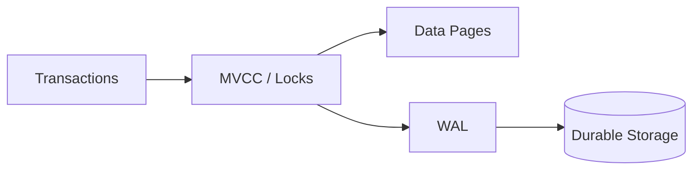
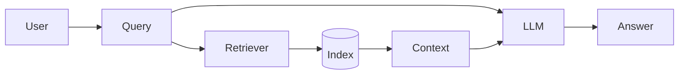

# 2026-09-14 10:00 — Çalışma Paketleri

## Paket 1 — Senior/Staff Databases: Transactions, Isolation, MVCC ve WAL

### 30 dakikalık plan
0–8 dk transaction/isolation, 8–15 dk MVCC, 15–21 dk WAL, 21–26 dk interview, 26–30 dk mini lab.

### Mental model


ACID'de kritik fikir, concurrent işlemler sırasında invariant'ları korurken commit edilen verinin crash sonrası geri getirilebilmesidir.

**Read Committed:** her statement yeni committed snapshot görebilir.  
**Repeatable Read:** transaction boyunca daha stabil snapshot sağlar.  
**Serializable:** sonucu seri execution'a eşdeğer tutmayı hedefler; abort/retry maliyeti artabilir.

MVCC uygun row version'ı göstererek reader/writer çakışmasını azaltır ama “lock yok” demek değildir. Write conflict, deadlock, cleanup ve uzun transaction problemleri devam eder.

WAL için temel kural: data page kalıcı hale gelmeden önce değişikliği tarif eden log kaydı durable olmalıdır. Bu crash recovery'nin temelidir; aynı change stream ailesi replication ve CDC için de kullanılabilir.

### Failure modes
- uzun transaction → cleanup/bloat/lock süresi
- hot row → contention
- deadlock → abort + retry ihtiyacı
- synchronous durability → daha güçlü garanti, daha yüksek latency

### Mülakat soruları
1. MVCC ile locking arasındaki ilişki nedir?
2. Read Committed ve Repeatable Read farkını timeline ile anlat.
3. Lost update nasıl engellenir?
4. WAL neden data page'den önce yazılır?
5. Hot row neden bottleneck olur?
6. DB değişikliklerini Kafka'ya güvenilir biçimde nasıl çıkarırsın?
7. Multi-region read-after-write nasıl sağlanır?

**Senior beklentisi:** anomaly + isolation + lock/MVCC + retry ilişkisini açıklamak.  
**Staff beklentisi:** invariant'ı tanımlayıp consistency, throughput, topology ve operasyon maliyetine göre seçim yapmak.

### Uygulama
İki PostgreSQL session aç; Read Committed ve Repeatable Read'i karşılaştır, aynı row'a iki writer gönder, basit deadlock üret ve timeline yaz.

### Bununla ne yapabiliriz?
`transaction-lab`: lost update, deadlock, repeatable read ve outbox senaryolarını Docker ile tekrar üret.

### Habitat bağlantısı
Habitat-benzeri bir storage katmanı farklı backend'lerin transaction/consistency yeteneklerini tek API arkasında saklarken semantik farkları kaybetmemeli. **Common API ile common guarantee aynı şey değildir.**

### Ana kaynaklar
- PostgreSQL Concurrency Control: https://www.postgresql.org/docs/current/mvcc.html
- Transaction Isolation: https://www.postgresql.org/docs/current/transaction-iso.html
- WAL: https://www.postgresql.org/docs/current/wal-intro.html
- Logical Decoding: https://www.postgresql.org/docs/current/logicaldecoding.html

---

## Paket 2 — Mid/Senior ML/AI/LLM: Transformer, Attention ve RAG

### 30 dakikalık plan
0–7 dk tokenizer/embedding, 7–14 dk attention, 14–21 dk RAG, 21–26 dk trade-off, 26–30 dk eval.

### Mental model


Self-attention'ın sezgisi: her token, temsilini güncellerken diğer token'ların hangilerinin önemli olduğuna bakar.

```text
Query = ne arıyorum?
Key   = bende hangi sinyal var?
Value = seçilirsem hangi bilgiyi taşıyorum?
```

RAG iki sistemi birleştirir: **retriever** ilgili kanıtı bulur, **generator** bu context ile cevap üretir. Bu nedenle retrieval quality ve generation quality ayrı ölçülmelidir.

### Failure modes
- kötü chunking
- retrieval miss
- stale index
- yanlış tenant/ACL filtresi
- prompt injection içeren kaynak
- fazla top-k nedeniyle noise/token maliyeti
- context doğru olduğu halde hallucination

### Production trade-off
Daha fazla top-k recall'ı artırabilir ama latency, token ve noise maliyeti getirir. Reranker quality'yi artırabilir ama ekstra hop ekler. Long-context model RAG'ı otomatik olarak gereksiz yapmaz; freshness, citations, access control ve maliyet hâlâ önemlidir.

### Mülakat soruları
1. Attention'ı Q/K/V sezgisiyle anlat.
2. Embedding ile generative model farkı nedir?
3. RAG neden fine-tuning ile aynı şey değildir?
4. Retrieval doğru ama cevap yanlışsa nereden debug edersin?
5. Vector DB gerçekten gerekli mi?
6. Multi-tenant RAG'da veri sızıntısı nasıl önlenir?
7. Source-of-truth silinince index/cache consistency nasıl sağlanır?
8. LLM serving latency/cost nasıl düşürülür?

**Mid beklentisi:** kavramları doğru ayırıp pipeline çizebilmek.  
**Senior beklentisi:** retrieval, generation, eval, security, latency ve cost'u birlikte tasarlamak.

### Uygulama
20–50 doküman + 10 soru ile iki chunk size ve iki top-k ayarı karşılaştır. Önce “doğru kanıt geldi mi?”, sonra “cevap doğru mu?” ölç.

### Bununla ne yapabiliriz?
`rag-evaluation-lab`: recall@k, grounded answer rate, p95 latency ve cost/request ölçen küçük sistem.

### Habitat bağlantısı
RAG aslında object store + metadata + search/vector index + policy layer + model serving zinciridir. Merkezi storage platformu index freshness, tenant isolation, residency ve deletion propagation'ı standartlaştırabilir.

### Ana kaynaklar
- Attention Is All You Need: https://arxiv.org/abs/1706.03762
- RAG paper: https://arxiv.org/abs/2005.11401
- PyTorch scaled dot-product attention: https://docs.pytorch.org/docs/stable/generated/torch.nn.functional.scaled_dot_product_attention.html
- Hugging Face Transformers: https://huggingface.co/docs/transformers/
