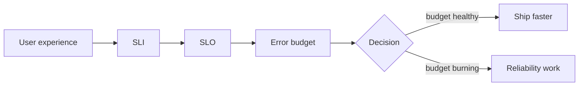
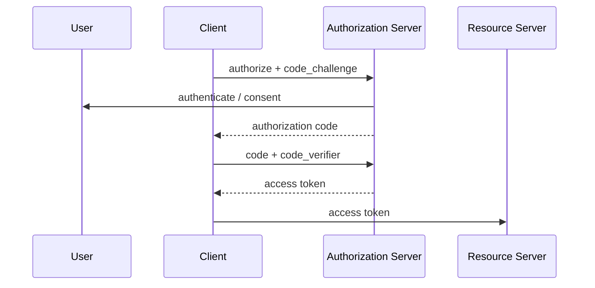

# 2026-09-14 11:00 — SRE + Identity Security

Bu saatte iki yaklaşık 30 dakikalık paket var. Amaç yalnızca terimleri bilmek değil, failure mode ve production trade-off'larını açıklayabilmek.

---

## Paket 1 — Senior / Staff SRE: SLI, SLO, SLA ve Error Budget

### Mental model



**SLI** ölçülen kullanıcı deneyimi sinyalidir: success rate, latency, freshness, durability gibi. **SLO**, bu göstergenin hedefidir. **SLA** ise çoğunlukla dış müşteriye verilen taahhüttür. Error budget, %100 ile SLO arasındaki izin verilen başarısızlık payını mühendislik kararına dönüştürür.

Örnek: aylık availability SLO `%99.9` ise yaklaşık `%0.1` başarısızlık bütçesi vardır. Burada amaç `%100` peşinde koşmak değil; güvenilirlik ile feature velocity arasında bilinçli trade-off yapmaktır.

### Failure modes

- sadece average latency izlemek p99 sorununu gizler,
- global başarı oranı tek tenant/bölge sorununu maskeleyebilir,
- readiness ile liveness'ı karıştırmak restart storm yaratabilir,
- yanlış SLI iyi görünen ama kullanıcıyı kötü etkileyen bir sistem üretebilir.

### Yüksek getirili mülakat soruları

1. SLI, SLO ve SLA farkı nedir?
2. Neden %100 availability hedefi genellikle yanlış optimizasyondur?
3. p50 iyi ama p99 kötü ise nereden başlarsın?
4. Error budget release kararını nasıl etkiler?
5. Multi-tenant storage platformunda hangi SLI'ları tenant bazında ayırırsın?
6. Dependency outage'ı sırasında liveness probe ne yapmalı?

### Seviye beklentisi

- **Mid:** kavramları doğru tanımlar, temel metric seçer.
- **Senior:** burn rate, tail latency, retry/queue etkisi ve incident davranışını açıklar.
- **Staff:** hizmet ağacı, blast radius, tenant/regional SLO, error-budget policy ve organizasyon kararlarını bağlar.

### 15–20 dk uygulama

`/fast`, `/slow`, `/flaky` endpoint'leri olan küçük servis kur. Request count, success rate ve latency histogram ölç. p50/p95/p99 hesapla; basit bir SLO ve error-budget tablosu çıkar.

### Bununla ne yapabiliriz?

`mini-sre-lab`: Prometheus/OpenTelemetry + küçük API + dashboard + iki alert. İkinci aşamada dependency'ye gecikme ve hata enjekte edip burn-rate davranışını gözlemle.

### Habitat bağlantısı

Habitat-benzeri storage platformunda tek global availability yetmez. Read/write success, p99 latency, routing error, replication lag, CDC freshness ve tenant throttling ayrı SLI'lar olabilir. En kritik Staff sorusu: **platform iyi görünürken tek tenant veya region kötüleşebilir mi?**

### Ana kaynaklar

- Google SRE — Service Level Objectives: https://sre.google/sre-book/service-level-objectives/
- Google SRE — Embracing Risk / Error Budgets: https://sre.google/sre-book/embracing-risk/
- Kubernetes — Liveness, Readiness and Startup Probes: https://kubernetes.io/docs/concepts/configuration/liveness-readiness-startup-probes/

---

## Paket 2 — Mid / Senior Security: OAuth 2.0, OIDC, JWT ve PKCE

### Büyük ayrım

```text
OAuth 2.0 -> authorization / delegated access
OIDC      -> identity / authentication layer
JWT       -> token/claim representation format
PKCE      -> authorization-code interception riskini azaltan mekanizma
```



JWT gördüğün her yerde güven varsayma. Resource server `iss`, `aud`, `exp`, signature ve gerektiğinde scope/role kontrolü yapmalıdır. ID Token'ı API authorization token'ı gibi kullanmak yaygın tasarım hatalarındandır.

### Failure / security modes

- redirect URI doğrulamasının gevşek olması,
- access token ile ID token'ın karıştırılması,
- `aud`/`iss` doğrulanmaması,
- uzun ömürlü token,
- key rotation yapılmaması,
- browser/mobile public client'ta secret'a güvenmek,
- tenant ID'nin sadece request body'den alınması.

### Yüksek getirili sorular

1. Authentication ve authorization farkı?
2. OAuth ile OIDC farkı?
3. Access token vs ID token?
4. PKCE neden var?
5. JWT neden session demek değildir?
6. JWKS ve key rotation nasıl çalışır?
7. Multi-tenant sistemde tenant boundary nerede enforce edilmelidir?

### Seviye beklentisi

- **Junior/Mid:** akışları ve token türlerini ayırır.
- **Senior:** redirect, PKCE, audience, issuer, rotation, revocation ve storage risklerini açıklar.
- **Staff:** merkezi identity platformunun blast radius, policy propagation ve service identity tasarımını tartışır.

### 20 dk uygulama

Bir demo API'de üç role sahip OIDC login kur. API tarafında issuer/audience/scope doğrulaması yap. Yanlış audience veya süresi geçmiş token testleri ekle.

### Bununla ne yapabiliriz?

`identity-security-lab`: OIDC + PKCE + RBAC + audit log + JWKS rotation. Son aşamada service-to-service identity ve tenant-aware authorization ekle.

### Habitat bağlantısı

Storage gateway'de güven zinciri `identity -> tenant -> resource -> operation -> policy -> storage` olarak düşünülebilir. Merkezi gateway authorization standardizasyonu sağlar ama compromise olursa blast radius çok büyür; least privilege ve service identity kritik hale gelir.

### Ana kaynaklar

- RFC 6749 — OAuth 2.0: https://www.rfc-editor.org/rfc/rfc6749
- RFC 7636 — PKCE: https://www.rfc-editor.org/rfc/rfc7636
- OpenID Connect Core 1.0: https://openid.net/specs/openid-connect-core-1_0.html
- RFC 7519 — JWT: https://www.rfc-editor.org/rfc/rfc7519
- RFC 9700 — OAuth 2.0 Security Best Current Practice: https://www.rfc-editor.org/rfc/rfc9700
