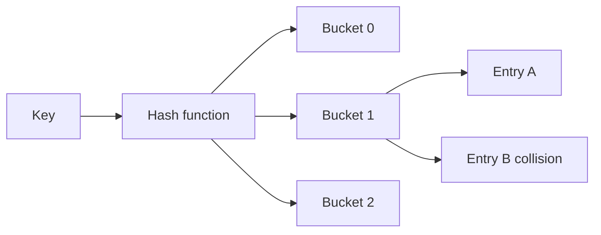
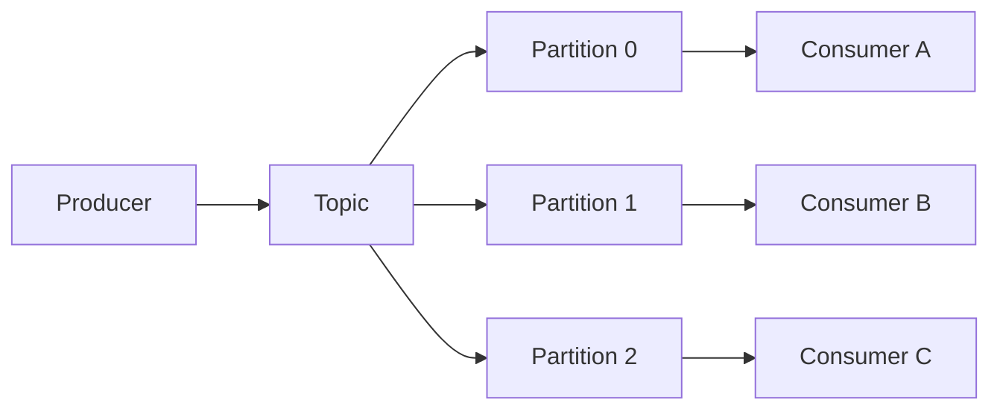

# 2026-09-14 12:00 — Algorithms + Data Engineering

## Paket 1 — Junior / Mid Algorithms: Hash Table ve Amortized Analysis

### Mental model

Hash table'ın amacı key'i doğrudan bir bucket'a eşlemektir:

```text
key --hash()--> bucket index --> entry
```

İyi durumda lookup yaklaşık `O(1)` beklenen zamandadır. Ama bu **worst-case garantisi değildir**. Collision, load factor ve resize davranışı sonucu değiştirir.



### Neden amortized analysis gerekir?

Dynamic array veya hash table her operation'da resize yapmaz. Bazen pahalı bir resize olur, fakat birçok ucuz operation'ın arasına dağılır. Bu yüzden tek operation'ın worst-case maliyeti ile uzun operation serisinin ortalama maliyetini ayırırız.

Örneğin kapasite iki katına çıkarılırsa tek append `O(n)` olabilir; fakat çok sayıda append için amortized maliyet `O(1)` olabilir.

### Yüksek getirili sorular

1. Hash collision nedir?
2. Hash table neden her zaman O(1) değildir?
3. Load factor neyi etkiler?
4. Chaining vs open addressing farkı?
5. Dynamic array append neden amortized O(1)?
6. Hash map ile balanced tree ne zaman değiştirilir?

### Seviye beklentisi

- **Junior:** hashing, collision ve Big-O temelini bilir.
- **Mid:** load factor, resize, memory trade-off ve collision strategy anlatır.
- **Senior:** adversarial input, cache locality, concurrency ve implementation-specific trade-off'ları tartışır.

### 20 dk uygulama

Kendi mini hash map'ini yaz: `put/get/delete`. Önce chaining kullan; sonra load factor `%75` olduğunda resize et. 10K/100K key üzerinde lookup ve resize süresini ölç.

### Bununla ne yapabiliriz?

`mini-collections-lab`: dynamic array + hash map + LRU cache. Benchmark dosyasına throughput, memory ve collision sayısı ekle.

### Ana kaynaklar

- MIT OpenCourseWare 6.006 — Introduction to Algorithms: https://ocw.mit.edu/courses/6-006-introduction-to-algorithms-fall-2011/
- Python data model / mappings: https://docs.python.org/3/reference/datamodel.html
- Java HashMap API: https://docs.oracle.com/en/java/javase/21/docs/api/java.base/java/util/HashMap.html

---

## Paket 2 — Mid / Senior Data Engineering: Kafka Partitions, Consumer Groups ve Ordering

### Büyük fikir

Kafka'da topic, partition'lara bölünür; partition hem ölçeklenme hem de ordering sınırıdır.



Aynı consumer group içindeki bir partition aynı anda tek consumer tarafından işlenir. Daha fazla partition paralellik sağlar; fakat partition key yanlış seçilirse hot partition oluşabilir.

### Ordering

Kafka'nın güçlü ordering sınırı partition içidir. Eğer `user_id` partition key ise aynı kullanıcı event'leri aynı partition'a yönlendirilebilir. Ama bütün sistemde global ordering istemek ölçeklenebilirliği ciddi şekilde azaltabilir.

### Yüksek getirili sorular

1. Topic, partition ve consumer group nedir?
2. Partition sayısı neyi belirler?
3. Ordering nerede garanti edilir?
4. Consumer lag nedir?
5. Rebalance sırasında ne olur?
6. At-least-once processing duplicate üretebilir mi?
7. Partition key nasıl seçilir?
8. Hot partition nasıl teşhis edilir?

### Failure modes

- yanlış key -> hot partition,
- yavaş consumer -> lag büyümesi,
- poison message -> partition ilerlemesinin durması,
- duplicate processing,
- schema evolution ile eski consumer kırılması,
- aşırı partition sayısı ile operational overhead.

### Seviye beklentisi

- **Mid:** producer/topic/partition/consumer group akışını açıklar.
- **Senior:** idempotency, lag, rebalance, retry/DLQ ve key seçimini tartışır.
- **Staff:** partition strategy'yi tenant isolation, replay, recovery time, cost ve multi-region gereksinimleriyle bağlar.

### 20 dk uygulama

Bir `orders` topic'i kur. `customer_id` ile partition et. İki consumer çalıştır; sonra bir consumer'ı yavaşlat ve lag gözlemle. Aynı event'i iki kez üretip idempotent consumer tasarla.

### Bununla ne yapabiliriz?

`cdc-kafka-lab`: PostgreSQL -> CDC -> Kafka -> consumer -> analytics tablosu. Duplicate event, schema change ve consumer restart senaryolarını test et.

### Habitat bağlantısı

Habitat-benzeri platformda storage değişiklikleri CDC ile downstream analytics/search sistemlerine aktarılabilir. Partition key seçimi tenant veya entity ordering ihtiyacına göre yapılır. Kritik soru: online write path Kafka'ya bağımlı mı, yoksa CDC asenkron mu?

### Ana kaynaklar

- Apache Kafka Documentation: https://kafka.apache.org/documentation/
- Kafka Design: https://kafka.apache.org/documentation/#design
- Kafka Consumer Configs: https://kafka.apache.org/documentation/#consumerconfigs
