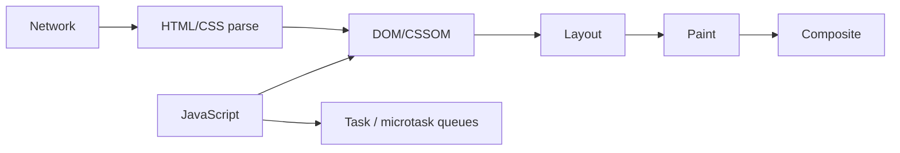
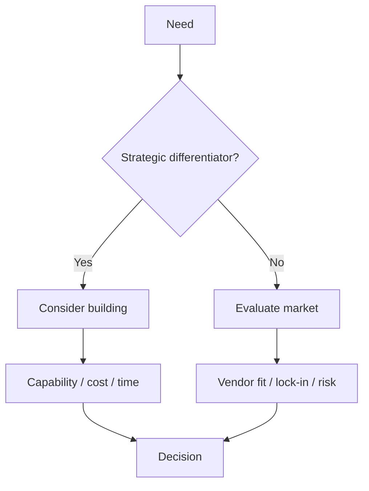

# 2026-09-14 13:00 — Frontend Runtime + CTO/Platform Strategy

## Paket 1 — Mid / Senior Frontend: Event Loop, Rendering ve Web Performance

### Mental model

Browser tek bir şey değildir; network, JavaScript runtime, rendering engine ve compositor birlikte çalışır.

JavaScript event loop; task'lar, microtask'lar ve rendering fırsatları arasında scheduling yapar. Uzun süren synchronous JavaScript ana thread'i bloke ederse input gecikir, rendering aksar ve kullanıcı arayüzü donmuş gibi görünür.

### Kritik ayrımlar

- **task/macrotask:** timer, event callback gibi işler,
- **microtask:** Promise continuation gibi işler,
- **layout:** element geometry hesapları,
- **paint:** piksellenecek görsel komutlar,
- **composite:** layer'ların ekranda birleştirilmesi.

Her DOM değişikliği otomatik olarak aynı maliyeti yaratmaz. Layout tetikleyen okuma/yazmaları karıştırmak layout thrashing üretebilir.

### Yüksek getirili sorular

1. Event loop nedir?
2. Promise callback ile `setTimeout(..., 0)` neden aynı sırada çalışmayabilir?
3. Reflow/layout ile repaint farkı nedir?
4. Büyük JavaScript bundle nasıl kullanıcı deneyimini etkiler?
5. Debounce ve throttle farkı?
6. Memory leak frontend'de nasıl oluşabilir?
7. LCP/INP/CLS neyi ölçmeye çalışır?

### Failure / production bağlantısı

- long task -> input latency,
- render-blocking resource -> geç içerik,
- büyük bundle -> parse/compile maliyeti,
- gereksiz rerender -> CPU tüketimi,
- yanlış cache policy -> bandwidth/latency,
- event listener/timer cleanup eksikliği -> memory leak.

### Seviye beklentisi

- **Mid:** event loop, async code ve temel rendering akışını bilir.
- **Senior:** profiler kullanır, long task ve network/render bottleneck ayırır, ölçülebilir performans bütçesi koyar.
- **Staff:** design system, performance guardrail, telemetry ve cross-team web platform standardı kurar.

### 20 dk uygulama

Bir sayfada 10.000 satır render et. Önce düz render, sonra virtualization uygula. Performance panel ile scripting/rendering süresini ve kullanıcı input gecikmesini karşılaştır.

### Bununla ne yapabiliriz?

`browser-perf-lab`: long-task demosu, list virtualization, image lazy loading, code splitting ve Web Vitals ölçümü bulunan küçük site.

### Ana kaynaklar

- WHATWG HTML — Event loops: https://html.spec.whatwg.org/multipage/webappapis.html#event-loops
- MDN — JavaScript execution model: https://developer.mozilla.org/en-US/docs/Web/JavaScript/Event_loop
- web.dev — Web Vitals: https://web.dev/articles/vitals

---

## Paket 2 — Staff / Principal / CTO: Build vs Buy ve Platform Strategy

Teknik liderlikte soru artık sadece “hangi teknoloji daha iyi?” değildir. Doğru soru çoğu zaman:

> Bu yetenek şirket için stratejik bir farklılaştırıcı mı, yoksa satın alınabilir bir commodity mi?

### Karar modeli

Build vs buy kararı yalnız ilk geliştirme maliyetine göre verilmez. Toplam sahip olma maliyeti şunları içerir:

- geliştirme ve bakım,
- on-call ve incident maliyeti,
- güvenlik/compliance,
- migration ve exit cost,
- ekip uzmanlığı,
- opportunity cost,
- vendor lock-in,
- ölçek büyüdüğünde unit economics.

### Platform ne zaman mantıklıdır?

Aynı auth, observability, deployment veya storage problemi birçok ekip tarafından tekrar çözülüyorsa platformlaştırma developer velocity ve standardizasyon sağlayabilir. Ancak premature platform ekibi yeni bir bureaucracy katmanı da yaratabilir.

### Yüksek getirili liderlik soruları

1. Build vs buy kararını nasıl verirsin?
2. Vendor lock-in her zaman kötü müdür?
3. Platform ekibi ne zaman kurulmalı?
4. Internal platform'un başarısını hangi metric ile ölçersin?
5. Teknik borcu nasıl business diliyle anlatırsın?
6. Bir migration'ın ROI'sini nasıl hesaplarsın?
7. 30 takım aynı problemi farklı çözüyor; neyi merkezileştirirsin?

### Seviye beklentisi

- **Senior:** lokal teknik trade-off'u açıklar.
- **Staff:** birden çok takımın architecture/operational etkisini görür.
- **Principal:** standardizasyon, migration ve uzun dönem teknik strateji kurar.
- **EM:** ownership, staffing, delivery ve adoption tarafını yönetir.
- **CTO:** teknoloji kararını ürün stratejisi, finans, risk ve organizasyonla birlikte değerlendirir.

### Failure modes

- sadece lisans fiyatına bakıp TCO'yu kaçırmak,
- “not invented here” nedeniyle gereksiz build,
- vendor exit planı olmaması,
- platformu kullanıcı takımların ihtiyacından kopuk tasarlamak,
- merkezi platform ile blast radius'u büyütmek,
- adoption metric olmadan platform başarısı ilan etmek.

### 20 dk uygulama

Şirketin 10 ekibi için üç senaryo yaz: authentication, observability ve feature flag. Her biri için `build / managed service / open-source operate ourselves` seçeneklerini 1–5 puanla değerlendir: stratejik değer, ekip kapasitesi, security, cost, time-to-market, lock-in, reliability.

### Bununla ne yapabiliriz?

Repo içinde `architecture-decisions/` klasörü açıp gerçek ADR örnekleri üretilebilir. Örnek: “Managed Kafka mı self-hosted Kafka mı?”, “Merkezi auth platformu mu takım bazlı auth mu?”, “Vector DB satın almalı mıyız?”.

### Habitat bağlantısı

Habitat tipi storage platformu tam bir platform-investment örneğidir: yüzlerce ekibin routing, auth, tenancy, rate limiting ve storage erişimini tekrar çözmesini engelleyebilir. Ama platform kritik path'e girdikçe güvenilirlik ve blast-radius sorumluluğu da merkezileşir.

### Ana kaynaklar

- AWS Well-Architected Framework: https://docs.aws.amazon.com/wellarchitected/latest/framework/welcome.html
- Google Cloud Architecture Framework: https://cloud.google.com/architecture/framework
- Martin Fowler — Platform Engineering: https://martinfowler.com/articles/platform-engineering.html
