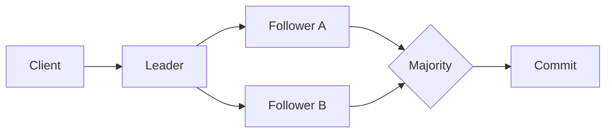
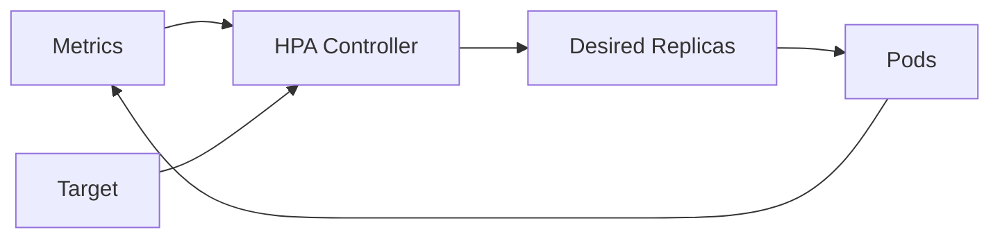

# 16:00 — Interview Study Packs

## Paket 1 — Staff Distributed Systems: Raft Consensus

**Süre:** 25–30 dk

### Konu anlatımı
Consensus, birden fazla node'un arıza ve mesaj gecikmelerine rağmen aynı sıralı kararlar üzerinde anlaşmasını sağlar. Raft problemi leader election, log replication ve safety olarak ayırır. Normal durumda client leader'a yazar; leader log entry'yi follower'lara çoğaltır ve çoğunluk entry'yi kabul ettiğinde commit ilerler. Term numarası mantıksal dönemdir; daha yüksek term gören node eski liderliğin geçersiz olduğunu anlar.

### Mental model


Consensus = "her kopya aynı anda ayakta olsun" değil; doğru çoğunluk kurallarıyla tek bir güvenli log tarihi üretmektir.

### Yüksek getirili soru kümeleri
- Leader neden gerekir; leaderless consensus mümkün mü?
- Quorum neden çoğunlukla ilişkilidir?
- Split brain nasıl engellenir?
- Commit edilmiş entry ile yalnızca local log'a yazılmış entry arasındaki fark nedir?
- Network partition sırasında availability ne olur?
- Raft ile distributed lock aynı şey midir?

### Seviye beklentisi
Senior aday election/log replication'ı doğru anlatmalı. Staff aday stale leader, term, quorum intersection, membership change ve storage durability bağlantısını tartışabilmeli. Principal seviyesinde consensus'un nerede kullanılmaması gerektiği, latency ve operational complexity de cevapta olmalı.

### Mini alıştırma
5 node'lu cluster çiz. Leader iki follower'a entry gönderdi, diğer ikisine erişemedi. Entry commit olabilir mi? Ardından leader ölürse hangi log'un yeni leader seçiminde güvenli olduğunu gerekçelendir.

### Bununla ne yapabiliriz?
Mini replicated metadata service: node'lar storage volume metadata'sını Raft log üzerinden çoğaltsın. Habitat benzeri platformda data path'i değil, metadata/control-plane kararlarını consensus ile yönetmek daha gerçekçi bir tasarımdır.

### Failure modes / trade-off
Election storm, disk fsync latency, asymmetric partition, slow follower, oversized log ve snapshot maliyeti. Consensus availability yaratmaz; partition altında safety uğruna bazı yazmaları reddedebilir. Consensus'u her veri parçasına koymak latency ve operasyon maliyetini büyütür.

### Kaynaklar
- Raft ana sitesi ve extended paper: https://raft.github.io/
- Diego Ongaro / John Ousterhout Raft sunumu: https://raft.github.io/slides/coreosfest2015.pdf

---

## Paket 2 — Mid/Senior Cloud & SRE: Kubernetes HPA ve Control Loops

**Süre:** 20–25 dk

### Konu anlatımı
Horizontal Pod Autoscaler, Deployment/StatefulSet gibi ölçeklenebilir workload'ların replica sayısını gözlenen metriklerle hedef değer arasındaki orana göre periyodik olarak ayarlar. Bu bir control loop'tur: ölç, hedefle karşılaştır, desired state üret, sistemi yeniden gözle. CPU tek sinyal değildir; memory, custom ve external metric kullanılabilir.

### Mental model


Autoscaling = "CPU yükseldi, pod ekle" kuralından çok feedback-control problemidir. Metric gecikmesi, startup süresi ve cooldown/stabilization davranışı sonucu değiştirir.

### Yüksek getirili soru kümeleri
- Horizontal ve vertical scaling farkı nedir?
- CPU %80 neden her servis için doğru metric değildir?
- Queue worker için hangi metric daha anlamlıdır?
- Yeni pod 90 saniyede hazır oluyorsa HPA nasıl davranabilir?
- Scale-up ile database connection pool arasında nasıl bir production problemi çıkar?
- Autoscaling neden capacity planning'in yerine geçmez?

### Seviye beklentisi
Mid aday HPA'nın replica sayısını metriklerden yönettiğini anlatmalı. Senior aday readiness, startup latency, resource requests, custom metrics ve downstream bottleneck'leri bağlamalı. Staff aday feedback-loop instability, cost, regional capacity ve SLO tabanlı scaling'i tartışmalı.

### Mini alıştırma
Bir API'nin 10 pod ile 1.000 RPS taşıdığını, yeni pod'un 60 saniyede hazır olduğunu varsay. Trafik 20 saniyede 3 katına çıkarsa yalnız CPU metric'ine dayalı HPA'nın neden geç kalabileceğini timeline ile çiz.

### Bununla ne yapabiliriz?
Queue-depth tabanlı worker autoscaler laboratuvarı. Request rate, queue age ve CPU'yu birlikte gözle; farklı metric seçimlerinin p95 latency ve maliyete etkisini ölç.

### Failure modes / trade-off
Metric lag, oscillation, cold start, yanlış resource request, maxReplicas sınırı, downstream saturation ve thundering herd. Habitat benzeri storage platformunda frontend pod sayısını artırmak storage backend IOPS sınırını artırmaz; control plane'in backend kapasitesini de hesaba katması gerekir.

### Kaynaklar
- Kubernetes HPA resmi dokümanı: https://kubernetes.io/docs/concepts/workloads/autoscaling/horizontal-pod-autoscale/

---

## Paket 3 — Junior/Mid Algorithms: Binary Search ve Boundary Thinking

**Süre:** 20–25 dk

### Konu anlatımı
Binary search yalnızca "sorted array'de eleman bulma" algoritması değildir. Asıl güçlü mental model, monoton bir predicate'in false→true veya true→false sınırını bulmaktır. Her adımda arama uzayı yaklaşık yarıya iner; arama O(log n) olur. Ancak sorted list'e insertion yapmak array üzerinde O(n) olabilir; arama karmaşıklığı ile mutation maliyetini karıştırmamak gerekir.

### Mental model
```text
false false false | true true true
                  ^
              boundary
```

Invariant seç: örneğin `lo` cevaptan önce, `hi` cevap olabilecek bölgede. Döngünün her iterasyonunda invariant korunmalı ve aralık kesin küçülmeli.

### Yüksek getirili soru kümeleri
- Exact match ile lower_bound farkı nedir?
- Duplicate değerlerde ilk occurrence nasıl bulunur?
- `lo <= hi` ve `lo < hi` şablonları neden karıştırılmamalı?
- Rotated sorted array'de hangi tarafın sorted olduğunu nasıl anlarsın?
- "Minimum feasible capacity" problemi binary search'e nasıl çevrilir?
- Binary search neden linked list için genellikle iyi seçim değildir?

### Seviye beklentisi
Junior aday klasik aramayı off-by-one hatası olmadan yazmalı. Mid aday lower/upper bound, answer-space search ve monoton predicate'i tanımalı. Senior aday overflow-safe midpoint, termination invariant ve veri yapısının random-access maliyetini tartışabilmeli.

### Mini alıştırma
Sorted array'de `target` değerinin ilk görüldüğü index'i döndüren lower-bound yaz. Sonra aynı şablonu "işleri D gün içinde bitirecek minimum kapasite" problemine dönüştür.

### Bununla ne yapabiliriz?
Latency/capacity simulator: monoton bir throughput fonksiyonu üzerinde hedef SLO'yu sağlayan minimum worker sayısını binary search ile bul. Böylece algoritma sorusunu capacity planning mental modeline bağla.

### Failure modes / trade-off
Off-by-one, sonsuz döngü, yanlış monotonluk varsayımı, integer overflow ve pahalı predicate. Production'da predicate bir network çağrısıysa O(log n) çağrı bile pahalı olabilir; cache veya offline model gerekebilir.

### Kaynaklar
- Python `bisect` resmi dokümanı: https://docs.python.org/3/library/bisect.html
