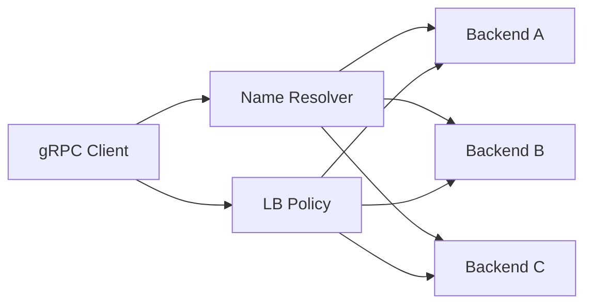
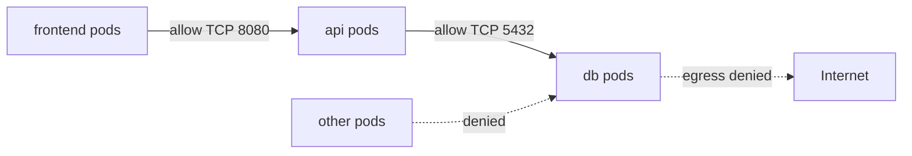
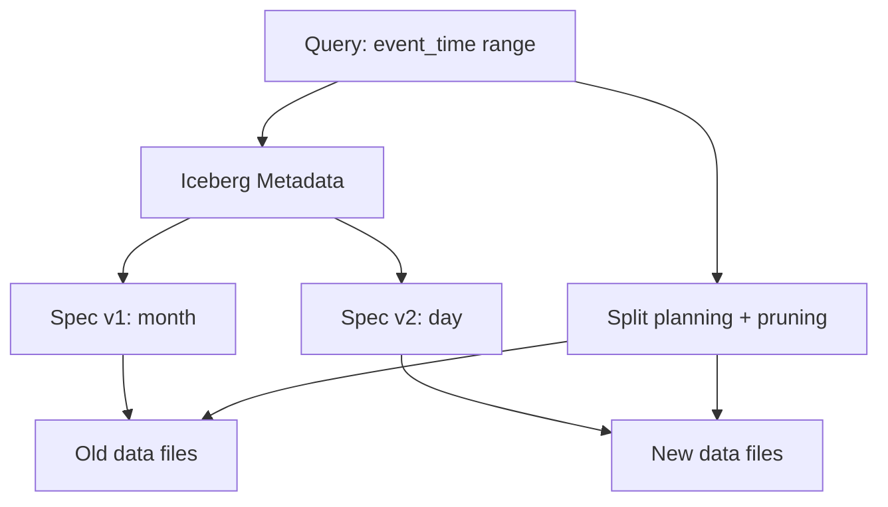

# 2026-09-14 18:00 — Interview Study Packs

Bu tur, yakın günlüklerdeki Raft/HPA/binary-search, Kafka, SLO, OAuth, browser ve build-vs-buy konularını tekrar etmemek için networking, cloud security ve data engineering eksenine kayar.

## Paket 1 — Senior Networking/Backend: gRPC Client-side Load Balancing

### Konu anlatımı
Bir servis adı tek bir makine demek değildir. İsim çözümleyici bir hedef için birden fazla backend adresi döndürebilir; gRPC load-balancing policy bu adreslere subchannel/connection tutar ve her RPC için hangisinin seçileceğine karar verir. Varsayılan `pick_first`, erişebildiği ilk adresi kullanır; `round_robin` hazır backend'ler arasında çağrıları döndürür. Daha gelişmiş politikalar backend CPU, memory veya queue depth gibi sinyallerle ağırlıklı seçim yapabilir.

Buradaki temel ayrım **discovery != balancing != health**. Resolver adayları bulur; LB policy seçim yapar; health/readiness sinyalleri seçimin güvenilirliğini etkiler. Client-side balancing, proxy hop'unu azaltabilir fakat policy/config dağıtımını client fleet'e taşır.

### Mental model

### Yüksek getirili soru kümeleri
- `pick_first` ile `round_robin` davranış farkı nedir?
- Client-side ve proxy/server-side load balancing trade-off'ları nelerdir?
- Bir backend yavaş ama health check'te sağlıklıysa ne olur?
- Least-loaded yaklaşımı neden stale metric yüzünden osilasyon üretebilir?
- Connection pooling ve HTTP/2 multiplexing balancing'i nasıl etkiler?

### Seviye beklentisi
Senior aday discovery, connection, health ve balancing'i ayırmalı; tail latency, locality ve overload'u tartışmalı. Staff seviyesinde config rollout, heterogeneous clients, metric feedback ve failure-domain farkındalığı beklenir.

### Kısa alıştırma
3 backend düşün: A=20ms/%90 dolu, B=35ms/%20 dolu, C=25ms/%40 dolu. Round-robin ile load-aware policy'nin hangi workload'da daha iyi/kötü olacağını yaz.

### Bununla ne yapabiliriz?
`grpc-routing-lab`: üç backend, resolver ve iki LB policy ile latency/queue-depth simülasyonu kur. Habitat-benzeri storage platformunda adapter endpoint'lerini region, backend health ve queue depth'e göre seçen routing katmanı tasarla.

### Failure modes / trade-off / production
Stale endpoint, thundering herd, unhealthy connection reuse, metric feedback oscillation, uneven long-lived streams ve locality maliyeti. Load balancing yalnız CPU eşitlemek değil; kullanıcı latency'si ve failure-domain riskini yönetmektir.

### Kaynaklar
- https://grpc.io/docs/guides/custom-load-balancing/
- https://grpc.io/docs/guides/service-config/
- https://grpc.io/docs/guides/custom-backend-metrics/

---

## Paket 2 — Mid/Senior Cloud Security: Kubernetes NetworkPolicy

### Konu anlatımı
Kubernetes NetworkPolicy, seçilen Pod'lara yönelik L3/L4 trafik kurallarını tanımlar. `podSelector`, `namespaceSelector` ve `ipBlock` ile peer seçilir; ingress/egress kuralları izin verilen akışları belirtir. Kritik production ayrıntısı: API nesnesini oluşturmak tek başına enforcement garantisi değildir; kullanılan network plugin'in NetworkPolicy'yi uygulaması gerekir.

NetworkPolicy'yi uygulama authentication/authorization mekanizması gibi düşünmemek gerekir. L3/L4 erişim sınırı sağlar; uygulama kimliği, kullanıcı yetkisi veya request-level policy'nin yerine geçmez.

### Mental model

### Yüksek getirili soru kümeleri
- Default-deny neden yararlıdır?
- `podSelector` ve `namespaceSelector` birlikte nasıl düşünülür?
- Policy var ama CNI enforcement desteklemiyorsa ne olur?
- NetworkPolicy neden application authorization değildir?
- DNS egress'i yanlış kapatmanın sonucu ne olabilir?

### Seviye beklentisi
Mid aday ingress/egress ve selector mantığını açıklamalı. Senior aday default-deny rollout, DNS/control-plane dependency, eventual policy application ve observability'yi tartışmalı. Staff seviyesinde multi-tenant isolation ve policy governance beklenir.

### Kısa alıştırma
`frontend -> api -> db` için yalnız gerekli akışlara izin veren policy matrisi çıkar. DNS ve telemetry egress'ini ayrıca değerlendir.

### Bununla ne yapabiliriz?
`network-policy-lab`: önce açık namespace, sonra default-deny ve explicit allow politikaları uygula; connectivity testleri yaz. Habitat control plane'de tenant workload'larının yalnız kendi adapter/service endpoint'lerine erişebildiği segmentasyonu modelle.

### Failure modes / trade-off / production
CNI desteğini varsaymak, DNS'i kesmek, label drift, fazla geniş namespace selector, rollout sırasında geçici connectivity farkları ve troubleshooting görünürlüğünün düşük olması.

### Kaynaklar
- https://kubernetes.io/docs/concepts/services-networking/network-policies/
- https://kubernetes.io/docs/reference/kubernetes-api/networking/network-policy-v1/

---

## Paket 3 — Staff Data Engineering: Apache Iceberg Schema & Partition Evolution

### Konu anlatımı
Klasik directory-partitioned lake tasarımlarında partition şeması sorgulara ve fiziksel path'lere sızabilir. Apache Iceberg partition bilgisini table metadata'sında yönetir ve hidden partitioning sağlar. Partition spec değiştiğinde eski dosyalar eski layout'ta kalabilir, yeni veriler yeni spec ile yazılır; planner her spec için uygun pruning yapabilir. Bu, partition evolution'ı zorunlu full rewrite yerine metadata merkezli bir değişime dönüştürür.

Schema evolution'da kolon kimlikleri önemlidir: isim/pozisyon yerine unique field ID kullanımı rename/drop gibi değişikliklerde veri anlamının yanlış eşleşmesini önlemeye yardımcı olur.

### Mental model

### Yüksek getirili soru kümeleri
- Hidden partitioning neyi çözer?
- Partition evolution sırasında eski dosyalar neden hemen rewrite edilmek zorunda değildir?
- Schema evolution'da field ID neden önemlidir?
- Small-files problemi partition evolution'dan nasıl ayrılır?
- Metadata büyümesi ve snapshot sayısı hangi operasyonel maliyetleri doğurur?

### Seviye beklentisi
Senior aday schema/partition evolution ve pruning'i anlatmalı. Staff aday engine interoperability, compaction, snapshot/metadata lifecycle ve concurrent writer davranışlarını tartışmalı. Principal seviyesinde governance ve çoklu engine uyumluluğu beklenir.

### Kısa alıştırma
Günde 50 GB'dan 5 TB'a büyüyen event tablosunda `day(ts)` partition'ından `hour(ts)` veya bucket kombinasyonuna geçişi tasarla; hangi sorguların fayda göreceğini ve metadata/file-count maliyetini yaz.

### Bununla ne yapabiliriz?
`lakehouse-evolution-lab`: iki partition spec ile veri üret, aynı query'nin file pruning davranışını karşılaştır. Habitat-benzeri storage abstraction'da object store fiziksel layout'unu tüketiciden saklayan metadata/catalog katmanıyla bağlantı kur.

### Failure modes / trade-off / production
Aşırı partitioning, small files, metadata şişmesi, compaction maliyeti, eski engine compatibility ve yanlış workload varsayımı. Evolution rewrite ihtiyacını azaltır; fiziksel veri bakımını ortadan kaldırmaz.

### Kaynaklar
- https://iceberg.apache.org/docs/latest/evolution/
- https://iceberg.apache.org/spec/
