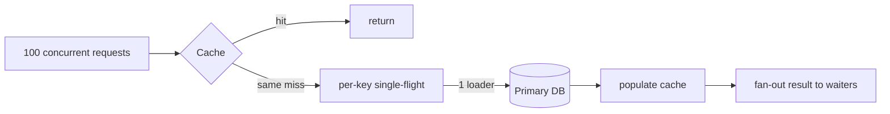

# 2026-09-14 19:00 — Interview Study Packs

Bu oturum önceki günlüklerden farklı üç eksene odaklanır: distributed coordination, frontend state identity ve cache stampede.

## Paket 1 — Staff Distributed Systems: Lease, Distributed Lock ve Fencing Token
**Süre:** 25–30 dk · **Seviye:** Staff/Principal

### Konu anlatımı
Distributed lock'ın amacı yalnızca iki worker'ın aynı anda bir kritik bölgeye girmesini azaltmak değildir; asıl soru, lock sahibinin gerçekten hâlâ yetkili olduğunu nasıl kanıtladığıdır. Bir lease zaman sınırlı sahipliktir. Sahip lease'i yeniler; yenileyemezse başka aday sahipliği alabilir. Ancak eski sahibin GC pause, network partition veya uzun I/O nedeniyle geç kalıp tekrar çalışmaya başlaması mümkündür. Bu nedenle correctness kritik sistemlerde fencing token kullanılır: her başarılı sahiplik devri monoton artan bir epoch/token üretir ve downstream storage yalnızca gördüğü en yeni token'ı kabul eder.

Redis'in resmi distributed-lock dokümanı mutual exclusion, deadlock freedom ve fault tolerance hedeflerini açıkça ayırır; ayrıca consistency/correctness kritikse fencing token değerlendirilmesini özellikle belirtir. Kubernetes ise Lease nesnelerini node heartbeat ve control-plane leader election için kullanır.

### Mental model
```mermaid
sequenceDiagram
  participant A as Worker A
  participant L as Lease Store
  participant B as Worker B
  participant S as Storage
  A->>L: acquire -> token 41
  A->>S: write(token=41)
  Note over A: pause / partition
  B->>L: expired; acquire -> token 42
  B->>S: write(token=42)
  A->>S: late write(token=41)
  S-->>A: reject stale token
```

### Yüksek getirili soru kümeleri
- Mutex, distributed lock ve lease arasındaki fark nedir?
- TTL neden tek başına correctness garantisi değildir?
- Eski lock sahibi lease bittikten sonra çalışmaya devam ederse ne olur?
- Fencing token hangi katmanda kontrol edilmelidir?
- Leader election ile distributed lock aynı problem midir?
- Availability ile safety arasında hangi trade-off oluşur?

### Beklenen cevap derinliği
Senior aday lease/TTL, crash ve partition riskini açıklamalı. Staff aday stale owner problemine ulaşmalı; fencing/epoch, downstream validation, clock varsayımları ve failover semantiğini tartışmalı. Principal aday coordination primitive seçimini iş invariant'ına bağlamalı: duplicate execution tolere edilebiliyorsa idempotency yeterli olabilir; para, metadata ownership veya destructive operation gibi alanlarda daha güçlü fencing gerekebilir.

### Kısa alıştırma
İki worker'ın aynı volume'u attach etmeye çalıştığı bir sistem tasarla. Lease 15 saniye. Worker A 25 saniye pause oluyor. Token 7 ve 8 ile hangi write'ların kabul edilmesi gerektiğini yaz.

### Bununla ne yapabiliriz?
`lease-fencing-lab`: küçük bir lease service + monotonic epoch + storage simulator. Pause ve partition enjekte ederek stale owner write'larını reddet. Habitat-benzeri storage control plane'de volume ownership, adapter leadership veya migration coordinator için doğrudan uygulanabilir.

### Failure modes / trade-off / production
Clock drift, lease'in gereğinden uzun/kısa seçilmesi, stale owner, lock store outage, split brain, downstream'un token kontrol etmemesi ve retry storm. Strong coordination latency/availability maliyeti getirir; her iş akışına distributed lock eklemek yerine mümkünse idempotency ve ownership partitioning tercih edilir.

### Kaynaklar
- Redis — Distributed Locks: https://redis.io/docs/latest/develop/clients/patterns/distributed-locks/
- Kubernetes — Leases: https://kubernetes.io/docs/concepts/architecture/leases/
- Kubernetes — Lease API: https://kubernetes.io/docs/reference/kubernetes-api/coordination/lease-v1/

---

## Paket 2 — Mid/Senior Frontend: React State Identity, Keys ve Render Tree
**Süre:** 20–25 dk · **Seviye:** Mid/Senior

### Konu anlatımı
React state'i JSX etiketinin içine fiziksel olarak koymaz; state'i render tree'deki component identity/position ile ilişkilendirir. Aynı component aynı pozisyonda kalırsa state korunabilir. Component tipi veya `key` değişirse React bunu farklı identity olarak görür ve subtree state'i resetlenebilir. Bu yüzden listelerde index'i key yapmak reorder durumunda yanlış state'in yanlış satıra taşınmasına yol açabilir.

`key` yalnızca performans ipucu değildir; identity semantiğinin parçasıdır. Formu bilinçli resetlemek için key değiştirmek yararlı olabilir. Buna karşılık rastgele key üretmek her render'da remount, state kaybı ve gereksiz DOM işi doğurabilir.

### Mental model
```text
Render tree position + component type + key
                  |
                  v
           Component identity
             /          \
        same              changed
         |                   |
   preserve state       reset/remount
```

### Yüksek getirili soru kümeleri
- React state nerede yaşar ve ne zaman korunur?
- Listede `key` neden gerekir?
- Array index'i key olarak kullanmak ne zaman sorun çıkarır?
- Bir formu bilinçli olarak nasıl resetlersin?
- Parent render olduğunda child mutlaka remount olur mu?
- State'i local tutmak ile yukarı kaldırmak arasında trade-off nedir?

### Beklenen cevap derinliği
Junior/Mid aday stable key ve state preservation'ı örnekleyebilmeli. Senior aday identity, remount, reconciliation etkileri ve state locality'yi açıklamalı; gereksiz global state'in coupling yarattığını tartışmalı.

### Kısa alıştırma
Editable todo listesinde satırları drag-and-drop ile yeniden sırala. `key={index}` ve `key={todo.id}` davranışlarını tahmin et; hangi durumda input state yanlış item'a bağlanabilir?

### Bununla ne yapabiliriz?
`state-identity-playground`: reorder edilen liste, chat recipient değişimi ve resetlenebilir form içeren küçük React uygulaması. DevTools ile render/remount farkını gözlemle.

### Failure modes / trade-off / production
Unstable/random keys, index key + reorder, gereksiz state lifting, derived state duplication, yanlış yerde reset ve büyük subtree remount. Production'da bunlar kaybolan form girdisi, yanlış satır state'i ve gereksiz render maliyeti olarak görünür.

### Kaynaklar
- React — Preserving and Resetting State: https://react.dev/learn/preserving-and-resetting-state
- React — useState: https://react.dev/reference/react/useState

---

## Paket 3 — Senior Backend: Cache Stampede, Single-Flight ve Hot-Key Koruması
**Süre:** 25 dk · **Seviye:** Senior/Staff

### Konu anlatımı
Cache-aside sisteminde popüler bir key aynı anda expire olduğunda yüzlerce request aynı miss'i görebilir ve primary database'e birlikte gidebilir. Buna cache stampede/dogpile denir. Cache'in amacı load azaltmakken expiration anı tersine load amplifier olur.

Koruma seçenekleri arasında per-key single-flight/request coalescing, kısa süreli loader lock, TTL jitter, stale-while-revalidate ve proactive refresh bulunur. Tek bir çözüm her workload için doğru değildir. Single-flight aynı process içindeki duplicate load'ları kolayca birleştirir; çok replica varsa coordination kapsamı ayrıca düşünülür. TTL jitter expiry'lerin aynı ana yığılmasını azaltır. Stale serving availability ve latency'yi iyileştirir ama freshness trade-off'u getirir.

### Mental model


### Yüksek getirili soru kümeleri
- Cache stampede nasıl oluşur?
- TTL jitter neyi çözer, neyi çözmez?
- Single-flight ile distributed lock arasındaki fark nedir?
- Loader ölürse waiters ne yapmalı?
- Stale-while-revalidate hangi ürünlerde risklidir?
- Hot key tek cache shard'ını doyurursa ne yaparsın?

### Beklenen cevap derinliği
Senior aday stampede'i load amplification olarak modellemeli ve en az iki mitigation kıyaslamalı. Staff aday multi-replica scope, bounded waiting, stale policy, observability, hot-key detection ve failure fallback tasarlamalı.

### Kısa alıştırma
Bir ürün detay endpoint'i normalde 5k RPS alıyor. Hot key 60 saniyede bir expire oluyor ve DB lookup 80 ms. Aynı anda 400 miss geldiğinde naive cache-aside ile single-flight davranışını karşılaştır.

### Bununla ne yapabiliriz?
`cache-stampede-lab`: cache + fake DB + load generator. Sabit TTL, jitter, single-flight ve stale-while-revalidate modlarını p95/p99 latency ve DB QPS ile karşılaştır. Habitat-benzeri metadata/read-heavy control plane'de backend capability veya policy metadata cache'lerinde uygulanabilir.

### Failure modes / trade-off / production
Loader crash, lock expiry, waiters'ın sınırsız beklemesi, stale data, hot shard, synchronized TTL, retry amplification ve cache outage. Cache'i correctness source-of-truth yapmamak ve degradation davranışını önceden tanımlamak önemlidir.

### Kaynaklar
- Redis — Cache-aside / stampede protection: https://redis.io/docs/latest/develop/use-cases/cache-aside/redis-py/
- Redis — Distributed Locks: https://redis.io/docs/latest/develop/clients/patterns/distributed-locks/
