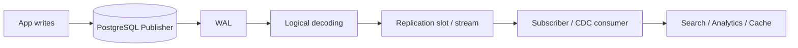
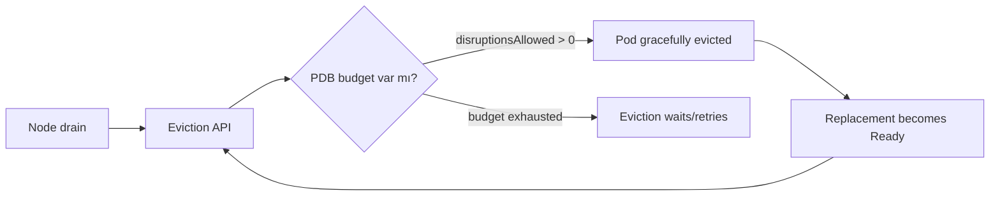
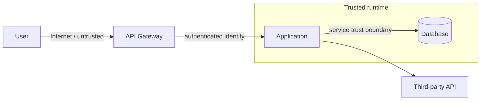

# 21:00 — Yazılım Mülakat Çalışma Paketleri

Bu tur önceki saatlerdeki Raft, HPA, binary search, gRPC load balancing, NetworkPolicy, Iceberg, lease/fencing, React state, cache stampede, RAG, MVCC ve incident-response konularını tekrar etmez.

## Paket 1 — Senior/Staff Data Engineering: CDC ve PostgreSQL Logical Replication
**Süre:** 20–30 dk

### Konu anlatımı
Change Data Capture (CDC), veritabanındaki değişiklikleri periyodik tam tablo taraması yerine değişiklik akışından yakalama yaklaşımıdır. PostgreSQL logical replication, fiziksel blokları kopyalamak yerine tablo değişikliklerini logical biçimde publication/subscription modeliyle taşır. Publisher tarafında WAL logical decoding ile yorumlanır; subscriber değişiklikleri transactional order içinde uygular. UPDATE/DELETE için satırın subscriber'da bulunabilmesi gerekir; bu nedenle replica identity kritik bir tasarım unsurudur ve çoğunlukla primary key kullanılır.

Logical replication schema/DDL'yi otomatik replike etmez. Bu nedenle CDC mimarisinde veri sözleşmesi ve schema rollout sırası, veri akışı kadar önemlidir. Replication slot consumer'ın ilerleme konumunu korur; consumer uzun süre geride kalırsa tutulması gereken WAL büyüyebilir.

### Mental model

### Yüksek getirili mülakat soruları
- Physical replication ile logical replication farkı nedir?
- Replica identity neden UPDATE/DELETE için önemlidir?
- Replication slot consumer geride kalırsa ne olabilir?
- CDC ile dual-write problemini nasıl azaltırsın?
- Schema migration sırasında producer/consumer uyumluluğunu nasıl korursun?
- At-least-once teslimde downstream idempotency neden gerekir?

### Seviye beklentisi
Senior aday WAL/CDC, ordering, lag, idempotency ve schema evolution'ı açıklamalı. Staff aday ayrıca backfill + live stream cutover, replay, observability, retention ve failure recovery tasarlayabilmeli.

### Kısa alıştırma
`orders` tablosundaki değişiklikleri search index'e taşıyan pipeline çiz. Initial snapshot ile canlı stream arasında değişiklik kaybetmeden geçişi ve duplicate event durumunu açıkla.

### Bununla ne yapabiliriz?
Mini bir `postgres-to-index-cdc` laboratuvarı: PostgreSQL -> logical stream -> consumer -> materialized read model. Lag, duplicate handling ve schema-change senaryolarını ölç. Habitat benzeri storage platformunda backend metadata değişikliklerini merkezi inventory/search katmanına taşımak için aynı desen kullanılabilir.

### Failure modes / trade-off / production
Slot kaynaklı WAL büyümesi; subscriber conflict; DDL uyumsuzluğu; replica identity eksikliği; replay sırasında duplicate side-effect; snapshot/stream boundary hataları; consumer lag. CDC güçlüdür ama veri sözleşmesi ve operasyonel gözlem gerektirir.

### Kaynaklar
- PostgreSQL 18 Logical Replication: https://www.postgresql.org/docs/18/logical-replication.html
- Architecture: https://www.postgresql.org/docs/18/logical-replication-architecture.html
- Restrictions: https://www.postgresql.org/docs/18/logical-replication-restrictions.html

---

## Paket 2 — Mid/Senior Cloud/SRE: PodDisruptionBudget, Drain ve Availability
**Süre:** 20–30 dk

### Konu anlatımı
Kubernetes'te disruption iki sınıfta düşünülür: voluntary ve involuntary. Node drain gibi kontrollü işlemler voluntary disruption'dır; donanım arızası veya node kaybı involuntary olabilir. PodDisruptionBudget (PDB), replicated workload için voluntary eviction sırasında aynı anda kaç Pod'un unavailable olabileceğini sınırlar. `minAvailable` veya `maxUnavailable` ile ifade edilir.

PDB bir uptime garantisi değildir: node failure gibi involuntary disruption'ı engellemez. Ayrıca doğrudan Pod/Deployment silme gibi bazı işlemler PDB'yi bypass edebilir. Çok katı PDB ise node drain veya cluster upgrade'i kilitleyebilir. Dolayısıyla availability ile operability arasında bir budget tasarımıdır.

### Mental model

### Yüksek getirili mülakat soruları
- PDB hangi failure türlerini önler, hangilerini önlemez?
- `minAvailable: 100%` neden cluster maintenance'i bloke edebilir?
- Deployment rollout ile node drain aynı şey midir?
- 5 replica için `minAvailable: 4` ne ifade eder?
- Stateful/quorum workload için PDB nasıl seçilir?
- Readiness, termination grace period ve PDB birlikte neden önemlidir?

### Seviye beklentisi
Mid aday PDB ve eviction ilişkisini bilmeli. Senior aday rollout/drain farkını, capacity headroom, readiness, quorum ve blocked-maintenance failure mode'unu tartışmalı.

### Kısa alıştırma
5 replica API için bir PDB seç. Bir node üzerinde 2 replica bulunduğunu varsay. Drain sırasında ne olur? Replacement Pod Pending kalırsa operasyon nasıl etkilenir?

### Bununla ne yapabiliriz?
`safe-drain-lab`: üç node'lu test cluster'ında PDB olmadan ve PDB ile drain davranışını karşılaştır; `disruptionsAllowed`, Ready replica ve drain süresini kaydet. Habitat controller gibi control-plane servislerinde quorum/leader availability ile ilişkilendir.

### Failure modes / trade-off / production
Yanlış selector; zero-disruption PDB ile sonsuz drain; yetersiz spare capacity; uzun termination; unhealthy Pod'un eviction'ı bloke etmesi; PDB'yi HA garantisi sanmak.

### Kaynaklar
- Kubernetes Disruptions: https://kubernetes.io/docs/concepts/workloads/pods/disruptions/
- Configure PDB: https://kubernetes.io/docs/tasks/run-application/configure-pdb/

---

## Paket 3 — Staff/Principal Cybersecurity: Threat Modeling ve Trust Boundaries
**Süre:** 20–30 dk

### Konu anlatımı
Threat modeling, sistemin güvenlik özelliklerini tasarım aşamasında sistematik biçimde incelemektir. Başlangıç noktası 'hangi saldırıyı düşünelim?' değil, 'ne inşa ediyoruz?' sorusudur. Component'leri, data flow'ları, external dependency'leri, identity'leri, assets ve trust boundary'leri çıkar; sonra tehditleri belirle, riskleri önceliklendir, mitigations seç ve modeli doğrula.

Data Flow Diagram özellikle değerlidir çünkü veri trust boundary geçtiğinde authentication, authorization, confidentiality, integrity, validation ve audit soruları görünür hale gelir. Threat model tek seferlik doküman değildir; mimari, dependency veya veri sınıflandırması değiştikçe güncellenmelidir.

### Mental model

### Yüksek getirili mülakat soruları
- Threat model ile vulnerability scan arasındaki fark nedir?
- Trust boundary nedir ve neden önemlidir?
- Yeni payment/file-upload API'sini nasıl threat-model edersin?
- Riskleri nasıl prioritize edersin?
- Threat modeling SDLC'nin hangi noktalarında tekrarlanmalı?
- Multi-tenant platformda tenant isolation'ı modelde nasıl gösterirsin?

### Seviye beklentisi
Senior aday assets, entry points, trust boundaries ve mitigations'ı çıkarabilmeli. Staff/Principal aday bunu organizasyon çapında repeatable design-review sürecine dönüştürmeli; ownership, exception, validation ve residual risk yönetimini açıklamalı.

### Kısa alıştırma
User -> API -> async worker -> object storage -> third-party webhook akışı için DFD çiz. En az dört trust boundary/asset belirle ve her biri için bir risk + mitigation yaz.

### Bununla ne yapabiliriz?
`architecture-threat-review` şablonu oluştur: DFD, asset inventory, trust boundary, risk, mitigation, owner ve validation alanları. Habitat benzeri multi-backend storage platformunda tenant -> control plane -> adapter -> external storage zincirini modelleyip credential ve tenant isolation sınırlarını görünür yap.

### Failure modes / trade-off / production
Sadece checklist doldurmak; gerçek data flow'u modellememek; her riski aynı severity görmek; mitigation owner'ı atamamak; modeli architecture değişince güncellememek; security review'ı release sonuna bırakmak.

### Kaynaklar
- OWASP Threat Modeling Cheat Sheet: https://cheatsheetseries.owasp.org/cheatsheets/Threat_Modeling_Cheat_Sheet.html
- OWASP Threat Modeling: https://owasp.org/www-community/Threat_Modeling
