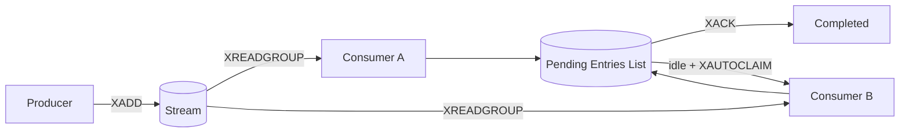
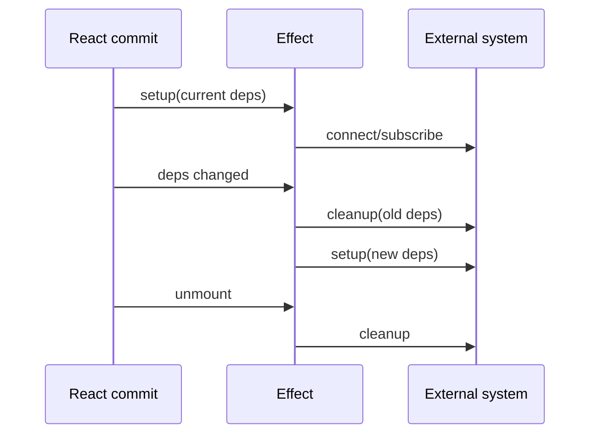

# 2026-09-15 13:00 — Interview Study Packages

README ve yakın daily notları kontrol edildi. Son turlardaki CPython free-threading, OpenTelemetry DB semantic conventions, Spark AQE, logical replication, Gateway API ve error budgets başlıkları tekrar edilmedi. Bu tur: distributed messaging, frontend ve algorithms.

## Paket 1 — Senior Distributed Systems: Redis Streams Consumer Groups, PEL & Recovery
**Süre:** 20–30 dk

### Konu anlatımı
Redis Streams append-only, zaman sıralı ID'lere sahip bir log yapısıdır. Consumer group içinde `XREADGROUP` ile teslim edilen fakat `XACK` edilmemiş entry'ler Pending Entries List (PEL) içinde tutulur. Consumer ölürse mesaj otomatik olarak başarılı sayılmaz; `XPENDING` ile gözlemlenebilir ve yeterince idle entry'ler `XCLAIM`/`XAUTOCLAIM` ile sağlıklı consumer'a devredilebilir. Bu model pratikte at-least-once processing demektir: recovery sırasında aynı iş yeniden görülebileceğinden side effect'ler idempotent olmalıdır.

### Mental model


### Yüksek getirili mülakat soruları
- Stream ile klasik queue arasındaki temel fark nedir?
- PEL neden vardır; yalnızca stream offset'i neden yetmez?
- Consumer crash ederse unacked entry nasıl kurtarılır?
- `XACK` işlemden önce yapılırsa hangi failure mode oluşur?
- At-least-once delivery altında duplicate side effect nasıl engellenir?
- Staff: poison message, retry limit, DLQ-benzeri politika ve lag observability nasıl tasarlanır?

### Seviyeye göre cevap derinliği
Junior/Mid: XADD, consumer group, ACK. Senior: PEL, claim/recovery, idempotency ve lag. Staff: retry ownership, poison-message policy, capacity/backpressure ve operational metrics.

### Kısa alıştırma
Bir payment worker'ın mesajı işledikten sonra `XACK` öncesinde crash ettiği senaryoyu çiz; duplicate charge'ı engelleyen idempotency key'i ekle.

### Proje fikri
`stream-worker-lab`: iki worker, crash injection, `XPENDING` dashboard'u ve `XAUTOCLAIM` recovery loop'u. Duplicate processing, pending age ve group lag ölç.

### Failure modes / trade-off / production
ACK-before-side-effect veri kaybı; ACK-after-side-effect duplicate riski; sınırsız retry poison-message hot loop yaratır; PEL büyümesini izlememek recovery debt üretir. Production'da idempotent consumer, bounded retry, pending-age alarmı ve lag metriği birlikte düşünülmelidir.

### Kaynaklar
- Redis Streams: https://redis.io/docs/latest/develop/data-types/streams/
- XAUTOCLAIM: https://redis.io/docs/latest/commands/xautoclaim/
- XACK: https://redis.io/docs/latest/commands/xack/

---

## Paket 2 — Mid/Senior Frontend: React Effects, External Synchronization & Cleanup
**Süre:** 20–30 dk

### Konu anlatımı
React'te Effect, render sırasında hesaplanabilecek state'i üretmek için değil, component'i network connection, timer, browser API veya üçüncü taraf widget gibi external system ile senkronize etmek içindir. Setup'ın döndürdüğü cleanup önceki dependency değerleriyle kurulmuş external resource'u kapatır. Dependency listesi effect içinde kullanılan reactive değerleri yansıtmalıdır; aksi halde stale closure veya eksik synchronization ortaya çıkar. Gereksiz Effect'ler state graph'ını karmaşıklaştırır; render sırasında türetilebilen değer render sırasında türetilmelidir.

### Mental model


### Yüksek getirili mülakat soruları
- `useEffect` ne için kullanılmalıdır?
- Derived state'i Effect ile hesaplamak neden sorunludur?
- Cleanup hangi anlarda çalışır?
- Missing dependency hangi stale-state bug'ını doğurabilir?
- Fetch race condition nasıl önlenir?
- Senior: custom hook external synchronization boundary'sini nasıl iyileştirir?

### Seviyeye göre cevap derinliği
Junior: setup/dependency/cleanup. Mid: subscriptions, timers, fetch lifecycle. Senior: race conditions, abort/cancellation, stale closures, custom hooks ve Effect elimination.

### Kısa alıştırma
`roomId` değiştiğinde eski websocket'i kapatıp yenisini açan component akışını yaz; unmount cleanup'ını ekle.

### Proje fikri
`effect-lifecycle-lab`: websocket simulator + reconnect counter + Strict Mode testleri; leaked connection sayısını ölç.

### Failure modes / trade-off / production
Cleanup unutmak resource leak; yanlış dependency stale closure; her render'da object/function dependency üretmek reconnect storm; fetch response ordering race'i eski cevabın yeni state'i ezmesine yol açabilir.

### Kaynaklar
- React useEffect: https://react.dev/reference/react/useEffect
- Synchronizing with Effects: https://react.dev/learn/synchronizing-with-effects
- You Might Not Need an Effect: https://react.dev/learn/you-might-not-need-an-effect

---

## Paket 3 — Junior/Mid Algorithms: Union-Find, Path Compression & Kruskal
**Süre:** 20–30 dk

### Konu anlatımı
Disjoint Set Union (Union-Find), elemanları kesişmeyen kümelerde tutar ve iki temel operasyon sunar: `find(x)` elemanın temsilcisini, `union(a,b)` iki kümenin birleştirilmesini sağlar. Parent-pointer forest kullanılır. Union-by-rank/size ağacı sığ tutar; path compression ise `find` sırasında ziyaret edilen düğümleri doğrudan köke yaklaştırır. İkisi birlikte amortized olarak pratikte sabite çok yakın maliyet verir. Kruskal MST algoritması edge'leri ağırlığa göre sıralar ve cycle oluşturmayacak edge'i Union-Find ile seçer.

### Mental model
```text
Before find(4): 4 -> 3 -> 2 -> 1
After compression: 4 -----> 1
                   3 -----> 1
                   2 -----> 1

union(a,b): rootA != rootB ise küçük ağacı büyük ağaca bağla
```

### Yüksek getirili mülakat soruları
- Union-Find hangi problem sınıfını çözer?
- Path compression ne yapar?
- Union-by-rank neden gereklidir?
- DFS/BFS connectivity ile DSU arasında ne zaman seçim yaparsın?
- Kruskal cycle'ı nasıl tespit eder?
- Dynamic connectivity için DSU'nun sınırı nedir?

### Seviyeye göre cevap derinliği
Junior: parent array ve find/union. Mid: rank/size, path compression, amortized complexity ve Kruskal. Senior: offline connectivity, rollback DSU ve kullanım sınırlarını tartışabilir.

### Kısa alıştırma
`n=7` için `(0,1),(1,2),(3,4),(2,4)` union'larını uygula; son parent forest'ı çiz ve component sayısını bul.

### Proje fikri
`network-connectivity-lab`: edge stream'i geldikçe component count ve largest component ölç; naive DFS yaklaşımıyla süreyi karşılaştır.

### Failure modes / trade-off / production
Rank/size kullanmamak derin ağaç yaratabilir; root bulmadan parent değiştirmek invariants'ı bozar; DSU edge deletion'ı doğal olarak desteklemez. Production bağlantısı: account/entity deduplication, offline connectivity ve graph clustering ön-işleme.

### Kaynaklar
- Princeton Algorithms, Union-Find: https://algs4.cs.princeton.edu/15uf/
- KruskalMST API: https://algs4.cs.princeton.edu/code/javadoc/edu/princeton/cs/algs4/KruskalMST.html
