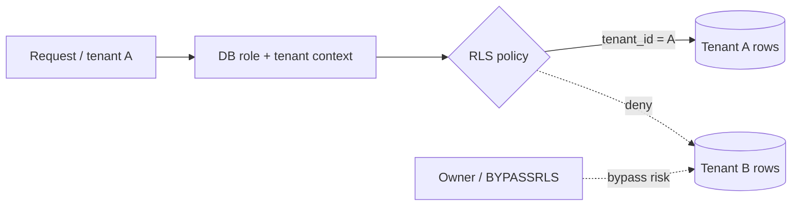

# 2026-09-15 14:00 — Interview Study Packages

README ve yakın `daily/` notları kontrol edildi. 13:00 turundaki Redis Streams, React Effects ve Union-Find/Kruskal konuları tekrar edilmedi. Bu tur databases/security, Kubernetes stateful workloads ve leadership/product/business eksenlerinde ilerliyor.

## Paket 1 — Senior Databases/Security: PostgreSQL Row-Level Security, Tenant Isolation & Policy Pitfalls
**Süre:** 20–30 dk

### Konu anlatımı
PostgreSQL Row-Level Security (RLS), klasik `GRANT` yetkilerinin üstüne satır bazlı bir authorization filtresi ekler. Bir tabloda RLS etkinleştirildiğinde normal kullanıcı erişimi policy tarafından izin verilen satırlarla sınırlanır; policy yoksa davranış default-deny'dır. `USING` mevcut satırların görünür/işlenebilir olmasını, `WITH CHECK` ise INSERT/UPDATE ile ortaya çıkacak yeni satırın kabul edilmesini kontrol eder. Birden fazla permissive policy varsayılan olarak OR, restrictive policy'ler AND mantığıyla birleşir.

Multi-tenant SaaS'ta tipik mental model `tenant_id = current tenant` predicate'ini veriye en yakın enforcement katmanına koymaktır. Ancak RLS uygulama katmanındaki authorization'ın yerine geçen sihirli bir sınır değildir: table owner normalde RLS'yi bypass eder; superuser ve `BYPASSRLS` rolleri de policy'lerden muaftır. Connection pooling kullanılıyorsa request tenant context'inin transaction sınırında doğru kurulup temizlenmesi kritik hale gelir.

### Mental model


### Yüksek getirili mülakat soruları
- RLS ile `GRANT` arasındaki fark nedir?
- `USING` ve `WITH CHECK` neden ayrı kavramlardır?
- Policy olmayan RLS-enabled tabloda ne olur?
- Table owner veya `BYPASSRLS` neden threat model'e dahil edilmelidir?
- Connection pool altında tenant context leakage nasıl oluşabilir?
- Staff: application authorization + RLS defense-in-depth modelini nasıl test edersin?

### Seviyeye göre cevap derinliği
Junior/Mid: role, GRANT, row filter ve default-deny. Senior: `USING`/`WITH CHECK`, permissive/restrictive policy, owner bypass ve pool context. Staff/Principal: tenant isolation invariant'ı, migration/backup davranışı, privileged-role governance ve adversarial integration tests.

### Kısa alıştırma
`invoices(tenant_id, id, amount)` tablosunda tenant'ın yalnızca kendi satırlarını SELECT/INSERT/UPDATE edebildiği policy taslağını yaz; yanlış `tenant_id` ile INSERT testini ekle.

### Proje fikri
`rls-tenant-lab`: iki tenant, pooled connections ve integration tests. Normal role, table owner ve yanlış tenant-context senaryolarını ayrı test et.

### Failure modes / trade-off / production
Uygulama rolünü table owner yapmak izolasyonu sessizce delmek; `WITH CHECK` eksikliğiyle cross-tenant write; request context'ini pool'a geri vermeden temizlememek; privileged maintenance job'larını audit etmemek. RLS güçlü defense-in-depth sağlar fakat policy karmaşıklığı, query planning ve operational tooling birlikte değerlendirilmelidir.

### Kaynaklar
- PostgreSQL 18 Row Security Policies: https://www.postgresql.org/docs/18/ddl-rowsecurity.html
- PostgreSQL 18 `pg_policy`: https://www.postgresql.org/docs/18/catalog-pg-policy.html
- PostgreSQL 18 CREATE ROLE / BYPASSRLS: https://www.postgresql.org/docs/18/sql-createrole.html

---

## Paket 2 — Senior/Staff Cloud/SRE: Kubernetes StatefulSet Identity, Ordering & Safe Stateful Rollouts
**Süre:** 20–30 dk

### Konu anlatımı
Deployment stateless replica'ları büyük ölçüde değiştirilebilir kabul ederken StatefulSet her Pod'a ordinal, stable network identity ve volume claim üzerinden kalıcı bir kimlik verir. Varsayılan ordinal aralığı `0..N-1`'dir; `.spec.ordinals.start` ile başlangıç ordinal'i değiştirilebilir. Her `volumeClaimTemplates` girdisi Pod başına ayrı PVC üretir ve StatefulSet/Pod silinmesi PVC'leri varsayılan olarak otomatik silmez.

`OrderedReady` varsayılan pod-management policy'sidir ve ölçekleme sırasında sıra/Ready garantilerini korur. `Parallel`, uygulamanın sıralamaya ihtiyacı yoksa create/terminate işlemlerini paralelleştirir. Buradaki kritik mülakat ayrımı şudur: Kubernetes size stable identity ve orchestration primitive verir; database quorum, replication safety, fencing veya application-level membership protokolünü sizin yerinize çözmez.

### Mental model
```text
StatefulSet db, replicas=3

 db-0 ---- PVC-0 ---- stable identity
 db-1 ---- PVC-1 ---- stable identity
 db-2 ---- PVC-2 ---- stable identity

OrderedReady: 0 -> Ready -> 1 -> Ready -> 2
Parallel:     0 + 1 + 2   (ordering relaxed)
```

### Yüksek getirili mülakat soruları
- StatefulSet'i Deployment'tan ayıran üç temel garanti nedir?
- Pod yeniden schedule edilirse hangi identity parçaları korunur?
- PVC neden Pod/StatefulSet silinince otomatik kaybolmayabilir?
- `OrderedReady` ile `Parallel` trade-off'u nedir?
- Stable identity neden tek başına distributed database safety sağlamaz?
- Staff: quorum tabanlı bir datastore rollout'unda readiness, PDB ve application membership'i nasıl bağlarsın?

### Seviyeye göre cevap derinliği
Mid: ordinal, stable DNS ve PVC. Senior: lifecycle/order, rolling update, storage retention ve failure recovery. Staff: quorum, fencing, topology, disruption budget, operator/controller ownership ve restore/runbook tasarımı.

### Kısa alıştırma
Üç replikalı quorum datastore için `db-0/1/2` kimliklerini çiz; node failure sırasında hangi Kubernetes garantisinin işe yaradığını ve hangi safety kararının datastore'a ait olduğunu işaretle.

### Proje fikri
`statefulset-failure-lab`: 3 Pod + PVC ile küçük bir replicated demo kur; Pod delete, node drain ve scale-down sırasında identity/storage davranışını kaydet.

### Failure modes / trade-off / production
StatefulSet kullanınca verinin otomatik replike edildiğini sanmak; readiness'i yalnızca process-alive yapmak; volume lifecycle'ını backup sanmak; ordering gerekmeyen workload'da gereksiz serial rollout; quorum uygulamasında Kubernetes rollout davranışıyla application membership'i koordine etmemek.

### Kaynaklar
- Kubernetes StatefulSets: https://kubernetes.io/docs/concepts/workloads/controllers/statefulset/
- StatefulSet Basics: https://kubernetes.io/docs/tutorials/stateful-application/basic-stateful-set/

---

## Paket 3 — Engineering Manager/CTO: Build vs Buy, Reversibility & Total Cost of Ownership
**Süre:** 20–30 dk

### Konu anlatımı
Build-vs-buy kararı yalnızca lisans fiyatı ile mühendis maaşını karşılaştırmak değildir. Kararı capability'nin stratejik farklılaştırma değeri, time-to-market, güvenlik/compliance gereksinimleri, entegrasyon maliyeti, operasyonel ownership, vendor concentration riski ve exit cost birlikte belirler. İyi karar çerçevesi önce iş sonucunu ve gerekli capability'yi tanımlar; sonra seçenekleri aynı zaman ufkunda total cost of ownership (TCO) ile karşılaştırır.

Reversibility önemli bir ikinci eksendir. Kolay geri döndürülebilen Type-2 kararlar hızlı denenebilir; veri modeli, kimlik altyapısı veya core workflow gibi pahalı geri dönüşlü kararlar için daha fazla due diligence gerekir. Vendor seçerken API/export imkanları, veri sahipliği, SLA/SLO, incident transparency, fiyatlandırma eğrisi ve migration path sözleşmenin teknik parçasıdır.

### Mental model
```text
                 strategic differentiation
                       low       high
reversible  high     BUY/TRY    PILOT/BUILD
            low      BUY+EXIT   DEEP DUE DILIGENCE

TCO = license/build + integration + operations
    + security/compliance + migration/exit + opportunity cost
```

### Yüksek getirili mülakat soruları
- Build-vs-buy kararında hangi maliyetler genellikle unutulur?
- Core differentiation ne zaman build lehine güçlü sinyaldir?
- Vendor lock-in'i teknik olarak nasıl ölçersin?
- Bir kararın reversibility'si süreç derinliğini nasıl değiştirmeli?
- EM: ekip kapasitesi ve opportunity cost'u roadmap'e nasıl yansıtırsın?
- CTO: vendor concentration riskini ve exit planını board seviyesinde nasıl anlatırsın?

### Seviyeye göre cevap derinliği
Senior: teknik entegrasyon, operasyon ve bakım maliyeti. Staff/Principal: platform etkisi, standards ve migration path. EM: kapasite, roadmap ve ownership. CTO: şirket stratejisi, cash/time-to-market, concentration risk, compliance ve 2–3 yıllık TCO.

### Kısa alıştırma
Auth, observability veya feature-flag capability'lerinden birini seç. Build ve buy için 24 aylık maliyet kalemleri, iki teknik risk ve bir exit trigger yaz.

### Proje fikri
`architecture-decision-scorecard`: weighted decision matrix + ADR şablonu. TCO, reversibility, differentiation, security, integration ve exit-cost skorlarını görünür yap.

### Failure modes / trade-off / production
Sadece ilk yıl fiyatına bakmak; internal platform'un on-call/upgrade maliyetini sıfır saymak; vendor export/migration yolunu test etmemek; sunk cost nedeniyle kötü kararı sürdürmek; stratejik olmayan capability'de aylarca özel platform geliştirmek. Production bağlantısı bütçe kadar ownership ve incident accountability'dir.

### Kaynaklar
- AWS Architecture Blog — Building evolvable architectures: https://aws.amazon.com/blogs/architecture/building-evolvable-architectures/
- Google Cloud Architecture Framework — System design: https://cloud.google.com/architecture/framework/system-design
- FinOps Framework: https://www.finops.org/framework/
