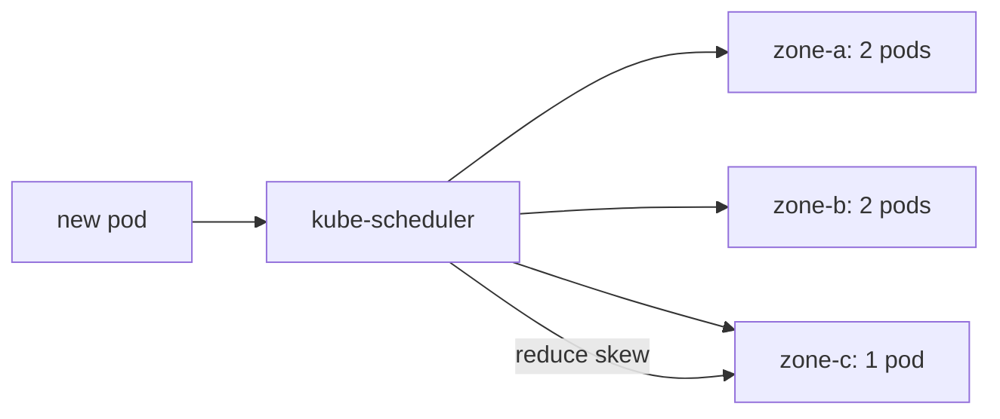

# 2026-09-15 15:00 — Interview Study Packages

README ve yakın `daily/` notları kontrol edildi. 14:00 turundaki PostgreSQL RLS, StatefulSet ve build-vs-buy başlıkları tekrar edilmedi. Bu tur cloud/SRE scheduling, observability ve algorithms eksenlerinde ilerliyor.

## Paket 1 — Senior/Staff Cloud/SRE: Kubernetes Topology Spread, Failure Domains & Scheduling Trade-offs
**Süre:** 20–30 dk

### Konu anlatımı
Yüksek erişilebilirlik yalnızca replica sayısı değildir; replica'ların aynı failure domain'e yığılmaması gerekir. Kubernetes `topologySpreadConstraints`, matching Pod'ların node, zone, region veya özel topology domain'leri arasında ne kadar dengesiz dağılabileceğini scheduler'a bildirir. `maxSkew` izin verilen dengesizliği sınırlar. `whenUnsatisfiable: DoNotSchedule` hard constraint gibi davranır; `ScheduleAnyway` ise scheduler'a skew'u azaltan domain'leri tercih ettiren soft davranıştır.

Bu mekanizma Pod anti-affinity ile aynı şey değildir. Anti-affinity çoğunlukla belirli Pod'ların birlikte yerleşmesini yasaklar/azaltır; topology spread ise dağılımın sayısal dengesini modellemeye daha uygundur. Production tasarımında zone sayısı, replica sayısı, autoscaling, node pool kapasitesi ve disruption davranışı birlikte düşünülmelidir. Üç replica'yı üç zone'a yaymak güzel görünür; fakat bir zone kapasitesizse hard constraint yeni Pod'u Pending bırakabilir.

### Mental model


### Yüksek getirili mülakat soruları
- Replica sayısı yüksek availability için neden tek başına yeterli değildir?
- `maxSkew` neyi ifade eder?
- `DoNotSchedule` ile `ScheduleAnyway` trade-off'u nedir?
- Topology spread ile Pod anti-affinity nasıl ayrılır?
- Bir zone kaybolduğunda hard spread constraint hangi availability sorununu yaratabilir?
- Staff: HPA + topology spread + PDB + zonal capacity planını nasıl birlikte tasarlarsın?

### Seviyeye göre cevap derinliği
Junior/Mid: node/zone/failure-domain ve replica dağılımı. Senior: `maxSkew`, selector, hard/soft scheduling, capacity ve Pending failure mode. Staff/Principal: multi-zone capacity headroom, autoscaling, disruption, scheduler defaults ve organization-wide workload policy.

### Kısa alıştırma
3 zone ve 5 replica için `maxSkew: 1` dağılımını çiz. Sonra zone-c kapasitesini sıfırla; `DoNotSchedule` ve `ScheduleAnyway` sonuçlarını karşılaştır.

### Proje fikri
`topology-spread-lab`: kind veya test cluster üzerinde node'ları üç sahte zone ile etiketle; 2→9 replica scale ederken Pod dağılımını ve Pending durumlarını kaydet.

### Failure modes / trade-off / production
Yanlış label selector nedeniyle constraint'in beklenen Pod'ları eşlememesi; hard constraint yüzünden kapasite varken yanlış domain kısıtı nedeniyle Pending; yalnız zone spread yapıp aynı node riskini unutmak; HPA'nın yeni replica talebiyle zonal capacity'nin uyuşmaması. Production'da placement policy, capacity modelinin bir parçasıdır.

### Kaynaklar
- Kubernetes — Pod Topology Spread Constraints: https://kubernetes.io/docs/concepts/scheduling-eviction/topology-spread-constraints/
- Kubernetes — Assigning Pods to Nodes: https://kubernetes.io/docs/concepts/scheduling-eviction/assign-pod-node/

---

## Paket 2 — Senior Backend/Observability: OpenTelemetry Logs, Events & Trace Correlation
**Süre:** 20–30 dk

### Konu anlatımı
Structured logging'in değeri yalnız JSON üretmek değildir; telemetry backend'inin farklı kaynaklardan gelen kayıtları aynı semantik modelde sorgulayabilmesidir. OpenTelemetry Logs Data Model; `Timestamp`, `ObservedTimestamp`, `TraceId`, `SpanId`, `SeverityText`, normalize edilmiş `SeverityNumber`, `Body`, `Resource`, `InstrumentationScope`, `Attributes` ve `EventName` gibi alanları tanımlar. `TraceId`/`SpanId`, log kaydını request trace'i ile korele etmeyi mümkün kılar.

OpenTelemetry'de non-empty `EventName` taşıyan LogRecord bir Event'tir. Event, belirli bir occurrence'ı ve şemasını isimlendirmek için uygundur; serbest biçimli diagnostic mesaj ise normal log olarak kalabilir. Cardinality ve privacy production'ın kritik tarafıdır: user ID, request ID veya exception detail gibi alanlar faydalı olabilir fakat sınırsız yüksek-cardinality index, maliyeti artırabilir; token, parola ve kişisel veri ise telemetry'ye hiç düşmemelidir. Sampling de dikkat ister: trace sampled değil diye error log'un kaybolması zorunlu değildir; sinyallerin retention ve sampling politikaları ayrı tasarlanabilir.

### Mental model
```text
request
  |
  +--> span(trace_id=T, span_id=S)
  |
  +--> log{TraceId=T, SpanId=S, Severity=ERROR}
                    |
                    v
              correlated view

Resource = service identity
Attributes = occurrence context
EventName = named event schema
```

### Yüksek getirili mülakat soruları
- `Timestamp` ile `ObservedTimestamp` farkı nedir?
- `SeverityText` ve `SeverityNumber` neden birlikte bulunabilir?
- Log-trace correlation nasıl çalışır?
- Event ile normal diagnostic log'u ne zaman ayırırsın?
- Resource attribute ile event/log attribute arasındaki semantik fark nedir?
- Staff: cardinality, PII redaction, retention ve sampling politikalarını nasıl tasarlarsın?

### Seviyeye göre cevap derinliği
Mid: structured logs, severity, trace correlation. Senior: resource/scope/attributes, EventName, ingestion pipeline, cardinality ve redaction. Staff: telemetry schema governance, cost controls, cross-team semantic conventions, retention tiers ve incident-query ergonomics.

### Kısa alıştırma
Bir checkout failure için OTel LogRecord tasarla: hangi alanlar Resource, hangileri Attributes, hangisi EventName olur? Bir secret alanını bilerek ekle ve pipeline'da nerede redakte edeceğini belirt.

### Proje fikri
`otel-log-correlation-lab`: küçük bir HTTP servisinde trace + structured log üret; Collector üzerinden backend'e gönder; tek request ID yerine TraceId ile log→trace pivot'u göster.

### Failure modes / trade-off / production
Her şeyi attribute yapmak ve index maliyetini patlatmak; secret/PII sızdırmak; severity mapping'i servisler arasında tutarsızlaştırmak; trace correlation alanlarını kaybetmek; log body'yi parse edilmesi gereken dev bir string'e çevirmek. Production observability bir veri-modeli ve maliyet-governance problemidir.

### Kaynaklar
- OpenTelemetry — Logs Data Model: https://opentelemetry.io/docs/specs/otel/logs/data-model/
- OpenTelemetry — Semantic conventions for events: https://opentelemetry.io/docs/specs/semconv/general/events/
- OpenTelemetry — Logs concepts: https://opentelemetry.io/docs/concepts/signals/logs/

---

## Paket 3 — Junior/Mid Algorithms: Monotonic Stack, Next Greater Element & Amortized O(n)
**Süre:** 20–30 dk

### Konu anlatımı
Monotonic stack, elemanları artan veya azalan bir invariant altında tutan stack pattern'idir. Next Greater Element probleminde soldan sağa ilerlerken stack'te henüz daha büyük sağ komşusu bulunmamış index'leri tutarız. Yeni değer stack top'undan büyükse top'un cevabı bulunmuştur; pop ederiz ve koşul sürdükçe devam ederiz. Sonra yeni index'i push ederiz.

İç içe `while` görünmesine rağmen toplam karmaşıklık O(n)'dir: her index en fazla bir kez push ve bir kez pop edilir. Bu amortized-analysis argümanı mülakatta kod kadar önemlidir. Aynı pattern stock span, daily temperatures, histogram ve bazı range-boundary problemlerine dönüşür. Hangi yönde monotonic invariant tutulacağı sorunun 'next/previous' ve 'greater/smaller' yapısına göre seçilir.

### Mental model
```text
values: 2  1  5  3  4

stack indices waiting for a greater value
2 -> [2]
1 -> [2,1]
5 -> pop 1, pop 2, push 5
3 -> [5,3]
4 -> pop 3, push 4

Each index: push <= 1, pop <= 1  => O(n)
```

### Yüksek getirili mülakat soruları
- Monotonic stack invariant'ı nedir?
- Next Greater Element brute-force karmaşıklığı nedir?
- İçeride `while` varken çözüm neden O(n)?
- Index tutmak ile value tutmak neyi değiştirir?
- Equal değerlerde `<` ve `<=` seçimi sonucu nasıl etkiler?
- Histogram largest rectangle probleminde stack neyi temsil eder?

### Seviyeye göre cevap derinliği
Junior: stack ve O(n²) brute force. Mid: monotonic invariant, index-based implementation ve amortized O(n). Senior mülakat varyantında boundary semantics, duplicates ve histogram/range dönüşümlerini açıklayabilmek beklenir.

### Kısa alıştırma
`[2,1,2,4,3]` için next-greater index dizisini elle çıkar; sonra aynı kodu next-smaller için değiştir.

### Proje fikri
`monotonic-pattern-visualizer`: input array üzerinde push/pop adımlarını ASCII veya küçük web UI ile animasyonlaştır; NGE, stock span ve daily temperatures modları ekle.

### Failure modes / trade-off / production
Value yerine index gerektiğini geç fark etmek; duplicate semantics'i tanımlamamak; stack invariant'ını ters kurmak; amortized complexity'yi açıklayamamak. Production bağlantısı doğrudan servis mimarisinden çok streaming/range analytics ve performance-sensitive sequence processing'dedir; mülakatta ise pattern recognition getirisi yüksektir.

### Kaynaklar
- CLRS/OpenStax yerine telifli metin kopyalanmamıştır; amortized analysis için özgün açıklama kullanılmıştır.
- Princeton Algorithms — Stacks and Queues (referans): https://algs4.cs.princeton.edu/13stacks/
