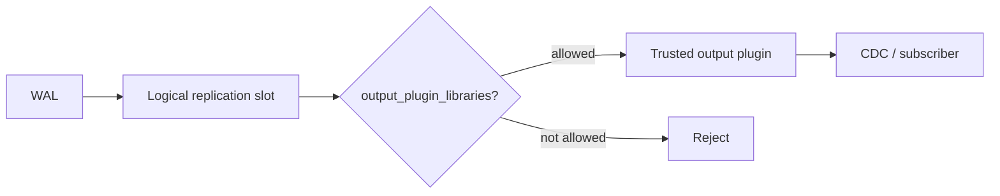
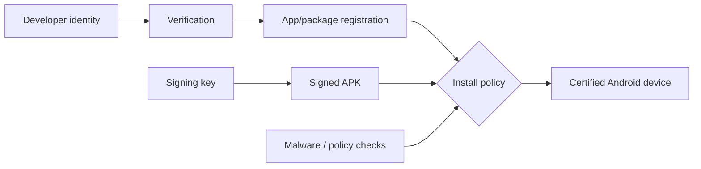

# 2026-09-17 19:00 — Interview Study Packages

README ve yakın mevcut daily notları kontrol edildi. Bu saat databases/security ile frontend-mobile/platform-security ekseninde ilerliyor; repo aramasında aşağıdaki iki konu için yakın eşleşme bulunmadı.

## Paket 1 — Senior → Staff Databases & Cybersecurity: PostgreSQL Logical Decoding Plugin Allowlisting

**Süre:** 20–30 dk

### Konu anlatımı

Logical decoding, WAL içindeki fiziksel değişiklikleri bir output plugin aracılığıyla mantıksal değişiklik akışına dönüştürür. CDC, event streaming ve heterogeneous replication için güçlüdür; fakat plugin yüklemek aynı zamanda veritabanı sunucusunun process boundary'si içinde native code çalıştırma yeteneğidir. Bu nedenle replication privilege tek başına yeterli güvenlik sınırı değildir.

PostgreSQL 18.6, logical decoding output plugin'lerini yeni `output_plugin_libraries` sunucu parametresiyle allowlist etmeye başladı. Varsayılan liste PostgreSQL ile gelen `pgoutput` ve `test_decoding` plugin'lerini içerir. Upgrade sırasında üçüncü taraf decoder kullanan sistemlerin allowlist'i açıkça güncellemesi gerekir; PostgreSQL 17+ kaynak cluster'lardan `pg_upgrade --check` da yeni cluster'ın slotlarda kullanılan plugin'lere izin verip vermediğini kontrol eder.

Bu değişiklik güzel bir production security mental model'i verir: **data-plane privilege ≠ arbitrary extension execution privilege**. Bir CDC consumer'ın veri okuyabilmesi, sunucuya istediği shared library'yi seçtirebilmesi anlamına gelmemelidir.

### Mental model

### Yüksek getirili mülakat soruları

1. Physical replication ile logical replication arasındaki temel fark nedir?
2. Replication slot WAL retention'ı neden büyütebilir?
3. Output plugin neden bir security boundary problemidir?
4. Allowlist, authentication ve authorization'dan nasıl farklıdır?
5. Senior: üçüncü taraf decoder kullanan cluster'ı 18.6'ya nasıl yükseltirsin?
6. Staff: yüzlerce cluster'da plugin inventory ve policy drift'i nasıl yönetirsin?
7. Bir plugin kaldırılırken mevcut slotların ve downstream CDC'nin blast radius'u nasıl sınırlandırılır?

### Seviyeye göre cevap derinliği

- **Junior/Mid:** WAL, replication slot, logical vs physical replication.
- **Senior:** plugin trust, least privilege, upgrade preflight, WAL retention ve rollback.
- **Staff:** fleet-wide inventory, policy-as-code, exception governance ve CDC availability.
- **Principal/CTO:** extension ecosystem'i ile attack surface arasındaki stratejik denge.

### Kısa alıştırma

Bir production cluster'da `pgoutput`, `wal2json` ve artık kullanılmayan `decoderbufs` olduğunu varsay. 18.6 upgrade öncesi inventory, allowlist, validation ve rollback adımlarını 8 maddede tasarla.

### Proje fikri

`pg-plugin-auditor`: cluster'lardaki logical replication slot/plugin eşleşmelerini çıkaran, allowlist ile karşılaştıran ve CI/CD için machine-readable drift raporu üreten küçük bir araç.

### Failure modes / trade-off / production bağlantısı

- Fazla geniş allowlist → güvenlik kontrolü anlamsızlaşır.
- Fazla dar allowlist → CDC outage.
- Unused slot → WAL disk büyümesi.
- Plugin binary/version uyumsuzluğu → decoding failure.
- Upgrade öncesi inventory yokluğu → sürpriz `pg_upgrade --check` veya production cutover problemi.

Production metrikleri: replication slot lag, retained WAL bytes, decoding error rate, plugin/version inventory, subscriber apply lag ve disk headroom.

### Kaynaklar

- PostgreSQL 18.6 release notes: https://www.postgresql.org/docs/release/18.6/
- PostgreSQL 18 logical replication: https://www.postgresql.org/docs/18/logical-replication.html
- PostgreSQL logical decoding concepts: https://www.postgresql.org/docs/18/logicaldecoding.html

---

## Paket 2 — Mid → CTO Frontend/Mobile & Security: Android Developer Verification, App Identity & Distribution Trust

**Süre:** 20–30 dk

### Konu anlatımı

Mobil uygulama güvenliğinde üç kavramı ayırmak gerekir: **package identity**, **cryptographic signing** ve **developer/distribution identity**. APK signing, bir update'in aynı signing identity'den geldiğini kanıtlamaya yardım eder; fakat signing key'in arkasındaki gerçek geliştiricinin kim olduğunu tek başına söylemez. Store review ise başka bir trust layer'dır.

Android, developer verification korumalarını 30 Eylül 2026'da Brezilya, Endonezya, Singapur ve Tayland'daki certified Android cihazlarda devreye alacağını açıkladı. Google'ın Haziran 2026 güncellemesine göre rollout Google Play dışındaki büyük store'ları da kapsıyor ve 2027'de global genişleme planlanıyor. Amaç app identity'yi verified developer identity ile ilişkilendirerek kötü niyetli aktörlerin yeni kimliklerle tekrar dağıtım yapmasını zorlaştırmak.

Mülakatta kritik ayrım şudur: verification bir malware detector değildir. Güven zincirine **accountability / provenance** katmanı ekler; code review, sandbox, runtime permissions, signing-key protection ve malware scanning'in yerine geçmez.

### Mental model

### Yüksek getirili mülakat soruları

1. APK signing neyi kanıtlar, neyi kanıtlamaz?
2. Developer verification ile store review neden aynı şey değildir?
3. Package name neden tek başına güçlü identity değildir?
4. Signing key compromise olduğunda blast radius nedir?
5. Senior: multi-store release pipeline'da identity drift'i nasıl önlersin?
6. Staff: verification rollout'u sırasında legitimate sideload/use-case compatibility'sini nasıl test edersin?
7. CTO/Product: ecosystem openness, abuse prevention ve developer friction nasıl dengelenir?

### Seviyeye göre cevap derinliği

- **Junior:** package, signing key, install/update kavramları.
- **Mid:** trust chain, store vs sideload, key rotation.
- **Senior:** CI signing boundary, HSM/KMS, multi-store release ve recovery.
- **Staff:** ecosystem policy, compatibility matrix, telemetry ve staged rollout.
- **CTO/Product:** abuse economics, openness, regulatory/market risk ve developer experience.

### Kısa alıştırma

Play + iki üçüncü taraf store + enterprise direct distribution kullanan bir Android uygulaması için tek bir release'in identity/signing/registration doğrulama checklist'ini çıkar.

### Proje fikri

`android-release-provenance-checker`: build artifact hash'i, package id, signing certificate fingerprint, versionCode ve hedef distribution channel bilgisini tek manifestte toplayıp release gate olarak doğrulayan CLI.

### Failure modes / trade-off / production bağlantısı

- Signing key compromise → sahte update riski.
- Store/console registration drift → legitimate install/update failure.
- Verification'ı malware prevention ile eşitlemek → false sense of security.
- Tek market davranışına göre test → regional rollout sürprizleri.
- Identity recovery prosedürü olmaması → uzun süreli distribution outage.

Production bağlantısı: signing keys'i build worker'dan ayır; release provenance kaydet; channel/region bazlı install failure telemetry izle; rollout deadline'larından önce gerçek cihaz matrisiyle canary yap.

### Kaynaklar

- Android developer verification, 30 Haziran 2026: https://android-developers.googleblog.com/2026/06/android-developer-verification.html
- Android developer verification rollout, 30 Mart 2026: https://android-developers.googleblog.com/2026/03/android-developer-verification-rolling-out-to-all-developers.html
- Android app signing: https://developer.android.com/studio/publish/app-signing
