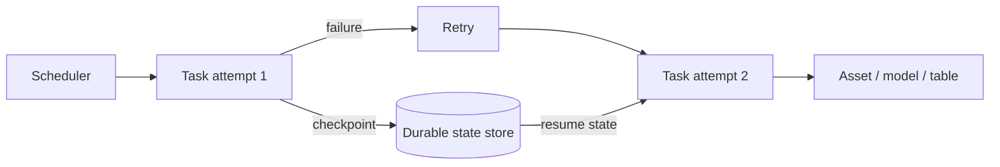
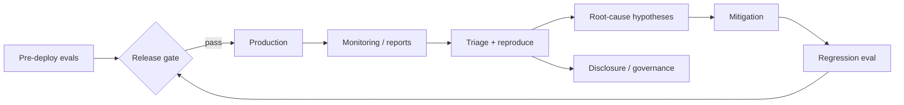

# 2026-09-17 20:00 — Interview Study Packages

README ve yakın `19-00.md` kontrol edildi. PostgreSQL logical-decoding allowlist ve Android developer verification tekrar edilmedi; repo aramasında aşağıdaki iki konu için yakın eşleşme bulunmadı.

## Paket 1 — Mid → Staff Data Engineering & MLOps: Airflow 3.3 Stateful Tasks, Durable Workflow State & Retry Semantics

**Süre:** 20–30 dk

### Konu anlatımı
Workflow orchestration'da task retry ile application state aynı şey değildir. Retry, bir execution attempt'i yeniden çalıştırır; durable application state ise attempt'ler, task'lar ve hatta DAG run'ları arasında kontrollü biçimde taşınan bilgidir. State'i local disk, worker memory veya rastgele XCom benzeri kanallara gömmek worker replacement, retry ve horizontal scaling sırasında kırılganlık yaratır.

Apache Airflow 3.3.0, AIP-103 ile task ve asset'ler için first-class state store getirdi. Mental model: orchestrator execution lifecycle'ı yönetir; state store ise workflow'un devamlılık bilgisini açık bir API ve namespace altında saklar. Bu ayrım özellikle incremental ingestion cursor'ları, API pagination token'ları, agent checkpoint'leri ve uzun süren data/ML pipeline'larında önemlidir.

### Mental model

### Yüksek getirili mülakat soruları
1. Retry state ile application state arasındaki fark nedir?
2. Worker local disk neden durable checkpoint değildir?
3. Checkpoint yazımı ile external side effect atomik değilse ne olabilir?
4. Mid: pagination cursor'ını nasıl idempotent kullanırsın?
5. Senior: state schema/version migration nasıl tasarlanır?
6. Staff: multi-team orchestrator'da namespace, quota ve retention nasıl yönetilir?
7. MLOps: training/agent checkpoint'i ile orchestrator metadata'sını nerede ayırırsın?

### Seviyeye göre cevap derinliği
- **Junior/Mid:** retry, idempotency, durable vs ephemeral state.
- **Senior:** checkpoint ordering, schema evolution, concurrency ve recovery.
- **Staff:** tenancy, lifecycle/retention, observability ve platform contract.
- **Principal/CTO:** managed state'in operasyonel değeri, lock-in ve governance maliyeti.

### Kısa alıştırma
Paginated bir API'den 10 milyon kayıt alan task tasarla. Her sayfadan sonra cursor saklanıyor. Process, external sink'e yazdıktan fakat cursor commit'inden önce ölürse duplicate'i nasıl önlersin? 6 maddelik recovery protokolü yaz.

### Proje fikri
`durable-ingestion-lab`: cursor checkpoint, idempotency key, injected crash ve retry içeren küçük bir Airflow pipeline'ı; crash'in dört farklı noktasında correctness testi yap.

### Failure modes / trade-off / production bağlantısı
Stale checkpoint, concurrent writer, unbounded state growth, secret/PII'nin state'e sızması, state-store outage ve checkpoint-side-effect ordering hataları. Production'da checkpoint age, retry count, duplicate rate, state read/write latency, state size ve recovery duration izle. State store kullanmak correctness'i otomatik sağlamaz; external side effect ile checkpoint arasındaki consistency protokolünü hâlâ tasarlamak gerekir.

### Kaynaklar
- Apache Airflow 3.3.0 (6 Temmuz 2026): https://airflow.apache.org/blog/airflow-3.3.0/
- Airflow announcements / 3.3.1: https://airflow.apache.org/announcements/
- Airflow documentation: https://airflow.apache.org/docs/

---

## Paket 2 — Senior → CTO ML/AI/LLM & Leadership: Model Misalignment Reporting, Evaluation Gates & AI Incident Governance

**Süre:** 20–30 dk

### Konu anlatımı
Production AI governance yalnızca offline benchmark değildir. Model davranışı dağıtımdan sonra yeni prompt dağılımları, tool access, uzun horizon ve sistem entegrasyonları altında farklı failure mode'lar gösterebilir. Bu yüzden capability eval, safety eval, runtime monitoring, incident triage ve disclosure birbirinden ayrı fakat bağlı kontrol döngüleridir.

OpenAI 16 Eylül 2026'da model misalignment örneklerini takip etme, araştırma ve raporlama için sistematik bir framework yayımladı. Mülakat açısından yüksek getirili çıkarım belirli bir sağlayıcıdan bağımsızdır: beklenmeyen davranışı yalnızca tekil bug olarak değil, yeniden üretilebilir evidence + severity + affected surface + mitigation + regression eval zinciri olarak ele almak gerekir.

### Mental model

### Yüksek getirili mülakat soruları
1. Capability eval ile safety eval neden ayrılmalıdır?
2. Offline eval production riskini neden tam temsil etmez?
3. Bir model incident'ında reproducibility neden zordur?
4. Senior: nondeterministic failure için regression test nasıl kurarsın?
5. Staff: tool-using agent için severity rubric nasıl tasarlanır?
6. EM/Principal: false-positive safety gate ile release velocity nasıl dengelenir?
7. CTO: hangi model davranışları executive escalation veya external disclosure gerektirir?

### Seviyeye göre cevap derinliği
- **Junior/Mid:** eval set, metric, false positive/negative, monitoring.
- **Senior:** stratified evals, seeds/retries, trace capture, mitigation validation.
- **Staff:** cross-product severity taxonomy, ownership ve release gates.
- **EM/CTO:** risk appetite, disclosure policy, regulatory exposure ve business continuity.

### Kısa alıştırma
Tool kullanan bir agent'ın %0.2 oranında yetki sınırı dışındaki bir aksiyonu denediğini varsay. Severity, containment, evidence capture, rollback, regression suite ve re-release gate içeren 8 maddelik incident planı yaz.

### Proje fikri
`ai-incident-eval-harness`: prompt/tool trace'lerini redakte ederek saklayan, failure taxonomy uygulayan ve mitigation öncesi/sonrası aynı scenario set'ini çoklu denemelerle karşılaştıran mini harness.

### Failure modes / trade-off / production bağlantısı
Benchmark overfitting, eval contamination, yalnızca average score izlemek, rare/high-impact event'leri kaçırmak, telemetry'de hassas veri tutmak ve mitigation'ın capability'yi aşırı düşürmesi. Production'da severity-bucket incident rate, tool-denial rate, human escalation, regression pass rate, policy violation attempts ve mitigation latency izle. Governance hedefi sıfır incident iddiası değil; riskin erken bulunması, sınırlandırılması, öğrenilmesi ve tekrarının ölçülebilir biçimde azaltılmasıdır.

### Kaynaklar
- OpenAI model misalignment reporting framework (16 Eylül 2026): https://openai.com/index/model-misalignment-reporting-framework/
- NIST AI Risk Management Framework: https://www.nist.gov/itl/ai-risk-management-framework
- NIST AI RMF Generative AI Profile: https://www.nist.gov/publications/artificial-intelligence-risk-management-framework-generative-artificial-intelligence-profile
