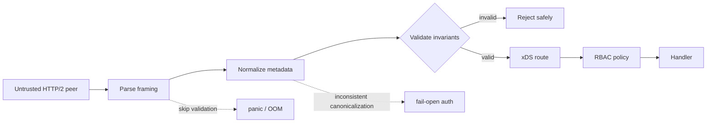
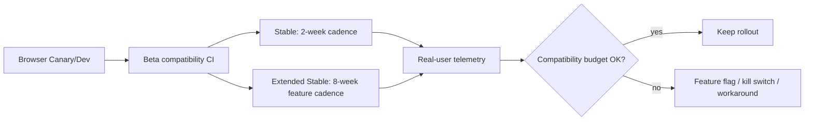

# 2026-09-17 21:00 — Interview Study Packages

README ve yakın `20-00.md` kontrol edildi. Airflow durable state ve AI incident governance tekrar edilmedi; repo aramasında aşağıdaki iki konu için yakın eşleşme bulunmadı.

## Paket 1 — Mid → Staff Backend, Networking & Cybersecurity: gRPC/xDS Protocol Validation, Fail-Open Auth & Availability

**Süre:** 20–30 dk

### Konu anlatımı
Bir RPC sunucusunda ağ katmanından gelen metadata yalnızca routing girdisi değildir; authorization ve process availability için de trust boundary'dir. HTTP/2 üzerinde gRPC, `:authority` gibi pseudo-header'ları kullanır. xDS tabanlı routing/RBAC bu metadata'yı policy evaluation'a taşır. Buradaki temel invariant şudur: **untrusted wire input normalize ve validate edilmeden routing veya authorization kararına girmemelidir**.

15 Eylül 2026'da Go vulnerability database iki öğretici gRPC-Go vakası yayımladı. GO-2026-6443'te xDS routing kullanan server, hem `:authority` hem `Host` eksik bir request'te empty authority üzerinde işlem yaparak panic edebiliyor; tek malformed request process availability'yi etkileyebiliyor. GO-2026-6441'de xDS RBAC header matcher isimlerinin lowercase normalize edilmemesi mixed-case header ile DENY kuralının eşleşmemesine ve policy'nin fail-open davranmasına yol açabiliyor. Aynı protokol sınırındaki iki farklı correctness sınıfı: **crash safety** ve **authorization safety**.

### Mental model

### Yüksek getirili mülakat soruları
1. `:authority` ile `Host` neden routing ve security boundary olabilir?
2. Parser'ın request'i kabul etmesi application invariant'larının sağlandığı anlamına gelir mi?
3. Header canonicalization authorization'dan önce neden yapılmalıdır?
4. Mid: malformed request'i panic yerine nasıl güvenli reject edersin?
5. Senior: fail-open ve fail-closed policy'nin trade-off'u nedir?
6. Staff: proxy → gRPC → xDS zincirinde validation ownership'i nasıl belirlersin?
7. Security: normalization inconsistency neden policy bypass sınıfıdır?
8. SRE: malformed traffic kaynaklı crash ile normal application crash'ini telemetry'de nasıl ayırırsın?

### Seviyeye göre cevap derinliği
- **Junior/Mid:** HTTP metadata, input validation, panic vs error, deny/allow.
- **Senior:** canonicalization, protocol invariants, fail-open/fail-closed, fuzz/property tests.
- **Staff:** trust boundaries, proxy/backend semantic consistency, blast radius ve staged rollout.
- **Principal/CTO:** dependency patch SLA, exposure inventory, security-vs-availability policy ve fleet governance.

### Kısa alıştırma
Bir gRPC edge server için 8 test yaz: missing authority, empty authority, mixed-case RBAC header, duplicate header, oversized metadata, malformed pseudo-header ordering, unknown route ve explicit DENY. Her testte beklenen HTTP/gRPC sonucu ile process'in yaşamaya devam etmesi invariant'ını belirt.

### Proje fikri
`grpc-boundary-fuzzer`: küçük bir gRPC/xDS benzeri routing katmanına malformed metadata üreten property-based test harness'i. Panic=0, unauthorized allow=0 ve deterministic reject-code invariant'larını ölç.

### Failure modes / trade-off / production bağlantısı
Parser ile policy engine'in farklı canonicalization yapması, invalid input'ta panic, deny rule'un sessizce match etmemesi, proxy'nin backend'den farklı header semantics uygulaması ve yalnız happy-path integration testleri. Production'da invalid-metadata reject rate, auth deny/allow counters, process restart, panic signature, route-miss ve dependency version coverage izle. Strict validation compatibility sorunları yaratabilir; ancak security-sensitive ambiguity'yi sessizce kabul etmek yerine explicit reject ve observable migration daha güvenlidir.

### Kaynaklar
- Go vulnerability GO-2026-6443 (15 Eylül 2026): https://pkg.go.dev/vuln/GO-2026-6443
- Go vulnerability GO-2026-6441 (15 Eylül 2026): https://pkg.go.dev/vuln/GO-2026-6441
- gRPC-Go repository/security context: https://github.com/grpc/grpc-go
- HTTP/2 RFC 9113: https://www.rfc-editor.org/rfc/rfc9113

---

## Paket 2 — Mid → CTO Frontend/Mobile, DevOps & Leadership: Browser Release Cadence, Compatibility Budgets & Enterprise Rollouts

**Süre:** 20–30 dk

### Konu anlatımı
Web production ortamında browser bir runtime dependency'dir fakat uygulama ekibi onu deploy etmez. Bu nedenle browser release cadence hızlandığında frontend delivery sistemi de değişmelidir: Beta/Canary compatibility testing, feature detection, progressive enhancement, telemetry ve rollback/kill-switch mekanizmaları daha kısa geri bildirim döngüsüne uyarlanmalıdır.

Google, Chrome 153'ün 8 Eylül 2026'da Stable'a çıkışıyla Chrome Stable cadence'ini dört haftadan iki haftaya indirdi. Enterprise için Extended Stable major feature update'leri sekiz haftada bir alırken security fixes daha sık backport edilmeye devam ediyor. Bu iki kanal farklı risk fonksiyonları yaratır: hızlı Stable daha küçük change batch ve daha hızlı fix getirirken test/qualification sıklığını artırır; Extended Stable qualification süresini artırır fakat daha büyük milestone delta ve feature lag yaratabilir.

### Mental model

### Yüksek getirili mülakat soruları
1. Browser neden uygulamanın external runtime dependency'sidir?
2. Feature detection neden user-agent sniffing'den genellikle daha dayanıklıdır?
3. Daha sık release neden hem risk azaltabilir hem operasyon maliyetini artırabilir?
4. Mid: Beta kanalını frontend CI'a nasıl eklersin?
5. Senior: browser regression için compatibility budget nasıl tanımlarsın?
6. Staff: web app, extension ve embedded WebView fleet'ini nasıl segmentlersin?
7. EM: iki haftalık cadence test ownership ve on-call sürecini nasıl değiştirir?
8. CTO: Stable ile Extended Stable seçimini security, compliance ve business continuity açısından nasıl yaparsın?

### Seviyeye göre cevap derinliği
- **Junior/Mid:** feature detection, polyfill/progressive enhancement, cross-browser test.
- **Senior:** RUM, synthetic/Beta CI, kill switch, regression isolation.
- **Staff:** channel segmentation, compatibility SLO, enterprise fleet ve release automation.
- **EM/CTO:** patch latency, qualification cost, security exposure ve organizational throughput.

### Kısa alıştırma
Chrome Stable'ın iki haftada bir değiştiği bir B2B uygulama için release gate tasarla. Login, checkout, file upload ve WebRTC akışlarını kapsayan 6 gate; iki RUM rollback trigger'ı ve bir emergency kill-switch mekanizması tanımla.

### Proje fikri
`browser-compat-lab`: Playwright ile Stable + Beta üzerinde kritik user journey'leri koşturan, Web API capability snapshot alan ve sürümler arasında console error/performance/visual regression farklarını raporlayan CI pipeline.

### Failure modes / trade-off / production bağlantısı
Sadece developer browser'ında test etmek, UA sniffing'e aşırı güvenmek, Beta sinyalini release gate'e bağlamamak, enterprise WebView/extension kullanıcılarını gözden kaçırmak ve RUM'da browser-version dimension tutmamak. Production'da error rate, Core Web Vitals, failed journey rate, browser/version distribution, feature fallback rate ve mitigation time izle. Daha hızlı cadence'e cevap manuel test hacmini doğrusal artırmak değil; risk-temelli otomasyon ve hızlı containment kapasitesi kurmaktır.

### Kaynaklar
- Chrome: iki haftalık release cadence duyurusu (8 Eylül 2026): https://developer.chrome.com/blog/chrome-two-week-start
- Chrome 153 yenilikleri (8 Eylül 2026): https://developer.chrome.com/blog/new-in-chrome-153
- Chrome 155 Beta (16 Eylül 2026): https://developer.chrome.com/blog/chrome-155-beta
- MDN feature detection yaklaşımı: https://developer.mozilla.org/en-US/docs/Learn_web_development/Extensions/Testing/Feature_detection
