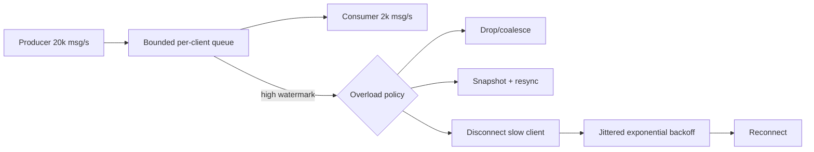
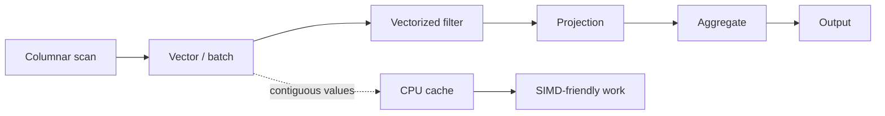

# 2026-09-17 22:00 — Interview Study Packages

README ve yakın `21-00.md` kontrol edildi. gRPC/xDS validation ve browser release cadence tekrar edilmedi. Repo aramasında aşağıdaki iki konu için yakın eşleşme bulunmadı.

## Paket 1 — Mid → Staff Frontend/Backend & Distributed Systems: WebSocket Backpressure, Slow Consumers & Reconnect Storms

**Süre:** 20–30 dk

### Konu anlatımı
WebSocket uzun ömürlü, çift yönlü bir bağlantıdır; fakat transport'un açık olması producer ile consumer'ın aynı hızda çalıştığı anlamına gelmez. Browser'ın klasik `WebSocket` API'si receive tarafında gerçek bir backpressure mekanizması sunmaz. Mesajlar uygulamanın işleyebildiğinden hızlı gelirse buffer büyür, memory/CPU baskısı oluşur ve sonunda bağlantı ya da process sağlığı bozulabilir.

Temel invariant: **her uzun ömürlü stream için bounded buffering + overload policy gerekir**. Server tarafında per-connection queue sınırı, message priority/coalescing, slow-consumer disconnect ve global admission control; client tarafında bounded application state, snapshot/resync ve kontrollü reconnect gerekir. RFC 6455 ayrıca abnormal closure sonrasında tüm client'ların anında reconnect etmesinin recovery'yi DoS-benzeri bir reconnect storm'a çevirebileceğini, bu nedenle randomized delay ve artan backoff kullanılmasını önerir.

### Mental model

`unbounded queue` kapasite planı değildir; sadece OOM'un zamanını erteler.

### Yüksek getirili mülakat soruları
1. Backpressure nedir ve WebSocket'te neden önemlidir?
2. TCP flow control neden tek başına application-level queue sorununu çözmez?
3. Mesaj drop etmek ne zaman kabul edilebilir, ne zaman correctness bug'dır?
4. Mid: slow consumer'ı nasıl tespit edersin?
5. Senior: market-data/chat/collaboration ürünlerinde overload policy neden farklı olur?
6. Staff: 1 milyon bağlantıda per-connection memory budget nasıl türetilir?
7. Reconnect storm neden outage recovery'yi uzatır?
8. Sequence number + snapshot/resync tasarımı hangi problemi çözer?

### Seviyeye göre cevap derinliği
- **Junior/Mid:** queue, producer/consumer hızı, bounded buffer, reconnect/backoff.
- **Senior:** high-watermark, coalescing, sequence/gap detection, idempotent resync, fairness.
- **Staff:** fleet-wide admission, memory budget, fan-out topology, overload containment ve observability.
- **Principal/CTO:** realtime UX ile infrastructure cost, degradation policy ve availability hedeflerini birlikte yönetir.

### Kısa alıştırma
Producer 10.000 msg/s, client 1.000 msg/s işliyor ve ortalama mesaj 500 byte. Unbounded queue'nun 60 saniyede yaklaşık ne kadar büyüyeceğini hesapla. Ardından 8 MB per-client limit için iki farklı overload policy tasarla.

### Proje fikri
`slow-consumer-lab`: WebSocket fan-out server, ayarlanabilir client tüketim hızı, bounded queue, high-watermark metric, coalescing ve jittered reconnect içeren küçük load-test sistemi.

### Failure modes / trade-off / production bağlantısı
Unbounded queues, bütün mesajları eşit önemde saymak, reconnect'te jitter kullanmamak, stale connection'ı sonsuza dek tutmak, sequence gap'i fark etmeden drop etmek ve yalnız connection-count izlemek başlıca failure mode'lardır. Production'da queue bytes/messages, oldest-message age, send latency, disconnect reason, reconnect rate, gap/resync rate ve per-tenant fan-out cost izle. Drop/coalesce memory'yi korur ama fidelity kaybettirir; disconnect kaynakları geri kazanır fakat reconnect load yaratır; snapshot/resync correctness'i güçlendirir fakat protocol complexity ekler.

### Kaynaklar
- MDN WebSocket API — klasik WebSocket API'de backpressure yok: https://developer.mozilla.org/en-US/docs/Web/API/WebSockets_API
- RFC 6455 §7.2.3 — abnormal closure recovery ve randomized/backoff reconnect: https://www.rfc-editor.org/rfc/rfc6455
- WHATWG WebSockets Standard: https://websockets.spec.whatwg.org/

---

## Paket 2 — Mid → Principal Data Engineering & Databases: Columnar Memory, Vectorized Execution & CPU Economics

**Süre:** 20–30 dk

### Konu anlatımı
Analytical workload'larda performans yalnız Big-O değildir; memory layout ve CPU'nun veriyi nasıl tükettiği belirleyicidir. Row-oriented layout bir kaydın alanlarını yan yana tutar ve point lookup/update için doğaldır. Columnar layout aynı alanın değerlerini ardışık tutarak scan, compression, cache locality ve SIMD/vectorization için avantaj sağlar.

Apache Arrow, language-agnostic columnar in-memory formatında sequential scan için data adjacency, O(1) random access, SIMD/vectorization-friendly layout ve zero-copy paylaşımı hedefler. DuckDB ise execution sırasında operator'ları tek tuple yerine `Vector`/`DataChunk` üzerinde çalıştırır; dokümante edilen default standard vector size 2048 tuple'dır. Buradaki mental shift: **query engine performansını tuple sayısından çok bytes moved + branches + cache misses + batches üzerinden düşün**.

### Mental model

Row-at-a-time: `load row → branch → function call → next row`.
Vectorized: `load batch → operate on arrays → selection vector → next operator`.

### Yüksek getirili mülakat soruları
1. OLTP neden çoğu zaman row-oriented, OLAP neden columnar storage'dan faydalanır?
2. Column pruning I/O'yu nasıl azaltır?
3. Vectorized execution ile SIMD aynı şey midir?
4. Null bitmap ve dictionary encoding'in CPU/memory trade-off'u nedir?
5. Mid: `SELECT avg(price) FROM events WHERE country='TR'` columnar layout'ta neden avantajlıdır?
6. Senior: batch size çok küçük veya çok büyük olursa ne olur?
7. Staff: Arrow neden servisler arası data interchange'de serialization/copy maliyetini azaltabilir?
8. Principal: compute/storage ayrık lakehouse sisteminde memory format standardizasyonunun organizasyonel getirisi nedir?

### Seviyeye göre cevap derinliği
- **Junior/Mid:** row vs column, locality, scan, compression.
- **Senior:** vectorized operators, selection vectors, null handling, cache/SIMD ve batch sizing.
- **Staff:** execution/storage format ayrımı, zero-copy boundaries, interoperability ve profiling.
- **Principal/CTO:** workload economics, CPU-hour/scan-byte maliyeti, platform standardization ve build-vs-buy.

### Kısa alıştırma
100 sütunlu ve 1 TB logical büyüklükte bir event tablosunda query yalnız 4 fixed-width sütun okuyorsa, idealized column pruning ile taranacak byte oranını kabaca hesapla. Sonra compression, metadata ve predicate selectivity'nin bu basit hesabı nasıl değiştirdiğini yaz.

### Proje fikri
`vector-scan-bench`: aynı integer dataset'i row-object listesi ve contiguous column arrays olarak tut; filter+sum workload'unu farklı batch size'larda benchmark et. wall time yanında bytes processed ve mümkünse CPU/cache profiler çıktısını karşılaştır.

### Failure modes / trade-off / production bağlantısı
Columnar formatı her workload için üstün sanmak, tiny-query latency'yi batch throughput ile karıştırmak, variable-width/string maliyetini görmezden gelmek, UDF ile vectorized pipeline'ı bozmak ve yalnız wall-clock benchmark yapmak yaygın hatalardır. Production'da scanned bytes, rows/s, CPU time, cache behavior, decompression time, spill bytes ve batch occupancy izle. Daha büyük batch amortization'ı iyileştirebilir fakat cache footprint ve latency'yi artırabilir; compression I/O'yu düşürür fakat decode CPU ekler; zero-copy copy maliyetini azaltırken lifetime/ownership disiplinini zorlaştırır.

### Kaynaklar
- Apache Arrow Columnar Format: https://arrow.apache.org/docs/format/Columnar.html
- DuckDB Execution Format / vectorized execution: https://duckdb.org/docs/stable/internals/vector
- DuckDB internals overview: https://duckdb.org/docs/stable/internals/overview
