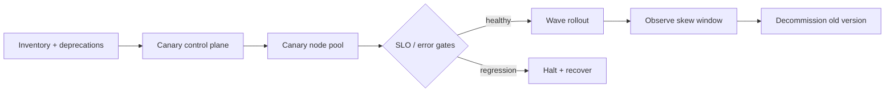
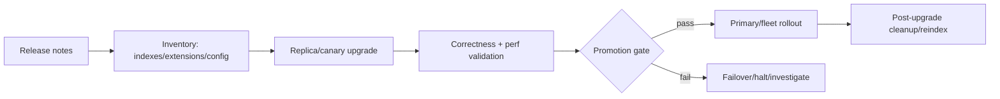

# 2026-09-17 23:00 — Interview Study Packages

README ve yakın `22-00.md` kontrol edildi. WebSocket backpressure ve columnar/vectorized execution tekrar edilmedi. Repo aramasında aşağıdaki iki konu için yakın eşleşme bulunmadı.

## Paket 1 — Mid → CTO Cloud/DevOps/SRE: Kubernetes Patch Lifecycle, Version Skew & Safe Fleet Upgrades

**Süre:** 20–30 dk

### Konu anlatımı
Kubernetes upgrade'i yalnız `kubectl version` değişimi değildir; control plane, kubelet, kube-proxy, CNI/CSI, admission webhook'ları ve workload'ların farklı hızlarda hareket ettiği bir compatibility problemidir. Güvenli upgrade'in temel fikri **support window + version skew contract + staged rollout + rollback/recovery budget** bileşimidir.

17 Eylül 2026 itibarıyla Kubernetes 1.35 aktif destek altında; resmi release sayfası 1.35.8'i yayımlanmış son patch olarak gösteriyor ve 1.35.9 için 15 Eylül hedefi listeliyor. 1.34 ise 27 Ağustos 2026'da maintenance mode'a girdi ve 27 Ekim 2026'da EOL olacak. Bu takvim platform ekipleri için teknik borcun takvimsel bir SLO olduğunu gösterir: sürüm eskidikçe yalnız feature değil güvenlik ve düzeltme akışı da daralır.

Upgrade tasarımında önce API/deprecation envanteri çıkarılır; sonra staging/canary cluster veya node pool, control-plane-first akışı, node drain ve PodDisruptionBudget davranışı test edilir. Başarı yalnız node'ların `Ready` olması değildir: workload SLO, scheduling latency, admission errors, DNS/networking, storage attach ve autoscaling sinyalleri de gate olmalıdır.

### Mental model

Mental kural: **upgrade = temporary heterogeneous distributed system**. En riskli an bütün fleet'in yeni sürümde olduğu an değil, eski ve yeni bileşenlerin birlikte yaşadığı geçiş penceresidir.

### Yüksek getirili mülakat soruları
1. Kubernetes version skew neden önemlidir?
2. Control plane ve worker node'ları hangi sırayla upgrade edersin, neden?
3. PodDisruptionBudget node drain sırasında neyi garanti eder, neyi garanti etmez?
4. Mid: deprecated API kullanımını upgrade öncesi nasıl bulursun?
5. Senior: canary node pool için hangi metrikleri promotion gate yaparsın?
6. Staff: yüzlerce cluster'da rollout wave ve blast radius nasıl tasarlanır?
7. Principal: EOL yaklaşan sürümler için platform policy ve exception süreci nasıl kurulur?
8. CTO: upgrade velocity, reliability ve engineering capacity arasında nasıl bütçe kurarsın?

### Seviyeye göre cevap derinliği
- **Junior/Mid:** control plane/worker ayrımı, drain, PDB, basic compatibility ve rollback fikri.
- **Senior:** API deprecations, addons, admission/webhook, storage/network compatibility, canary ve SLO gates.
- **Staff:** fleet inventory, wave rollout, skew policy, automated halt, exception governance ve blast radius.
- **Principal/CTO:** support lifecycle'ı risk register, compliance, capacity ve platform yatırım ekonomisiyle bağlar.

### Kısa alıştırma
120 node'luk bir cluster için aynı anda en fazla %5 node unavailable olacak şekilde upgrade wave planı çıkar. Her wave için `Ready`, scheduling latency, 5xx, DNS error ve volume-attach error gate'leri tanımla; hangi koşulda rollout'u otomatik durduracağını yaz.

### Proje fikri
`cluster-upgrade-guard`: cluster version/addon inventory çıkaran, deprecated API kullanımını raporlayan ve canary sonrası SLO gate'lerine göre `promote/halt` kararı üreten küçük bir CLI/controller.

### Failure modes / trade-off / production bağlantısı
Tüm node'ları aynı anda drain etmek, PDB'nin gerçek capacity garantisi olduğunu sanmak, addon/webhook compatibility'sini atlamak, yalnız `NodeReady` izlemek, rollback'in stateful workload/storage etkisini test etmemek ve EOL'yi son haftaya bırakmak tipik failure mode'lardır. Küçük wave blast radius'u düşürür ama rollout süresini uzatır; hızlı upgrade security exposure'ı azaltabilir ama change riskini yükseltir. Production'da version distribution, deprecated API calls, drain duration, unschedulable pods, admission latency/errors, DNS/network errors, storage attach failures ve workload SLO'ları izlenmelidir.

### Kaynaklar
- Kubernetes 1.35 release lifecycle: https://kubernetes.io/releases/1.35/
- Kubernetes patch release schedule: https://kubernetes.io/releases/patch-releases/
- Kubernetes Version Skew Policy: https://kubernetes.io/releases/version-skew-policy/
- Kubernetes Disruptions / PDB: https://kubernetes.io/docs/concepts/workloads/pods/disruptions/

---

## Paket 2 — Senior → Principal Databases & SRE: PostgreSQL Minor Upgrades, Regression Risk & Post-Upgrade Validation

**Süre:** 20–30 dk

### Konu anlatımı
Database patching'in yanlış mental modeli `minor = risksiz`dir. Doğru model: **minor release düşük risk hedefler, fakat production doğrulaması yine gerekir**. PostgreSQL'in versioning policy'si minor release'lerin bug, security ve data-corruption düzeltmeleri taşıdığını ve kullanıcıların major sürümlerinin güncel minor release'inde kalmasını öneriyor.

PostgreSQL 18.6, 13 Ağustos 2026'da yayımlandı; proje 18.5'in post-wrap bulunan bir regression nedeniyle hiç yayımlanmadığını belirtiyor. 18.6 release notes dump/restore gerektirmediğini, fakat bazı security/configuration cleanup'ları ile GIN, `btree_gist` ve `ltree` kullanan sistemlerde ek kontrol/reindex ihtiyacı olabileceğini açıkça söylüyor. Bu iyi bir mülakat vakasıdır: patching yalnız binary restart değil, **release-note-driven data/config remediation** işidir.

Upgrade planı dört katmanlı düşünülür: (1) release note ve extension/env inventory, (2) replica/canary üzerinde upgrade rehearsal, (3) traffic ve query correctness/performance validation, (4) post-upgrade remediation ve rollback/failover planı. Database'te rollback application deploy kadar kolay değildir; on-disk state, WAL timeline, extension ABI ve schema/data cleanup geri dönüşü karmaşıklaştırabilir.

### Mental model

Mental kural: **patch success = process starts değil; data doğru + query planları sağlıklı + replication yetişiyor + required remediation tamam**.

### Yüksek getirili mülakat soruları
1. PostgreSQL major ve minor upgrade arasındaki operasyonel fark nedir?
2. Minor upgrade öncesi neden release notes okunmalıdır?
3. Replica-first patching hangi riskleri azaltır, hangilerini çözmez?
4. Senior: reindex gerektiren bir release note'u yüzlerce database'te nasıl operationalize edersin?
5. Senior: post-upgrade query regression'ı nasıl yakalarsın?
6. Staff: patch rollout için correctness ve performance promotion gate'leri nasıl tasarlanır?
7. Principal: security patch urgency ile database change riskini nasıl dengelersin?
8. Principal/CTO: unsupported PostgreSQL major sürümlerini organizasyon çapında nasıl yönetişime alırsın?

### Seviyeye göre cevap derinliği
- **Mid:** backup, restart, replication, release notes ve basic validation.
- **Senior:** replica-first rollout, extension/index inventory, query-plan regression, WAL/lag ve reindex/remediation.
- **Staff:** fleet automation, promotion gates, automated inventory, rollback/failover semantics ve change windows.
- **Principal/CTO:** patch SLA, EOL policy, exception ownership, security exposure ve maintenance economics.

### Kısa alıştırma
20 PostgreSQL cluster'ı için patch runbook yaz: preflight'ta 5 kontrol, canary'de 5 metric/query gate, rollout sırasında halt condition ve upgrade sonrası 3 data-integrity kontrolü tanımla.

### Proje fikri
`pg-patch-auditor`: PostgreSQL version, installed extensions, GIN/GiST index inventory, replication lag ve seçilmiş query fingerprint'lerini toplayıp release-specific remediation checklist üreten bir CLI.

### Failure modes / trade-off / production bağlantısı
`minor` kelimesini risksiz sanmak, release note okumamak, extension compatibility'sini atlamak, yalnız process health kontrol etmek, replica lag'i görmeden failover yapmak, reindex/remediation işini upgrade tamamlandı saydıktan sonra unutmak ve rollback'i yalnız package downgrade olarak düşünmek yaygın failure mode'lardır. Daha hızlı patching vulnerability exposure'ı azaltır; daha uzun soak regression yakalama olasılığını artırır fakat exposure penceresini uzatır. Production'da replication lag, WAL generation/replay, error rate, query latency percentiles, plan changes, lock waits, index health ve data-integrity checks izlenmelidir.

### Kaynaklar
- PostgreSQL 18.6 release notes — 13 Ağustos 2026: https://www.postgresql.org/docs/release/18.6/
- PostgreSQL 18.6 announcement: https://www.postgresql.org/about/news/postgresql-186-1711-1615-1519-1424-and-19-beta-3-released-3365/
- PostgreSQL versioning policy: https://www.postgresql.org/support/versioning/
- PostgreSQL current documentation: https://www.postgresql.org/docs/
