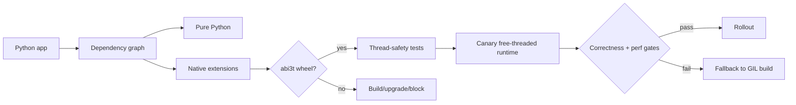
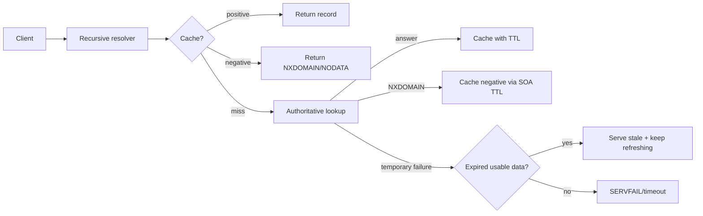

# 2026-09-18 00:00 — Interview Study Packages

README ve yakın `2026-09-17/23-00.md` kontrol edildi. Kubernetes patch lifecycle ve PostgreSQL minor-upgrade konuları tekrar edilmedi. Repo aramasında aşağıdaki iki konu için yakın eşleşme bulunmadı.

## Paket 1 — Mid → Staff Backend/MLOps: Python 3.15 Free-Threaded ABI, `abi3t` & Native Extension Compatibility

**Süre:** 20–30 dk

### Konu anlatımı
CPython free-threaded build, GIL'i devre dışı bırakarak Python thread'lerinin CPU-bound Python kodunda daha gerçek paralellik kurabilmesini hedefler; fakat native extension ekosistemi için yalnız concurrency değil ABI ve object-lifetime problemidir. Python 3.15 için kabul edilen PEP 803, free-threaded build'lere özel `abi3t` Stable ABI varyantını tanımlar ve `PyObject` yapısını opaque yapar. Böylece extension'ın CPython object layout'una doğrudan bağımlılığı azaltılır.

1 Eylül 2026'da yayımlanan Python 3.15.0rc2 final release candidate'dır; 3.15.0 final 1 Ekim 2026 için planlanıyor. Resmi macOS binary'leri free-threading desteğini varsayılan olarak kuruyor ve RC aşamasından sonra 3.15 serisinde ABI değişikliği beklenmiyor. Production migration mental modeli: **runtime flag değil, dependency graph + wheel matrix + thread-safety audit + benchmark**.

Native extension free-threaded uyumlu görünse bile global mutable state, borrowed-reference lifetime, hidden locks ve callback reentrancy race üretebilir. Bu yüzden rollout'ta import smoke test yeterli değildir; representative concurrent workload, sanitizer/race testleri ve CPU-throughput/latency karşılaştırması gerekir.

### Mental model

### Yüksek getirili mülakat soruları
1. GIL kaldırıldığında hangi workload'lar gerçekten hızlanabilir?
2. Stable ABI ile normal CPython ABI arasındaki fark nedir?
3. `abi3t` neden ayrı bir ABI varyantıdır?
4. Native extension'da hidden global state neden race üretir?
5. Senior: free-threaded migration için dependency/wheel matrix nasıl çıkarılır?
6. Staff: canary promotion gate'lerinde throughput dışında ne ölçersin?
7. Staff: fallback stratejisini binary/runtime seviyesinde nasıl tasarlarsın?
8. Principal: ecosystem readiness ile compute economics'i nasıl dengelersin?

### Seviyeye göre cevap derinliği
- **Mid:** GIL, CPU-bound vs I/O-bound, wheel/native extension ve temel race kavramları.
- **Senior:** ABI, extension compatibility, object lifetime, lock/reentrancy ve benchmark tasarımı.
- **Staff:** fleet/runtime matrix, canary, automated compatibility gates ve fallback.
- **Principal:** migration timing, ecosystem risk, infra maliyeti ve platform standardı.

### Kısa alıştırma
NumPy/cryptography benzeri iki native dependency içeren bir servis için migration checklist çıkar: wheel availability, import test, 32-thread stress, correctness oracle, p95 latency ve CPU utilization gate'leri tanımla.

### Proje fikri
`py-ft-readiness`: dependency tree'deki wheel tag/ABI bilgilerini tarayan, native extension'ları işaretleyen ve GIL/free-threaded benchmark matrisi üreten CLI.

### Failure modes / trade-off / production bağlantısı
`GIL yok = otomatik hızlanma` varsayımı, extension'ın import edilmesini thread-safe kabul etmek, transitive native dependency'leri kaçırmak, yalnız throughput ölçmek ve fallback binary'sini hazır tutmamak başlıca failure mode'lardır. Daha fazla paralellik throughput'u artırabilir; synchronization ve allocator/cache contention latency'yi kötüleştirebilir. Production'da crash/race sinyalleri, p95/p99, CPU efficiency, RSS, lock contention, worker/thread sayısı ve dependency ABI coverage izlenmelidir.

### Kaynaklar
- PEP 803 — `abi3t`: https://peps.python.org/pep-0803/
- Python 3.15.0rc2 — 1 Eylül 2026: https://www.python.org/downloads/release/python-3150rc2/
- PEP 790 — Python 3.15 release schedule: https://peps.python.org/pep-0790/

---

## Paket 2 — Junior → Principal Networking/SRE: DNS Negative Caching, NXDOMAIN & Serve-Stale Resilience

**Süre:** 20–30 dk

### Konu anlatımı
DNS cache yalnız var olan kayıtları tutmaz; **yokluk bilgisini de cache'ler**. RFC 2308'de NXDOMAIN ismin bulunmadığını, NODATA ise isim var olduğu halde istenen RR type'ın bulunmadığını ifade eder. Authoritative server negatif cevapta SOA taşır; negative TTL, SOA.MINIMUM ile SOA TTL'in küçüğünden türetilir. Bu, typo/olmayan isimler için recursive resolver ve authoritative server yükünü azaltır.

Operasyonel risk: yeni bir record oluşturduğunda daha önce cache'lenmiş NXDOMAIN, positive record yayınlanmış olsa bile negative TTL bitene kadar bazı resolver'larda görünmeye devam edebilir. Bu yüzden DNS rollout yalnız positive TTL yönetimi değildir; negative caching de deployment propagation budget'ının parçasıdır.

RFC 8767 serve-stale yaklaşımı ise authoritative kaynak geçici olarak erişilemezken expired positive data'yı kontrollü biçimde döndürerek availability'yi artırabilir. Trade-off açıktır: **freshness karşılığında resilience**. Stale cevap verirken resolver refresh denemesini sürdürmelidir; TTL=0 data stale fallback için de kullanılamaz.

### Mental model

### Yüksek getirili mülakat soruları
1. NXDOMAIN ile NODATA farkı nedir?
2. Negative caching neden gereklidir?
3. Negative TTL nereden gelir?
4. Yeni DNS kaydı neden bazı kullanıcılarda hemen görünmeyebilir?
5. Senior: DNS cutover öncesi negative-cache riskini nasıl azaltırsın?
6. Staff: serve-stale hangi outage'larda faydalı, hangi durumlarda tehlikelidir?
7. Principal: freshness/availability policy'sini internal service discovery için nasıl belirlersin?
8. Principal: resolver metrics ile authoritative metrics'i nasıl korele edersin?

### Seviyeye göre cevap derinliği
- **Junior:** resolver, authoritative server, TTL, NXDOMAIN.
- **Mid/Senior:** SOA, NODATA, negative TTL, cutover propagation ve cache behavior.
- **Staff:** serve-stale, refresh timeout, failure isolation ve resolver policy.
- **Principal:** multi-region DNS resilience, control-plane dependency ve availability/freshness budget.

### Kısa alıştırma
Bir `api.example.com` kaydı ilk kez açılacak. Negative TTL 30 dakika. Deploy'dan 10 dakika önce health checker yanlışlıkla ismi sorguladı ve NXDOMAIN cache'lendi. Kullanıcı etkisini zaman çizelgesiyle açıkla ve daha güvenli rollout prosedürü yaz.

### Proje fikri
`dns-rollout-lab`: authoritative + recursive resolver container'larıyla NXDOMAIN cache, record creation, TTL expiry ve serve-stale outage senaryolarını tekrar üretip zaman çizelgesi çıkaran küçük lab.

### Failure modes / trade-off / production bağlantısı
Sadece positive TTL'e bakmak, NXDOMAIN ile SERVFAIL'i aynı saymak, TTL=0'ı stale kullanılabilir sanmak, stale data'yı sınırsız sunmak ve resolver cache hit/miss oranlarını gözlemlememek yaygın hatalardır. Uzun negative TTL upstream yükünü azaltır ama yeni isimlerin görünürlüğünü geciktirir; serve-stale availability'yi artırır fakat eski endpoint'e trafik gönderebilir. Production'da NXDOMAIN/NODATA/SERVFAIL oranları, recursive latency, cache hit ratio, stale-answer count, authoritative reachability ve rollout propagation izlenmelidir.

### Kaynaklar
- RFC 2308 — DNS Negative Caching: https://datatracker.ietf.org/doc/html/rfc2308
- RFC 8767 — Serving Stale Data to Improve DNS Resiliency: https://datatracker.ietf.org/doc/html/rfc8767
