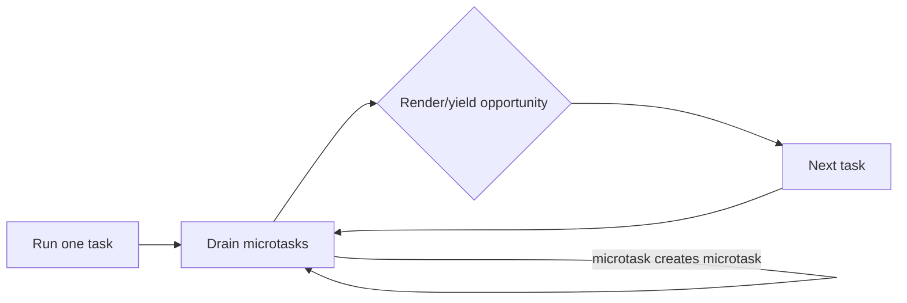
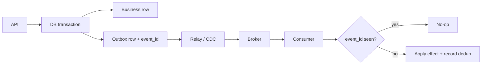

# 2026-09-18 01:00 — Interview Study Packages

README ve yakın `2026-09-18/00-00.md` kontrol edildi. Python free-threaded ABI ve DNS negative caching/serve-stale tekrar edilmedi. Repo aramasında aşağıdaki iki konu için yakın eşleşme bulunmadı.

## Paket 1 — Junior → Staff Frontend/Backend: JavaScript Event Loop, Microtask Starvation & Cooperative Scheduling

**Süre:** 20–30 dk

### Konu anlatımı
JavaScript concurrency mental modeli “tek thread = aynı anda tek iş”ten daha zengindir. Browser event loop; task queue, microtask queue ve rendering opportunity arasında ilerler. Promise callback'leri ve `queueMicrotask()` microtask olarak çalışır; mevcut task bittikten sonra event loop bir sonraki task'a geçmeden önce microtask queue boşaltılır. Bir microtask sürekli yeni microtask üretirse timer/input/render gibi işler gecikebilir: **microtask starvation**.

Bu nedenle `Promise.resolve().then(loop)` ile işi parçalamak her zaman UI'ya yield etmek değildir. Uzun CPU işi worker'a taşınabilir; main-thread işi ise uygun task/scheduling primitive'iyle dilimlenmelidir. Backend Node.js tarafında da aynı sezgi önemlidir: event-loop latency yükselirse tek bir pahalı callback çok sayıda bağımsız request'in tail latency'sini etkiler.

### Mental model

**Invariant:** fairness otomatik değildir; kodun scheduler'a gerçekten kontrol vermesi gerekir.

### Yüksek getirili mülakat soruları
1. Task ile microtask farkı nedir?
2. Promise callback neden `setTimeout(...,0)` callback'inden önce çalışabilir?
3. Microtask starvation nasıl oluşur?
4. Long task kullanıcı deneyimini nasıl etkiler?
5. Senior: CPU-bound işi main thread'den nasıl izole edersin?
6. Senior: “chunking” ile worker arasındaki trade-off nedir?
7. Staff: event-loop lag'i hangi SLO/telemetry ile yönetirsin?
8. Staff: scheduler fairness ile throughput arasında nasıl karar verirsin?

### Seviyeye göre cevap derinliği
- **Junior:** call stack, task, microtask, Promise/timer sırası.
- **Mid:** rendering opportunity, starvation ve chunking.
- **Senior:** workers, cancellation, backpressure ve tail latency.
- **Staff:** scheduling policy, observability, fairness budget ve workload isolation.

### Kısa alıştırma
10 milyon elemanlık CPU döngüsünü üç biçimde tasarla: tek callback, recursive microtask, task-chunking. Input responsiveness ve toplam throughput açısından sonucu tahmin et; sonra ölçüm planı yaz.

### Proje fikri
`event-loop-lab`: task/microtask/worker varyantlarını çalıştırıp input delay, long-task duration ve throughput'u karşılaştıran küçük browser benchmark'ı.

### Failure modes / trade-off / production bağlantısı
`async` kodu otomatik non-blocking sanmak, microtask'ı yield kabul etmek, sınırsız Promise zinciri kurmak, CPU işini main thread'de bırakmak ve yalnız average latency ölçmek tipik hatalardır. Küçük chunk responsiveness'i artırır ama scheduling overhead yaratır; worker isolation sağlar fakat serialization/coordination maliyeti getirir. Production'da INP/long tasks, event-loop lag, p95/p99 request latency, queue depth ve worker utilization izlenmelidir.

### Kaynaklar
- WHATWG HTML — Event loops: https://html.spec.whatwg.org/multipage/webappapis.html#event-loops
- MDN — Microtask guide: https://developer.mozilla.org/en-US/docs/Web/API/HTML_DOM_API/Microtask_guide
- Node.js — Don't block the event loop: https://nodejs.org/en/learn/asynchronous-work/dont-block-the-event-loop

---

## Paket 2 — Mid → CTO Distributed Systems/System Design: Transactional Outbox, Idempotent Consumers & Exactly-Once Illusions

**Süre:** 20–30 dk

### Konu anlatımı
Bir servis hem veritabanını güncelleyip hem broker'a event gönderecekse klasik dual-write problemi oluşur: DB commit olup publish başarısız olabilir veya publish olup transaction rollback olabilir. Transactional outbox, business state ile gönderilecek event'i **aynı local DB transaction** içinde yazar. Ayrı relay/CDC bileşeni committed outbox kayıtlarını broker'a taşır.

Bu pattern atomicity gap'i kapatır fakat end-to-end “exactly once” sağlamaz. Relay publish edip checkpoint yazmadan crash ederse aynı event tekrar yayınlanabilir. Consumer bu yüzden event ID/dedup state veya doğal idempotent operation ile duplicate'i tolere etmelidir. Mental model: **atomic local intent + at-least-once transport + idempotent effect**.

Ordering de scope gerektirir. Global ordering pahalıdır; çoğu sistem aggregate/entity key başına ordering ister. Outbox büyümesi, retention, poison event, schema evolution, relay lag ve replay operasyonel tasarımın parçasıdır.

### Mental model

### Yüksek getirili mülakat soruları
1. Dual write neden atomik değildir?
2. Outbox hangi failure window'u kapatır?
3. Relay neden duplicate publish edebilir?
4. Idempotency key nasıl seçilir ve ne kadar tutulur?
5. Senior: per-aggregate ordering nasıl korunur?
6. Staff: polling publisher ile log-based CDC trade-off'u nedir?
7. Principal: replay, schema evolution ve poison event governance nasıl tasarlanır?
8. CTO: outbox altyapısını ortak platform yapmak ne zaman mantıklıdır?

### Seviyeye göre cevap derinliği
- **Mid:** DB transaction, outbox table, relay ve duplicate kavramı.
- **Senior:** dedup transaction'ı, ordering, retries, retention ve observability.
- **Staff:** CDC/polling, partition strategy, replay, schema compatibility ve blast radius.
- **Principal/CTO:** platform standardı, ownership, auditability, cost ve cross-team contracts.

### Kısa alıştırma
Sipariş oluşturma + `OrderCreated` publish akışında şu crash noktalarını analiz et: DB commit öncesi, commit sonrası/publish öncesi, publish sonrası/checkpoint öncesi, consumer effect sonrası/ack öncesi. Her durumda veri/event sonucunu ve recovery davranışını yaz.

### Proje fikri
`outbox-lab`: PostgreSQL outbox + relay + broker + idempotent consumer kur; kontrollü crash injection ile duplicate, lag ve replay davranışını göster.

### Failure modes / trade-off / production bağlantısı
Outbox'ı exactly-once sanmak, consumer dedup'ını DB effect'ten ayrı transaction'da tutmak, sınırsız retention, global ordering talep etmek, schema version taşımamak ve relay lag alarmı kurmamak yaygın hatalardır. Polling basittir ama DB yükü/latency yaratabilir; CDC düşük latency ve ölçek sunar fakat operasyonel karmaşıklığı artırır. Production'da outbox backlog/age, relay throughput/error, duplicate rate, consumer lag, poison-event count ve replay volume izlenmelidir.

### Kaynaklar
- AWS Prescriptive Guidance — Transactional outbox: https://docs.aws.amazon.com/prescriptive-guidance/latest/cloud-design-patterns/transactional-outbox.html
- Apache Kafka — Delivery semantics/design: https://kafka.apache.org/documentation/#semantics
- PostgreSQL — Transactions: https://www.postgresql.org/docs/current/tutorial-transactions.html