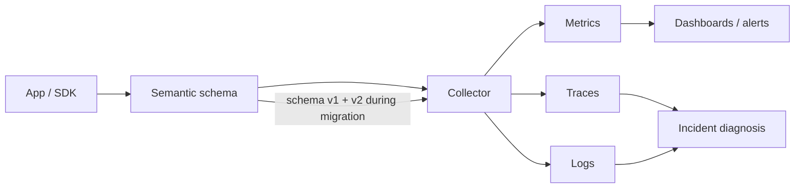
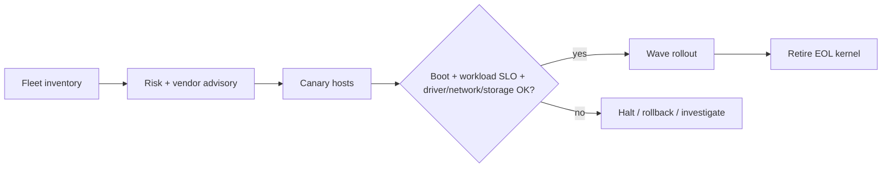

# 2026-09-18 02:00 — Interview Study Packages

README ve yakın `2026-09-18/01-00.md` kontrol edildi. JavaScript event-loop starvation ve transactional outbox/idempotent consumer konuları tekrar edilmedi. Repo aramasında aşağıdaki iki konu için yakın eşleşme bulunmadı.

## Paket 1 — Mid → Principal Backend/SRE: OpenTelemetry Semantic Conventions, Cardinality & Safe Schema Migration

**Süre:** 20–30 dk

### Konu anlatımı
Observability yalnız telemetry üretmek değildir; farklı servislerin aynı operasyonu aynı anlamla adlandırabilmesidir. OpenTelemetry Semantic Conventions (semconv), trace/metric/log/resource alanları için ortak isim ve anlam sözleşmesi sağlar. Bu sözleşme özellikle polyglot sistemlerde dashboard, alert, correlation ve vendor portability için bir **telemetry schema** gibi davranır.

Schema migration production problemidir. OpenTelemetry database semantic conventions, eski v1.24.0 veya öncesi instrumentations için yeni stable database conventions'a kontrollü geçiş amacıyla `OTEL_SEMCONV_STABILITY_OPT_IN=database` ve geçişte hem eski hem yeni sinyali üretmek için `database/dup` yaklaşımını tanımlar. Messaging conventions ise hâlâ Development durumundadır ve benzer opt-in/dup stratejisi tarif eder. Bu bize önemli bir mülakat mental modeli verir: **telemetry schema da API'dir; consumer'ları kırmadan migrate edilmelidir**.

Cardinality ikinci büyük risktir. `user_id`, raw URL, query text veya benzersiz destination isimlerini metric label yapmak time-series patlamasına yol açabilir. Database conventions `db.query.summary` için low-cardinality yaklaşımı teşvik eder; query parameter değerleri PII/sensitive veri içerebildiğinden default capture önerilmez. Doğru tasarım: düşük cardinality aggregate metrics + gerektiğinde sampling ile zengin traces/logs.

### Mental model

**Invariant:** telemetry alanı yalnız producer detayı değildir; dashboard, alert, SLO ve incident tooling için versioned contract'tır.

### Yüksek getirili mülakat soruları
1. Semantic convention neden gerekir?
2. Metric cardinality neden pahalıdır?
3. Trace attribute ile metric label seçimi neden aynı değildir?
4. `db.query.text` ve query parameter capture hangi privacy risklerini taşır?
5. Stable semconv migration'ını dashboard kırmadan nasıl yaparsın?
6. `dup` dönemi ne kazandırır, maliyeti nedir?
7. Staff: yüzlerce serviste telemetry schema governance nasıl kurulur?
8. Principal: vendor-neutral schema ile vendor-specific deep signals nasıl dengelenir?

### Seviyeye göre cevap derinliği
- **Mid:** span/metric/log, attribute ve cardinality temelini açıklar.
- **Senior:** privacy, sampling, low-cardinality naming ve dual-emission migration'ını tartışır.
- **Staff:** schema registry/governance, compatibility tests, fleet rollout ve cost budget kurar.
- **Principal:** observability contract'ını SLO, incident response, platform economics ve vendor portability ile bağlar.

### Kısa alıştırma
Bir checkout servisi için HTTP + database + messaging telemetry şeması tasarla. Hangi 8 alan metric label olabilir, hangi alanlar yalnız trace/log'da kalmalı? Her seçim için cardinality ve privacy gerekçesi yaz.

### Proje fikri
`semconv-linter`: OpenTelemetry Collector export örneklerini okuyup deprecated attribute, high-cardinality candidate, PII riski ve v1/v2 migration coverage raporu üreten CLI.

### Failure modes / trade-off / production bağlantısı
Raw query/user ID'yi metric label yapmak, schema değişikliğini deploy detayı sanmak, eski dashboard consumer'larını envanterlememek, duplicate telemetry dönemini süresiz bırakmak ve sensitive parametreleri default capture etmek tipik hatalardır. Dual emission migration riskini azaltır fakat telemetry hacmini ve maliyeti artırır. Production'da active time-series, ingest bytes, dropped spans, exporter errors, attribute cardinality, dashboard query failures ve old/new schema adoption izlenmelidir.

### Kaynaklar
- OpenTelemetry — Semantic Conventions: https://opentelemetry.io/docs/concepts/semantic-conventions/
- OpenTelemetry — Database semantic conventions: https://opentelemetry.io/docs/specs/semconv/db/
- OpenTelemetry — Database client spans: https://opentelemetry.io/docs/specs/semconv/db/database-spans/
- OpenTelemetry — Messaging semantic conventions: https://opentelemetry.io/docs/specs/semconv/messaging/

---

## Paket 2 — Junior → CTO Cloud/DevOps/SRE: Linux LTS Kernel Lifecycle, Backports & Fleet Patch Strategy

**Süre:** 20–30 dk

### Konu anlatımı
Kernel patching, uygulama dependency update'inden farklıdır: scheduler, memory management, filesystem, networking, drivers, eBPF ve syscall ABI gibi bütün host'un failure domain'ini etkiler. Linux kernel.org aktif release tablosu 6.18'i longterm olarak Aralık 2028'e kadar, 6.12'yi Aralık 2028'e kadar; 5.15 ve 5.10'u ise Aralık 2026'ya kadar projected EOL ile listeliyor. Bu nedenle kernel version yalnız teknik bilgi değil, **fleet lifecycle ve security exposure budget** girdisidir.

LTS'nin anlamı 'hiç değişmez' değildir. Longterm tree'lere önemli bugfix'ler backport edilir. Distribution kernel'ları ise upstream kernel.org tree'sinden farklı patch/backport setlerine sahip olabilir; dolayısıyla yalnız `uname` major/minor numarasına bakarak vulnerability status çıkarımı yapmak yanlıştır. Kaynak-of-truth distribution/vendor security advisory ve package metadata olmalıdır.

Safe fleet rollout: inventory → vulnerability/compatibility değerlendirmesi → canary host/node pool → workload/SLO validation → küçük waves → drain/reboot/live-patch stratejisi → post-boot validation. Kernel rollback teoride eski image ile boot olabilir, fakat filesystem/data state veya driver davranışı değişmişse rollback yine risksiz değildir.

### Mental model

**Invariant:** kernel patch başarısı `host reboot oldu` değil; host + workload + network/storage davranışı kabul edilebilir kaldı demektir.

### Yüksek getirili mülakat soruları
1. LTS kernel ne demektir?
2. Backport nedir; version string neden tek başına security status söylemez?
3. Kernel upgrade öncesi hangi workload'ları özellikle canary'ye koyarsın?
4. Reboot ile live patch arasındaki trade-off nedir?
5. Kubernetes node kernel patch'inde drain/PDB/capacity nasıl ilişkilidir?
6. eBPF/CNI/CSI/driver compatibility nasıl doğrulanır?
7. Staff: 10 bin host için wave ve automated halt nasıl tasarlanır?
8. CTO: EOL kernel borcunu reliability, compliance ve engineering capacity açısından nasıl yönetirsin?

### Seviyeye göre cevap derinliği
- **Junior:** kernel/userspace ayrımı, reboot ve LTS kavramı.
- **Mid:** backport, distro kernel, driver/module ve canary.
- **Senior:** workload-aware rollout, live patch, drain, recovery ve telemetry.
- **Staff/CTO:** fleet policy, EOL budget, exception ownership, compliance ve patch economics.

### Kısa alıştırma
2.000 Kubernetes worker node'un %20'si 5.15 tabanlı distribution kernel kullanıyor. Aynı anda en fazla %2 capacity kaybına izin veriliyor. Canary + wave planı, halt koşulları ve vendor-advisory doğrulama adımlarını yaz.

### Proje fikri
`kernel-fleet-auditor`: node/VM kernel ve distribution package bilgisini toplayıp support/EOL sınıfı, reboot-required durumu, canary adayları ve rollout wave planı çıkaran araç.

### Failure modes / trade-off / production bağlantısı
Version string'i CVE status sanmak, distribution backport'larını yok saymak, bütün fleet'i tek wave'de reboot etmek, yalnız host health kontrol etmek, CNI/CSI/eBPF/driver regression'ını test etmemek ve EOL kernel'leri exception ownership olmadan yaşatmak tipik hatalardır. Live patch downtime'ı azaltır ama her değişikliği kapsamaz ve operasyonel karmaşıklık getirir. Production'da kernel/version distribution, reboot age, node readiness, boot failures, kernel oops/panic, network packet loss, storage errors, syscall/error rate ve workload p95/p99 SLO izlenmelidir.

### Kaynaklar
- kernel.org — Active kernel releases: https://www.kernel.org/releases.html
- Linux Kernel Documentation: https://docs.kernel.org/
- Linux Kernel — Reporting issues: https://docs.kernel.org/admin-guide/reporting-issues.html
