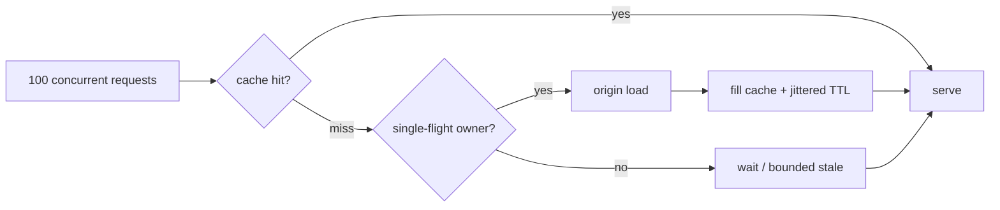
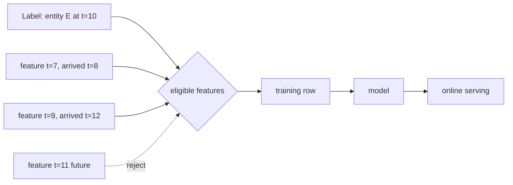

# 2026-09-18 03:00 — Interview Study Packages

README ve yakın `2026-09-18/02-00.md` kontrol edildi. OpenTelemetry semantic conventions ve Linux LTS kernel lifecycle konuları tekrar edilmedi. Repo aramasında aşağıdaki iki konu için yakın eşleşme bulunmadı.

## Paket 1 — Mid → Staff Backend/System Design: Cache Stampede, Request Coalescing & Stale-While-Revalidate

**Süre:** 20–30 dk

### Konu anlatımı
Cache hit hızlıdır; asıl zor problem aynı popüler key'in TTL'i dolduğunda yüzlerce request'in aynı anda miss görmesidir. Her caller origin database/API'ye giderse cache, yükü azaltmak yerine ani bir **load amplifier** olur. Buna cache stampede/thundering herd denir.

İlk savunma request coalescing veya single-flight'tır: aynı key için yalnız bir loader origin'e gider, diğer caller'lar sonucu bekler. Process-local single-flight tek instance içinde ucuzdur; çok instance'lı fleet'te distributed lock/lease veya cache üzerinde atomik ownership gerekir. Redis'in güncel cache-aside rehberi `SET NX PX` tabanlı kısa ömürlü lock ve yalnız sahibi silebilsin diye token kontrollü release örneği verir.

İkinci savunma expiration'ı senkron olmaktan çıkarmaktır: TTL jitter, probabilistic early refresh ve stale-while-revalidate. Stale serving availability ve tail latency'yi iyileştirir ama freshness budget tüketir. Lock da bedava değildir: lock TTL loader'dan kısa olursa iki owner oluşabilir; uzun olursa crashed owner sonrası bekleme artar. Bu nedenle invariant şudur: **cache correctness kaynağı değildir; origin korunurken staleness açıkça bütçelenir**.

### Mental model

### Yüksek getirili mülakat soruları
1. Cache stampede neden normal cache miss'ten farklıdır?
2. Single-flight ile distributed lock arasındaki kapsam farkı nedir?
3. Lock TTL nasıl seçilir; loader TTL'i aşarsa ne olur?
4. TTL jitter neyi çözer, neyi çözmez?
5. Stale-while-revalidate hangi ürünlerde tehlikelidir?
6. Negative caching ile stampede ilişkisi nedir?
7. Staff: milyonlarca key için hot-key detection ve adaptive refresh nasıl tasarlanır?
8. Origin down iken cache policy fail-open mı fail-closed mı olmalı?

### Seviyeye göre cevap derinliği
- **Mid:** TTL, cache-aside, stampede ve single-flight temelini açıklar.
- **Senior:** lock ownership, timeout, jitter, stale budget ve negative caching'i tartışır.
- **Staff:** multi-region ownership, hot-key telemetry, admission control ve origin protection tasarlar.

### Kısa alıştırma
10k RPS alan ve tek bir key'in trafiğin %20'sini aldığı serviste TTL=60s. Origin 80ms sürüyor. Lock TTL, waiter timeout, stale window ve TTL jitter aralığı öner; lock holder ölürse akışı çiz.

### Proje fikri
`stampede-lab`: Redis + küçük bir HTTP origin ile naive cache-aside, process-local single-flight, Redis lease ve stale-while-revalidate modlarını karşılaştıran load-test projesi. Origin QPS, p95/p99 ve stale-age histogramı üret.

### Failure modes / trade-off / production bağlantısı
Lock'suz refill, ownership token'sız unlock, sonsuz waiter queue, tüm key'lerde aynı TTL, unbounded stale serving ve cache hit-rate'i tek başarı metriği sanmak tipik hatalardır. Production'da per-key miss burst, coalesced waiter sayısı, lock contention, origin QPS, refill latency, stale age, timeout ve cache eviction izlenmelidir.

### Kaynaklar
- Redis — Cache-aside: https://redis.io/docs/latest/develop/use-cases/cache-aside/
- Redis — Cache-aside with Go / stampede protection: https://redis.io/docs/latest/develop/use-cases/cache-aside/go/
- Go singleflight package docs: https://pkg.go.dev/golang.org/x/sync/singleflight

---

## Paket 2 — Mid → Principal Data Engineering/MLOps: Point-in-Time Correct Feature Joins, Leakage & Training-Serving Skew

**Süre:** 20–30 dk

### Konu anlatımı
ML training dataset'i sıradan bir SQL join değildir. Bir label olayı `t_label` anında gerçekleştiyse feature satırı modelin o anda gerçekten bilebileceği geçmişten gelmelidir. Gelecekte oluşmuş feature'ı geçmiş label'a join etmek **feature leakage** üretir: offline metric yükselir ama production model aynı bilgiyi göremez.

Point-in-time join mental modeli: her entity/label satırı için `feature_event_time <= label_time` koşulunu sağlayan en yeni feature seçilir; ayrıca TTL/freshness window uygulanabilir. Feast'in resmi dokümanı historical retrieval sırasında entity timestamp'inden geriye doğru tarayıp TTL sınırı içindeki feature değerini seçtiğini açıklar. Bu yalnız correctness değil, reproducibility contract'ıdır.

Event time ile ingestion/created time ayrımı kritiktir. Late-arriving data geçmiş event time'a sahip olabilir ama training snapshot oluşturulduktan sonra sisteme ulaşmış olabilir. Eğer backfill bugün bildiğimiz veriyi geçmişte biliniyormuş gibi kullanırsa ikinci bir leakage kanalı doğar. Daha güçlü sistemler event-time correctness yanında **knowledge/availability time** ve dataset snapshot/version provenance da taşır.

Online serving ise genellikle entity'nin en güncel feature'ını düşük latency ile ister. Offline ve online transform farklı implement edilirse training-serving skew oluşur. Feature definition, transform semantics, null/default policy ve freshness SLO ortak contract olmalıdır.

### Mental model

**Invariant:** training row yalnız prediction anında erişilebilir olan bilgiyi kullanmalıdır.

### Yüksek getirili mülakat soruları
1. Feature leakage nedir; neden random train/test split bunu her zaman yakalayamaz?
2. Point-in-time join normal latest-value join'den nasıl farklıdır?
3. Event time ve ingestion time neden ayrılmalıdır?
4. TTL feature correctness'ini nasıl etkiler?
5. Late-arriving data backfill sırasında nasıl ele alınır?
6. Offline/online store arasındaki training-serving skew nasıl ölçülür?
7. Staff: feature definition/version lineage nasıl yönetilir?
8. Principal: reproducible training dataset ile düşük-latency online serving arasında hangi platform contract'larını kurarsın?

### Seviyeye göre cevap derinliği
- **Mid:** leakage, entity key, timestamp ve as-of join'i doğru açıklar.
- **Senior:** late data, TTL, null/default, offline-online parity ve backfill semantics'i tartışır.
- **Staff/Principal:** snapshot provenance, feature versioning, data contracts, skew SLO ve governance tasarlar.

### Kısa alıştırma
`orders(user_id, label_time, fraud)` ve `user_stats(user_id, event_time, created_time, chargebacks_30d)` tabloları için leakage-safe training join pseudo-SQL'i yaz. `created_time > label_time` olan late row'lar için iki farklı policy ve trade-off belirt.

### Proje fikri
`pit-join-auditor`: training dataset'inde her feature için event-time/availability-time ihlali, TTL breach, duplicate timestamp ve offline-online skew raporu üreten Spark/DuckDB tabanlı araç.

### Failure modes / trade-off / production bağlantısı
`MAX(feature_time)` ile bugünkü latest değeri geçmiş label'a bağlamak, created/availability time'ı yok saymak, backfill'i production geçmişiyle eşdeğer sanmak, offline ve online transform'u ayrı kodlamak ve null/default semantics'ini versionlamamak tipik hatalardır. Production'da feature freshness, null rate, online/offline value mismatch, late-arrival distribution, materialization lag ve model metric drift izlenmelidir.

### Kaynaklar
- Feast — Point-in-time joins: https://docs.feast.dev/getting-started/concepts/point-in-time-joins
- Feast — Feature retrieval: https://docs.feast.dev/getting-started/concepts/feature-retrieval
- Feast — Concepts: https://docs.feast.dev/getting-started/concepts
