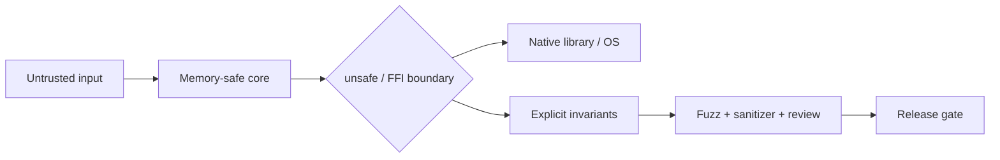

# 2026-09-18 04:00 — Interview Study Packages

README ve yakın `2026-09-18/03-00.md` kontrol edildi. Cache stampede ve point-in-time feature join konuları tekrar edilmedi. Repo aramasında bu saatin iki konusu için yakın eşleşme bulunmadı.

## Paket 1 — Mid → CTO Cybersecurity/Backend: Memory Safety, Rust FFI & Secure-by-Design Migration

**Süre:** 20–30 dk

### Konu anlatımı
Memory safety; use-after-free, out-of-bounds access, double free ve invalid pointer dereference gibi hata sınıflarını dil/runtime seviyesinde önlemeyi hedefler. C/C++ gibi memory-unsafe dillerde ownership ve lifetime kurallarının büyük bölümü programcı disiplinine ve tooling'e kalır. Rust gibi memory-safe diller ownership/borrowing ve lifetime kurallarını compile-time'da zorlar; fakat `unsafe`, FFI, native allocator ve OS sınırlarında invariant'lar tekrar mühendisin sorumluluğuna döner.

CISA/FBI'nin 11 Şubat 2025 Secure by Design uyarısı buffer overflow sınıfını ortadan kaldırmak için memory-safe dilleri öncelikli önleme yöntemi olarak öneriyor. NIST SSDF 1.1 finaldir; Aralık 2025'te yayımlanan SSDF 1.2 Rev.1 ise hâlâ draft durumundadır. Mülakatta doğru çerçeve “rewrite everything” değil, **risk-weighted migration** olmalıdır: internet-facing parser/codec, privileged daemon ve attacker-controlled input işleyen bileşenler önce; düşük riskli stabil kod daha sonra.

Rust FFI'da `unsafe` bloğu güvenlik garantisini kapatmaz; yalnız compiler'ın kanıtlayamadığı invariant'ları geliştiricinin üstlendiğini belirtir. Pointer validity, length/capacity, ownership transfer, thread safety, ABI ve allocator eşleşmesi boundary contract olarak belgelenmeli ve fuzz/sanitizer/Miri benzeri testlerle daraltılmalıdır.

### Mental model

**Invariant:** `unsafe` küçük, auditable ve contract-driven tutulur; güvenlik sınırı gizlenmez.

### Yüksek getirili mülakat soruları
1. Memory safety ile type safety aynı şey midir?
2. Rust ownership use-after-free sınıfını nasıl azaltır?
3. `unsafe` neyi garanti eder, neyi etmez?
4. FFI boundary'de hangi invariant'ları yazılı hale getirirsin?
5. Sanitizer/fuzzing memory-safe dil ihtiyacını ortadan kaldırır mı?
6. Büyük C++ codebase'i hangi sırayla migrate edersin?
7. Staff: migration başarısını hangi security/reliability metrikleriyle ölçersin?
8. CTO: rewrite riski, delivery velocity ve vulnerability exposure nasıl dengelenir?

### Seviyeye göre cevap derinliği
- **Mid:** stack/heap, bounds, lifetime, ownership ve temel Rust safety modelini açıklar.
- **Senior:** FFI, allocator, concurrency, `unsafe` invariants, fuzzing ve rollout riskini tartışır.
- **Staff:** component risk scoring, strangler migration, interoperability ve platform guardrail tasarlar.
- **CTO:** secure-by-design hedefini ürün roadmap'i, staffing, supply-chain ve risk economics ile bağlar.

### Kısa alıştırma
C ABI'dan `(ptr, len)` alan bir Rust wrapper için precondition/postcondition listesi yaz. Null pointer, oversized length, ownership transfer ve concurrent call durumlarını ele al.

### Proje fikri
`ffi-safety-lab`: küçük bir C parser'ı Rust'tan çağır; unsafe boundary'yi tek modülde tut, property-based/fuzz test ekle, sanitizer ve Miri çıktısını CI gate'e bağla.

### Failure modes / trade-off / production bağlantısı
“Rust yazıldıysa otomatik güvenlidir” demek, geniş `unsafe` alanları, undocumented ownership transfer, farklı allocator'da allocate/free, ABI drift ve panic'in FFI üzerinden kontrolsüz taşması tipik hatalardır. Full rewrite güçlü uzun vadeli fayda sağlayabilir ama migration defect ve delivery riski yaratır; incremental replacement blast radius'u azaltır. Production'da memory-safety CVE sınıfları, crash signatures, unsafe LOC/boundary sayısı, fuzz coverage, native dependency exposure ve rollback oranı izlenmelidir.

### Kaynaklar
- CISA/FBI Secure by Design — Eliminating Buffer Overflow Vulnerabilities (11 Feb 2025): https://www.cisa.gov/sites/default/files/2025-02/secure-by-design-alert-eliminating-buffer-overflow-vulnerabilities-508c.pdf
- NIST SSDF project: https://csrc.nist.gov/projects/ssdf
- NIST SP 800-218 Rev.1 / SSDF 1.2 draft (17 Dec 2025): https://csrc.nist.gov/pubs/sp/800/218/r1/ipd
- Rust Reference — Unsafe keyword: https://doc.rust-lang.org/reference/unsafe-keyword.html
- Rust Nomicon — FFI: https://doc.rust-lang.org/nomicon/ffi.html

---

## Paket 2 — Junior → Staff Frontend/Performance: Interaction to Next Paint, Long Tasks & RUM Diagnosis

**Süre:** 20–30 dk

### Konu anlatımı
INP (Interaction to Next Paint), kullanıcının etkileşim başlatmasından tarayıcının bir sonraki görsel sonucu sunmasına kadar algılanan responsiveness'i ölçer. FID yalnız ilk input'un processing'e başlamadan önceki gecikmesine odaklanıyordu; INP etkileşim yaşam döngüsünü daha geniş ele alır ve 12 Mart 2024'ten beri Core Web Vital'dır. web.dev iyi deneyim için sayfa yüklemelerinin 75. percentile'ında INP ≤200 ms hedefini önerir.

Bir etkileşim kabaca üç bütçeye ayrılır: **input delay + processing duration + presentation delay**. Sorun yalnız event handler'ın yavaş olması değildir. Main-thread'deki önceki long task input delay yaratabilir; ağır synchronous JS processing'i büyütür; render/layout/paint işi presentation delay'i büyütür. Bu nedenle “handler'ı optimize ettim” tek başına yeterli teşhis değildir.

W3C Event Timing API'nin 19 Mart 2026 Working Draft'ı `PerformanceEventTiming`, `processingStart`, `processingEnd`, `targetSelector` ve ilişkili event'leri gruplayan `interactionId` mekanizmasını tanımlar. Production RUM'da route/component/interaction type gibi düşük-cardinality boyutlar toplanmalı; kullanıcı girdisi veya hassas selector/text telemetry'ye taşınmamalıdır.

### Mental model

**Mental model:** responsiveness bir main-thread budget problemidir; CPU işi kullanıcı etkileşimiyle yarışır.

### Yüksek getirili mülakat soruları
1. INP ile FID arasındaki temel fark nedir?
2. Long task INP'yi event handler dışında nasıl bozabilir?
3. `setTimeout(0)` neden her zaman iyi scheduling çözümü değildir?
4. Büyük render işini nasıl chunk/yield edersin?
5. Web Worker ne zaman faydalıdır, ne zaman değildir?
6. Lab metric ile field/RUM neden farklı çıkabilir?
7. Senior: INP regression'ını component veya interaction'a nasıl attribution edersin?
8. Staff: performance budget ve release gate'i nasıl kurarsın?

### Seviyeye göre cevap derinliği
- **Junior:** main thread, event handler, render ve long task ilişkisini açıklar.
- **Mid:** input/processing/presentation ayrımı, chunking ve worker trade-off'unu tartışır.
- **Senior:** Event Timing/RUM attribution, percentile, device segmentation ve regression debugging yapar.
- **Staff:** org-wide performance budget, telemetry privacy, CI/lab + field gate ve ownership modeli kurar.

### Kısa alıştırma
Bir autocomplete'te keypress sonrası 80 ms JSON transform + 90 ms React render + 60 ms presentation gecikmesi var. Hangi işi worker'a, hangi işi chunk'a taşıyacağını ve hangi RUM alanlarını toplayacağını yaz.

### Proje fikri
`inp-lab`: bilerek CPU-heavy handler, render-heavy component ve background long-task senaryoları olan mini SPA. Event Timing tabanlı RUM ile interaction breakdown ve p75/p95 dashboard üret.

### Failure modes / trade-off / production bağlantısı
Sadece Lighthouse'a bakmak, average kullanmak, desktop sonuçlarını mobile genellemek, her interaction'a yüksek-cardinality DOM selector eklemek, gereksiz worker serialization maliyeti ve görsel update'i aşırı parçalamak tipik hatalardır. Production'da p75/p95 INP, long-task duration, route/component attribution, device class, JS error ve release-version segmentleri birlikte izlenmelidir.

### Kaynaklar
- web.dev — INP Core Web Vital launch: https://web.dev/blog/inp-cwv-launch
- web.dev — Optimize INP (updated 2 Sep 2025): https://web.dev/articles/optimize-inp
- W3C Event Timing API Working Draft (19 Mar 2026): https://www.w3.org/TR/event-timing/
- W3C Event Timing publication history: https://www.w3.org/standards/history/event-timing/
