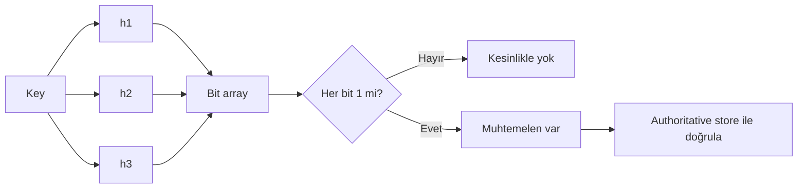
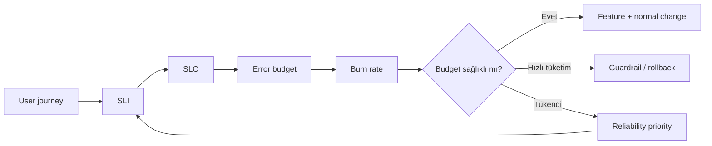

# 2026-09-18 05:00 — Interview Study Packages

README ve yakın `2026-09-18/04-00.md` kontrol edildi. Memory safety/Rust FFI ve INP/RUM konuları tekrar edilmedi. Repo aramasında aşağıdaki iki konu için yakın eşleşme bulunmadı.

## Paket 1 — Junior → Staff Algorithms & Data Structures / Databases: Bloom Filters, False Positives & Probabilistic Membership

**Süre:** 20–30 dk

### Konu anlatımı
Bloom filter, bir elemanın kümeye **kesinlikle ait olmadığını** veya **muhtemelen ait olduğunu** söyleyen, bit-array tabanlı probabilistic veri yapısıdır. `m` bitlik dizi ve `k` hash fonksiyonu kullanılır. Insert sırasında `k` pozisyon 1 yapılır; lookup sırasında bu bitlerden biri 0 ise eleman kesin yoktur. Hepsi 1 ise sonuç pozitiftir fakat collision nedeniyle false positive olabilir. Standart Bloom filter false negative üretmez; ancak yanlış deletion, concurrency bug veya lifecycle hatası bu invariant'ı bozabilir.

Yaklaşık false-positive olasılığı `p ≈ (1 - e^(-kn/m))^k`; sabit `m,n` için optimum `k ≈ (m/n) ln 2`. Daha az bellek daha yüksek false-positive oranı demektir. Bu nedenle Bloom filter authoritative store değildir; pahalı lookup öncesi **negative filter** olarak değerlidir. LSM/SSTable sistemlerinde disk read azaltma, anti-replay ve privacy-preserving telemetry gibi alanlarda kullanılır. TLS 1.3 RFC 8446, 0-RTT anti-replay store için false-positive üretebilen Bloom filter benzeri yapıları açıkça kabul eder; apparent replay durumunda 0-RTT reddedilebilir ama handshake abort edilmemelidir.

### Mental model

**Invariant:** Bloom filter pozitif sonucu doğrulama gerektirir; negatif sonuç ancak lifecycle doğruysa güçlüdür.

### Yüksek getirili mülakat soruları
1. Bloom filter neden false positive üretir ama normal modelde false negative üretmez?
2. `m`, `n`, `k` parametreleri false-positive oranını nasıl etkiler?
3. HashSet yerine neden Bloom filter kullanırsın?
4. Standard Bloom filter'da deletion neden tehlikelidir; counting Bloom filter ne değiştirir?
5. LSM-tree read path'inde filter nerede konumlanır?
6. Filter saturation'ı production'da nasıl tespit edersin?
7. Staff: tenant başına memory budget ve hedef FPR nasıl seçilir?
8. Security: false positive sonucu authorization kararı olarak kullanmak neden tehlikelidir?

### Seviyeye göre cevap derinliği
- **Junior:** bit array, hash, membership ve false positive'i doğru açıklar.
- **Mid:** `m/n/k`, optimum hash sayısı, deletion ve sizing trade-off'larını tartışır.
- **Senior:** cache/storage read path, rebuild/versioning, concurrency ve telemetry tasarlar.
- **Staff:** fleet memory economics, workload skew, adversarial input ve correctness boundary'sini yönetir.

### Kısa alıştırma
1 milyon key için key başına 10 bit ayırdığını varsay. `k≈7` ile yaklaşık FPR'yi hesapla; sonra 5 bit/key durumuyla karşılaştır. Pozitif lookup'ın 4 ms disk read'e dönüştüğü bir workload'da beklenen gereksiz read maliyetini yorumla.

### Proje fikri
`bloom-lab`: configurable `m/k` ile Bloom filter yaz; gerçek ve teorik FPR'yi karşılaştır, saturation grafiği çıkar ve SQLite/yerel KV lookup önüne koyarak avoided-read oranını ölç.

### Failure modes / trade-off / production bağlantısı
Yanlış deletion false negative yaratabilir; capacity aşımı FPR'yi hızla büyütür; zayıf/adversarial hash dağılımı hot bits üretir; filter ile authoritative store'un snapshot/version lifecycle'ı ayrışırsa stale negatives oluşabilir. Production'da inserted-item estimate, fill ratio, observed FPR, avoided lookups, bytes/key, rebuild süresi ve authoritative-store miss-after-positive oranı izlenmelidir. Security kararlarında probabilistic positive tek başına yetki kanıtı değildir.

### Kaynaklar
- RFC 8446 — TLS 1.3, 0-RTT anti-replay ve Bloom filter notu: https://www.rfc-editor.org/rfc/rfc8446.html
- RFC 8932 — DNS Privacy Service Operators, Bloom Filters: https://www.rfc-editor.org/rfc/rfc8932.html
- Burton H. Bloom, 1970, Space/Time Trade-offs in Hash Coding with Allowable Errors: https://doi.org/10.1145/362686.362692

---

## Paket 2 — Mid → CTO SRE / Leadership / Product: Error Budgets, Burn Rate & Reliability Prioritization

**Süre:** 20–30 dk

### Konu anlatımı
SLO, kullanıcı açısından kabul edilebilir reliability hedefidir; error budget kabaca `1 - SLO` ile izin verilen başarısızlık payını karar mekanizmasına dönüştürür. Örneğin 30 günlük %99.9 success SLO'su %0.1 error budget verir. Ama amaç yalnız dashboard üretmek değildir: error budget, feature velocity ile reliability investment arasındaki ortak kontrol yüzeyidir.

**Burn rate**, budget'ın hedefe göre ne hızla tüketildiğini gösterir. Burn rate 1, pencere boyunca aynı hız sürerse budget'ın tam biteceği hızdır; 10x, budget'ı yaklaşık pencerenin onda birinde tüketir. Google SRE Workbook, burn-rate alerting'i yüksek precision ve anlamlı budget spend üzerinden kurar; tek kısa pencere yerine fast-burn ve slow-burn durumlarını ayırmak daha kullanışlıdır.

Error-budget policy önceden yazılı olmalıdır: hangi SLI'lar geçerli, hangi trafik kapsam dışı, budget tükenince hangi değişiklikler durur, security fix'leri nasıl ele alınır, kim karar verir ve hangi exit criteria ile normal delivery'ye dönülür? CTO seviyesinde SLO bir teknik KPI değil; müşteri beklentisi, gelir/reputation riski, engineering capacity ve release velocity arasında kontrattır.

### Mental model

**Invariant:** SLO ölçülüp raporlanan bir sayı değil, önceden anlaşılmış bir karar policy'sine bağlı control loop'tur.

### Yüksek getirili mülakat soruları
1. SLI, SLO ve SLA arasındaki fark nedir?
2. %99.9 SLO için error budget nasıl hesaplanır?
3. Burn rate 1 ve 10 ne anlama gelir?
4. Neden yalnız kalan budget yüzdesine alert vermek yetersizdir?
5. Dependency outage kendi error budget'ını tüketmeli mi?
6. Feature freeze hangi koşullarda otomatik, hangi koşullarda insan kararı olmalı?
7. Staff: farklı user journey'ler için SLO portföyünü nasıl kurarsın?
8. CTO: daha yüksek SLO'nun maliyetini ürün ve finans ekibine nasıl çevirirsin?

### Seviyeye göre cevap derinliği
- **Mid:** availability/latency SLI, SLO ve temel budget hesabını açıklar.
- **Senior:** burn-rate alerting, dependency attribution, canary ve rollback gate'lerini tasarlar.
- **Staff:** cross-team policy, service tiering, exception ve reliability roadmap'i yönetir.
- **CTO:** reliability target'larını revenue risk, customer segment, compliance ve engineering allocation ile bağlar.

### Kısa alıştırma
30 günlük %99.9 request-success SLO'su ve ayda 20 milyon request için error budget'ı hesapla. 1 saatte 6.000 bad event oluşursa bu olay budget'ın yüzde kaçını tüketir? Bu spend için page, rollback veya freeze policy'si öner.

### Proje fikri
`slo-control-loop`: Prometheus-style good/total event serisinden rolling SLO compliance, remaining budget ve burn rate hesaplayan küçük servis; fast/slow burn gate'leri ve release webhook simülasyonu ekle.

### Failure modes / trade-off / production bağlantısı
Yanlış SLI kullanıcı acısını ölçmez; çok gevşek SLO reliability borcunu gizler; aşırı sıkı SLO gereksiz maliyet ve düşük velocity üretir; low-traffic servislerde request-based budget gürültülü olabilir; dependency attribution ekipler arası teşvikleri bozabilir. Production'da user-journey SLIs, remaining budget, multi-window burn rate, incident başına budget spend, rollback frequency, change failure rate ve reliability work allocation birlikte izlenmelidir. Policy punishment değil, önceden anlaşılmış prioritization mekanizması olmalıdır.

### Kaynaklar
- Google SRE Workbook — Implementing SLOs: https://sre.google/workbook/implementing-slos/
- Google SRE Workbook — Alerting on SLOs / burn rate: https://sre.google/workbook/alerting-on-slos/
- Google SRE Workbook — Example Error Budget Policy: https://sre.google/workbook/error-budget-policy/
- Google SRE Book — Embracing Risk: https://sre.google/sre-book/embracing-risk/
