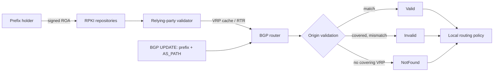
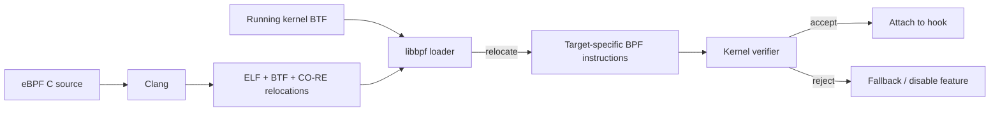

# 2026-09-18 06:00 — Interview Study Packages

README ve yakın `2026-09-18/05-00.md` kontrol edildi. Bloom filters ve error-budget/burn-rate konuları tekrar edilmedi. Repo aramasında aşağıdaki iki konu için yakın eşleşme bulunmadı.

## Paket 1 — Mid → Principal Networking / Cybersecurity / SRE: BGP RPKI, Route Origin Validation & Route-Leak Boundaries

**Süre:** 20–30 dk

### Konu anlatımı
BGP, Internet üzerindeki Autonomous System'lerin hangi prefix'lere hangi yollarla ulaşılacağını ilan ettiği inter-domain routing protokolüdür. Temel BGP ilanı tek başına bir AS'nin belirli bir prefix'i originate etmeye yetkili olduğunu kriptografik olarak kanıtlamaz. RPKI bu boşluğun bir bölümünü kapatır: prefix sahibi, bir **Route Origin Authorization (ROA)** ile hangi origin ASN'nin prefix'i ve hangi `maxLength` sınırına kadar daha spesifik prefix'leri originate edebileceğini imzalı olarak belirtir.

Relying-party validator RPKI repository'lerinden nesneleri alır, imzaları doğrular ve router'a VRP cache verir. RFC 6811 modelinde BGP route sonucu **Valid**, **Invalid** veya **NotFound** olur. Valid: en az bir VRP prefix'i cover eder, origin ASN ve prefix length eşleşir. Invalid: bir VRP cover eder ama origin veya `maxLength` eşleşmez. NotFound: route'u cover eden VRP yoktur. Kritik sınır: origin validation, bütün AS_PATH'in meşru olduğunu kanıtlamaz. Route leak, doğru origin ile de gerçekleşebilir; RPKI ROV ile path validation aynı problem değildir.

Mart 2026 tarihli IETF `8210bis-25` taslağı RPKI-Router protocol v2 için origin verisine ek olarak Router Keys ve ASPA verisini trusted cache'ten router'a taşıma modelini tarif ediyor; bu, path/relationship validation yönündeki evrimi gösterir fakat draft ile yürürlükteki RFC'yi karıştırmamak gerekir.

### Mental model

**Invariant:** RPKI validation state bir input'tur; routing policy'nin kendisi değildir ve origin-valid olmak path'in leak-free olduğunu garanti etmez.

### Yüksek getirili mülakat soruları
1. BGP route hijack ile route leak arasındaki fark nedir?
2. ROA'daki `maxLength` neden güvenlik açısından önemlidir?
3. Valid, Invalid ve NotFound nasıl hesaplanır?
4. Router neden ROA imzalarını doğrudan doğrulamak yerine validator/cache kullanır?
5. Bütün validator'lar erişilemez olursa availability policy'n ne olur?
6. ROV neden doğru origin'li route leak'i durduramaz?
7. Staff: RPKI Invalid drop'u global fleet'te nasıl kademeli açarsın?
8. Principal: ROV, ASPA/path validation, peer policy ve monitoring'i nasıl katmanlarsın?

### Seviyeye göre cevap derinliği
- **Mid:** ASN, prefix, ROA/VRP ve üç validation state'i doğru açıklar.
- **Senior:** `maxLength`, validator redundancy, stale cache ve local-policy etkilerini tartışır.
- **Staff:** staged enforcement, telemetry, exception/override ve blast-radius yönetir.
- **Principal:** origin validation'ın sınırını path/relationship validation ve interconnect governance ile bağlar.

### Kısa alıştırma
`203.0.113.0/24, AS64500, maxLength=/24` VRP'si için şu ilanları sınıflandır: `/24 AS64500`, `/25 AS64500`, `/24 AS64501`, `198.51.100.0/24 AS64500`. Sonra `/25` ilanına izin vermek için ROA'nın nasıl değişeceğini ve bunun saldırı yüzeyini nasıl etkilediğini açıkla.

### Proje fikri
`rov-lab`: küçük bir VRP tablosu ve BGP announcement listesi alan, Valid/Invalid/NotFound sınıflandırması yapan CLI; `maxLength`, stale-cache ve validator-outage senaryoları için testler ekle.

### Failure modes / trade-off / production bağlantısı
Aşırı geniş `maxLength` gereksiz more-specific originasyon alanı açar; yanlış ROA meşru trafiği Invalid yapabilir; tek validator failure domain yaratır; validator outage'ında fail-closed global reachability kaybı doğurabilir; yalnız ROV kullanmak route leak/path attack riskini çözülmüş sanmaya yol açar. Production'da validation-state oranları, newly-invalid prefixes, validator freshness/session health, RTR lag, override sayısı, BGP churn ve reachability/SLO sinyalleri izlenmelidir.

### Kaynaklar
- RFC 6811 — BGP Prefix Origin Validation: https://www.rfc-editor.org/rfc/rfc6811.html
- RFC 8893 — RPKI Origin Validation for BGP Export: https://www.rfc-editor.org/rfc/rfc8893.html
- RPKI Documentation — Using RPKI Data: https://rpki.readthedocs.io/en/latest/rpki/using-rpki-data.html
- IETF draft-ietf-sidrops-8210bis-25, 2 Mar 2026: https://datatracker.ietf.org/doc/html/draft-ietf-sidrops-8210bis-25

---

## Paket 2 — Mid → Staff Cloud / SRE / Cybersecurity: eBPF Verifier, BTF & CO-RE Portability

**Süre:** 20–30 dk

### Konu anlatımı
eBPF, kernel içinde sandboxed programlar çalıştırarak networking, tracing, observability ve security policy gibi işlerde kernel module yazmadan programmable hooks sağlar. Güvenlik modelinin merkezinde **verifier** vardır: program load sırasında control-flow ve instruction path'lerini analiz eder; register/stack state, pointer türleri, bounds ve helper/kfunc argümanlarını takip eder. Program verifier'dan geçmeden çalışmaz.

Portability ayrı problemdir. Kernel struct layout ve alanları sürümler arasında değişebilir. **BTF (BPF Type Format)** kernel/program tip metadata'sını taşır. **CO-RE (Compile Once — Run Everywhere)** compiler'ın ürettiği relocation bilgisi + BTF + libbpf loader ile hedef kernel'in gerçek type/field layout'una göre instruction offset/immediate alanlarını load-time'da düzeltir. Böylece her host'ta runtime compile yerine tek artifact'in bir kernel matrisi üzerinde taşınabilir olması hedeflenir.

CO-RE 'her kernelde kesin çalışır' garantisi değildir. Beklenen type/field yoksa, attach target veya kfunc contract değişirse program yüklenmeyebilir. Kernel dokümanı arbitrary kernel function attach noktalarının ABI olmadığını açıkça belirtir. Production tasarımında verifier rejection, feature detection ve graceful degradation birinci sınıf failure mode olmalıdır.

### Mental model

**Invariant:** CO-RE portability'yi artırır; verifier runtime safety gate'idir. İkisi farklı sorunu çözer.

### Yüksek getirili mülakat soruları
1. eBPF verifier neden load-time'da abstract interpretation benzeri state tracking yapar?
2. `PTR_TO_CTX`, scalar ve stack pointer ayrımı neden önemlidir?
3. BTF ne taşır; debug symbol ile ilişkisi nedir?
4. CO-RE relocation hangi problemi çözer?
5. CO-RE neden kernel ABI garantisi değildir?
6. Verifier rejection production'da nasıl degrade edilmelidir?
7. Staff: 5 farklı distro/kernel ailesine eBPF agent rollout'unu nasıl doğrularsın?
8. Security: verifier bypass bug'ı neden yüksek blast-radius taşır?

### Seviyeye göre cevap derinliği
- **Mid:** hook, map, verifier ve basic safety modelini açıklar.
- **Senior:** BTF/CO-RE relocation, bounds/pointer tracking ve kernel compatibility'yi tartışır.
- **Staff:** kernel matrix, capability detection, fallback, rollout ve security isolation tasarlar.

### Kısa alıştırma
Bir packet parser'ın `data + 14 <= data_end` check'i olmadan Ethernet header okuduğunu varsay. Verifier'ın neden reddetmesini beklediğini açıkla. Ardından 3 kernel sürümü için CO-RE compatibility test matrisi ve fallback davranışı tanımla.

### Proje fikri
`core-probe`: CO-RE kullanan küçük process/network tracer; startup'ta kernel BTF ve attach capability kontrolü, verifier-log capture, ring-buffer event export ve unsupported-host fallback metriği ekle.

### Failure modes / trade-off / production bağlantısı
Verifier complexity programı reddedebilir; kernel type/field veya attach target değişimi CO-RE relocation/attach failure yaratabilir; yüksek event rate ring-buffer drop ve CPU overhead üretir; yüksek-cardinality telemetry maliyeti büyütür; privileged loader compromise büyük blast radius taşır. Production'da load/attach success, verifier rejection reason, lost events, map pressure, CPU overhead, kernel/BTF version distribution ve fallback rate izlenmelidir. eBPF observability aracı host stability'sinden daha önemli değildir; overhead budget ve kill switch gereklidir.

### Kaynaklar
- Linux Kernel — eBPF verifier: https://docs.kernel.org/bpf/verifier.html
- Linux Kernel — BPF Type Format: https://docs.kernel.org/bpf/btf.html
- Linux Kernel — CO-RE relocations: https://docs.kernel.org/bpf/llvm_reloc.html
- Linux Kernel — BPF Design Q&A / ABI expectations: https://docs.kernel.org/bpf/bpf_design_QA.html
