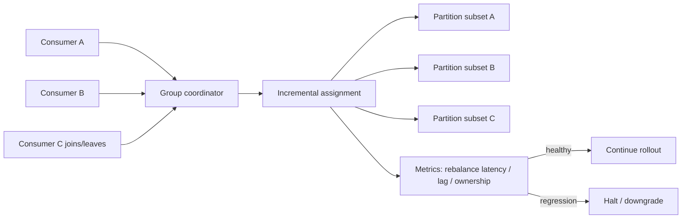
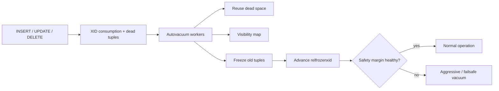

# 2026-09-18 07:00 — Interview Study Packages

README ve yakın `2026-09-18/06-00.md` kontrol edildi. BGP RPKI/ROV ve eBPF verifier/BTF/CO-RE konuları tekrar edilmedi. Repo aramasında aşağıdaki iki konu için yakın eşleşme bulunmadı.

## Paket 1 — Mid → Principal Data Engineering / Distributed Systems: Kafka Consumer Rebalance Protocol, Incremental Assignment & Migration

**Süre:** 20–30 dk

### Konu anlatımı
Kafka consumer group, topic partition'larını üyeler arasında paylaştırarak paralel tüketim sağlar. Üyelik değişince assignment yeniden hesaplanır. Eski Classic protokolün önemli maliyeti rebalance sırasında grup çapında koordinasyon/senkronizasyon bariyeridir. KIP-848 ile gelen yeni **Consumer rebalance protocol**, Kafka 4.0'dan beri GA'dır ve fully incremental tasarımla global synchronization barrier'ını kaldırarak rebalance süresini ve disruption'ı azaltmayı hedefler.

Yeni protokolde heartbeat interval, session timeout ve assignment strategy gibi kararların daha fazlası broker/server tarafına taşınır. Java consumer tarafında `group.protocol=consumer` ile opt-in edilir. Migration yalnız config flip değildir: custom client-side assignor kullanımı, rack-aware davranış, client sürümleri, lag/SLO ve rollback kabiliyeti kontrol edilmelidir. Online migration mümkündür; ancak classic assignor custom metadata embed ediyorsa interoperability sınırı vardır.

Nisan 2026'da kabul edilen KIP-1274, Classic protokolün aşamalı emekliliğini tarif ediyor: Kafka 4.3'te deprecation, 5.0'da yeni Consumer protokolünün default olması ve 6.0'da KafkaConsumer'ın yalnız Consumer protokolünü desteklemesi hedefleniyor. Bu nedenle migration artık yalnız performans optimizasyonu değil, lifecycle yönetimidir.

### Mental model

**Invariant:** rebalance correctness = aynı partition'ın eşzamanlı yanlış ownership'ini önlemek + assignment değişirken processing progress ve delivery semantics'i korumak. Daha hızlı rebalance, consumer işleyicisini otomatik olarak idempotent yapmaz.

### Yüksek getirili mülakat soruları
1. Consumer group neden rebalance olur?
2. Stop-the-world/global barrier yaklaşımı latency ve lag'i nasıl etkiler?
3. KIP-848'in incremental modeli neyi değiştirir?
4. Heartbeat/session timeout'un broker tarafına taşınmasının trade-off'u nedir?
5. Partition revoke/assign sırasında offset commit ve side effect nasıl yönetilir?
6. Online Classic → Consumer migration hangi durumda mümkün olmayabilir?
7. Staff: 500 consumer'lı bir grupta rollout gate'lerini nasıl seçersin?
8. Principal: protocol lifecycle, client fleet ve application delivery semantics'ini nasıl birlikte yönetirsin?

### Seviyeye göre cevap derinliği
- **Mid:** group, partition ownership, heartbeat, lag ve rebalance nedenlerini açıklar.
- **Senior:** incremental assignment, offset/side-effect boundary, timeout ve failure recovery'yi tartışır.
- **Staff:** mixed-version rollout, custom assignor compatibility, observability ve rollback tasarlar.
- **Principal:** KIP-1274 lifecycle'ını platform standardı, migration budget ve fleet governance ile bağlar.

### Kısa alıştırma
24 partition, 6 consumer ve consumer başına 4 partition bulunan bir grup düşün. İki yeni consumer aynı anda katılıyor. Assignment değişimini çiz; hangi metriklerle Classic ve Consumer protokollerinin disruption'ını karşılaştıracağını yaz. Ardından duplicate side effect'i önlemek için handler contract'ını tanımla.

### Proje fikri
`rebalance-lab`: Docker/Kafka üzerinde consumer join/leave/crash senaryoları üreten, Classic ve Consumer protocol için rebalance duration, consumer lag, revoked/assigned partition ve duplicate-effect sayısını karşılaştıran küçük benchmark.

### Failure modes / trade-off / production bağlantısı
Yanlış timeout tuning churn yaratabilir; slow handler heartbeat/progress semantiğini bozabilir; non-idempotent side effect duplicate üretir; custom assignor migration'ı engelleyebilir; mixed fleet gözlenmeden rollout blast radius büyütür. Production'da rebalance count/duration, assignment churn, consumer lag, processing latency, commit failures, duplicate-effect metriği ve group membership izlenmelidir. Protocol migration application-level exactly-once garantisi değildir.

### Kaynaklar
- Apache Kafka — Consumer Rebalance Protocol: https://kafka.apache.org/43/operations/consumer-rebalance-protocol/
- Apache Kafka 4.0 release announcement — KIP-848 GA: https://kafka.apache.org/blog/2025/03/18/apache-kafka-4.0.0-release-announcement/
- KIP-1274 — Classic protocol deprecation/removal, accepted Apr 2026: https://cwiki.apache.org/confluence/spaces/KAFKA/pages/406619710/KIP-1274+Deprecate+and+remove+support+for+Classic+rebalance+protocol+in+KafkaConsumer
- Apache Kafka downloads / current releases: https://kafka.apache.org/community/downloads/

---

## Paket 2 — Junior → Staff Databases / SRE: PostgreSQL VACUUM, XID Wraparound & Autovacuum Capacity

**Süre:** 20–30 dk

### Konu anlatımı
PostgreSQL MVCC'de UPDATE/DELETE eski tuple version'larını anında fiziksel olarak yok etmez. `VACUUM` dead tuple alanını yeniden kullanılabilir hale getirir, planner statistics/visibility map bakımına katkı sağlar ve daha kritik olarak transaction-ID wraparound riskini yönetir. Normal `VACUUM`, production read/write ile birlikte çalışabilir; `VACUUM FULL` ise tabloyu yeniden yazar ve `ACCESS EXCLUSIVE` lock gerektirir.

Normal XID'ler 32-bit alanda dolaşır. PostgreSQL modulo karşılaştırma nedeniyle yaklaşık iki milyar XID'lik geçmiş/gelecek penceresi kullanır. Çok eski tuple'lar freeze edilmezse wraparound sonrasında geçmiş transaction 'gelecekte' gibi görünebilir. Bu nedenle autovacuum yalnız bloat cleanup mekanizması değildir; correctness/safety mekanizmasıdır. PostgreSQL tehlike yaklaşınca wraparound-prevention autovacuum'u zorlar ve kritik sınırda yeni XID atamalarını reddederek veri kaybını önlemeye çalışır.

PostgreSQL 18 ayrıca normal vacuum'un bazı all-visible sayfaları erkenden freeze etmesine izin veren eager freezing davranışını ekledi; amaç ilerideki full-relation aggressive freeze maliyetini azaltmaktır. Operasyonel soru 'autovacuum açık mı?' değil, write rate karşısında vacuum throughput yeterli mi ve oldest XID age güvenli hızda mı ilerliyor?' olmalıdır.

### Mental model

**Invariant:** vacuum capacity uzun vadede dead-tuple/XID üretim hızını karşılamalıdır; aksi halde backlog yalnız performans değil availability/correctness riski olur.

### Yüksek getirili mülakat soruları
1. MVCC neden dead tuple üretir?
2. `VACUUM` ile `VACUUM FULL` farkı nedir?
3. Visibility map index-only scan'i nasıl hızlandırır?
4. XID wraparound neden tehlikelidir ve freeze ne yapar?
5. Uzun transaction veya stale replication slot vacuum'u nasıl etkileyebilir?
6. Autovacuum açık olduğu halde neden geride kalabilir?
7. Staff: yüksek-write multi-tenant cluster'da per-table tuning ve capacity modelini nasıl kurarsın?
8. Incident: wraparound warning geldiğinde hangi sırayla teşhis ve remediation yaparsın?

### Seviyeye göre cevap derinliği
- **Junior:** MVCC, dead tuple ve temel VACUUM amacını açıklar.
- **Mid:** autovacuum, visibility map, bloat ve standard/FULL lock farkını bilir.
- **Senior:** XID age, freeze, long transaction/slot blockers ve I/O trade-off'unu tartışır.
- **Staff:** vacuum throughput, per-table settings, alerts, emergency runbook ve fleet policy tasarlar.

### Kısa alıştırma
Dakikada 3 milyon row update alan büyük bir tablo için dashboard tasarla. `n_dead_tup`, vacuum duration/frequency, oldest XID age, replication-slot age ve disk/I/O metriklerinden hangilerini alarm yapacağını; warning ve critical eşiklerinin neden salt disk yüzdesine dayanamayacağını açıkla.

### Proje fikri
`pg-vacuum-watch`: `pg_stat_*`, `pg_class.relfrozenxid`, database XID age ve replication-slot xmin/catalox_xmin verisini okuyup tablo bazlı risk skoru, blocker listesi ve vacuum-capacity trendi çıkaran CLI/dashboard.

### Failure modes / trade-off / production bağlantısı
Autovacuum'u bloat nedeniyle agresif kısmak wraparound riskini büyütebilir; aşırı agresif vacuum I/O contention yaratabilir; uzun transaction old snapshot'ı tutabilir; stale replication slot cleanup'ı geciktirebilir; `VACUUM FULL` yanlış incident anında lock/downtime yaratabilir. Production'da dead tuples, autovacuum runtime/backlog, `age(relfrozenxid)`, database oldest XID, replication-slot xmin age, long transactions, I/O latency ve table/index size birlikte izlenmelidir.

### Kaynaklar
- PostgreSQL 18 — Routine Vacuuming: https://www.postgresql.org/docs/18/routine-vacuuming.html
- PostgreSQL 18 — VACUUM: https://www.postgresql.org/docs/18/sql-vacuum.html
- PostgreSQL 18 release notes — eager freezing: https://www.postgresql.org/docs/18/release-18.html
- PostgreSQL documentation/current releases: https://www.postgresql.org/docs/
