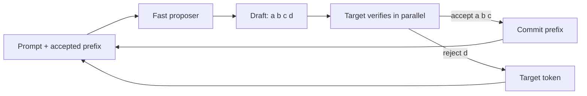
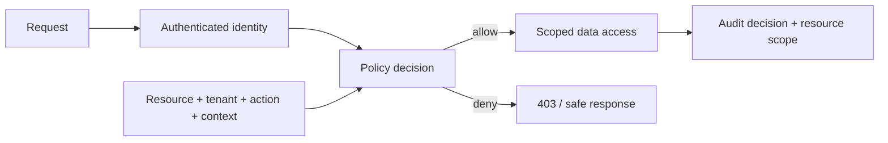

# 2026-09-18 08:00 — Interview Study Packages

README ve yakın `2026-09-18/07-00.md` kontrol edildi. Kafka consumer rebalance ve PostgreSQL VACUUM/XID wraparound tekrar edilmedi. Repo aramasında aşağıdaki iki konu için yakın eşleşme bulunmadı.

## Paket 1 — Mid → Principal ML/AI/LLM / MLOps: Speculative Decoding, Acceptance Rate & Inference Economics

**Süre:** 20–30 dk

### Konu anlatımı
Autoregressive LLM decode normalde token başına büyük model forward pass'i gerektirir ve özellikle düşük/orta QPS'te memory-bandwidth bound olabilir. Speculative decoding küçük/hızlı bir proposer'ın birkaç token önden tahmin etmesi, target modelin bunları paralel doğrulaması ve yalnız kabul edilen prefix'i kullanması fikridir. Amaç target distribution'ı değiştirmeden inter-token latency'yi düşürmektir.

Kazanç yalnız `num_speculative_tokens` artırmakla gelmez. Draft maliyeti, target verification maliyeti, acceptance length, batch/QPS, KV-cache footprint ve scheduler etkileşimi birlikte düşünülür. Düşük acceptance'ta draft işi boşa gider; yüksek QPS'te ekstra proposer compute throughput'u kötüleştirebilir. vLLM güncel dokümantasyonu EAGLE, MTP, draft model, n-gram ve suffix dahil yöntemleri destekliyor ve per-request acceptance metrics sunuyor.

### Mental model

**Invariant:** hızlandırma, target modelin sampling semantiğini korurken daha az pahalı decode step'iyle daha fazla kabul edilmiş token üretmelidir.

### Yüksek getirili mülakat soruları
1. Autoregressive decode neden memory-bound olabilir?
2. Draft model ve target model rolleri nedir?
3. Acceptance rate/length performansı neden belirler?
4. Daha fazla speculative token neden her zaman daha hızlı değildir?
5. MTP ile ayrı draft model yaklaşımını karşılaştır.
6. Low-QPS latency ile high-QPS throughput hedefleri neden farklı tuning ister?
7. Staff: production benchmark matrisi ve rollout gate'lerini nasıl kurarsın?
8. Principal: model/hardware/workload heterojenliğinde speculation policy'yi nasıl otomatikleştirirsin?

### Seviyeye göre cevap derinliği
- **Mid:** proposer → verify → accept/reject akışını açıklar.
- **Senior:** acceptance, draft overhead, KV cache, batching ve latency/throughput trade-off'unu tartışır.
- **Staff:** workload-segmented benchmark, per-request metrics, fallback ve canary tasarlar.
- **Principal:** dynamic policy, GPU economics, capacity ve model lifecycle'ını birlikte yönetir.

### Kısa alıştırma
Baseline 45 token/s. Draft+verify ile step başına ortalama 2.4 token çıkıyor fakat step maliyeti baseline'ın 1.35 katı. İdealize speedup'ı hesapla; sonra acceptance %30 düştüğünde neden yeniden ölçüm gerektiğini açıkla.

### Proje fikri
`spec-decode-lab`: vLLM üzerinde n-gram ve draft-model speculation'ı farklı QPS, prompt uzunluğu ve output uzunluklarında benchmark edip TTFT, ITL, throughput, acceptance length ve GPU memory raporlayan harness.

### Failure modes / trade-off / production bağlantısı
Düşük acceptance negative ROI yaratabilir; draft model belleği capacity'yi azaltabilir; batching kazancı speculation kazancını gölgeleyebilir; sampling/numerical davranış determinism beklentisini bozabilir; tek benchmark gerçek trafik dağılımını temsil etmeyebilir. Production'da TTFT, ITL, tokens/s, queue time, draft acceptance rate/length, GPU utilization/memory ve request sınıfı birlikte izlenmelidir.

### Kaynaklar
- vLLM — Speculative Decoding: https://docs.vllm.ai/en/stable/features/spec_decode/
- vLLM — Per-Request Acceptance Metrics: https://docs.vllm.ai/en/latest/features/speculative_decoding/acceptance_metrics/
- vLLM Speculators — Getting Started: https://docs.vllm.ai/projects/speculators/en/stable/user_guide/getting_started/

---

## Paket 2 — Junior → CTO Cybersecurity / Backend: Object-Level Authorization, BOLA & Deny-by-Default Design

**Süre:** 20–30 dk

### Konu anlatımı
Authentication 'kim?' sorusunu; authorization ise 'bu principal bu resource üzerinde bu action'ı yapabilir mi?' sorusunu cevaplar. Object-level authorization hatası, endpoint'in geçerli oturum kabul etmesine rağmen kullanıcının başka tenant/user'a ait nesneyi ID değiştirerek okuyabilmesi veya değiştirebilmesidir. Güvenlik invariant'ı `allow = policy(subject, action, resource, context)` kararının her hassas object access'te server-side uygulanmasıdır.

Kontrolü yalnız UI'da gizlemek, opaque UUID kullanmak veya route-level role check yapmak yeterli değildir. Resource ownership/tenant boundary sorguya veya merkezi policy katmanına bağlanmalı; deny-by-default, least privilege ve auditable decision üretmelidir. OWASP ASVS 5.0.0 güncel stable sürümdür ve authorization kontrollerini doğrulanabilir gereksinimlere dönüştürmek için kullanılabilir.

### Mental model

**Invariant:** kullanıcının resource ID'yi bilmesi erişim yetkisi değildir; authorization kararı object scope ile birlikte verilmelidir.

### Yüksek getirili mülakat soruları
1. Authentication ve authorization farkı nedir?
2. BOLA/IDOR nasıl oluşur?
3. UUID neden authorization kontrolünün yerini tutmaz?
4. RBAC object ownership için neden tek başına yetersiz olabilir?
5. Multi-tenant SQL sorgularında tenant isolation nasıl enforce edilir?
6. Policy decision'ları cache etmek hangi stale-permission riskini yaratır?
7. Staff: mikroservislerde merkezi policy ile local enforcement'ı nasıl dengelersin?
8. CTO: authorization standardını test, audit, incident ve compliance süreçlerine nasıl bağlarsın?

### Seviyeye göre cevap derinliği
- **Junior:** authn/authz ayrımını ve server-side ownership check'i bilir.
- **Mid:** RBAC/ABAC, tenant scoping, deny-by-default ve testleri açıklar.
- **Senior:** policy caching, TOCTOU, confused deputy, audit ve service-to-service identity'yi tartışır.
- **Staff:** policy architecture, migration, observability ve blast radius tasarlar.
- **CTO:** authorization'ı ürün modeli, compliance evidence ve organization-wide secure defaults ile bağlar.

### Kısa alıştırma
`GET /projects/{id}` ve `PATCH /projects/{id}` için aynı tenant'ta viewer/editor/admin rollerini düşün. Subject-action-resource matrix çıkar; ardından başka tenant ID'si, silinmiş membership ve stale cache için negatif testler yaz.

### Proje fikri
`authz-contract-lab`: küçük REST API + policy engine; tenant-scoped repository, deny-by-default middleware, decision audit log ve property-based cross-tenant negative tests.

### Failure modes / trade-off / production bağlantısı
UI-only check, client-supplied tenant ID'ye güvenmek, admin bypass'larını yaymak, stale policy cache, list endpoint'te filtreleyip detail endpoint'te unutmamak ve audit log'a hassas veri yazmak tipik hatalardır. Merkezi policy tutarlılık sağlar ama latency/availability dependency yaratabilir; local policy hızlıdır ama drift riski taşır. Production'da deny/allow oranı, cross-tenant denemeleri, policy latency/errors, privileged actions ve policy-version dağılımı izlenmelidir.

### Kaynaklar
- OWASP ASVS — latest stable 5.0.0: https://owasp.org/projects/asvs
- OWASP ASVS v5.0.0 repository: https://github.com/OWASP/ASVS/tree/v5.0.0
- OWASP Cornucopia Authorization mapping: https://cornucopia.owasp.org/cards/AZ2
