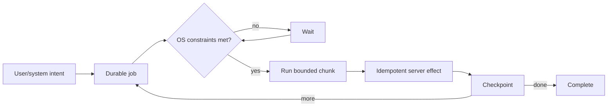
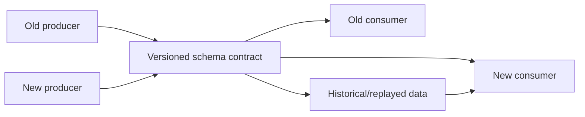

# 2026-09-18 09:00 — Interview Study Packages

README ve yakın `2026-09-18/08-00.md` kontrol edildi. Speculative decoding ve BOLA tekrar edilmedi. Repo aramasında aşağıdaki iki konu için yakın eşleşme bulunmadı.

## Paket 1 — Junior → Staff Frontend/Mobile/SRE: Background Work, OS Scheduling & Idempotent Mobile Jobs

**Süre:** 20–30 dk

### Konu anlatımı
Mobil uygulamada `async` başlatmak, işin uygulama görünmez olduktan veya process öldükten sonra tamamlanacağı anlamına gelmez. Android'de kalıcı/deferrable işler için WorkManager önerilir; constraint sağlandıktan sonra işi planlar, app restart/device reboot sınırlarını aşabilir. iOS'ta BackgroundTasks framework'ü kritik background işi sistem tarafından verilen execution window'larına taşır. Temel tasarım ilkesi: OS scheduler bir cron değildir; çalışmanın *ne zaman* başlayacağını tam kontrol etmezsin.

Bu yüzden job tasarımı scheduler'dan bağımsız olarak retry-safe olmalıdır: durable intent → unique/idempotency key → bounded work → checkpoint → server-side idempotent effect → success. Network, battery, charging ve storage constraint'leri product freshness ihtiyacıyla dengelenir. Exact alarm yalnız gerçekten exact user-visible zamanlama gerektiğinde kullanılmalıdır; normal sync için enerji maliyeti yüksektir.

### Mental model

**Invariant:** scheduler aynı işi geç, birden fazla kez veya process restart sonrasında çalıştırsa bile observable business effect doğru kalmalıdır.

### Yüksek getirili mülakat soruları
1. Coroutine/async task ile persistent background work farkı nedir?
2. WorkManager neden normal sync için AlarmManager'dan daha uygundur?
3. Background job neden idempotent olmalıdır?
4. Unique work duplicate enqueue problemini nasıl azaltır; server-side idempotency neden yine gerekir?
5. Network/charging constraint'leri freshness ile nasıl dengelersin?
6. Process kill ortasında upload yarıda kalırsa nasıl recover edersin?
7. Senior: milyonlarca cihaz aynı anda reconnect olursa backend thundering herd'ü nasıl önlersin?
8. Staff: Android/iOS ortak product SLO'su ile platform-specific scheduler semantics'i nasıl yönetirsin?

### Seviyeye göre cevap derinliği
- **Junior:** foreground async ile durable work ayrımını ve retry ihtiyacını açıklar.
- **Mid:** constraints, unique work, backoff ve checkpoint tasarlar.
- **Senior:** idempotency, partial progress, server load shaping, observability ve battery trade-off'larını tartışır.
- **Staff:** cross-platform freshness SLO, rollout, fleet behavior ve backend capacity'yi birlikte yönetir.

### Kısa alıştırma
500 MB fotoğraf upload'u tasarla. Uygulama kapanabilir, ağ 4 kez değişebilir ve backend aynı chunk'ı iki kez alabilir. Job state, idempotency key, chunk checkpoint ve retry/backoff kurallarını yaz.

### Proje fikri
`durable-mobile-uploader`: Android WorkManager tabanlı resumable upload; unique work, network constraint, exponential backoff, chunk checkpoint ve server idempotency endpoint'i ile küçük demo.

### Failure modes / trade-off / production bağlantısı
Duplicate enqueue, sonsuz retry, non-idempotent POST, büyük tek parça job, battery drain, reconnect stampede ve OS quota/throttling tipik hatalardır. Daha sık sync freshness'i artırır fakat enerji/data/backend maliyetini büyütür. Production'da enqueue→start delay, success/retry rate, attempt count, bytes retried, duplicate-effect suppression, battery/network class ve backend arrival burst'leri izlenmelidir.

### Kaynaklar
- Android — Persistent work / WorkManager: https://developer.android.com/develop/background-work/background-tasks/persistent
- Android — WorkManager API: https://developer.android.com/reference/androidx/work/WorkManager
- Android — Managing/Unique Work: https://developer.android.com/develop/background-work/background-tasks/persistent/how-to/manage-work
- Apple — Background Tasks: https://developer.apple.com/documentation/backgroundtasks

---

## Paket 2 — Mid → Principal Data Engineering/Distributed Systems: Schema Evolution, Compatibility & Data Contracts

**Süre:** 20–30 dk

### Konu anlatımı
Distributed schema değişikliği tek deploy değildir; producer, consumer, replayed historical data ve stored table files farklı sürümlerde aynı anda yaşayabilir. Bu nedenle schema evolution'ın temel sorusu “yeni schema compile oluyor mu?” değil, “old writer/new reader ve new writer/old reader kombinasyonlarında anlam korunuyor mu?” sorusudur.

Protocol Buffers wire format field number'larını kimlik olarak kullanır: production'a çıkmış tag numarası değiştirilmemeli veya yeniden kullanılmamalı; silinen alanların numarası reserve edilmelidir. Apache Iceberg benzer correctness problemini analytics tablolarında stable field ID'leriyle çözer; add/drop/rename/reorder gibi schema evolution işlemlerini metadata seviyesinde yapabilir ve field ID sayesinde rename'i yanlış kolona bağlamaz.

Data contract bunun üst katmanıdır: syntax/type yanında ownership, semantic meaning, nullability, freshness, quality expectation, compatibility policy ve deprecation window tanımlar. Güvenli rollout genellikle additive-first → dual-read/dual-write gerektiğinde migration → consumer adoption telemetry → deprecation → removal şeklindedir.

### Mental model

**Invariant:** isimler değişebilir; persisted/wire identity ve business meaning yanlış entity/field'e yeniden bağlanmamalıdır.

### Yüksek getirili mülakat soruları
1. Backward, forward ve full compatibility ne demektir?
2. Protobuf field number neden field name'den daha kritik olabilir?
3. Silinen tag neden `reserved` yapılmalıdır?
4. Additive schema change hangi durumda yine breaking olabilir?
5. Iceberg rename'i neden field ID ile daha güvenli yapabilir?
6. Replay edilen eski event'ler migration tasarımını nasıl etkiler?
7. Staff: schema compatibility'yi CI/CD gate'e nasıl çevirirsin?
8. Principal: yüzlerce producer/consumer arasında ownership, deprecation SLA ve exception governance nasıl kurulur?

### Seviyeye göre cevap derinliği
- **Mid:** compatibility yönlerini, optional/additive change ve tag reuse riskini açıklar.
- **Senior:** mixed-version rollout, replay, default/null semantics ve consumer telemetry tasarlar.
- **Staff:** registry/CI gate, contract ownership, deprecation workflow ve blast radius yönetir.
- **Principal:** org-wide compatibility policy, platform standardı, migration economics ve data governance kurar.

### Kısa alıştırma
`Customer.email` alanını `primary_email` olarak yeniden adlandırmak ve yeni `emails[]` alanına geçmek istiyorsun. Protobuf event + Iceberg table için 4 aşamalı, rollback-safe migration planı yaz; hangi identity'lerin korunacağını belirt.

### Proje fikri
`schema-compat-gate`: iki `.proto` veya iki table schema snapshot'ını karşılaştırıp tag/field-ID reuse, unsafe type change, removed-required semantic ve deprecation metadata eksikliği için CI raporu üreten CLI.

### Failure modes / trade-off / production bağlantısı
Tag/field-ID reuse, nullable→required geçişi, enum semantiğini sessiz değiştirme, default değer anlamını değiştirme, consumer inventory'siz removal ve historical replay'i unutma tipik failure mode'lardır. Strict compatibility velocity'yi yavaşlatabilir; gevşek policy ise runtime/data-corruption riskini büyütür. Production'da schema version distribution, unknown-field/parse errors, DLQ, consumer lag, null/default rate, old-version traffic ve deprecation deadline izlenmelidir.

### Kaynaklar
- Protocol Buffers — Language Guide / field numbers & deletion: https://protobuf.dev/programming-guides/editions/
- Protocol Buffers — Proto Best Practices: https://protobuf.dev/best-practices/dos-donts/
- Apache Iceberg — Evolution: https://iceberg.apache.org/docs/1.9.0/evolution/
- Apache Iceberg — Specification / Schema Evolution: https://iceberg.apache.org/spec/
