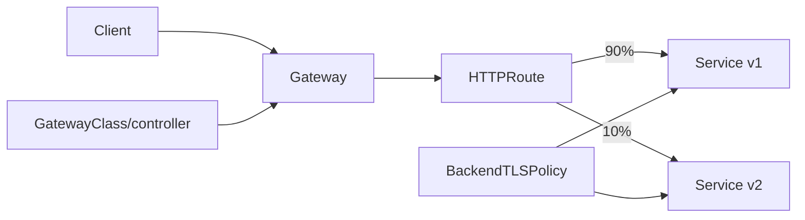

# 2026-09-18 11:00 — Interview Study Packages

README ve yakın `09-00.md` kontrol edildi. 10:00 GitHub notu bulunmadı; önceki tur PDF fallback olmuştu. Mobile background work/schema evolution ve PDF'deki PostgreSQL durable queue/FinOps konuları tekrar edilmedi. Repo aramasında aşağıdaki iki konu için yakın eşleşme bulunmadı.

## Paket 1 — Mid → Principal Cloud/Networking/SRE: Kubernetes Gateway API, Policy Attachment & Safe Traffic Control
**Süre:** 20–30 dk

### Konu anlatımı
Ingress tek bir API objesinde infrastructure ownership ile application routing'i kolayca birbirine bağlar. Gateway API bu sınırı `GatewayClass → Gateway → Route → backend` olarak ayırır: platform ekibi GatewayClass/Gateway'i, uygulama ekibi HTTPRoute/GRPCRoute'u yönetebilir. Bu yalnız syntax değişimi değil; delegation, portability ve policy ownership modelidir.

Gateway API v1.4.0 6 Ekim 2025'te yayımlandı. `Gateway`, `GatewayClass` ve `HTTPRoute` Standard/GA yüzeylerdir. v1.4'te `BackendTLSPolicy` Standard kanala çıktı; gateway→backend hop'unda TLS doğrulamasını hostname/SNI ve CA trust ile tarif eder. `supportedFeatures` GatewayClass'ın gerçek capability'lerini status'ta yayınlamasına izin verir. Experimental özellikleri production standardı sanmamak gerekir.

Retry/timeout/mirroring gibi L7 özellikleri failure amplification yaratabilir. Retry yalnız request semantics, retry budget, deadline ve backend overload birlikte düşünülürse güvenlidir. Weighted routing canary için kullanışlıdır fakat rollback sinyali error-rate kadar latency ve saturation'ı da içermelidir.

### Mental model

**Invariant:** routing intent uygulama sahibinden gelebilir; shared listener, TLS ve cross-namespace trust platform sınırlarıyla kontrol edilmelidir.

### Yüksek getirili mülakat soruları
1. Ingress ile Gateway API ownership modeli nasıl farklıdır?
2. GatewayClass, Gateway ve HTTPRoute sorumluluklarını ayır.
3. Route bir Gateway'e bağlanamadığında `status.conditions` neden kritik?
4. Weighted routing ile canary yaparken hangi rollback guardrail'larını seçersin?
5. BackendTLSPolicy hangi trust problemini çözer; frontend TLS'ten farkı nedir?
6. Retry neden overload'u büyütebilir; retry budget neyi sınırlar?
7. Staff: cross-namespace Route→backend yetkisini nasıl yönetirsin?
8. Principal: farklı controller implementasyonlarında portability/conformance riskini nasıl yöneteceksin?

### Seviyeye göre cevap derinliği
- **Mid:** resource ilişkisini, host/path match ve backendRef'i doğru açıklar.
- **Senior:** TLS, retry/timeout, canary, status/observability ve failure amplification'ı bağlar.
- **Staff:** namespace delegation, policy attachment, conformance ve multi-team ownership tasarlar.
- **Principal:** controller portability, rollout standardı, blast radius ve platform API governance kurar.

### Kısa alıştırma
`api.example.com` için v1/v2 servislerine 95/5 weighted route tasarla. v2 p99 iki katına çıkarsa rollback kuralını; backend TLS validation ve route ownership sınırını yaz.

### Proje fikri
`gateway-canary-lab`: kind cluster + conformant Gateway API controller; HTTPRoute weighted canary, BackendTLSPolicy, dashboard ve otomatik rollback simülasyonu.

### Failure modes / trade-off / production bağlantısı
Yanlış hostname/listener binding, cross-namespace trust açığı, unsupported feature varsayımı, retry storm, mirror'ın side effect üretmesi, stale DNS/backend ve controller migration farkları tipiktir. Production'da Accepted/Programmed/ResolvedRefs conditions, route-level RPS/error/p95-p99, retry count, backend TLS failure, saturation ve rollout cohort izlenir.

### Kaynaklar
- Kubernetes — Gateway API v1.4 (6 Kasım 2025 duyurusu; release 6 Ekim 2025): https://kubernetes.io/blog/2025/11/06/gateway-api-v1-4/
- Gateway API docs: https://gateway-api.sigs.k8s.io/
- Gateway API specification: https://gateway-api.sigs.k8s.io/reference/spec/
- Kubernetes — Gateway API v1.3 / retry budgets: https://kubernetes.io/blog/2025/06/02/gateway-api-v1-3/

---

## Paket 2 — Junior → Staff Networking/Backend: QUIC Connection Migration, HTTP/3 & 0-RTT Replay Boundaries
**Süre:** 20–30 dk

### Konu anlatımı
HTTP/3, HTTP semantics'i QUIC üzerinde taşır. QUIC UDP üzerinde çalışsa da güvenilir stream, congestion control, TLS 1.3 entegrasyonu ve connection identity sağlar. TCP bağlantısı pratikte 4-tuple'a bağlıyken QUIC Connection ID kullanarak istemcinin Wi-Fi'dan hücresel ağa geçmesi gibi address değişimlerinde bağlantının yaşayabilmesini sağlar.

RFC 9000'a göre migration handshake doğrulanmadan başlatılmaz. Yeni path `PATH_CHALLENGE/PATH_RESPONSE` ile validate edilir; yeni path'in RTT ve kapasitesi farklı olabileceği için congestion controller ve RTT tahmini migration sırasında yeniden ele alınır. Connection migration yalnız 'IP değişti ama socket devam etti' değildir; reachability, anti-amplification, congestion ve privacy sınırları vardır.

TLS 1.3 resumption ile QUIC 0-RTT application data gönderebilir. Latency avantajının karşılığı replay riskidir: RFC 9001, 0-RTT verisinin saldırgan tarafından replay edilebileceğini ve istenmeyen side effect başlatabilecek talimatlar için uygun olmadığını belirtir. Bu yüzden ödeme/işlem oluşturma gibi non-idempotent operasyonlarda 0-RTT'yi kapatmak veya application-level replay/idempotency koruması gerekir.

### Mental model
```mermaid
sequenceDiagram
  participant C as Client
  participant S as Server
  C->>S: QUIC connection via Wi-Fi (CID=X)
  C->>S: network changes; PATH_CHALLENGE via 5G
  S-->>C: PATH_RESPONSE
  Note over C,S: validate new path; reset path congestion state
  C->>S: continue streams with CID identity
```
**Invariant:** connection identity address'ten ayrılabilir; fakat yeni path güvenilir ve güvenli kabul edilmeden önce validate edilmelidir.

### Yüksek getirili mülakat soruları
1. HTTP/2 over TCP ile HTTP/3 over QUIC arasındaki head-of-line farkı nedir?
2. Connection ID migration'ı nasıl mümkün kılar?
3. Path validation neden gerekir?
4. Migration sonrası congestion state'i neden aynen taşımak risklidir?
5. 0-RTT neden 0 ms latency demek değildir ve replay riski nedir?
6. GET ile payment POST için 0-RTT policy neden farklı olabilir?
7. Senior: load balancer CID routing ve stateless reset'i nasıl düşünürsün?
8. Staff: mobile network churn, privacy ve observability arasında hangi trade-off'lar vardır?

### Seviyeye göre cevap derinliği
- **Junior:** QUIC/HTTP3'ün UDP üstünde güvenilir transport sağladığını ve stream kavramını açıklar.
- **Mid:** CID, path validation, handshake ve 0-RTT replay riskini bağlar.
- **Senior:** congestion reset, anti-amplification, LB routing, idempotency ve fallback tasarlar.
- **Staff:** fleet rollout, middlebox/UDP failure, privacy, telemetry ve multi-region edge trade-off'larını yönetir.

### Kısa alıştırma
Mobil checkout akışı için `/catalog`, `/cart` ve `/charge` endpoint'lerinde 0-RTT policy belirle. Wi-Fi→5G migration sırasında hangi metric ve correctness invariant'larını izleyeceğini yaz.

### Proje fikri
`quic-migration-lab`: HTTP/3 client/server; Linux network namespace ile address değişimi simüle et, connection ID/path validation event'lerini logla ve replay-safe/replay-unsafe endpoint davranışını test et.

### Failure modes / trade-off / production bağlantısı
UDP blocking, NAT rebinding, CID routing hatası, migration sonrası yanlış congestion varsayımı, 0-RTT replay, non-idempotent side effect ve HTTP/3 fallback telemetry eksikliği tipiktir. Production'da handshake RTT, H3 adoption/fallback, path validation success, migration count, loss/RTT before-after, 0-RTT accept/reject ve replay-suppression izlenir.

### Kaynaklar
- IETF RFC 9000 — QUIC Transport: https://www.rfc-editor.org/rfc/rfc9000.html
- IETF RFC 9001 — Using TLS to Secure QUIC: https://www.rfc-editor.org/rfc/rfc9001.html
- IETF RFC 9114 — HTTP/3: https://www.rfc-editor.org/rfc/rfc9114.html
