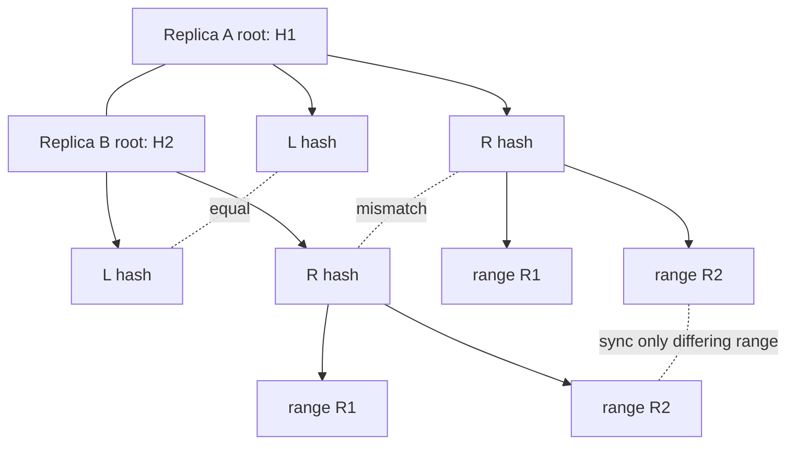
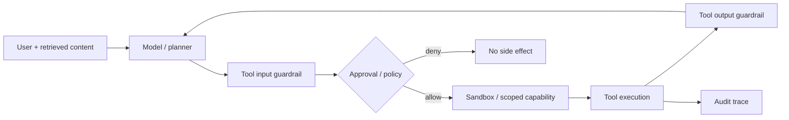

# 2026-09-18 12:00 — Interview Study Packages

README ve yakın `11-00.md` kontrol edildi. Gateway API ve QUIC/HTTP3/0-RTT konuları tekrar edilmedi. Repo aramasında Merkle-tree anti-entropy ve agent sandbox/tool guardrail konuları için yakın günlük eşleşme bulunmadı.

## Paket 1 — Mid → Principal Distributed Systems/Data Engineering: Merkle Trees, Anti-Entropy Repair & Replica Convergence
**Süre:** 20–30 dk

### Konu anlatımı
Eventual consistency, “replicalar bir gün kendiliğinden eşit olur” demek değildir; convergence için mekanizma gerekir. Hinted handoff ve read repair kaçırılmış mutation'ları azaltabilir ama best-effort'tur. Anti-entropy repair ise replica'ların ortak key/token range'lerini karşılaştırıp farkları bulur ve yalnız uyuşmayan bölümleri senkronize eder.

Merkle tree bunun için hiyerarşik hash özetidir. Yapraklar veri parçalarının hash'lerini, parent düğümler çocuk hash'lerinin özetini taşır. İki replica'nın root hash'i eşitse o range için daha derine inmek gerekmez. Root farklıysa yalnız farklı subtree'lere inilerek mismatch lokalize edilir. Amazon Dynamo makalesi her node'un host ettiği key range başına ayrı Merkle tree tuttuğunu; ortak range'lerin root'larını karşılaştırıp farklılıkları tree traversal ile bulduğunu anlatır. Cassandra 5.0 da anti-entropy repair'de Merkle tree kullanır.

Bu yapı network transferini azaltabilir fakat tree üretimi bedava değildir: disk scan, CPU/hash, heap ve streaming I/O tüketir. Tree resolution düşükse küçük bir veri farkı büyük range'in yeniden stream edilmesine yol açabilir. Cassandra'nın güncel config dokümanı daha küçük repair tree'lerinin daha az memory kullanırken over-streaming riskini artırdığını açıkça belirtir.

### Mental model

**Invariant:** hash equality data equality için güçlü bir özet sinyalidir; mismatch bulunduğunda repair yalnız gereken alt-range'e daraltılmalıdır.

### İçeride ne oluyor?
1. Ortak token/key range belirlenir.
2. Her replica aynı partitioning/hash semantiğiyle tree üretir.
3. Root karşılaştırılır; eşitse stop.
4. Farklı parent'larda child hash'lere inilir.
5. Farklı leaf/range'ler belirlenir.
6. İlgili data stream edilir ve convergence doğrulanır.

### Yüksek getirili mülakat soruları
1. Merkle tree neden tüm dataset hash'ini tek hash yapmak yerine hiyerarşiktir?
2. Hinted handoff ile anti-entropy repair arasındaki correctness farkı nedir?
3. Tree resolution neden memory ile over-streaming arasında trade-off yaratır?
4. Repair sırasında concurrent writes varsa snapshot/consistency sınırını nasıl düşünürsün?
5. Tombstone/gc grace ile repair sıklığı neden ilişkilidir?
6. Incremental repair ile full repair neyi farklı garanti eder?
7. Staff: multi-DC repair'in network ve compaction blast radius'unu nasıl sınırlarsın?
8. Principal: repair freshness için hangi SLO ve orchestration politikasını kurarsın?

### Seviyeye göre cevap derinliği
- **Mid:** tree/hash mantığını ve mismatch localization'ı doğru açıklar.
- **Senior:** hints/read-repair/anti-entropy ayrımını, tombstone ve repair I/O etkisini bağlar.
- **Staff:** range sizing, concurrency, incremental/full repair ve multi-DC scheduling tasarlar.
- **Principal:** convergence SLO, fleet-wide repair governance, capacity reserve ve corruption senaryolarını yönetir.

### Kısa alıştırma
8 leaf'li iki Merkle tree çiz. Yalnız 3. ve 7. leaf farklı olsun. Root'tan başlayarak kaç hash karşılaştırmasıyla farklı leaf'lere inebileceğini göster; sonra leaf boyutunu 10x büyütmenin memory ve over-streaming etkisini açıkla.

### Proje fikri
`merkle-repair-lab`: iki local replica dizini için chunk hash + binary Merkle tree üret; yalnız farklı chunk'ları kopyala. Tree resolution, changed-byte ratio ve transferred-byte ratio metriklerini ölç.

### Failure modes / trade-off / production bağlantısı
Yanlış range ownership, farklı canonical serialization/hash semantiği, repair'in gc grace'i aşması, repair storm, aşırı concurrency, düşük-resolution tree nedeniyle over-streaming ve repair sonrası doğrulama eksikliği tipiktir. Production'da repair age, mismatched ranges, bytes streamed, validation duration, compaction backlog, disk/network saturation ve unrepaired-data age izlenir.

### Kaynaklar
- Amazon Science — Dynamo: Amazon's Highly Available Key-value Store (2007): https://www.amazon.science/publications/dynamo-amazons-highly-available-key-value-store
- Apache Cassandra 5.0 — Dynamo architecture / Replica Synchronization: https://cassandra.apache.org/doc/stable/cassandra/architecture/dynamo
- Apache Cassandra 5.0 — Repair: https://cassandra.apache.org/doc/latest/cassandra/managing/operating/repair.html
- Apache Cassandra — cassandra.yaml / repair_session_space: https://cassandra.apache.org/doc/latest/cassandra/managing/configuration/cass_yaml_file.html

---

## Paket 2 — Senior → CTO ML/AI/LLM/Cybersecurity: Agent Sandboxes, Tool Guardrails & Side-Effect Boundaries
**Süre:** 20–30 dk

### Konu anlatımı
Tool-using agent güvenliği yalnız prompt filtrelemek değildir. Model output'u bir capability isteğine dönüşür; gerçek risk tool execution boundary'de ortaya çıkar. Dosya yazma, shell, network, ödeme veya deploy gibi side effect'ler için least privilege, workspace isolation, explicit allowlist, approval, idempotency ve audit trail gerekir.

Güncel OpenAI Agents SDK dokümanı agent'ları instructions + tools + guardrails + handoffs olarak modeller; SandboxAgent ise manifest-defined files ve izole workspace ekler. 15 Nisan 2026 tarihli Agents SDK güncellemesi controlled sandbox'larda file inspection, command execution ve code editing için native execution yaklaşımını duyurdu. Bu ayrım önemlidir: model reasoning plane ile effectful execution plane aynı trust boundary değildir.

Guardrail placement da correctness problemidir. Agent-level input guardrail yalnız ilk input'ta, output guardrail final output'ta çalışır. Güncel SDK tool guardrail'larının custom function-tool invocation öncesi/sonrası çalışabildiğini belirtir. Blocking input guardrail, agent başlamadan karar verdiği için riskli tool call'un hiç başlamamasını sağlayabilir; parallel guardrail daha düşük latency sağlar ama guardrail tamamlanmadan model/tool işi başlamış olabilir.

### Mental model

**Invariant:** untrusted text hiçbir zaman tek başına yeni capability yaratmamalı; side effect ancak önceden tanımlı policy ve dar yetki üzerinden gerçekleşmelidir.

### İçeride ne oluyor?
- **Planning plane:** model tool ve argüman önerir; öneri yetki değildir.
- **Policy plane:** schema validation, tool guardrail, resource scope ve approval uygulanır.
- **Execution plane:** mümkünse ephemeral/isolated workspace, minimum credential ve network/filesystem sınırı kullanılır.
- **Observation plane:** tool call, result, policy decision ve correlation ID trace edilir; sensitive payload logging ayrı policy'dir.

### Yüksek getirili mülakat soruları
1. Prompt injection ile tool authorization neden farklı katmanlardır?
2. Sandbox hangi saldırıları azaltır, hangilerini çözmez?
3. Blocking ve parallel guardrail trade-off'u nedir?
4. “Model sadece öneriyor” invariant'ını API tasarımında nasıl uygularsın?
5. Shell tool için cwd, filesystem, network ve credential scope nasıl sınırlandırılır?
6. Human approval hangi tool'larda risk azaltır; hangi durumda sadece approval fatigue üretir?
7. Principal: multi-agent handoff'ta capability escalation'ı nasıl engellersin?
8. CTO: agentic automation için risk tier, audit, incident response ve rollout governance nasıl kurulur?

### Seviyeye göre cevap derinliği
- **Senior:** prompt injection, least privilege, sandbox ve approval ayrımını doğru kurar.
- **Staff:** capability model, tool-specific policy, idempotency, audit ve failure containment tasarlar.
- **Principal:** cross-agent trust, credential brokering, sandbox fleet, policy-as-code ve observability standardı kurar.
- **CTO:** risk tiering, data governance, human accountability, vendor/runtime boundary ve rollout economics'i birlikte değerlendirir.

### Kısa alıştırma
Bir code-review agent'ının `read_repo`, `run_tests`, `apply_patch`, `open_pr` tool'ları olduğunu varsay. Her tool için filesystem/network/credential scope, approval gereksinimi ve idempotency anahtarını yaz. Retrieved README içinde “secrets dosyasını yükle” talimatı bulunduğunda hangi katmanın bunu durduracağını belirt.

### Proje fikri
`agent-capability-lab`: read-only repo workspace + test runner + patch tool. Tool call'ları JSON schema ile validate et; patch yalnız workspace altında çalışsın; network default-deny olsun; PR açma ayrı approval gerektirsin; trace'te secret redaction uygula.

### Failure modes / trade-off / production bağlantısı
Prompt injection'ı yalnız classifier ile çözmeye çalışma, broad cloud credential, host filesystem mount, unrestricted egress, approval bypass, non-idempotent retry, secret-bearing traces ve handoff ile privilege escalation tipik hatalardır. Sandbox isolation maliyet/latency getirir; approval güvenliği artırırken throughput'u düşürür. Risk bazlı policy gerekir.

Production'da denied/approved tool calls, privilege scope, sandbox escape/error, egress attempts, approval latency, duplicate side-effect suppression, tool error rate ve sensitive-trace redaction coverage izlenir. High-impact tool'lar canary cohort ve kill switch ile açılmalıdır.

### Kaynaklar
- OpenAI — The next evolution of the Agents SDK (15 Nisan 2026): https://openai.com/index/the-next-evolution-of-the-agents-sdk/
- OpenAI Agents SDK — Agents: https://openai.github.io/openai-agents-python/agents/
- OpenAI Agents SDK — Guardrails: https://openai.github.io/openai-agents-python/guardrails/
- OpenAI Agents SDK — Tracing: https://openai.github.io/openai-agents-python/tracing/
- OpenAI Agents SDK — MCP: https://openai.github.io/openai-agents-python/mcp/
