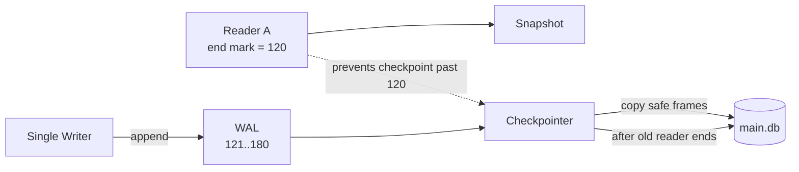
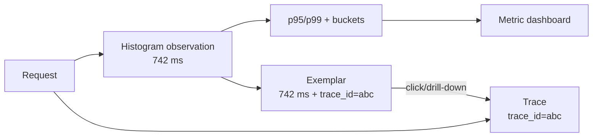

# 2026-09-18 13:00 — Interview Study Packages

README ve yakın `12-00.md` kontrol edildi. Merkle-tree anti-entropy ve agent sandbox/tool-guardrail konuları tekrar edilmedi. Repo aramasında SQLite WAL/checkpoint ve OpenTelemetry exemplar konuları için doğrudan yakın günlük eşleşme bulunmadı.

## Paket 1 — Junior → Staff Databases/Backend/Mobile: SQLite WAL, Checkpoint Starvation & Single-Writer Concurrency
**Süre:** 20–30 dk

### Konu anlatımı
SQLite WAL (write-ahead logging) modunda transaction değişiklikleri ana DB dosyasını yerinde güncellemek yerine WAL sonuna append edilir. Reader başladığında WAL içindeki son geçerli commit noktasını kendi **end mark**'ı olarak hatırlar; böylece writer yeni frame'ler eklerken mevcut reader kendi snapshot'ını okumaya devam edebilir. Bu yüzden WAL, rollback journal'a göre read/write concurrency'yi ciddi biçimde iyileştirir.

Ama WAL “çok writer paralel commit eder” demek değildir. SQLite'ın resmi WAL dokümanına göre tek WAL olduğundan aynı anda yalnız bir writer ilerler. Uzun write transaction bu yüzden diğer writer'ları kuyruklar. Checkpoint üçüncü aktördür: WAL frame'lerini ana DB'ye geri taşır. Aktif eski reader'ın end mark'ını geçemez; uzun reader checkpoint ilerlemesini sürekli engellerse WAL büyür ve **checkpoint starvation** oluşur.

2026 production notu: SQLite, 3 Mart 2026'da nadir bir WAL-reset corruption bug'ı buldu. Resmi dokümana göre bug 3.7.0–3.51.2 aralığını etkileyebilir ve 3.51.3 (13 Mart 2026) ile düzeltildi; 3.53.4 güncel release hattında fix'i içeriyor. Bu, embedded DB seçerken “tek dosya = sıfır operasyonel risk” varsayımının yanlış olduğuna iyi bir örnektir.

### Mental model

**Invariant:** reader kendi end mark'ından sonraki commit'leri görmez; writer append eder; checkpoint yalnız aktif reader snapshot'larını bozmayacak kadar ilerler.

### İçeride ne oluyor?
1. Reader snapshot/end mark seçer.
2. Writer WAL'a frame + commit record append eder.
3. Yeni reader daha yeni end mark görebilir; eski reader aynı snapshot'ta kalır.
4. Checkpoint güvenli frame'leri main DB'ye taşır.
5. Eski reader checkpoint horizon'ını tutarsa WAL büyür.
6. WAL reset/reuse yalnız güvenli noktada yapılır.

### Yüksek getirili mülakat soruları
1. WAL neden reader ile writer'ın eşzamanlı ilerlemesine izin verir?
2. Neden WAL modunda yine tek writer vardır?
3. Reader end mark neyi garanti eder?
4. Checkpoint starvation nasıl oluşur ve latency/disk kullanımını nasıl etkiler?
5. Uzun write transaction neden özellikle zararlıdır?
6. WAL neden network filesystem için uygun değildir?
7. Senior: `SQLITE_BUSY`, busy timeout ve transaction scope'u nasıl tasarlarsın?
8. Staff: SQLite'tan client/server DB'ye geçiş eşiğini hangi workload sinyalleriyle belirlersin?

### Seviyeye göre cevap derinliği
- **Junior:** WAL'ın append mantığını ve read/write concurrency avantajını açıklar.
- **Mid:** single-writer sınırı, checkpoint ve transaction süresini bağlar.
- **Senior:** starvation, busy handling, durability/fsync, backup ve crash recovery'yi tartışır.
- **Staff:** workload shape, write contention, operational simplicity, HA/remote access ve migration sınırlarını değerlendirir.

### Kısa alıştırma
İki reader ve iki writer için 8 adımlık timeline çiz. Reader A uzun sürsün; WAL 1000 page eşiğini geçsin. Hangi checkpoint'in nerede duracağını ve Writer B'nin ne zaman bekleyeceğini işaretle.

### Proje fikri
`sqlite-wal-lab`: 20 reader + 4 writer thread ile benchmark kur. Transaction süresi, WAL boyutu, checkpoint süresi, `SQLITE_BUSY` ve p95 write latency ölç. Bir reader'ı 30 saniye açık tutup starvation etkisini gözle.

### Failure modes / trade-off / production bağlantısı
Transaction içinde network I/O yapmak, uzun-lived read cursor, kontrolsüz WAL büyümesi, network filesystem üzerinde WAL, busy policy olmaması ve eski SQLite sürümü tipik risklerdir. Production'da WAL bytes/pages, checkpoint duration/result, write transaction duration, busy count, fsync latency, DB file growth ve sürüm/fix seviyesi izlenir.

### Kaynaklar
- SQLite — Write-Ahead Logging: https://www.sqlite.org/wal.html
- SQLite — Release 3.53.4 (24 Temmuz 2026): https://www.sqlite.org/releaselog/3_53_4.html
- SQLite — Recent News / WAL-reset fix chronology: https://sqlite.org/news.html
- SQLite — Transactions: https://www.sqlite.org/lang_transaction.html

---

## Paket 2 — Mid → Principal SRE/Observability: OpenTelemetry Exemplars, Trace–Metric Correlation & Cardinality Boundaries
**Süre:** 20–30 dk

### Konu anlatımı
Histogram sana “p99 yükseldi” der; trace ise belirli bir request'in neden yavaş olduğunu gösterebilir. Sorun, aggregate metric'ten hangi trace'e atlanacağını bulmaktır. **Exemplar**, aggregate metric içindeki seçilmiş gerçek measurement'ı trace/span context ile ilişkilendirir. OpenTelemetry Metrics Data Model'de exemplar Stable durumundadır ve `trace_id`, `span_id`, timestamp, value ve filtered attributes taşıyabilir.

Exemplar yeni bir time series değildir. Ölçüm zaten histogram bucket/count/sum içinde yer alır; exemplar yalnız o aggregate içinde tanısal bir örnek saklar. Bu ayrım cardinality için kritiktir: `user_id`, `request_id`, `trace_id` gibi yüksek-cardinality alanları metric label'a koymak yerine kontrollü exemplar/context ile drill-down yapmak daha güvenlidir.

OpenTelemetry Metrics SDK 1.61.0 hattında exemplar sampling için `AlwaysOn`, `AlwaysOff` ve `TraceBased` filter'larını tanımlar; TraceBased, sampled parent span bağlamındaki ölçümleri eligible yapar. Reservoir ise eligible ölçümlerden hangilerinin gerçekten tutulacağını seçer. Güncel .NET rehberi ayrıca önemli bir güvenlik nüansı vurgular: View ile metric attribute düşürmek, aynı attribute'un exemplar `filtered_attributes` içinde tutulmasını otomatik olarak engellemeyebilir. Redaction amacıyla yalnız View'a güvenmek PII sızıntısı yaratabilir.

### Mental model

**Invariant:** metric aggregate düşük-cardinality kalır; seçilmiş exemplar debugging için trace'e köprü olur.

### İçeride ne oluyor?
1. Instrument measurement kaydeder.
2. Aggregator metric point/bucket'ı günceller.
3. ExemplarFilter ölçümün eligible olup olmadığına karar verir.
4. Reservoir sınırlı sayıda örneği tutar.
5. Exporter metric point ile exemplar context'ini backend'e yollar.
6. Dashboard trace ID üzerinden trace backend'e drill-down sağlar.

### Yüksek getirili mülakat soruları
1. Exemplar ile metric label arasındaki temel fark nedir?
2. Neden `trace_id` histogram attribute'u yapılmamalıdır?
3. TraceBased exemplar sampling neyi çözer, neyi çözmez?
4. Tail sampling ile exemplar correlation arasında hangi ordering/sampling problemi çıkabilir?
5. View ile attribute drop etmek neden privacy redaction garantisi değildir?
6. Exemplars SLO alert triage akışını nasıl hızlandırır?
7. Staff: multi-tenant observability platformunda exemplar erişimini nasıl izole edersin?
8. Principal: telemetry cost, cardinality, retention ve debugging fidelity için hangi governance kurallarını koyarsın?

### Seviyeye göre cevap derinliği
- **Mid:** aggregate metric vs trace vs exemplar ayrımını doğru kurar.
- **Senior:** sampling, histogram, cardinality ve backend support trade-off'unu açıklar.
- **Staff:** cross-signal correlation, privacy, tenant isolation ve telemetry pipeline tasarlar.
- **Principal:** organization-wide instrumentation contract, cost budget ve sensitive-data governance kurar.

### Kısa alıştırma
`http.server.duration` histogramı için route/method/status düşük-cardinality boyutlarını seç. `request_id`, `user_id`, `trace_id` için label/exemplar/log kararını gerekçelendir. PII redaction sınırını ayrıca yaz.

### Proje fikri
`exemplar-latency-lab`: OpenTelemetry ile küçük API instrument et; latency histogram + traces üret, yavaş request'lere exemplar correlation kur. Sonra yanlışlıkla high-cardinality attribute ekleyip series sayısı ve telemetry maliyetini karşılaştır.

### Failure modes / trade-off / production bağlantısı
Her ölçümü exemplar yapmak, sampled trace bulunmadan trace ID saklamak, PII'yi filtered attributes'ta bırakmak, tenant boundary'siz drill-down, histogram bucket'larını kötü seçmek ve metric label'a request-level ID koymak tipik hatalardır. Production'da series cardinality, exemplar attach/export rate, trace lookup hit rate, sampling ratio, telemetry bytes/sec, dropped data ve sensitive-attribute audit'i izlenir.

### Kaynaklar
- OpenTelemetry — Metrics Data Model / Exemplars (Stable): https://opentelemetry.io/docs/specs/otel/metrics/data-model/
- OpenTelemetry Specification 1.61.0: https://opentelemetry.io/docs/specs/otel/
- OpenTelemetry — Metrics SDK / ExemplarFilter & Reservoir: https://opentelemetry.io/docs/specs/otel/metrics/sdk/
- OpenTelemetry .NET — Using exemplars (19 Mayıs 2026 güncellemesi): https://opentelemetry.io/docs/languages/dotnet/metrics/exemplars/
