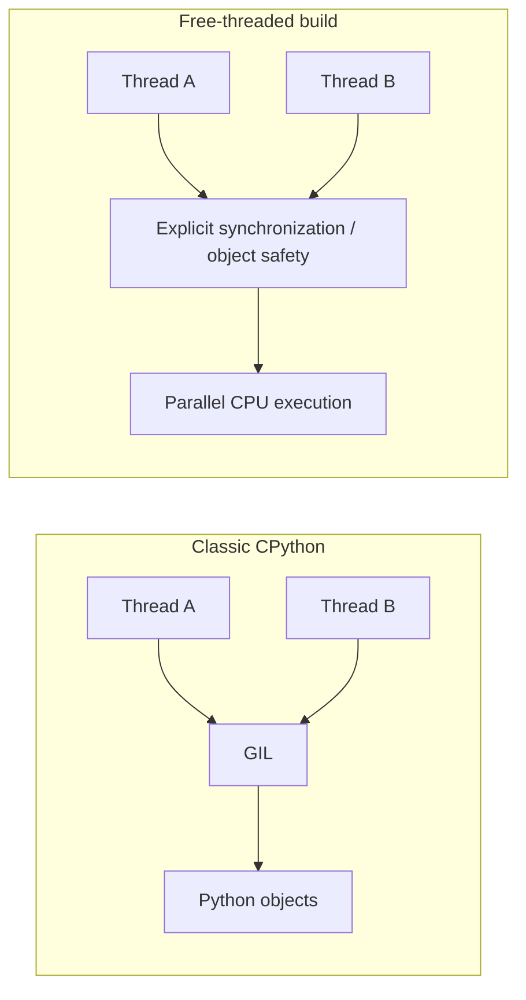
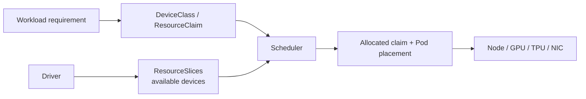

# 2026-09-18 14:00 — Interview Study Packages

README ve yakın `13-00.md` kontrol edildi. SQLite WAL/checkpoint ve OpenTelemetry exemplar konuları tekrar edilmedi. Repo aramasında free-threaded Python ve Kubernetes DRA için doğrudan eşleşme bulunmadı.

## Paket 1 — Mid → Principal Backend/Concurrency: Python 3.14 Free-Threading, GIL Boundaries & Extension Safety
**Süre:** 20–30 dk

### Konu anlatımı
CPython'ın klasik build'inde GIL, Python object/C API erişimini süreç çapında serialize eder; bu, thread-safe program garantisi değildir. Uygulama-level shared mutable state için yine lock/invariant gerekir. Free-threaded build (`--disable-gil`) GIL'i opsiyonel kaldırarak CPU-bound Python thread'lerinin birden fazla core üzerinde gerçekten paralel çalışabilmesini hedefler. Python 3.14 ile PEP 779 Phase II kapsamında free-threaded build deneysel olmaktan çıkıp resmi destekli fakat hâlâ opsiyonel hale geldi.

En önemli migration zihniyeti: “GIL yok → lock yok” değil, “runtime'ın örtük global serialization'ı yok → ownership ve synchronization sınırları görünür”. Third-party C extension free-threading desteğini bildirmezse import sırasında warning ile GIL yeniden etkinleştirilebilir. C extension'larda borrowed-reference, container mutation, allocator domain ve module initialization varsayımları yeniden incelenmelidir.

### Mental model

**Invariant:** paralellik arttıkça shared-state correctness hâlâ explicit synchronization/ownership ile korunmalıdır.

### İçeride ne oluyor?
- Build capability: `sysconfig.get_config_var("Py_GIL_DISABLED")`; runtime durumu `sys._is_gil_enabled()` ile gözlenebilir.
- C extension free-threading desteğini açıkça bildirmelidir; aksi halde GIL runtime'da yeniden açılabilir.
- Python object allocation için object domain kullanımı free-threaded build'de daha katı bir correctness gereksinimidir.
- Ayrı free-threaded wheel/binary (`t` suffix) gerekebilir; extension ecosystem compatibility rollout'un parçasıdır.
- Parallel speedup workload shape, contention, memory bandwidth ve extension davranışına bağlıdır; otomatik N-core speedup beklenmez.

### Yüksek getirili mülakat soruları
1. GIL thread safety ile neden aynı şey değildir?
2. CPU-bound ve I/O-bound workload için free-threading'in değeri nasıl değişir?
3. Bir extension neden GIL'i tekrar etkinleştirebilir?
4. Shared dict/list kullanımı hangi seviyede atomicity/invariant garantisi gerektirir?
5. Lock contention ve false sharing gibi bottleneck'ler GIL kalkınca neden daha görünür olur?
6. Senior: rollout'u benchmark + race test + extension inventory ile nasıl güvenli yaparsın?
7. Staff/Principal: process pool, subinterpreter ve free-threading arasında hangi workload/operasyon trade-off'larını tartışırsın?

### Seviyeye göre cevap derinliği
- **Mid:** concurrency vs parallelism, GIL ve explicit lock ayrımını kurar.
- **Senior:** race, contention, extension compatibility ve benchmark metodunu açıklar.
- **Staff:** runtime migration, dependency inventory, observability ve rollback stratejisi tasarlar.
- **Principal:** platform standardı, compatibility matrix ve performans/correctness bütçesini organizasyon çapında yönetir.

### Kısa alıştırma
CPU-bound bir `ThreadPoolExecutor` benchmark'ını classic ve free-threaded 3.14 altında 1/2/4/8 thread ile çalıştıracak deney tasarla. Throughput, CPU utilization, p95 task latency ve correctness checksum ölç; sonuçları Amdahl yasası ve lock contention ile yorumla.

### Proje fikri
`py-free-thread-audit`: dependency'leri tarayıp C extension içerenleri işaretleyen, classic/free-threaded smoke test çalıştıran ve benchmark/regression raporu üreten CI aracı.

### Failure modes / trade-off / production bağlantısı
GIL'in correctness sağladığını varsaymak, unsupported extension'ı fark etmemek, yalnız microbenchmark'a bakmak, lock granularity'yi kötü seçmek ve race detector/stress test eksikliği tipik risklerdir. Production'da throughput, CPU/core utilization, lock wait, RSS, crash rate, extension warning'leri ve classic build'e rollback metriği izlenir.

### Kaynaklar
- Python 3.14.7 release (5 Ağustos 2026): https://www.python.org/downloads/release/python-3147/
- PEP 779 — supported free-threaded Python: https://peps.python.org/pep-0779/
- Python 3.14 C API — thread states/GIL: https://docs.python.org/3.14/c-api/threads.html
- Python 3.14 — C API Extension Support for Free Threading: https://docs.python.org/3.14/howto/free-threading-extensions.html

---

## Paket 2 — Senior → CTO Cloud/MLOps/System Design: Kubernetes Dynamic Resource Allocation for GPUs & Specialized Devices
**Süre:** 20–30 dk

### Konu anlatımı
GPU/TPU/NIC gibi cihazları yalnız `vendor.com/gpu: 1` sayacı olarak görmek modern accelerator scheduling için yetersiz kalabilir: model, memory, topology, sharing ve admin policy gibi özellikler önemlidir. Kubernetes Dynamic Resource Allocation (DRA), storage'daki dynamic provisioning fikrine benzer biçimde cihaz talebini bir claim modeline taşır. Core DRA `resource.k8s.io/v1` API'leri Kubernetes 1.34'te GA oldu; `DeviceClass`, `ResourceClaim`, `ResourceClaimTemplate` ve `ResourceSlice` scheduler ile driver arasında structured device selection sağlar.

Kubernetes 1.37'de (3 Eylül 2026 duyurusu) DRA Extended Resource support GA oldu: geleneksel extended-resource talebi DRA driver tarafından karşılanabilir; böylece migration sırasında her workload'un doğrudan ResourceClaim yazması zorunlu olmayabilir. DRA'nın değeri yalnız API ergonomisi değil, pahalı accelerator kapasitesinde placement doğruluğu, utilization ve multi-tenant policy'dir.

### Mental model

**Invariant:** scheduler yalnız CPU/RAM node fit'i değil, claim'e uygun ve node'dan erişilebilir device allocation'ı ile placement'ı birlikte çözmelidir.

### İçeride ne oluyor?
- Driver mevcut cihazları `ResourceSlice` ile ilan eder.
- Cluster admin reusable `DeviceClass` tanımlar; RBAC ile admin/driver API yüzeyleri ayrılır.
- Workload claim/template üzerinden device özelliği ister.
- Scheduler claim allocation ile Pod placement'ı koordine eder.
- Prioritized alternatives Kubernetes 1.36'dan beri stable: tercih edilen cihaz yoksa kabul edilebilir fallback seçilebilir.
- 1.37 Extended Resource support, legacy request yüzeyi ile DRA-backed allocation arasında migration köprüsü sağlar.

### Yüksek getirili mülakat soruları
1. DRA klasik device plugin/extended resource modelinden hangi problemi daha iyi çözer?
2. `DeviceClass`, `ResourceClaim` ve `ResourceSlice` sorumlulukları nedir?
3. Device allocation ile node scheduling neden atomik/koordine düşünülmelidir?
4. GPU fragmentation ve topology-aware placement throughput'u nasıl etkiler?
5. Admin access neden privilege-escalation sınırı yaratır?
6. Staff: heterogeneous GPU fleet'te fallback/prioritized request politikasını nasıl tasarlarsın?
7. Principal/CTO: utilization, model latency SLO, accelerator maliyeti ve tenant fairness arasında hangi KPI'larla karar verirsin?

### Seviyeye göre cevap derinliği
- **Senior:** claim/class/slice ve scheduler-driver akışını açıklar.
- **Staff:** topology, sharing, fragmentation, RBAC ve rollout failure mode'larını tasarlar.
- **Principal:** multi-cluster accelerator platformu, quotas, capacity ve compatibility standardı kurar.
- **CTO:** accelerator utilization'ı inference/training unit economics, vendor strategy ve reliability ile bağlar.

### Kısa alıştırma
A100, H100 ve iki farklı NIC sınıfı olan 20-node cluster için iki DeviceClass ve bir prioritized workload talebi tasarla. H100 kapasitesi dolduğunda hangi fallback'in kabul edileceğini, latency/cost etkisini ve tenant quota politikasını yaz.

### Proje fikri
`dra-capacity-lab`: test cluster'da fake/example DRA driver ile ResourceSlice inventory, claim allocation ve scheduling telemetry dashboard'u kur. Device shortage, driver outage ve fallback senaryolarını fault-injection ile dene.

### Failure modes / trade-off / production bağlantısı
Stale ResourceSlice, driver/control-plane version skew, claim'in Pending kalması, yanlış RBAC/admin access, topology yüzünden stranded capacity, device fragmentation ve fallback'in SLO'yu bozması tipik risklerdir. Production'da claim pending age, allocation latency, device utilization, unschedulable reason, fragmentation/idle capacity, driver health ve cost per training/inference unit izlenir.

### Kaynaklar
- Kubernetes 1.37 DRA Updates (3 Eylül 2026): https://kubernetes.io/blog/2026/09/03/kubernetes-v1-37-dra-updates/
- Kubernetes — DRA API Objects: https://kubernetes.io/docs/concepts/resource-management/dynamic-resource-allocation/dra-api/
- Kubernetes 1.34 — DRA GA: https://kubernetes.io/blog/2025/09/01/kubernetes-v1-34-dra-updates/
- Kubernetes 1.36 release — DRA governance/selection features: https://kubernetes.io/blog/2026/04/22/kubernetes-v1-36-release/
- Kubernetes — DRA cluster-admin good practices: https://kubernetes.io/docs/concepts/cluster-administration/dra/
