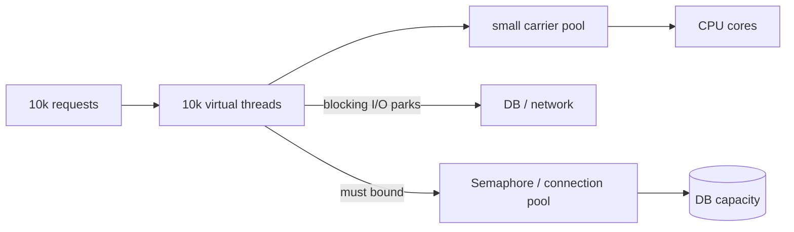
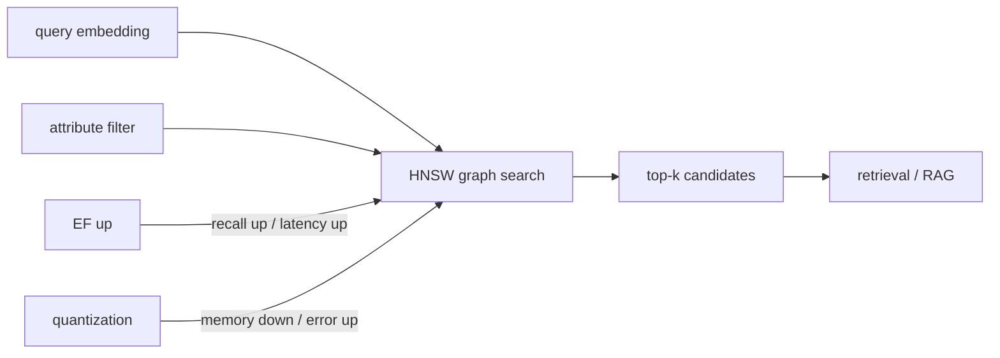

# 2026-09-18 15:00 — Interview Study Packages

README ve yakın `14-00.md` kontrol edildi. Python free-threading ve Kubernetes DRA tekrar edilmedi. Repo aramasında Java virtual threads ve Redis vector sets için doğrudan eşleşme bulunmadı.

## Paket 1 — Junior → Staff Backend/Concurrency: Java Virtual Threads, Backpressure & Resource Boundaries
**Süre:** 20–30 dk

### Konu anlatımı
Virtual thread, Java `Thread` API'sini koruyan fakat ömrü boyunca tek bir OS thread'ine bağlı olmayan hafif thread'dir. JDK scheduler çok sayıda virtual thread'i daha az sayıda carrier/platform thread üzerinde M:N olarak çalıştırır. JEP 444 ile JDK 21'de kalıcı özellik oldu. Ana kazanç CPU işini hızlandırmak değil, I/O bekleyen çok yüksek concurrency'de thread-per-request kodunu ölçekleyebilmektir.

En kritik mental model: **ucuz thread, ucuz downstream değildir**. 100 bin virtual thread yaratabilmek DB'nin 100 bin connection, partner API'nin 100 bin concurrent request veya heap'in sınırsız request state kaldıracağı anlamına gelmez. Thread pool'u concurrency limiter olarak kullanma alışkanlığı kaybolunca semaphore, connection pool, rate limiter ve bounded queue gibi gerçek resource boundary'leri explicit hale getirmek gerekir.

JEP 444'ün ilk pinning uyarılarının bir kısmı sonraki JDK'larda iyileşti; migration sırasında runtime/JDK sürümüne göre güncel davranış doğrulanmalı, native/foreign call ve diğer carrier-blocking sınırları profiling ile gözlenmelidir.

### Mental model

**Invariant:** virtual-thread concurrency, downstream kapasite limitlerini ortadan kaldırmaz; admission/backpressure ayrı tasarlanır.

### İçeride ne oluyor?
- Virtual thread CPU'da çalışırken bir carrier üzerinde mount edilir.
- Desteklenen blocking I/O'da park/unmount olup carrier'ı başka işe bırakabilir.
- CPU-bound işte core sayısından çok runnable thread throughput'u artırmaz.
- Virtual thread'ler task başına yaratılır; klasik worker pool mantığıyla pool'lanmaları önerilmez.
- ThreadLocal kullanımı mümkündür ama milyonlarca thread'de memory/lifecycle maliyeti düşünülmelidir.
- DB connection pool hâlâ fiziksel DB concurrency boundary'sidir.

### Yüksek getirili mülakat soruları
1. Virtual thread ile platform thread arasındaki fark nedir?
2. Neden virtual thread CPU-bound kodu otomatik hızlandırmaz?
3. Neden virtual thread pool kurmak genellikle yanlış mental modeldir?
4. 50 DB connection ve 50k virtual thread varsa backpressure nerede olmalıdır?
5. Blocking API kullanmak neden virtual thread dünyasında tekrar makul olabilir?
6. Senior: ThreadLocal ve request context maliyetini nasıl yönetirsin?
7. Staff: reactive stack'ten virtual-thread stack'e migration kararını latency, throughput, debugging ve ecosystem üzerinden nasıl verirsin?

### Seviyeye göre cevap derinliği
- **Junior:** thread, blocking I/O ve concurrency/parallelism ayrımını kurar.
- **Mid:** mount/park/carrier modelini ve I/O-bound faydayı açıklar.
- **Senior:** connection pool, semaphore, overload ve profiling sınırlarını tasarlar.
- **Staff:** framework/runtime migration, capacity model, observability ve rollback stratejisini yönetir.

### Kısa alıştırma
10 ms CPU + 90 ms DB beklemesi olan endpoint için Little's Law kullanarak 1k req/s hedefinde yaklaşık concurrency'yi hesapla. DB yalnız 80 concurrent query kaldırıyorsa virtual thread sayısından bağımsız hangi limiter'ı koyacağını ve overload davranışını yaz.

### Proje fikri
`loom-load-lab`: aynı HTTP fan-out servisini fixed platform-thread pool ve virtual-thread-per-request ile çalıştır. 1k/10k/50k concurrent client altında throughput, p95/p99, carrier utilization, heap ve DB pool wait ölç.

### Failure modes / trade-off / production bağlantısı
Virtual thread'i 'sonsuz kapasite' sanmak, DB/API admission control koymamak, CPU-bound workload'a uygulamak, devasa ThreadLocal state taşımak ve yalnız request latency ölçmek tipik hatalardır. Production'da active virtual threads, runnable/carrier saturation, DB pool wait, semaphore queue age, heap, GC, downstream error/429 ve p99 izlenir.

### Kaynaklar
- OpenJDK JEP 444 — Virtual Threads: https://openjdk.org/jeps/444
- Java 25 preview API — Structured Concurrency: https://docs.oracle.com/en/java/javase/25/docs/api/java.base/java/util/concurrent/StructuredTaskScope.html
- OpenJDK JEP 491 — Synchronize Virtual Threads without Pinning: https://openjdk.org/jeps/491

---

## Paket 2 — Mid → Principal ML/AI/LLM/Data Engineering: Redis Vector Sets, HNSW Recall & Retrieval Economics
**Süre:** 20–30 dk

### Konu anlatımı
Redis Vector Set, her member'ı yüksek boyutlu bir vector ile eşleyen native veri tipidir. `VADD` ile embedding eklenir, `VSIM` ile yakın komşular aranır. HNSW tabanlı approximate nearest-neighbor yaklaşımı latency/memory karşılığında recall trade-off'u verir. Redis 8.0'da beta olarak gelen yapı güncel Redis 8.x dokümantasyonunda `VADD`, `VSIM`, attributes/filtering, quantization ve sharding yüzeyleriyle belgeleniyor.

ANN mülakatında asıl soru 'vector DB nedir?' değil, **quality budget**'tır: exact top-k ground truth'a göre recall@k kaç, p99 latency kaç, memory/vector ne, update/delete davranışı nasıl ve filter selectivity sonucu nasıl değiştiriyor? Redis docs `EF` arttıkça recall'ın yükselip query'nin yavaşladığını; Q8'in FP32'ye göre yaklaşık 4x, binary quantization'ın yaklaşık 32x daha küçük temsil sunduğunu fakat accuracy trade-off'u getirdiğini belirtir.

Sharding write throughput'u ölçekleyebilir; global nearest-neighbor read ise shard'ların paralel sorgulanıp sonuçlarının merge edilmesini gerektirir. Böylece tail latency en yavaş shard'a ve partial-result politikasına bağlanır.

### Mental model

**Invariant:** ANN correctness exact equality değil; ölçülmüş recall/latency/cost SLO'sudur.

### İçeride ne oluyor?
- HNSW navigable graph üzerinden candidate neighborhood arar; exhaustive scan yapmaz.
- `EF` search breadth'i büyütür: daha iyi recall, daha fazla CPU/latency.
- Q8/BIN quantization memory bandwidth ve footprint'i düşürür; distance approximation error ekler.
- Attribute filtering candidate uzayını değiştirir; missing/type mismatch beklenmedik exclusion yaratabilir.
- Çok shard'da her shard top-k döndürür; coordinator/client global merge yapar.
- Exact/`TRUTH` benzeri doğrulama yolu offline recall regression testinde kullanılır, hot path'te değil.

### Yüksek getirili mülakat soruları
1. HNSW neden exact kNN'den hızlıdır ve neyi feda eder?
2. `EF` yükselince ne olur?
3. Quantization memory, latency ve recall'ı nasıl etkiler?
4. Filtered ANN neden yalnız 'WHERE + vector sort' kadar basit değildir?
5. Sharding global top-k doğruluğunu ve p99'u nasıl etkiler?
6. Senior: embedding model değişiminde dual-index/rebuild migration'ı nasıl yaparsın?
7. Principal: RAG quality, vector infra cost ve latency SLO arasında hangi offline/online KPI'larla karar verirsin?

### Seviyeye göre cevap derinliği
- **Mid:** embedding, cosine similarity ve approximate-vs-exact ayrımını açıklar.
- **Senior:** EF, quantization, filter ve recall benchmark tasarlar.
- **Staff:** sharding, replication, rebuild/migration ve failure isolation tasarlar.
- **Principal:** retrieval quality budget'ını product metric, inference cost ve capacity planıyla bağlar.

### Kısa alıştırma
100k embedding için exact top-10 ground truth çıkar. Q8 ve BIN ile EF=100/200/500 deneyleri tasarla; recall@10, p95/p99, RSS ve query CPU ölç. Hangi kombinasyonu production'a alacağını SLO ile savun.

### Proje fikri
`vector-recall-lab`: Redis Vector Set'e aynı corpus'u farklı quantization/EF ayarlarıyla yükleyip exact baseline'a karşı recall-latency-memory frontier grafiği üreten benchmark harness.

### Failure modes / trade-off / production bağlantısı
Recall ölçmeden yalnız latency optimize etmek, embedding dimension/model version drift, stale vectors, filter type mismatch, shard hotspot, delete/rebuild latency spike ve quantization error tipik risklerdir. Redis 8.10.1 Ağustos 2026 release notes Vector Sets dahil güvenlik düzeltmeleri içerdiğinden production sürüm patch seviyesi de correctness/security yüzeyidir. Production'da recall sample, p99, query CPU, RSS/vector, index size, insert/delete latency, shard skew, partial-result rate ve embedding-version coverage izlenir.

### Kaynaklar
- Redis — Vector Sets: https://redis.io/docs/latest/develop/data-types/vector-sets/
- Redis — Vector Set Performance: https://redis.io/docs/latest/develop/data-types/vector-sets/performance/
- Redis — Vector Set Scalability: https://redis.io/docs/latest/develop/data-types/vector-sets/scalability/
- Redis — Filtered Search: https://redis.io/docs/latest/develop/data-types/vector-sets/filtered-search/
- Redis Open Source 8.10 release notes: https://redis.io/docs/latest/operate/oss_and_stack/stack-with-enterprise/release-notes/redisce/redisos-8.10-release-notes/
