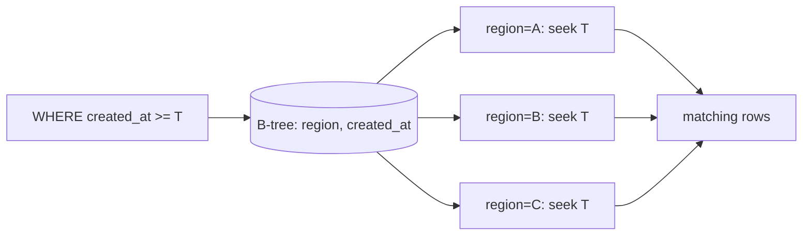
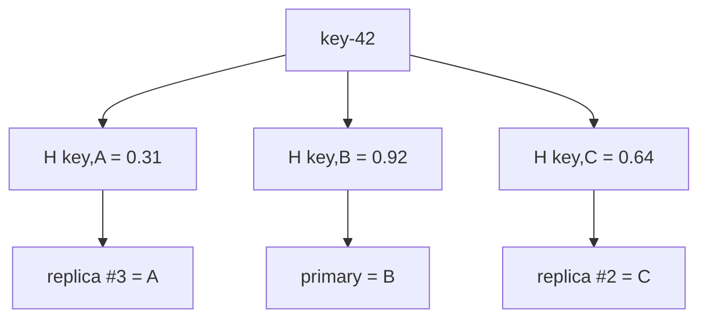

# 2026-09-18 16:00 — Interview Study Packages

README ve yakın `15-00.md` kontrol edildi. Java virtual threads ve Redis Vector Sets tekrar edilmedi. Bu tur databases/query planning ile distributed systems/algorithms eksenine döndü.

## Paket 1 — Mid → Staff Databases/Backend: PostgreSQL 18 B-tree Skip Scan & Composite Index Economics
**Süre:** 20–30 dk

### Konu anlatımı
Composite B-tree için klasik kural “leftmost prefix önemlidir” ama bu, sonraki kolonların hiçbir zaman kullanılamayacağı anlamına gelmez. PostgreSQL 18, **skip scan** optimizasyonunu ekledi: erken index kolonunda equality predicate yokken, daha sonraki kolonda yararlı bir koşul varsa planner bazı veri dağılımlarında index içinde tekrar tekrar konumlanarak gereksiz aralıkları atlayabilir.

Örnek: `INDEX (region, created_at)` ve `WHERE created_at >= now() - interval '1 day'`. Eski mental model “region yoksa index işe yaramaz” diye aşırı keskindir. PostgreSQL 18 planner'ı `region` için olası değer grupları arasında yeniden search başlatmayı, tüm index/table taramasından ucuz görürse skip scan seçebilir. Resmi multicolumn-index dokümanı bunun özellikle eksik prefix kolonunun distinct değer sayısı düşükken faydalı olabileceğini açıklar.

Bu özellik index tasarımını sihirli biçimde çözmez. Eğer leading kolon çok yüksek cardinality'ye sahipse yüz binlerce yeniden konumlanma pahalı olabilir; planner sequential scan veya başka planı seçebilir. Correctness değişmez, yalnız access path değişir. Production kararı `EXPLAIN (ANALYZE, BUFFERS)` ve gerçek workload dağılımıyla verilmelidir.

### Mental model

**Invariant:** skip scan, eksik prefix değerlerini tek tek “tahmin ederek” index'in yararlı suffix koşullarına yeniden konumlanır; kârlılık cardinality/selectivity/cost modeline bağlıdır.

### İçeride ne oluyor?
- B-tree ordering lexicographic'tir: önce leading kolon, sonra sonraki kolon.
- Equality koşulu olan leading kolonlar index aralığını doğrudan daraltır.
- Prefix equality eksikse skip scan farklı prefix grupları için dinamik yeniden arama yapabilir.
- Planner bunu ancak beklenen yeniden arama sayısı ve heap/index I/O alternatiften ucuzsa seçer.
- PostgreSQL 18 `EXPLAIN ANALYZE` index scan başına index lookup sayısını da görünür kılar; bu, skip-scan davranışını production incelemesinde daha ölçülebilir yapar.
- Statistics stale ise distinct/selectivity tahmini kötüleşip yanlış plan seçilebilir.

### Yüksek getirili mülakat soruları
1. Composite B-tree'de kolon sırası neden önemlidir?
2. “Leftmost prefix” kuralı neden mutlak bir “suffix kullanılamaz” kuralı değildir?
3. Skip scan hangi veri dağılımında faydalıdır?
4. Leading kolon yüksek cardinality ise neden sequential scan kazanabilir?
5. `(tenant_id, created_at)` ile `(created_at, tenant_id)` arasında nasıl karar verirsin?
6. Senior: stale statistics skip-scan kararını nasıl bozabilir?
7. Staff: bir index'i tek query için değil workload portföyü, write amplification ve storage budget ile nasıl değerlendirirsin?

### Seviyeye göre cevap derinliği
- **Mid:** B-tree ordering, selectivity ve composite-index kolon sırasını açıklar.
- **Senior:** planner cost, statistics, heap fetch, covering/index-only scan ve write maliyetini bağlar.
- **Staff:** workload-level index portfolio, regression benchmark, rollout/rollback ve observability tasarlar.

### Kısa alıştırma
10M satırlı `events(region, tenant_id, created_at, payload)` tablosunda `region` 6 değer, `tenant_id` 100k değer olsun. `(region, created_at)` index'i için yalnız son 10 dakikayı sorgulayan query'nin skip scan ile neden makul olabileceğini açıkla. Sonra `region` 500k distinct olsaydı beklentinin nasıl değişeceğini yaz ve `EXPLAIN (ANALYZE, BUFFERS)` ile hangi metrikleri karşılaştıracağını belirt.

### Proje fikri
`pg-skip-scan-lab`: PostgreSQL 18 üzerinde leading-column cardinality'yi 5/100/100k olarak değiştir. Aynı suffix-range query için plan, index lookups, shared buffers, execution time ve table/index size ölç; `ANALYZE` öncesi/sonrası plan değişimini kaydet.

### Failure modes / trade-off / production bağlantısı
Skip scan var diye kötü kolon sırasını normalize etmek, yalnız synthetic benchmark kullanmak, stale statistics, gereksiz duplicate index, write-heavy tabloda index sayısını büyütmek ve plan değişimini major upgrade sonrası izlememek tipik hatalardır. Production'da query p95/p99, plan hash/change, index lookup count, shared/local buffer reads, rows removed/filter, index hit/read, write amplification ve index bloat izlenir.

### Kaynaklar
- PostgreSQL 18 — Multicolumn Indexes: https://www.postgresql.org/docs/18/indexes-multicolumn.html
- PostgreSQL 18 release notes — skip scan: https://www.postgresql.org/docs/18/release-18.html
- PostgreSQL 18 Released — query/performance enhancements: https://www.postgresql.org/about/news/postgresql-18-released-3142/
- PostgreSQL 18.6 release notes — 13 Ağustos 2026 güncel maintenance hattı: https://www.postgresql.org/docs/release/18.6/

---

## Paket 2 — Junior → Principal Distributed Systems/Algorithms: Rendezvous (HRW) Hashing, Minimal Churn & Replica Placement
**Süre:** 20–30 dk

### Konu anlatımı
Dağıtık cache, shard router veya edge seçiminde aynı membership listesini gören client'ların merkezi koordinasyon olmadan aynı key için aynı node'u seçmesi gerekir. **Rendezvous hashing / Highest Random Weight (HRW)** basit bir çözüm sunar: her `(key, node)` çifti için deterministik score hesapla ve en yüksek score'lu node'u seç.

`owner(key) = argmax_node H(key, node)`.

Güçlü özellik membership değişimindeki **minimal churn**'dür. Bir node çıkarıldığında, o node zaten winner olmayan key'lerin surviving-node score sıralaması değişmez; yalnız çıkarılan node'un kazandığı key'ler yeni owner seçer. Node eklenince de yalnız yeni node'un eski winner'dan daha yüksek score aldığı key'ler taşınır. Top-k score sıralaması doğal replica listesi de üretir.

Ring-based consistent hashing lookup açısından verimli olabilir ve vnode'larla denge sağlar. Basit HRW ise node başına score hesapladığı için O(N) lookup maliyetine sahiptir; buna karşılık ring/vnode state'i gerekmez ve top-k replica placement sezgiseldir. Weighted HRW heterojen kapasiteyi modelleyebilir fakat ağırlık formülü dikkatle seçilmelidir; `score * weight` gibi naif yöntemler beklenen dağılımı bozabilir.

### Mental model

**Invariant:** membership aynıysa bütün client'lar aynı ranking'i üretir; bir node kaybolduğunda surviving node'ların kendi aralarındaki ranking'i değişmez.

### İçeride ne oluyor?
- Node kimliği stable ve canonical olmalıdır; hostname/ID drift placement'ı değiştirir.
- Hash function deterministic ve yeterince uniform olmalıdır.
- Primary için max score; replica set için score'a göre top-k seçilir.
- Node removal yalnız o node'un ranking'de gerekli olduğu key'leri etkiler.
- Basit implementation key başına tüm N node'u score eder: O(N).
- Membership version skew varsa iki client farklı owner seçebilir; hashing algoritması membership consistency problemini çözmez.
- Capacity-aware placement için weighted HRW veya ayrı bounded-load mekanizması gerekir.

### Yüksek getirili mülakat soruları
1. Rendezvous hashing nasıl çalışır?
2. Node çıkarılınca neden yalnız sınırlı key remap olur?
3. HRW ile ring-based consistent hashing'in temel trade-off'u nedir?
4. Replica set'i HRW ile nasıl seçersin?
5. Membership listeleri farklıysa ne olur?
6. Senior: heterogeneous node capacity'yi nasıl modelliyorsun?
7. Staff/Principal: placement stability, failure domains, bounded load ve membership propagation arasında hangi invariant'ları kurarsın?

### Seviyeye göre cevap derinliği
- **Junior:** deterministic hashing ve `argmax` seçimini anlatır.
- **Mid:** minimal churn ve top-k replica placement'ı açıklar.
- **Senior:** O(N) lookup, weights, membership skew ve hotspot riskini tartışır.
- **Staff/Principal:** zone/rack constraints, bounded load, control-plane versioning ve large-cluster optimization tasarlar.

### Kısa alıştırma
A/B/C/D dört node ve 10k synthetic key üret. HRW ile dağılımı ölç; C'yi çıkar ve kaç key'in owner değiştirdiğini say. Sonra E'yi ekle. Değişen key'lerin yalnız membership değişiminden doğrudan etkilenen winner set'i olduğunu test eden invariant yaz.

### Proje fikri
`hrw-placement-lab`: HRW ve vnode-ring'i aynı key corpus'unda karşılaştır. Node add/remove sırasında remap ratio, max/avg load, lookup CPU, metadata size ve top-3 replica diversity ölç. Zone-aware placement constraint ekle.

### Failure modes / trade-off / production bağlantısı
Process-randomized hash kullanmak, unstable node ID, farklı membership snapshot'ları, naif weighted score, failure-domain'i hesaba katmadan top-k replica seçmek ve hot-key problemini placement problemi sanmak tipik hatalardır. Production'da membership version skew, remap ratio, max/avg load, owner disagreement, lookup CPU, replica-zone diversity ve node saturation izlenir.

### Kaynaklar
- Thaler & Ravishankar — A Name-Based Mapping Scheme for Rendezvous (1996): https://www.eecs.umich.edu/techreports/cse/96/CSE-TR-316-96.pdf
- UC eScholarship mirror — Rendezvous hashing paper: https://escholarship.org/uc/item/3ks7q6mx
- 2025 research direction — Local Rendezvous Hashing: https://arxiv.org/abs/2512.23434
