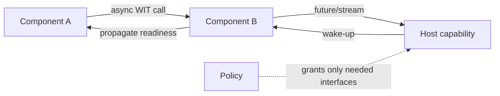

# 2026-09-18 17:00 — Interview Study Packages

README ve yakın `16-00.md` kontrol edildi. PostgreSQL skip scan ve Rendezvous/HRW hashing tekrar edilmedi. Bu tur cloud/backend runtime ile algorithms/data-engineering eksenine döndü.

## Paket 1 — Mid → Principal Cloud/Backend: WASI 0.3 Native Async, Component Boundaries & Capability Security
**Süre:** 20–30 dk

### Konu anlatımı
WebAssembly Component Model, farklı dillerde üretilmiş bileşenlerin WIT ile tanımlanmış typed interface'ler üzerinden konuşmasını ve Canonical ABI ile veri alışverişini standartlaştırır. WASI 0.3.0, 11 Haziran 2026'da yayımlandı ve `async func`, `stream<T>`, `future<T>` primitive'lerini Component Model Canonical ABI'ye taşıdı. 0.2'de `wasi:io` içindeki pollable/stream modeli component zincirlerinde wake-up propagation açısından zayıftı; 0.3 native async ile readiness component sınırından composable biçimde geçebilir.

WASI 0.3.1, 11 Ağustos 2026'da `map<K,V>` ile `implements`/`external-id` annotation'larını ekledi. Wasmtime 46+ 0.3'ü varsayılan destekler. Fakat runtime support ile language toolchain maturity aynı şey değildir; migration kararı WIT version pinning, bindings, adapter/polyfill ve dependency desteğiyle verilmelidir.

Security mental modeli POSIX process = ambient authority yerine **typed interface + explicit host capability** olmalıdır. Wasmtime varsayılan olarak component'e filesystem/environment gibi kaynakları vermez; host yalnız gereken capability'leri açabilir. Bu, plugin/multi-tenant extension platformlarında blast radius'u küçültür ama business-level authorization'ı otomatik çözmez.

### Mental model

**Invariant:** component yalnız host'un bağladığı interface/capability yüzeyinden effect üretir; native async readiness component zincirinde kaybolmadan taşınabilir.

### İçeride ne oluyor?
- WIT language-neutral interface contract'tır.
- Canonical ABI dil-spesifik memory/layout farklarını sınırda lower/lift eder.
- `async func`, `future<T>` ve `stream<T>` asynchronous composition'ı ABI seviyesine taşır.
- WASI 0.3, 0.2'nin üzerine evrilir; host iki sürümü yan yana destekleyebilir veya 0.2'yi 0.3 üstünde polyfill edebilir.
- Capability grant runtime/host policy'sidir; component code'un niyetine güvenmek yerine effect yüzeyi sınırlandırılır.
- Toolchain/WIT version mismatch instantiation/type hataları üretebilir; version pinning release artifact'ının parçası olmalıdır.

### Yüksek getirili mülakat soruları
1. Core Wasm module ile Component Model component arasındaki fark nedir?
2. WIT ve Canonical ABI hangi problemleri çözer?
3. WASI 0.3 native async neden 0.2 pollable modelinden daha composable?
4. `future<T>` ile `stream<T>` kullanım farkı nedir?
5. Capability-based host binding ambient authority'yi nasıl azaltır?
6. Senior: 0.2 → 0.3 migration'ında hangi compatibility ve observability risklerini izlersin?
7. Staff/Principal: untrusted plugin platformunda component boundary, tenant isolation, resource quota ve rollout stratejisini nasıl tasarlarsın?

### Seviyeye göre cevap derinliği
- **Mid:** module/component, WIT ve host capability kavramlarını ayırır.
- **Senior:** async composition, adapters, version pinning, cancellation/backpressure ve runtime limits'i tartışır.
- **Staff:** multi-language plugin platformu, policy boundary ve compatibility rollout tasarlar.
- **Principal:** runtime standardization, supply-chain trust, tenant blast radius ve platform economics'i birlikte değerlendirir.

### Kısa alıştırma
HTTP request alan A component'inin B component'inden streaming veri okuyup host object store'a yazdığı bir WIT sınırı çiz. Her interface için hangi capability'nin gerektiğini, cancellation/backpressure'ın nerede aktığını ve tenant ID'nin hangi katmanda authorize edileceğini belirt.

### Proje fikri
`wasi-p3-plugin-lab`: iki farklı dilde component, WIT interface, async stream ve Wasmtime host. Host yalnız belirli directory/network capability'si versin; denied capability testleri, cancellation ve slow-consumer backpressure ölçümü ekle.

### Failure modes / trade-off / production bağlantısı
Runtime sandbox'ı business authorization sanmak, broad filesystem/network grant, WIT/toolchain version drift, unbounded stream buffering, cancellation propagation eksikliği ve component başına CPU/memory/fuel limiti koymamak tipik hatalardır. Production'da component instantiation latency, trap/error rate, capability-denial count, memory/CPU/fuel, stream backlog, cancellation latency ve WIT/runtime version dağılımı izlenir.

### Kaynaklar
- WASI 0.3 — 11 Haziran 2026 ve 0.3.1 — 11 Ağustos 2026: https://wasi.dev/releases/wasi-p3
- WASI releases/current status: https://wasi.dev/releases
- Component Model — Native Async: https://component-model.bytecodealliance.org/design/async.html
- Component Model — Canonical ABI: https://component-model.bytecodealliance.org/advanced/canonical-abi.html
- Wasmtime Component Model: https://component-model.bytecodealliance.org/running-components/wasmtime.html

---

## Paket 2 — Junior → Staff Algorithms/Data Engineering: Count-Min Sketch, Heavy Hitters & Error Budgets
**Süre:** 20–30 dk

### Konu anlatımı
Exact frequency table her distinct key için state tutar. Cardinality milyonlar/milyarlar olduğunda memory pahalılaşır. **Count-Min Sketch (CMS)** fixed-size yaklaşık frequency structure'dır: `d` bağımsız hash function ve her biri `w` counter içeren tablo tutar. Update'te key her row'daki bir counter'ı artırır; query'de bu counter'ların minimumu alınır.

Yalnız increment içeren klasik modelde collision'lar count'u ancak yukarı iter; bu yüzden estimate gerçek frequency'den küçük olmaz. Width hata büyüklüğünü, depth hata olasılığını kontrol eder. Standart parametre sezgisi `w = ceil(e/ε)`, `d = ceil(ln(1/δ))`: olasılık en az `1-δ` iken additive overestimate yaklaşık `ε * ||a||₁` sınırındadır.

CMS tek başına heavy-hitter kimliklerini enumerate etmez; yalnız verilen key'in yaklaşık count'unu sorgular. Top-k için candidate set gerekir: heap, Space-Saving benzeri algoritma veya ayrı candidate discovery katmanı. Distributed merge için aynı dimensions/hash seeds kullanan sketch'lerin counter'ları element-wise toplanabilir; fakat epoch/config mismatch sonuçları anlamsızlaştırır.

### Mental model
```mermaid
flowchart TD
  K[key=x] --> H1[h1(x)]
  K --> H2[h2(x)]
  K --> H3[h3(x)]
  H1 --> C1[row1 counter += 1]
  H2 --> C2[row2 counter += 1]
  H3 --> C3[row3 counter += 1]
  C1 --> M[min]
  C2 --> M
  C3 --> M
  M --> E[estimated frequency]
```
**Invariant:** insert-only CMS'de collision yalnız pozitif bias üretir; minimum, farklı row'lardaki collision gürültüsünün en küçüğünü seçer.

### İçeride ne oluyor?
- Memory `O(w*d)`, update/query `O(d)`.
- Daha geniş `w` daha az collision; daha derin `d` kötü collision ihtimalini azaltır.
- Hash seeds/config sketch identity'nin parçasıdır.
- Saturating counter veya counter overflow production correctness konusudur.
- Merge yalnız aynı shape/hash semantics ve uyumlu epoch için güvenlidir.
- Top-k discovery için CMS yanında candidate structure gerekir.

### Yüksek getirili mülakat soruları
1. CMS neden exact hash map'ten daha az memory kullanır?
2. Neden query'de sum/average değil minimum alınır?
3. Insert-only modelde neden underestimate beklemeyiz?
4. Width ve depth hangi hata boyutlarını kontrol eder?
5. CMS tek başına top-k key'leri neden bulamaz?
6. Senior: distributed sketches nasıl merge edilir ve hangi metadata zorunludur?
7. Staff: heavy-hitter detection için CMS, Space-Saving ve exact aggregation arasında nasıl seçim yaparsın?

### Seviyeye göre cevap derinliği
- **Junior:** hash collision, fixed memory ve min-query'yi açıklar.
- **Mid:** ε/δ error budget ile dimensions seçer.
- **Senior:** mergeability, counter overflow, hash quality ve candidate discovery'yi tartışır.
- **Staff:** accuracy-memory-CPU-network bütçesini workload/SLO ile bağlar ve exact validation path tasarlar.

### Kısa alıştırma
`ε=0.001`, `δ=10^-6` için yaklaşık `w` ve `d` hesapla. Saniyede 2M event gelen stream'de sketch memory'sini 64-bit counter varsayımıyla tahmin et. Sonra 100 shard'ın sketch'lerini merge etmek için gerekli config/epoch metadata'sını yaz.

### Proje fikri
`cms-heavy-hitter-lab`: Zipf dağılımlı 10M event üret. Exact map ile CMS tahminlerini karşılaştır; ε/δ değiştikçe memory, update throughput, p99 relative/additive error ve top-k candidate precision/recall ölç.

### Failure modes / trade-off / production bağlantısı
CMS estimate'ini exact sanmak, top-k enumeration beklemek, farklı seed/dimension sketch'lerini merge etmek, epoch karıştırmak, counter overflow, adversarial hash distribution ve deletion gereken workload'da klasik insert-only invariant'ı kullanmak tipik hatalardır. Production'da sketch config/version, total mass, saturation, merge reject count, sampled exact-error, candidate recall ve bytes/event izlenir.

### Kaynaklar
- Cormode & Muthukrishnan — An Improved Data Stream Summary: The Count-Min Sketch and its Applications: https://dimacs.rutgers.edu/~graham/pubs/papers/cm-full.pdf
- Original Count-Min Sketch project/reference: https://sites.google.com/site/countminsketch/
