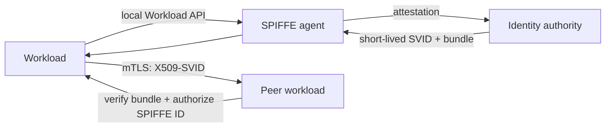
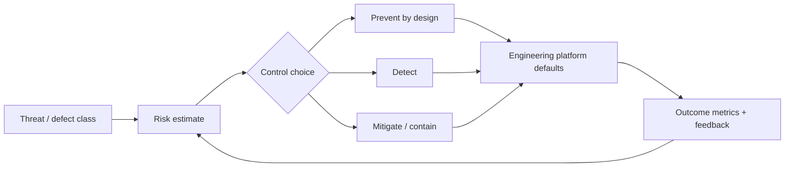

# 2026-09-18 19:00 — Interview Study Packages

README ve yakın `17-00.md` kontrol edildi. WASI 0.3 ve Count-Min Sketch tekrar edilmedi. Bu tur cybersecurity/networking ile leadership/product/security-governance eksenine döndü.

## Paket 1 — Junior → Staff Cybersecurity/Networking: SPIFFE Workload Identity, SVID Rotation & Trust Domains
**Süre:** 20–30 dk

### Konu anlatımı
Dağıtık sistemlerde servislerin birbirini yalnız IP, hostname veya uzun ömürlü API secret ile tanıması kırılgandır. SPIFFE, workload identity'yi `spiffe://trust-domain/path` biçimindeki URI kimliğiyle tanımlar. Kimlik kanıtı SVID'dir; X.509-SVID mTLS için, JWT-SVID token tabanlı entegrasyonlar için kullanılabilir. Workload API yerel endpoint üzerinden workload'a kimliğini, private key/certificate ve trust bundle'ı verir; uygulamanın bootstrap secret taşıması gerekmez.

Trust domain bir identity/PKI güven kökünü temsil eder. Farklı security posture veya environment'ları ayrı trust domain'lere bölmek blast radius'u azaltır. Federation iki domain'in birbirinin bundle'ını güvenli biçimde tanımasını sağlar; federation otomatik authorization değildir. Authentication `kim bu?`, authorization `bu kimlik bu kaynağa erişebilir mi?` sorusudur.

X.509-SVID kısa ömürlü ve rotate edilebilir. Workload API stream'i yeni SVID/bundle geldikçe client'a güncelleme sağlayabilir; production tasarımı rotation sırasında yeni connection'ları güncel cert ile kurmalı, mevcut connection lifecycle'ını kontrollü yönetmelidir. JWT-SVID bearer token olduğundan replay riski daha yüksektir; audience doğrulaması zorunlu sınırdır.

### Mental model

**Invariant:** private bootstrap secret workload image'ına gömülmez; runtime attestation kimliği bağlar, SVID kimliği kanıtlar, policy ise ayrı authorization kararı verir.

### İçeride ne oluyor?
- SPIFFE ID URI tabanlı workload kimliğidir; trust domain authority sınırıdır.
- Workload Endpoint doğrudan client authentication istemez; implementasyon caller authenticity'yi kernel/orchestrator gibi out-of-band sinyallerle belirler.
- X.509-SVID kısa ömürlü certificate + private key ile mTLS kurabilir.
- JWT-SVID `audience` taşır ve bearer-token replay riskine sahiptir.
- Trust bundle peer certificate chain'ini doğrular; federation başka domain'lerin bundle'larını paylaşır.
- Identity issuance ile application authorization birbirinden ayrılmalıdır.

### Yüksek getirili mülakat soruları
1. Service account/API key ile workload identity arasındaki fark nedir?
2. SPIFFE ID, SVID ve trust bundle hangi rolleri oynar?
3. Workload API neden bootstrap token istemeden güvenli olabilir?
4. X.509-SVID ile JWT-SVID trade-off'u nedir?
5. Trust-domain federation neden authorization anlamına gelmez?
6. Senior: cert rotation sırasında connection pool ve long-lived stream'leri nasıl yönetirsin?
7. Staff: multi-region/multi-cluster trust-domain sınırını, federation'ı ve revocation/incident stratejisini nasıl tasarlarsın?

### Seviyeye göre cevap derinliği
- **Junior:** identity, certificate ve mTLS kavramlarını ayırır.
- **Mid:** Workload API, SVID rotation, audience ve trust bundle'ı açıklar.
- **Senior:** attestation, rotation race, JWT replay, federation ve policy enforcement'ı tartışır.
- **Staff:** trust-domain topology, migration, incident blast radius, observability ve platform ownership tasarlar.

### Kısa alıştırma
`frontend -> orders -> payments` zinciri için üç SPIFFE ID tanımla. Yalnız `orders` workload'unun `payments/charge` çağrısına izin veren authorization policy yaz; X.509-SVID 30 dakika ömürlü olsun. Rotation, expired cert ve compromised node senaryolarını çiz.

### Proje fikri
`spiffe-mtls-lab`: iki servis + SPIRE agent/server ile short-lived X.509-SVID mTLS. Cert rotation sırasında kesintisiz request testi, unauthorized SPIFFE ID deny testi ve federation simülasyonu ekle.

### Failure modes / trade-off / production bağlantısı
SPIFFE'yi authorization sanmak, çok geniş tek trust domain, stale bundle, JWT audience doğrulamamak, rotation'ı restart'a bağlamak, identity telemetry'si tutmamak ve node compromise blast radius'unu düşünmemek tipik hatalardır. Production'da SVID expiry horizon, rotation error/latency, workload-attestation failure, denied identity, bundle age, mTLS handshake failure ve identity-policy mismatch izlenir.

### Kaynaklar
- SPIFFE Concepts: https://spiffe.io/docs/latest/spiffe/concepts/
- SPIFFE Workload API specification: https://spiffe.io/docs/latest/spiffe-specs/spiffe_workload_api/
- SPIFFE Workload Endpoint specification: https://spiffe.io/docs/latest/spiffe-specs/spiffe_workload_endpoint/
- Working with SVIDs: https://spiffe.io/docs/latest/deploying/svids/

---

## Paket 2 — Senior → CTO Leadership/Product/Cybersecurity: Secure-by-Design Governance, SSDF & Security Economics
**Süre:** 20–30 dk

### Konu anlatımı
Security programını yalnız vulnerability scanner veya son-gate pentest olarak görmek geç kalmış bir kontroldür. NIST SSDF güvenli geliştirme pratiklerini SDLC içine entegre edilen ortak bir çerçeve olarak ele alır: organizasyonu hazırlamak, yazılımı korumak, iyi güvenli yazılım üretmek ve vulnerability'lere yanıt vermek. NIST, SSDF 1.2 initial public draft'ını 17 Aralık 2025'te yayımladı; draft güvenli ve güvenilir geliştirme/delivery/improvement pratiklerini güncelliyor.

CTO/EM seviyesinde kritik mental model `security work = risk reduction portfolio` olmalıdır. Her kontrol aynı risk azaltımını sağlamaz. Memory-unsafe component'i memory-safe dile taşımak bir defect class'ını kökten azaltabilir; CISA/FBI Secure by Design rehberi de buffer overflow riskinde memory-safe language kullanımını güçlü bir prevention yolu olarak vurgular. Fakat migration'ın delivery, interoperability ve competency maliyeti vardır. Karar expected loss, exploitability, exposure, asset value ve change cost ile birlikte verilmelidir.

Governance'ın amacı takımları merkezi security queue'suna bağımlı yapmak değil, güvenli default'lar ve paved road üretmektir: approved dependency/source policy, reproducible CI, secret-free build, code review, artifact provenance, vulnerability response SLA ve risk exception lifecycle. Metric `kaç scan yaptık?` değil; örneğin critical exposure age, fix lead time, secure-default adoption, exception debt ve recurrence rate gibi outcome sinyalleri olmalıdır.

### Mental model

**Invariant:** security control seçimi checkbox sayısını değil, sürdürülebilir risk azalımını optimize eder; exception'lar owner, expiry ve compensating control olmadan kalıcılaşmaz.

### İçeride ne oluyor?
- SSDF bir product/tool listesi değil; SDLC'ye entegre edilebilen practice/task vocabulary'sidir.
- Preventive control defect'i kaynağında azaltır; detective control kaçan problemi bulur; containment blast radius'u sınırlar.
- Secure-by-default platformlar adoption friction'ını azaltır ve merkezi security throughput bottleneck'ini küçültür.
- Risk acceptance teknik borç gibi owner, gerekçe, expiry/review ve compensating control taşımalıdır.
- Security metrics denominator ve exposure ile normalize edilmelidir; salt vulnerability count takım karşılaştırması için zayıftır.
- AI/model geliştiren organizasyonlar için NIST SP 800-218A, SSDF 1.1'i GenAI/dual-use foundation model pratikleriyle genişletir.

### Yüksek getirili mülakat soruları
1. Secure by design ile shift-left aynı şey midir?
2. Preventive ve detective control arasında nasıl seçim yaparsın?
3. Vulnerability count neden kötü bir executive KPI olabilir?
4. Security exception sürecinde hangi alanlar zorunlu olmalıdır?
5. Memory-safe language migration'ını hangi risk/ekonomi modeliyle önceliklendirirsin?
6. Principal/EM: merkezi AppSec ekibi bottleneck olmadan governance nasıl kurulur?
7. CTO: security, feature velocity ve reliability yatırımlarını aynı portfolio'da nasıl kıyaslarsın?

### Seviyeye göre cevap derinliği
- **Senior:** threat, preventive/detective control, secure SDLC ve response SLA'yı bağlar.
- **Staff/Principal:** paved road, exception governance, supply-chain controls ve cross-team adoption tasarlar.
- **EM:** ownership, incentives, training, escalation ve delivery capacity'yi yönetir.
- **CTO:** expected loss, customer/regulatory impact, opportunity cost ve strategic platform investment'ı birlikte değerlendirir.

### Kısa alıştırma
Internet-facing C/C++ parser, Java API ve Python internal tool içeren üç ürün için 1 çeyreklik security bütçesi dağıt. Memory-safe rewrite, sandboxing, fuzzing, dependency hardening ve incident readiness seçeneklerini risk azaltımı / maliyet / time-to-value ekseninde sırala. Her exception'a owner ve expiry ekle.

### Proje fikri
`secure-sdlc-scorecard`: repo metadata, CI controls, dependency alerts ve incident/fix verisini toplayıp SSDF practice coverage yerine outcome dashboard'u üret. Critical exposure age, median fix lead time, exception age ve recurring root-cause oranını ölç; metric gaming testleri ekle.

### Failure modes / trade-off / production bağlantısı
Scanner count'u başarı metriği yapmak, tüm riskleri aynı severity etiketiyle yönetmek, exception'ları süresiz bırakmak, security ekibini approval gate'e çevirmek, rewrite riskini küçümsemek ve compliance'ı security ile eşitlemek tipik hatalardır. Production'da exposure-weighted vuln age, exploit/incident recurrence, patch lead time, secure-default adoption, exception debt, emergency-change rate ve security kaynaklı availability impact izlenir.

### Kaynaklar
- NIST SSDF project: https://csrc.nist.gov/projects/ssdf
- NIST SP 800-218 Rev.1 / SSDF 1.2 initial public draft — 17 Aralık 2025: https://csrc.nist.gov/pubs/sp/800/218/r1/ipd
- NIST SP 800-218A — Secure Software Development Practices for Generative AI: https://csrc.nist.gov/pubs/sp/800/218/a/final
- CISA/FBI Product Security Bad Practices update — 17 Ocak 2025: https://www.cisa.gov/news-events/alerts/2025/01/17/cisa-and-fbi-release-updated-guidance-product-security-bad-practices
