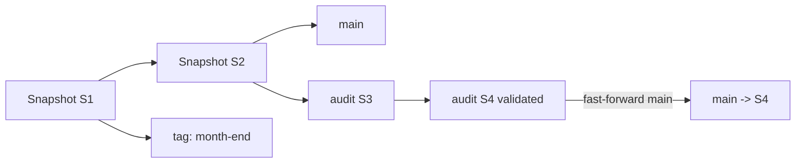
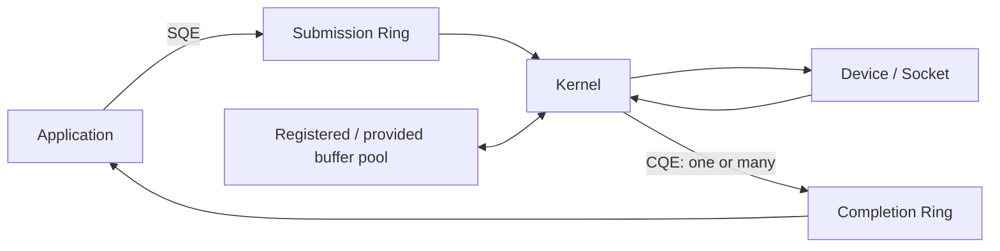

# 2026-09-18 20:00 — Interview Study Packages

README ve yakın `19-00.md` kontrol edildi. SPIFFE workload identity ve Secure-by-Design/SSDF tekrar edilmedi. Bu tur data engineering/system design ile Linux/backend performance eksenine döndü.

## Paket 1 — Mid → Principal Data Engineering/System Design: Apache Iceberg Branches, Tags, WAP & Snapshot Lifecycle
**Süre:** 20–30 dk

### Konu anlatımı
Apache Iceberg bir tablonun değişimlerini immutable snapshot zinciri olarak izler. Branch ve tag, snapshot'lara isim verilmiş reference'lardır; ancak semantikleri farklıdır. Branch mutable bir head'e sahip bağımsız lineage'dır ve yeni commit alabilir. Tag belirli tarihsel snapshot'ı sabitlemek/audit-retention için uygundur. Bu model data lake üzerinde Git-benzeri bir zihinsel model verir ama row-level merge'i Git merge ile karıştırmamak gerekir.

Write-Audit-Publish (WAP) akışında production `main` doğrudan değiştirilmez: audit branch'e yazılır, data-quality/business invariant testleri çalışır, doğrulama geçerse main branch audit branch head'ine fast-forward edilir. Fast-forward için target'ın source'un ancestor'ı olması gerekir. Snapshot retention branch/tag bazında yönetilebilir; fakat uzun ömürlü refs eski snapshot/data file'ların temizlenmesini bilinçli olarak engelleyebilir ve storage/metadata maliyeti yaratır.

Iceberg 1.11.0, 19 Mayıs 2026'da yayımlandı. Güncel REST Catalog protokolünde server-side scan planning ve metadata freshness/caching gibi özellikler client'ın manifest/metadata yükünü azaltmayı hedefler. Branch/tag tasarımı bu catalog/metadata control-plane'i ile birlikte düşünülmelidir.

### Mental model

**Invariant:** branch/tag yalnız snapshot reference'dır; publish işlemi doğrulanmış lineage'ı görünür production head'e taşır, retention policy ise hangi tarihsel snapshot'ların yaşamasına izin verildiğini belirler.

### İçeride ne oluyor?
- Snapshot log table değişimlerinin lineage'ını taşır.
- Branch mutable named ref; tag sabit tarihsel ref olarak kullanılır.
- Branch/tag kendi reference/snapshot retention policy'lerine sahip olabilir.
- WAP branch production görünürlüğü öncesi validation boundary sağlar.
- Fast-forward target branch source lineage'ın ancestor'ıysa güvenli pointer advancement yapar.
- `expire_snapshots` refs tarafından artık korunmayan eski snapshot/file'ları temizleme lifecycle'ının parçasıdır.
- Streaming workload yüksek commit frekansıyla snapshot/manifest/small-file sayısını büyütebilir; commit cadence ve maintenance gerekir.

### Yüksek getirili mülakat soruları
1. Iceberg snapshot, branch ve tag arasındaki fark nedir?
2. WAP neden staging table kopyalamaktan daha güçlü olabilir?
3. Fast-forward hangi koşulda güvenlidir?
4. Uzun ömürlü tag storage cleanup'ı nasıl etkiler?
5. Branch query ile tag query schema semantics neden farklılaşabilir?
6. Senior: streaming writer'ın yüksek commit frekansında hangi maintenance işleri gerekir?
7. Staff: concurrent writer, validation failure ve publish race'i nasıl tasarlarsın?
8. Principal: catalog availability, metadata growth, retention/compliance ve multi-engine interoperability için ownership modelini nasıl kurarsın?

### Seviyeye göre cevap derinliği
- **Mid:** snapshot, time travel, branch/tag ve retention'ı doğru ayırır.
- **Senior:** WAP, fast-forward, concurrent commit ve maintenance failure mode'larını açıklar.
- **Staff:** streaming/batch writer, catalog, validation ve lifecycle automation'ı birlikte tasarlar.
- **Principal:** compliance retention, storage economics, multi-engine contract ve platform governance trade-off'larını yönetir.

### Kısa alıştırma
`orders` tablosunda `main` snapshot S20'deyken `audit` branch oluştur. İki ETL commit'i S21/S22 üretsin. Row-count, null-rate ve revenue invariant testleri tanımla; yalnız testler geçerse main'i fast-forward et. Month-end tag'i 180 gün tut; audit branch'i 7 gün sonra expire edecek retention kuralı çiz.

### Proje fikri
`iceberg-wap-lab`: Spark/PyIceberg ile branch'e batch write, kalite doğrulaması, fast-forward publish, historical tag ve snapshot expiration akışı. Failure injection ile validation fail, concurrent main commit ve stale branch senaryolarını test et; metadata/snapshot count dashboard'u ekle.

### Failure modes / trade-off / production bağlantısı
Branch'i full table copy sanmak, tag'i sonsuza kadar tutup storage growth'u unutmak, validation ile publish arasındaki race'i yok saymak, streaming commit cadence'i aşırı küçültmek, small-file/manifest maintenance yapmamak ve catalog'u kritik control-plane olarak izlememek tipik hatalardır. Production'da snapshot count/age, refs by age, orphan/storage bytes, commit latency/conflict rate, validation failure, publish latency, manifest/file count ve catalog load latency izlenir.

### Kaynaklar
- Apache Iceberg — Branching and Tagging: https://iceberg.apache.org/docs/latest/branching/
- Apache Iceberg — Spark Queries / branch-tag schema semantics: https://iceberg.apache.org/docs/latest/spark-queries/
- Apache Iceberg 1.11.0 release — 19 Mayıs 2026: https://iceberg.apache.org/blog/apache-iceberg-1.11.0-release/
- Apache Iceberg — REST Catalog Protocol: https://iceberg.apache.org/docs/nightly/rest-protocol/
- Apache Iceberg — Structured Streaming: https://iceberg.apache.org/docs/1.10.0/spark-structured-streaming/

---

## Paket 2 — Junior → Staff Linux/Backend Performance: io_uring Multishot I/O, Registered Buffers & Backpressure
**Süre:** 20–30 dk

### Konu anlatımı
Klasik async I/O tasarımında her operasyon için submission/completion bookkeeping, syscall ve buffer lifecycle maliyeti throughput'u sınırlayabilir. Linux `io_uring`, shared submission/completion ring'leri üzerinden kernel ile userspace arasında daha düşük-overhead I/O akışı kurar. Fakat interview'da asıl değer `io_uring hızlıdır` demek değil; queue ownership, buffer lifetime, bounded in-flight work ve cancellation/backpressure invariant'larını açıklamaktır.

Multishot operation tek submission'ın zaman içinde birden fazla completion üretmesine izin verir. Bu özellikle accept/receive veya kernel-userspace request stream'lerinde submission churn'ünü azaltabilir. Registered/fixed buffers ise memory registration/pinning maliyetini amortize edebilir. Güncel Linux kernel dokümantasyonunda FUSE-over-io_uring buffer pool'un payload buffer'larını request entry'lerinden ayırdığı, pool'un fixed buffer olarak register edilebildiği anlatılır. UBLK batch-I/O tasarımı da multishot io_uring + provided buffer ile tek fetch komutunun zaman içinde çok sayıda I/O almasını örnekler.

Performans optimizasyonu correctness sınırını değiştirmez: completion gelene kadar kernel'in erişebildiği buffer reuse edilmemeli; ring/in-flight queue sınırsız büyütülmemeli; downstream storage/network yavaşladığında producer admission/backpressure uygulanmalıdır.

### Mental model

**Invariant:** submission ownership, buffer lifetime ve completion consumption açık olmalıdır; multishot daha az submission üretir ama sınırsız concurrency hakkı vermez.

### İçeride ne oluyor?
- SQE operasyonu tanımlar; CQE completion sonucunu taşır.
- Multishot request tek SQE'den birden fazla CQE üretebilir; consumer request'in gerçekten sona erdiğini completion flags/semantics ile ayırmalıdır.
- Registered/fixed buffer tekrar eden memory-registration maliyetini azaltabilir; pinned memory bir resource budget'tır.
- Provided buffer pool kernel'in uygun buffer seçmesine izin veren pattern'lerde allocation/copy overhead'ini azaltabilir.
- Queue depth throughput ile tail latency/memory pressure arasında trade-off'tur.
- Cancellation, shutdown ve partial completion path'leri happy-path kadar önemlidir.

### Yüksek getirili mülakat soruları
1. io_uring submission/completion ring mental modeli nedir?
2. Multishot neden syscall/submission overhead'ini azaltabilir?
3. Tek request birden fazla CQE üretiyorsa lifecycle'ı nasıl takip edersin?
4. Fixed/registered buffer'ın faydası ve riski nedir?
5. Queue depth neden sadece 'ne kadar büyük o kadar hızlı' değildir?
6. Senior: slow disk/network karşısında backpressure ve admission control'u nereye koyarsın?
7. Staff: cancellation, timeout, graceful shutdown ve buffer ownership invariant'larını nasıl test edersin?

### Seviyeye göre cevap derinliği
- **Junior:** async submission/completion ve buffer lifetime'ı açıklar.
- **Mid:** queue depth, multishot, fixed/provided buffer ve backpressure'ı bağlar.
- **Senior:** cancellation race, partial completion, memory pinning ve tail latency trade-off'larını tartışır.
- **Staff:** workload benchmark'ı, fallback/compatibility, observability ve operational rollout tasarlar.

### Kısa alıştırma
Bir TCP server için `accept -> recv -> process -> send` pipeline çiz. Maksimum 4096 in-flight connection, 512 provided buffer ve downstream worker queue limiti tanımla. Buffer exhaustion, cancellation ve graceful shutdown davranışını belirt.

### Proje fikri
`uring-backpressure-lab`: blocking socket server ile io_uring server'ı aynı protocol üzerinde karşılaştır. Concurrency, queue depth ve buffer pool size sweep et; throughput yanında p50/p99 latency, CPU, context switch, memory/pinned-buffer ve cancellation correctness ölç.

### Failure modes / trade-off / production bağlantısı
Completion öncesi buffer reuse, CQ'yu yeterince drain etmemek, unbounded in-flight I/O, pinned-memory budget'ını yok saymak, cancellation sonrası stale completion'ı yanlış request'e bağlamak ve microbenchmark sonucunu production workload'a genellemek tipik hatalardır. Production'da SQ/CQ occupancy, in-flight count, buffer-pool utilization/exhaustion, submit-to-complete latency, cancellation/timeout, error code dağılımı, CPU/syscall/context-switch ve downstream queue saturation izlenir.

### Kaynaklar
- Linux kernel — io_uring documentation index: https://docs.kernel.org/io_uring/index.html
- Linux kernel — FUSE over io_uring / buffer pools: https://kernel.org/doc/html/latest/filesystems/fuse/fuse-io-uring.html
- Linux kernel — ublk batch I/O / multishot + provided buffers: https://docs.kernel.org/block/ublk.html
- io_uring man pages: https://man7.org/linux/man-pages/man7/io_uring.7.html
