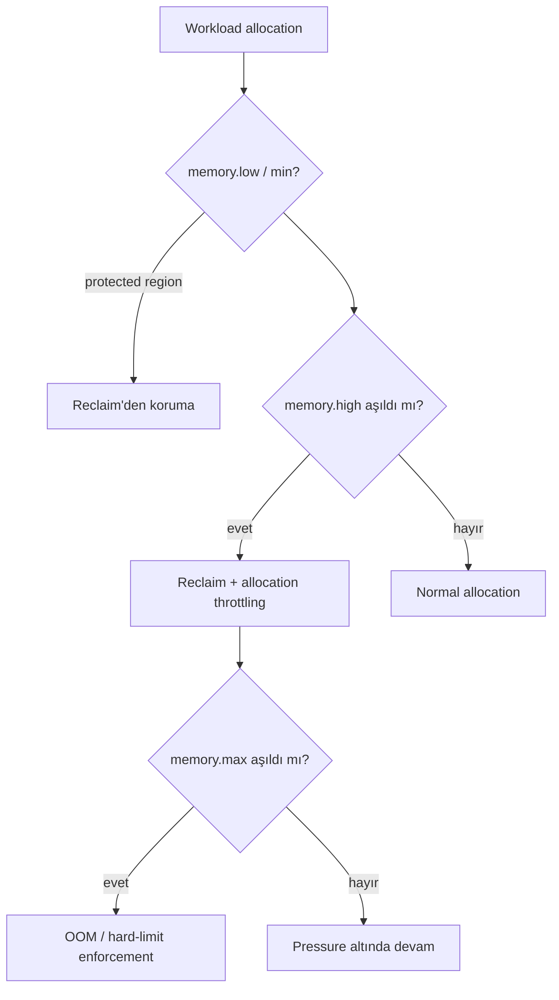

# 2026-09-18 21:00 — Interview Study Packages

README ve yakın `20-00.md` kontrol edildi. Apache Iceberg WAP/snapshot lifecycle ve io_uring multishot/buffer konuları tekrar edilmedi. Bu tur güncel Kubernetes/SRE ile algorithms/string processing eksenine döndü.

## Paket 1 — Mid → Principal Cloud/SRE: Kubernetes 1.37 Memory QoS, cgroup v2 & Memory Pressure Control
**Süre:** 20–30 dk

### Konu anlatımı
Kubernetes'te memory `request` scheduler'ın placement kararına, `limit` ise container'ın kullanabileceği üst sınıra etki eder; fakat production memory davranışı yalnız bu iki sayıdan ibaret değildir. Linux cgroup v2 `memory.min`, `memory.low`, `memory.high` ve `memory.max` ile memory pressure altında farklı koruma/throttling/limit semantikleri sağlar. Kubernetes 1.37'de Memory QoS Beta'ya yükseldi ve feature gate varsayılan açık hale geldi. Önemli nüans: gate'in açık olması tek başına `memory.high/min/low` yazılacağı anlamına gelmez; kubelet Memory QoS configuration ayrıca etkinleştirilmelidir.

`memory.min` hard protection, `memory.low` best-effort protection, `memory.high` throttle/reclaim pressure boundary ve `memory.max` hard ceiling gibi düşünülür. Amaç OOM anını beklemek yerine memory pressure'ı daha erken ve kontrollü biçimde workload'a geri yansıtmaktır. Bu bir 'OOM yok etme' özelliği değildir: yanlış reservation toplamı node kapasitesini aşabilir; reclaim/throttling latency'yi artırabilir; memory.max ihlalinde yine OOM olabilir.

### Mental model

**Invariant:** scheduler request ile node'a yerleştirir; cgroup v2 runtime'da pressure/enforcement uygular. Reservation, throttling ve hard limit aynı problem değildir.

### İçeride ne oluyor?
- Scheduler resource request üzerinden placement yapar; runtime memory pressure kararları kernel/cgroup katmanındadır.
- `memory.low` reclaim altında best-effort koruma sağlar; `memory.min` daha güçlü hard protection semantiğidir.
- `memory.high` aşıldığında workload hemen öldürülmek yerine reclaim/throttling baskısı görür.
- `memory.max` hard upper boundary'dir; reclaim yeterli değilse OOM path'i mümkündür.
- Kubernetes 1.37 Memory QoS Beta ve default feature gate açık olsa da default kubelet config memory control değerlerini otomatik yazmaz.
- Tiered reservation ve pod/container resource semantiği birlikte düşünülmelidir; sidecar ve bursty workload davranışı önemlidir.

### Yüksek getirili mülakat soruları
1. Memory request ile limit arasındaki fark nedir?
2. `memory.high` ile `memory.max` neden aynı şey değildir?
3. Memory QoS neden yalnız OOM killer'a güvenmekten daha kontrollü olabilir?
4. `memory.low` ve `memory.min` hangi koruma semantiğini taşır?
5. Throttling tail latency'yi nasıl etkileyebilir?
6. Senior: Java/Go heap target'ı ile cgroup limit/high değerlerini nasıl uyumlu tasarlarsın?
7. Staff: node overcommit, Guaranteed/Burstable QoS ve Memory QoS'u nasıl birlikte modelliyorsun?
8. Principal: cluster-wide rollout'ta SLO, capacity economics ve noisy-neighbor riskini nasıl yönetirsin?

### Seviyeye göre cevap derinliği
- **Mid:** request/limit, cgroup ve OOM ilişkisini doğru ayırır.
- **Senior:** reclaim, `memory.high`, heap/runtime davranışı ve tail-latency trade-off'unu açıklar.
- **Staff:** node overcommit, workload class, sidecar, observability ve rollout policy'sini birlikte tasarlar.
- **Principal:** fleet standardı, capacity headroom, SLO ve maliyet/risk optimizasyonunu yönetir.

### Kısa alıştırma
8 GiB node üzerinde A=2 GiB request/4 GiB limit, B=1 GiB request/3 GiB limit ve C=1 GiB request/2 GiB limit workload'ları çiz. Node pressure altında hangi workload'a ne kadar koruma vermek istediğini `low/high/max` mantığıyla gerekçelendir; bir workload'ın p99 latency'sinin reclaim yüzünden bozulduğu senaryoyu ekle.

### Proje fikri
`memory-qos-lab`: cgroup v2 destekli test cluster'da bursty allocator, JVM/Go service ve sidecar çalıştır. Memory QoS açık/kapalı karşılaştır; RSS/working-set, PSI, `memory.events`, OOM, reclaim ve p95/p99 latency ölç. Kontrollü pressure injection ile regression dashboard'u oluştur.

### Failure modes / trade-off / production bağlantısı
Feature gate açık diye policy aktif sanmak, toplam protection'ı node kapasitesinden kopuk belirlemek, `memory.high` throttling'inin latency maliyetini ölçmemek, application heap limitini container boundary ile uyumsuz bırakmak ve yalnız RSS izlemek tipik hatalardır. Production'da working set/RSS, cgroup `memory.current/events`, PSI, OOM/eviction, reclaim, throttling belirtileri, p99 latency, node allocatable/headroom ve QoS class dağılımı izlenir.

### Kaynaklar
- Kubernetes — Memory QoS graduates to Beta, 14 Eylül 2026: https://kubernetes.io/blog/2026/09/14/kubernetes-v1-37-memory-qos-graduates-to-beta/
- Kubernetes 1.37 release — 26 Ağustos 2026: https://kubernetes.io/releases/1.37/
- Linux kernel — cgroup v2 memory controller: https://docs.kernel.org/admin-guide/cgroup-v2.html
- Kubernetes — Resource Management for Pods and Containers: https://kubernetes.io/docs/concepts/configuration/manage-resources-containers/

---

## Paket 2 — Junior → Staff Algorithms/Data Structures: Suffix Automaton, Endpos Classes & Substring Queries
**Süre:** 20–30 dk

### Konu anlatımı
Suffix automaton (SAM), bir string'in bütün substring'lerini tanıyan minimal deterministic finite automaton'dur. İsmi yanıltıcı olabilir: yalnız suffix'leri saklamaz; kaynak string'in tüm substring dilini kompakt biçimde temsil eder. Uzunluğu `n` olan bir string için state ve transition sayısı lineerdir; bu nedenle substring membership, farklı substring sayısı ve occurrence bilgisi gibi problemlerde güçlüdür.

Her state bir `len` değeri (o state'in temsil ettiği en uzun substring uzunluğu) ve bir suffix link taşır. Aynı state'teki substring'ler aynı `endpos` kümesine sahiptir. Yeni karakter eklenirken normal state oluşturulur; determinism/minimality bozulacaksa bir `clone` state üretilir. Clone yeni occurrence değildir: transition ve suffix-link yapısını bölerek endpos equivalence class'larını doğru hale getirir.

### Mental model
```text
text stream:  a  b  a  b  a
              |  |  |  |  |
start --a--> q1 --b--> q2 --a--> q3 ...
   \                 
    suffix links: daha kısa eşdeğer suffix sınıfına geri dön

state v => uzunluk aralığı:
(len(link(v)) + 1) ... len(v)
```
**Invariant:** her state aynı end-position kümesini paylaşan substring sınıfını temsil eder; suffix link bu sınıfı uygun en uzun strict suffix sınıfına bağlar.

### İçeride ne oluyor?
- Her karakter için `cur` state oluşturulur ve `len[cur] = len[last] + 1` yapılır.
- Suffix-link zincirinde eksik transition'lar `cur`'a bağlanır.
- Mevcut transition'ın hedefi doğrudan bağlanma koşulunu sağlamıyorsa `clone` oluşturulur.
- Clone transition'ları ve suffix link'i kopyalar; `len[clone]` gerekli boundary'ye çekilir.
- `cur` ve eski hedefin suffix link'leri clone'a yönlendirilebilir.
- Farklı substring sayısı `sum(len[v] - len[link[v]])` ile hesaplanabilir.
- Occurrence count için terminal/visit bilgisi state'lere taşınıp `len` azalan sırada suffix link boyunca aggregate edilebilir.

### Yüksek getirili mülakat soruları
1. Suffix automaton neyi temsil eder?
2. Neden state sayısı lineer kalır?
3. `len` ve suffix link'in anlamı nedir?
4. Clone state neden gerekir ve neden yeni occurrence sayılmaz?
5. Bir pattern'ın substring olup olmadığını nasıl test edersin?
6. Farklı substring sayısı formülü nereden gelir?
7. Senior: occurrence count ve longest common substring'i SAM ile nasıl çözersin?
8. Staff: suffix array/tree/SAM arasında memory, implementation complexity ve query workload'a göre nasıl seçim yaparsın?

### Seviyeye göre cevap derinliği
- **Junior:** substring membership için transition yürüyüşünü ve automaton fikrini açıklar.
- **Mid:** suffix link, `len` aralığı ve clone mekanizmasını kurar.
- **Senior:** endpos equivalence, distinct-substring/occurrence/LCS türetimlerini açıklar.
- **Staff:** suffix array/tree/FM-index/SAM trade-off'larını workload ve memory üzerinden değerlendirir.

### Kısa alıştırma
`ababa` için SAM'i karakter karakter kur. Her state'in `len`, `link` ve transition'larını yaz. Sonra `bab`, `baa` ve `aba` membership query'lerini yürüt; distinct substring sayısını state katkılarından hesapla.

### Proje fikri
`suffix-automaton-lab`: UTF-8 token veya byte stream üzerinde SAM kuran CLI. Substring existence, occurrence count, distinct substring count ve iki metin arasında longest common substring komutları ekle. Sonuçları küçük input'larda brute-force oracle ile property-based test et.

### Failure modes / trade-off / production bağlantısı
Clone occurrence'ını yanlış saymak, suffix-link propagation sırasını ters kurmak, Unicode code point/byte semantiğini tanımlamamak, dense transition table ile alphabet büyükken memory patlatmak ve immutable corpus için daha cache-friendly suffix array alternatifini değerlendirmemek tipik hatalardır. Production karşılığı log/token substring analytics, DNA/text indexing, plagiarism/similarity yardımcı yapıları ve online corpus analizidir; state/transition count, bytes/state, build throughput ve query latency ölçülür.

### Kaynaklar
- Blumer et al. — The Smallest Automaton Recognizing the Subwords of a Text (1985): https://doi.org/10.1016/0304-0208(85)90010-6
- Crochemore — Transducers and repetitions (1986): https://doi.org/10.1016/0304-3975(86)90141-1
- cp-algorithms — Suffix Automaton: https://cp-algorithms.com/string/suffix-automaton.html
