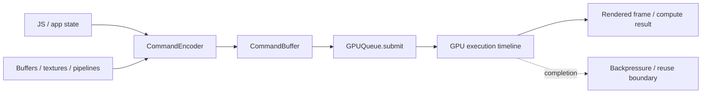
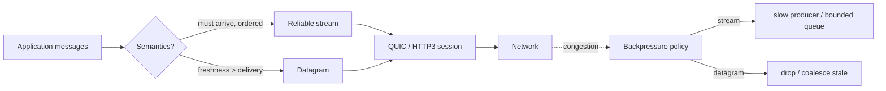

# 2026-09-18 23:00 — Interview Study Packages

README ve yakın `21-00.md` kontrol edildi. Kubernetes Memory QoS ve Suffix Automaton tekrar edilmedi. `22-00.md` GitHub'da bulunmadığı için önceki fallback turundaki PostgreSQL logical failover ve Android adaptive-layout konuları da yeniden seçilmedi. Bu tur frontend/GPU ile networking/system-design eksenine döndü.

## Paket 1 — Mid → Staff Frontend/Systems: WebGPU Command Model, Resource Lifetime & GPU Backpressure
**Süre:** 20–30 dk

### Konu anlatımı
WebGPU, browser içinden modern GPU'lara rendering ve general-purpose compute işi göndermek için tasarlanmış bir API'dir. W3C'nin 1 Eylül 2026 Candidate Recommendation Draft'ı WebGPU'yu WebGL'den ayrı, modern native GPU API'lerine verimli eşlenecek bir model olarak tanımlar. CPU tarafında `GPUDevice` kaynakları ve pipeline'ları oluşturur; `GPUCommandEncoder` komutları kaydeder; `finish()` immutable `GPUCommandBuffer` üretir; `GPUQueue.submit()` bunları GPU timeline'ına yollar.

En önemli mental model şudur: JavaScript'in bir API çağrısından dönmesi GPU işinin bittiği anlamına gelmez. CPU command üretirken GPU önceki işi çalıştırabilir. Bu throughput için iyidir; fakat sınırsız frame-in-flight, büyük buffer allocation'ları veya her frame pipeline yaratmak latency ve memory baskısı üretir. Resource lifetime da yalnız JS object reachability değildir: GPU'nun submitted work içinde hâlâ kullandığı kaynaklar tamamlanana kadar implementation tarafından yaşatılmalıdır.

WebGPU güvenlik modelinde browser GPU'ya ham/native erişim vermez. Resource usage, binding layout, buffer bounds ve shader kuralları doğrulanır. WGSL'nin 31 Ağustos 2026 Candidate Recommendation Draft'ı shader dilinin güncel normatif yüzüdür.

### Mental model

**Invariant:** CPU submission ile GPU completion farklı zaman çizgileridir; kaynak yeniden kullanımını ve frame pacing'i completion gerçeğine göre tasarla.

### İçeride ne oluyor?
- Adapter fiziksel/lojik GPU yeteneklerini temsil eder; device uygulamanın resource/command alanıdır.
- Encoder render/compute/copy pass komutlarını kaydeder; command buffer submission birimidir.
- Queue CPU ile GPU arasındaki asenkron iş kuyruğudur.
- Buffer/texture `usage` flag'leri kaynak kullanımını önceden sınırlar; validation ve optimization için önemlidir.
- Pipeline creation shader + layout + fixed-function state'i derleme/validation maliyetine bağlayabilir; hot path'te cache/reuse önemlidir.
- GPU işi asenkron olduğu için staging/readback ve frame-in-flight sayısı latency/memory trade-off'u yaratır.

### Yüksek getirili mülakat soruları
1. WebGPU ile WebGL mental modeli arasındaki temel fark nedir?
2. `queue.submit()` döndüğünde GPU işi bitmiş midir?
3. Command encoder ve command buffer neden ayrıdır?
4. Resource usage flag'leri neden API tasarımının parçasıdır?
5. Her frame pipeline yaratmak neden kötü olabilir?
6. Senior: triple buffering throughput'u artırırken input-to-photon latency'yi nasıl etkileyebilir?
7. Senior: GPU readback neden pipeline stall yaratabilir?
8. Staff: browser GPU workload'u için memory budget, device-loss recovery ve progressive fallback nasıl tasarlanır?

### Seviyeye göre cevap derinliği
- **Mid:** adapter/device/queue/encoder/buffer rollerini doğru ayırır.
- **Senior:** async GPU timeline, pipeline caching, resource reuse, readback ve frame pacing trade-off'larını açıklar.
- **Staff:** device loss, feature negotiation, telemetry, memory budget ve fallback stratejisini production tasarımına bağlar.

### Kısa alıştırma
60 FPS hedefli particle simulation çiz. İki storage buffer arasında ping-pong yap; compute pass sonucu render pass'e gitsin. CPU'nun hangi noktada bir sonraki frame'i encode edebileceğini ve üç frame-in-flight olduğunda hangi kaynakların yeniden kullanılamayacağını işaretle.

### Proje fikri
`webgpu-particle-lab`: WGSL compute shader ile 100K particle update + render. Pipeline cache, double/triple buffering ve CPU readback açık/kapalı benchmark et. CPU encode time, GPU frame time, dropped frame, memory footprint ve device-loss recovery ölç.

### Failure modes / trade-off / production bağlantısı
Her frame pipeline/resource yaratmak, GPU completion beklemeden buffer overwrite etmek, gereksiz CPU readback, limits/features kontrol etmemek, device loss'u fatal kabul etmek ve WebGPU desteği olmayan client için fallback bırakmamak tipik hatalardır. Production'da frame time dağılımı, command encoding time, GPU memory tahmini, pipeline creation latency, validation/device-loss error ve fallback oranı izlenir.

### Kaynaklar
- W3C WebGPU Candidate Recommendation Draft — 1 Eylül 2026: https://www.w3.org/TR/webgpu/
- W3C WebGPU publication history: https://www.w3.org/standards/history/webgpu/
- W3C WGSL Candidate Recommendation Draft — 31 Ağustos 2026: https://www.w3.org/TR/WGSL/

---

## Paket 2 — Junior → Principal Networking/System Design: WebTransport Streams, Datagrams & Application Backpressure
**Süre:** 20–30 dk

### Konu anlatımı
WebTransport, browser ile server arasında HTTP/3 tabanlı bir transport oturumu üzerinden reliable stream'ler ve unreliable datagram'lar sunan web API'sidir. W3C, 30 Temmuz 2026'da WebTransport'u Candidate Recommendation Snapshot olarak implementasyonlara davet etti. Tasarım problemi 'WebSocket'in daha hızlı hali' değildir; farklı delivery semantics'lerini aynı session içinde doğru veriye uygulamaktır.

Reliable stream ordered byte delivery sağlar. Tek bir stream içindeki kayıp, o stream'in sonraki byte'larını bekletir; fakat bağımsız stream'ler QUIC seviyesinde birbirini aynı şekilde bloke etmek zorunda değildir. Datagram ise teslim, sıra ve retransmission garantisi vermez; stale olduğunda yeniden göndermenin değersiz olduğu oyun position update, live telemetry veya transient state gibi veriler için uygundur.

Backpressure kritik production sınırıdır. Network senden yavaşsa application'ın sonsuz queue büyütmesi çözüm değildir. Reliable veri için producer'ı yavaşlatmak, queue budget koymak veya session'ı kapatmak gerekebilir. Datagram için eski update'i drop/coalesce etmek çoğu zaman retransmit etmekten daha doğrudur. Ayrıca transport security, application authorization'ın yerine geçmez.

### Mental model

**Invariant:** delivery semantics message değerinden türetilir; congestion olduğunda queue büyütmek yerine bounded backpressure policy uygulanır.

### İçeride ne oluyor?
- Session HTTP/3/QUIC üzerinde kurulur ve secure transport özelliklerinden yararlanır.
- Bidirectional/unidirectional stream'ler bağımsız reliable byte akışlarıdır.
- Datagram'lar unreliable ve unordered mesaj semantiğine uygundur.
- Stream multiplexing cross-stream head-of-line etkisini azaltır; aynı stream içindeki ordering yine vardır.
- Congestion control ve flow control transport katmanında olsa da application queue budget'ını sen tasarlarsın.
- Reconnect/resume semantics application-level state ve idempotency gerektirebilir.

### Yüksek getirili mülakat soruları
1. WebTransport ile WebSocket arasında hangi semantic farkları düşünürsün?
2. Stream ve datagram arasında nasıl seçim yaparsın?
3. QUIC multiplexing head-of-line blocking problemini tamamen yok eder mi?
4. Backpressure neden yalnız transport kütüphanesinin problemi değildir?
5. Datagram loss durumunda neden her zaman retry yapmamalısın?
6. Senior: multiplayer oyunda input, world snapshot ve chat mesajlarını hangi channel'a koyarsın?
7. Staff: reconnect, auth expiry, NAT/path change ve overload policy'sini nasıl tasarlarsın?
8. Principal: WebTransport adoption'ında browser support, gateway/LB support, observability ve fallback ekonomisini nasıl değerlendirirsin?

### Seviyeye göre cevap derinliği
- **Junior:** reliable/unreliable ve ordered/unordered ayrımını açıklar.
- **Mid:** stream/datagram mapping ve bounded queue/backpressure tasarlar.
- **Senior:** congestion, flow control, reconnect, idempotency ve latency trade-off'larını açıklar.
- **Staff/Principal:** edge/gateway uyumluluğu, abuse control, telemetry, fallback ve rollout ekonomisini birlikte yönetir.

### Kısa alıştırma
Gerçek zamanlı collaborative whiteboard için cursor position, stroke segment, document checkpoint ve chat mesajlarını stream/datagram olarak sınıflandır. 500 ms network stall sırasında her queue için drop/coalesce/block politikasını yaz.

### Proje fikri
`webtransport-realtime-lab`: browser + HTTP/3 server ile cursor datagram'ı ve reliable chat/document stream'i kur. Network loss/latency injection altında p50/p99 message age, queue depth, datagram drop, reconnect time ve memory kullanımını ölç; WebSocket fallback ekle.

### Failure modes / trade-off / production bağlantısı
Her şeyi reliable tek stream'e koymak, datagram'ı 'UDP olduğu için hızlı' diye seçmek, unbounded send queue, stale state'i retry etmek, reconnect sonrası duplicate side effect üretmek, proxy/LB/browser compatibility'yi test etmemek ve transport encryption'ı authorization sanmak tipik hatalardır. Production'da queue depth/bytes, message age, RTT/loss, datagram drop, stream reset, session reconnect, auth failure ve fallback oranı izlenir.

### Kaynaklar
- W3C WebTransport Candidate Recommendation: https://www.w3.org/TR/webtransport/
- W3C announcement — 30 Temmuz 2026: https://www.w3.org/news/2026/w3c-invites-implementations-of-webtransport/
- IETF RFC 9297 — HTTP Datagrams: https://www.rfc-editor.org/rfc/rfc9297
- IETF RFC 9000 — QUIC: https://www.rfc-editor.org/rfc/rfc9000
