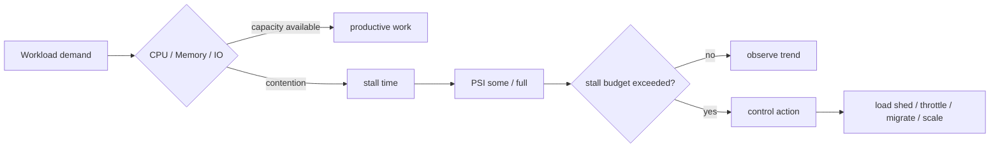
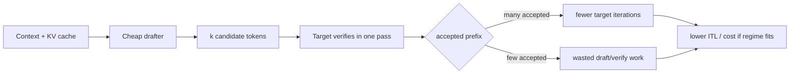

# 2026-09-19 00:00 — Interview Study Packages

README ve yakın `daily/2026-09-18/23-00.md` kontrol edildi. WebGPU ve WebTransport tekrar edilmedi. Yeni günün ilk turu SRE/Linux observability ile ML/AI/LLM inference eksenine döndü.

## Paket 1 — Mid → Principal Cloud/DevOps/SRE: Linux PSI, Stall Budgets & Pressure-Aware Load Shedding
**Süre:** 20–30 dk

### Konu anlatımı
CPU utilization tek başına sistemin üretken olup olmadığını söylemez. Linux Pressure Stall Information (PSI), CPU, memory ve I/O kıtlığının workload'u ne kadar süre gerçekten beklettiğini ölçer. `/proc/pressure/{cpu,memory,io}` sistem düzeyi, cgroup v2 altındaki `cpu.pressure`, `memory.pressure`, `io.pressure` ise workload/cgroup düzeyi görünüm verir.

PSI iki temel sinyal üretir. `some`, en az bir işin ilgili resource yüzünden stall olduğu zaman payıdır. `full`, tüm non-idle işlerin aynı anda stall olduğu ve sistemin o anda anlamlı ilerleme üretemediği daha ağır baskıyı temsil eder. `avg10/avg60/avg300` trendleri, `total` ise mikro-saniye cinsinden toplam stall zamanını verir. CPU `full` sistem seviyesinde anlamlı değildir; workload/cgroup seviyesinde daha yararlıdır.

PSI yalnız dashboard metriği değildir. Kernel threshold trigger API'si ile belirli bir pencere içinde stall budget aşılınca `poll/epoll` üzerinden userspace uyarılabilir. Böylece autoscaling'den önce admission control, concurrency reduction, load shedding, batch pause veya failover gibi pressure-aware kontrol döngüleri kurulabilir.

### Mental model

**Invariant:** resource utilization kapasite kullanımını, PSI ise kıtlığın workload ilerlemesine verdiği zararı anlatır; overload kontrolünü yalnız utilization'a bağlama.

### İçeride ne oluyor?
- Kernel task'ların resource bekleme sürelerini aggregate ederek pressure signal üretir.
- `some`: en az bir runnable/active task stalled; `full`: bütün non-idle işler stalled.
- Trend pencereleri 10/60/300 saniyedir; `total` kısa spike'ları özel pencerelerde analiz etmeyi sağlar.
- Trigger formatı `<some|full> <stall_us> <window_us>` şeklindedir.
- Trigger'lar `poll()`/`epoll()` ile event-driven controller'a bağlanabilir.
- cgroup v2 PSI, noisy-neighbor ile host-wide pressure'ı ayırmada kritiktir.

### Yüksek getirili mülakat soruları
1. CPU utilization %90 iken sistem neden sağlıklı olabilir; %40 iken neden kötü olabilir?
2. PSI `some` ve `full` arasındaki fark nedir?
3. Memory PSI yükselirken RSS sabit görünüyorsa hangi mekanizmaları araştırırsın?
4. I/O PSI ile disk throughput metriği neden aynı şeyi anlatmaz?
5. PSI trigger ile load shedding controller nasıl tasarlanır?
6. Senior: cgroup PSI ile host PSI'ı birlikte nasıl yorumlarsın?
7. Staff: autoscaling yerine ne zaman admission control veya concurrency limit tercih edersin?
8. Principal: organizasyon çapında stall budget/SLO standardını nasıl kurarsın?

### Seviyeye göre cevap derinliği
- **Mid:** utilization, saturation ve stall kavramlarını ayırır; some/full yorumlar.
- **Senior:** CPU/memory/I/O PSI'ı latency, reclaim, queue ve cgroup telemetry ile korele eder.
- **Staff:** pressure-aware admission, concurrency control, load shedding ve autoscaling policy tasarlar.
- **Principal:** stall budget'larını SLO, capacity economics ve multi-tenant isolation standardına bağlar.

### Kısa alıştırma
Bir API pod'u için şu durumu yorumla: CPU %45, memory.current limitin %80'i, `memory.pressure some avg10=18`, `full avg10=7`, p99 latency 4 kat artmış. Beş dakikalık incident sırasını yaz: hangi metric/log/kernel sinyalini önce kontrol eder, hangi load-shedding kararını hangi threshold'a bağlarsın?

### Proje fikri
`psi-pressure-controller`: cgroup v2 PSI dosyalarını okuyup configurable stall budget aşılınca worker concurrency azaltan küçük bir daemon. Synthetic CPU/memory/I/O pressure testleri ekle; p50/p99 latency, throughput, PSI some/full, shed ratio ve recovery time ölç.

### Failure modes / trade-off / production bağlantısı
PSI'ı utilization yüzdesi sanmak, yalnız avg300'e bakıp spike kaçırmak, host PSI ile pod/cgroup PSI'ı karıştırmak, threshold'u workload baseline'ı olmadan kopyalamak ve load shedding'i hysteresis/cooldown olmadan açmak tipik hatalardır. Production'da PSI, request latency, queue age/depth, reclaim/page-fault, throttling, OOM ve shed rate birlikte izlenmelidir.

### Kaynaklar
- Linux Kernel — PSI: https://docs.kernel.org/accounting/psi.html
- Linux Kernel — cgroup v2: https://docs.kernel.org/admin-guide/cgroup-v2.html

---

## Paket 2 — Mid → CTO ML/AI/LLM/MLOps: Speculative Decoding, Acceptance Rate & Inference Economics
**Süre:** 20–30 dk

### Konu anlatımı
Autoregressive LLM decoding doğal olarak sequential'dır: hedef model bir sonraki token için forward pass yapar, token seçilir ve süreç tekrar eder. Özellikle medium/low QPS ve memory-bound serving'de GPU compute kapasitesi tam dolmadan ağırlıklar tekrar tekrar okunabilir. Speculative decoding bu sequential maliyeti azaltmaya çalışır: daha ucuz bir proposer/drafter birkaç aday token üretir, pahalı target model bu adayları topluca doğrular; kabul edilen prefix sayesinde tek target iteration'da birden fazla output token ilerlenebilir.

Temel KPI yalnız `num_speculative_tokens` değildir. Acceptance rate / mean accepted length, drafter maliyeti, target verification maliyeti, batch size ve KV-cache davranışı birlikte sonucu belirler. Draft çok ucuz ama sık yanlışsa target ek verification yapar ve latency kötüleşebilir. Draft çok pahalıysa yüksek acceptance bile ekonomik olmayabilir. Bu yüzden speculation özellikle low/medium QPS memory-bound durumda güçlüdür; yüksek batch throughput rejiminde target GPU zaten verimli kullanılıyorsa ek draft işi faydayı azaltabilir.

Güncel vLLM dokümantasyonu EAGLE, MTP, draft model, PARD, MLP, n-gram ve suffix gibi yöntemleri destekliyor; per-request acceptance metrics de sunuyor. TensorRT-LLM güncel dokümantasyonu da draft/target, EAGLE 3, MTP, NGram, PARD, DFlash ve suffix-automaton seçeneklerini belgeliyor ve speedup'ın özellikle düşük batch size'da görüldüğünü vurguluyor.

### Mental model

**Invariant:** speculation output semantics'ini hız için değiştirmemeli; performans kazancı acceptance ile değil `accepted progress / total draft+verify cost` ile değerlendirilmelidir.

### İçeride ne oluyor?
- Proposer target'tan ucuz şekilde candidate token sequence üretir.
- Target candidate'ları parallel/batched biçimde doğrular.
- Rejection sampling doğru kurulduğunda teorik target distribution korunabilir; implementation numerics yine determinism farkları yaratabilir.
- Draft depth arttıkça potansiyel accepted progress artar fakat wasted work ve KV/cache maliyeti de büyür.
- MTP target ailesinin native multi-token prediction yeteneğini kullanabilir; ayrı draft model gerektirmeyebilir.
- N-gram/suffix yöntemleri prompt/generated repetition'dan yararlanır; neural drafter maliyetinden kaçınabilir.
- Acceptance telemetry prompt sınıfı, sampling parametreleri ve load rejimine göre segment edilmelidir.

### Yüksek getirili mülakat soruları
1. Speculative decoding neden autoregressive dependency'yi tamamen kaldırmaz?
2. Acceptance rate %80 ise sistem kesin hızlanmış mıdır?
3. Draft model ile target tokenizer uyumu neden önemlidir?
4. Low-QPS ve high-batch throughput rejimlerinde fayda neden değişir?
5. MTP ile ayrı draft-model yaklaşımını karşılaştır.
6. Senior: draft depth'i hangi online metriklerle tune edersin?
7. Staff: speculative serving'i scheduler, KV cache ve autoscaling ile nasıl birlikte tasarlarsın?
8. Principal/CTO: GPU $/token, p99 ITL ve engineering complexity üzerinden adoption kararını nasıl verirsin?

### Seviyeye göre cevap derinliği
- **Mid:** draft → verify → accept/reject akışını doğru açıklar.
- **Senior:** acceptance, batch size, memory-bound regime, KV cache ve sampling trade-off'larını tartışır.
- **Staff:** per-request routing, scheduler interaction, telemetry ve rollback/canary planı kurar.
- **Principal/CTO:** latency SLO, GPU utilization, $/M token, model compatibility ve operasyonel karmaşıklığı portföy kararı olarak değerlendirir.

### Kısa alıştırma
Baseline ITL 45 ms. Speculation açıkken draft+verify iteration 58 ms ve ortalama 2.2 output token ilerliyor. Yaklaşık effective ITL'yi hesapla; sonra acceptance düşüp ortalama progress 1.1 token olursa sonucu tekrar hesapla. Neden aynı config'in trafik mix'i değişince kapatılması gerekebileceğini açıkla.

### Proje fikri
`spec-decode-benchmark`: aynı model/workload için speculation kapalı, n-gram ve model-based proposer benchmark'ı. QPS, batch size, prompt repetition ve sampling temperature'ı sweep et. TTFT, p50/p99 ITL, tokens/s, acceptance length, GPU utilization, KV-cache occupancy ve $/1M output token raporla.

### Failure modes / trade-off / production bağlantısı
Acceptance rate'i tek başarı metriği yapmak, yalnız synthetic repetitive prompt test etmek, high-load throughput regresyonunu kaçırmak, tokenizer/model compatibility'yi doğrulamamak, numerical determinism'i lossless kavramıyla karıştırmak ve per-request telemetry olmadan global config seçmek tipik hatalardır. Production rollout'ta TTFT/ITL, accepted draft length distribution, reject rate, target iterations/output token, GPU utilization, KV-cache pressure, queue delay ve cost/token birlikte izlenir.

### Kaynaklar
- vLLM — Speculative Decoding (güncel): https://docs.vllm.ai/en/latest/features/spec_decode/
- vLLM — Per-Request Acceptance Metrics: https://docs.vllm.ai/en/latest/features/speculative_decoding/acceptance_metrics/
- NVIDIA TensorRT-LLM — Speculative Decoding: https://nvidia.github.io/TensorRT-LLM/features/speculative-decoding.html
- Leviathan et al. — Fast Inference from Transformers via Speculative Decoding: https://proceedings.mlr.press/v202/leviathan23a.html
