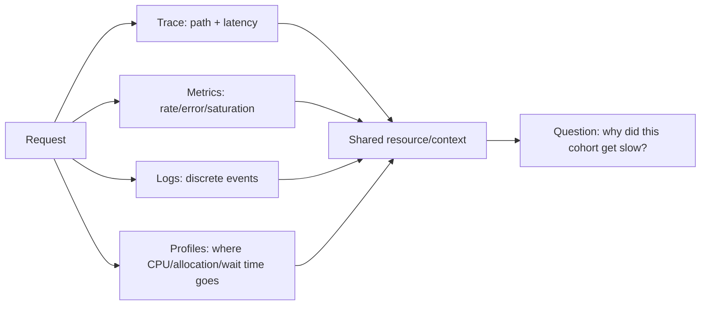
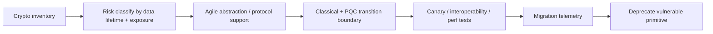

# 2026-09-19 01:00 — Interview Study Packages

README ve yakın `daily/2026-09-19/00-00.md` kontrol edildi. Linux PSI ve speculative decoding tekrar edilmedi. Bu tur observability/performance ile cybersecurity/architecture eksenine döndü.

## Paket 1 — Mid → Principal Cloud/DevOps/SRE: OpenTelemetry Profiles, Cross-Signal Correlation & Continuous Profiling
**Süre:** 20–30 dk

### Konu anlatımı
Metrics “ne kadar?”, traces “hangi request yolu?”, logs “hangi olay?” sorularını iyi yanıtlar; profile ise CPU zamanının, allocation'ın veya off-CPU beklemenin **hangi kod path'lerinde** harcandığını gösterir. Continuous profiling düşük overhead ile production workload'dan periyodik stack sample toplar ve hotspot'ları zaman içinde görünür kılar.

OpenTelemetry Profiles signal 26 Mart 2026'da public Alpha'ya girdi. Amaç profile'ı traces/metrics/logs ile aynı Resource/OTLP dünyasına taşımaktır. Collector v0.148.0+ profiles alabilir; pprof receiver, Kubernetes metadata enrichment ve OTTL transform/filter desteği duyuruldu. Alpha statüsü kritik production dependency olarak hazır olduğu anlamına gelmez; schema/backend/symbolization yüzeyleri hâlâ evrilebilir.

En yüksek değer cross-signal correlation'dadır: “p99 latency yükseldi” alarmından ilgili service/version/pod'a, oradan trace cohort'una ve aynı zaman aralığındaki CPU/off-CPU profile'a inmek. Profile tek başına causality kanıtı değildir; sampling bias, symbolization ve workload mix hesaba katılmalıdır.

### Mental model

**Invariant:** profile hotspot'u “bu kod pahalı” sinyalidir; “incident'in nedeni kesin budur” sonucu için trace/metric/workload context ile korelasyon gerekir.

### İçeride ne oluyor?
- Sampling profiler belirli aralıklarla stack snapshot alır; aggregate stack frequency yaklaşık resource-cost dağılımı verir.
- CPU, allocation ve off-CPU profilleri farklı sorulara yanıt verir.
- Symbolization native adresleri function/file/line bilgisine çevirir; stripped binaries/build-id yönetimi önemlidir.
- Resource attributes service, deployment, pod/node gibi boyutlarla profile'ı diğer telemetry sinyallerine bağlar.
- Collector enrichment/filtering cardinality ve privacy kontrol noktasıdır.
- Alpha signal için backend compatibility ve schema evolution production rollout riskidir.

### Yüksek getirili mülakat soruları
1. Metrics, traces ve profiles hangi farklı soruları cevaplar?
2. Sampling profiler neden exact accounting değildir?
3. CPU profile ile off-CPU profile arasındaki fark nedir?
4. Symbolization neden production pipeline'ın kritik parçasıdır?
5. Profile cardinality/storage maliyetini nasıl kontrol edersin?
6. Senior: p99 trace cohort'unu profile ile nasıl korele edersin?
7. Staff: eBPF profiler rollout'unda overhead, privacy ve kernel compatibility'yi nasıl yönetirsin?
8. Principal: Alpha bir telemetry standardını organizasyon çapında ne zaman ve hangi abstraction boundary ile benimsersin?

### Seviyeye göre cevap derinliği
- **Mid:** sample, stack, hotspot ve flame-graph mental modelini açıklar.
- **Senior:** symbolization, CPU/off-CPU ayrımı, correlation ve sampling bias'ı tartışır.
- **Staff:** Collector pipeline, cardinality/privacy budget, canary ve overhead SLO tasarlar.
- **Principal:** vendor-neutral telemetry architecture, schema evolution ve adoption riskini platform stratejisine bağlar.

### Kısa alıştırma
Bir API'de p99 180 ms'den 700 ms'ye çıktı; CPU utilization yalnız %55. Trace'ler DB span'lerinin normal olduğunu gösteriyor. CPU ve off-CPU profile'da hangi iki farklı pattern'i ararsın? Her pattern için doğrulayıcı metric/trace sinyalini yaz.

### Proje fikri
`otel-profile-correlation-lab`: küçük bir API'ye intentional CPU hotspot ve lock contention ekle. Trace/metric/log yanında continuous profile topla; deployment.version ve pod metadata ile korele et. Overhead %, profile bytes/min, symbolization success, p99 latency ve time-to-root-cause ölç.

### Failure modes / trade-off / production bağlantısı
Flame graph'ın en geniş frame'ini otomatik root cause saymak, debug symbol/build-id lifecycle'ını ihmal etmek, profile label cardinality'sini patlatmak, PII taşıyan labels/stacks için privacy review yapmamak ve Alpha signal'ı hard dependency yapmak tipik hatalardır. Production'da profiler CPU/memory overhead, sample/drop rate, export errors, symbolization success, profile ingest bytes, cardinality ve cross-signal link coverage izlenmelidir.

### Kaynaklar
- OpenTelemetry — Profiles Public Alpha, 26 Mart 2026: https://opentelemetry.io/blog/2026/profiles-alpha/
- OpenTelemetry — Specification Status: https://opentelemetry.io/docs/specs/status/
- OpenTelemetry — Profiles Concepts: https://opentelemetry.io/docs/concepts/signals/profiles/

---

## Paket 2 — Senior → CTO Cybersecurity/System Design: Post-Quantum Crypto Agility, ML-KEM Migration & Hybrid Boundaries
**Süre:** 20–30 dk

### Konu anlatımı
Post-quantum migration yalnız “RSA/ECDH yerine yeni algoritma koy” işi değildir. Büyük sistemlerde asıl problem **crypto agility**: hangi protocol/library/HSM/certificate/data-at-rest formatının hangi primitive'e bağlı olduğunu envanterlemek, dependency'leri yükseltmek, classical ve PQC dönemlerini birlikte işletmek, rollback yapmak ve uzun ömürlü veriyi harvest-now-decrypt-later riskine göre önceliklendirmektir.

NIST'in FIPS 203 standardı ML-KEM'i genel key-establishment için standardize etti; NIST 2026'da kurumların finalized PQC standartlarına geçişe şimdi başlamasını açıkça vurguluyor. ML-KEM bir KEM'dir: tarafların ortak symmetric secret kurmasına yardım eder; doğrudan bulk encryption algoritması değildir. FIPS 204 ML-DSA, FIPS 205 SLH-DSA signature alanındadır.

Migration sırasında hybrid yaklaşım classical ve PQ secret'ları protocol-defined combiner ile birleştirerek geçiş güvenliği sağlayabilir; ancak “iki algoritmayı concat ettim” tasarımı protocol proof/interoperability olmadan güvenli kabul edilmez. Inventory, algorithm identifiers, key/cert size, handshake bytes, MTU/fragmentation, HSM/KMS support, certificate chain ve latency etkileri ölçülmelidir.

NIST 12 Haziran 2026 PIV working drafts'ında backward-compatible incremental deployment için classical + PQC dual-stack modelini tartışıyor. Bu, genel migration mental modeline iyi örnektir: flag day yerine capability negotiation, staged rollout ve explicit deprecation timeline.

### Mental model

**Invariant:** crypto migration primitive seçimi kadar dependency discovery, protocol semantics, interoperability, key lifecycle ve rollback problemidir.

### İçeride ne oluyor?
- KEM encapsulation bir ciphertext + shared secret üretir; decapsulation private key ile shared secret'ı çıkarır.
- Shared secret daha sonra KDF/protocol context ile symmetric session keys'e dönüştürülür.
- PQ keys/ciphertexts/signatures classical alternatiflerden farklı boyutlara sahip olabilir; wire/storage/HSM assumptions kırılabilir.
- Hybrid deployment ancak protocol'un combiner ve downgrade semantics'i açık tanımlıysa anlamlıdır.
- Crypto inventory yalnız source-code grep değildir: TLS terminator, service mesh, KMS/HSM, SSH, PKI, firmware, third-party SaaS ve archived ciphertext dahil edilmelidir.
- Data confidentiality lifetime, migration priority için kritik girdidir.

### Yüksek getirili mülakat soruları
1. KEM ile public-key encryption arasındaki mental model farkı nedir?
2. ML-KEM hangi problemi çözer; ML-DSA hangi problemi çözer?
3. Harvest-now-decrypt-later hangi sistemleri önce migrate etmeyi gerektirir?
4. Crypto agility neden yalnız algorithm interface'i değildir?
5. Hybrid handshake neden otomatik olarak “iki kat güvenli” değildir?
6. Senior: PQC rollout'unda MTU, certificate/key size ve HSM sınırlarını nasıl test edersin?
7. Staff: 500 serviste crypto inventory ve dependency migration programını nasıl tasarlarsın?
8. Principal/CTO: compliance deadline, data lifetime, vendor readiness ve engineering cost üzerinden migration portföyünü nasıl önceliklendirirsin?

### Seviyeye göre cevap derinliği
- **Senior:** KEM/signature ayrımı, key lifecycle ve protocol compatibility'yi doğru açıklar.
- **Staff:** inventory, abstraction, hybrid rollout, downgrade protection ve observability tasarlar.
- **Principal:** multi-year migration sequencing, vendor/HSM riskleri ve cryptographic policy standardı kurar.
- **CTO:** data lifetime, regulatory exposure, capex/opex, vendor lock-in ve program governance üzerinden yatırım kararını verir.

### Kısa alıştırma
Üç workload'u sırala: (A) 15 yıl gizli kalması gereken arşiv, (B) 5 dakikalık session token, (C) public software-release signature. Her biri için confidentiality/authenticity horizon, dependency ve migration priority yaz; aynı PQ primitive'in üçünü de çözmediğini açıkla.

### Proje fikri
`crypto-agility-inventory`: repo/config/certificate metadata'dan algorithm/key-size/protocol dependency çıkaran read-only scanner. ML-KEM-ready / signature-ready / blocked-by-vendor sınıfları üret; service owner, data lifetime, external exposure ve dependency depth ile migration risk score hesapla. Secret/private key material toplamadan çalışsın.

### Failure modes / trade-off / production bağlantısı
PQC'yi tek library upgrade'i sanmak, KEM ile signature'ı karıştırmak, home-grown hybrid combiner yapmak, packet/cert/key size regresyonlarını ölçmemek, HSM/KMS firmware desteğini varsaymak, downgrade telemetry kurmamak ve uzun-lived encrypted data'yı sona bırakmak tipik hatalardır. Production'da negotiated algorithm, handshake failure/latency/bytes, cert-chain size, fallback/downgrade rate, HSM error/latency, unsupported-client ratio ve inventory coverage izlenir.

### Kaynaklar
- NIST — Post-Quantum Cryptography (2026): https://www.nist.gov/pqc
- NIST FIPS 203 — ML-KEM: https://csrc.nist.gov/pubs/fips/203/final
- NIST FIPS 204 — ML-DSA: https://csrc.nist.gov/pubs/fips/204/final
- NIST FIPS 205 — SLH-DSA: https://csrc.nist.gov/pubs/fips/205/final
- NIST — PQC updates to PIV working drafts, 12 Haziran 2026: https://www.nist.gov/news-events/news/2026/06/working-drafts-post-quantum-cryptography-updates-piv-standards
