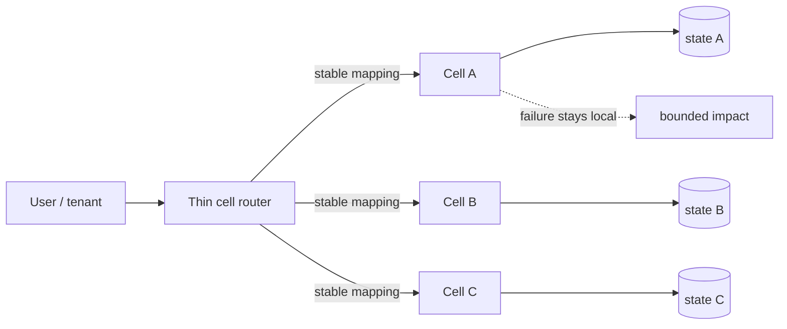
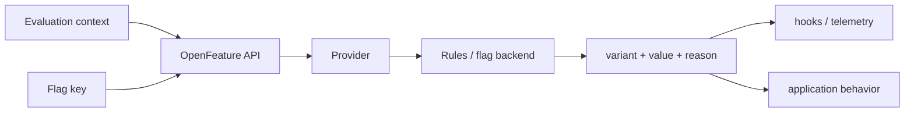

# 2026-09-19 01:00 — Interview Study Packages

README ve yakın `daily/2026-09-19/00-00.md` kontrol edildi; Linux PSI ve speculative decoding tekrar edilmedi. Repo araması ayrıca OpenTelemetry Profiles ve PQC crypto-agility konularının daha önce işlendiğini gösterdi; bu nedenle ilk taslak yerine iki yeni konuya dönüldü.

## Paket 1 — Senior → CTO System Design/SRE/Leadership: Cell-Based Architecture, Fault Isolation & Blast-Radius Economics
**Süre:** 20–30 dk

### Konu anlatımı
Cell-based architecture, tek büyük shared production fleet yerine aynı sistemin bağımsız ve sınırlı kapasiteli kopyalarını — cell'leri — oluşturur. Bir tenant/user/account deterministik veya metadata tabanlı routing ile bir cell'e atanır. Hedef yalnız horizontal scale değildir: software bug, overload, dependency failure veya bad deployment'ın **scope of impact**'ini sınırlamaktır.

Cell içinde compute ve mümkün olduğunca state/dependencies bağımsızlaştırılır. Cell'ler aynı binary/config contract'ını kullanabilir ama failure domain paylaşmamalıdır. Routing layer ise yeni shared critical dependency yaratmamalı; ince, yatay ölçeklenebilir ve mümkünse cached/static mapping ile çalışmalıdır. AWS'in cell-router guidance'ı da mevcut client'ların router kesintisinde doğrudan cell ile çalışabilmesi için static routing/cached endpoint yaklaşımını örnekler.

Cell sayısı büyüdükçe blast radius küçülür fakat fixed overhead, fleet fragmentation, deployment orchestration ve capacity headroom maliyeti artar. Bu yüzden cell size teknik değil ekonomik/SLO kararıdır: “bir cell kaybında kaç müşteri etkilenebilir?” ile “her cell için ne kadar idle reserve öderiz?” aynı denklemde ele alınır.

### Mental model

**Invariant:** cell ancak compute, state ve critical dependency failure'larının anlamlı kısmını gerçekten izole ediyorsa fault-isolation boundary'dir; yalnız deployment label'ı cell değildir.

### İçeride ne oluyor?
- Tenant→cell mapping routing/control-plane metadata'sıdır; request hot path mümkün olduğunca basit tutulur.
- Cell capacity bounded olmalıdır; aksi halde overload başka cell'lere zincirleme taşınabilir.
- Shared global dependency, bütün cell'lerin common-mode failure noktası olabilir.
- Cell-local deployment/canary, bad release blast radius'ini küçültür.
- Rebalancing stateful tenant migration problemidir; data copy, cutover, idempotency ve rollback gerekir.
- Supercell/region katmanı cell modelini disaster recovery ve data-residency için üst seviyede gruplayabilir.

### Yüksek getirili mülakat soruları
1. Cell ile shard arasındaki fark nedir?
2. Cell routing neden yeni bir global SPOF olmamalıdır?
3. Shared database kullanırsan cell isolation ne kadar gerçektir?
4. Tenant'ı bir cell'den diğerine nasıl güvenli taşırsın?
5. Bir cell overload olduğunda neden otomatik random spillover tehlikeli olabilir?
6. Staff: cell size ve headroom'u SLO üzerinden nasıl seçersin?
7. Principal: control plane ile data plane'i hangi failure boundaries ile ayırırsın?
8. CTO: %1 blast radius hedefinin ekstra infra/operasyon maliyetini nasıl gerekçelendirirsin?

### Seviyeye göre cevap derinliği
- **Senior:** routing, state ownership, isolation ve rebalancing mekaniklerini açıklar.
- **Staff:** cell-local SLO, capacity, deployment, dependency ve migration design'ı kurar.
- **Principal:** region/supercell topology, common-mode dependency ve control-plane resilience tasarlar.
- **CTO:** blast-radius hedefini müşteri tier'i, revenue-at-risk, compliance ve infra/operasyon maliyetiyle dengeler.

### Kısa alıştırma
100 bin tenant'lı SaaS için 10 cell tasarla. Bir cell kaybında maksimum tenant impact'i, N+1 headroom'u ve router outage davranışını yaz. Sonra shared Redis ve shared identity service'in isolation modelini nasıl deldiğini işaretle.

### Proje fikri
`cell-router-lab`: tenant→cell mapping, cached routing, per-cell rate limit ve health state içeren küçük gateway. Bir cell'e latency/error injection uygula; global error rate, affected-tenant %, reroute attempts ve healthy-cell saturation ölç.

### Failure modes / trade-off / production bağlantısı
Cell adını verip shared DB/cache/queue ile common-mode failure bırakmak, router'ı ağır control plane yapmak, fail olan cell trafiğini sınırsız healthy cell'lere boşaltmak, tenant migration rollback'i tasarlamamak ve capacity fragmentation maliyetini yok saymak tipik hatalardır. Production'da per-cell saturation/error/latency, affected tenant count, routing-cache hit, cell assignment skew, headroom, migration duration ve cross-cell dependency health izlenir.

### Kaynaklar
- AWS — Guidance for Cell-Based Architecture: https://docs.aws.amazon.com/solutions/cell-based-architecture-on-aws/
- AWS Prescriptive Guidance — Serverless Cell Router: https://docs.aws.amazon.com/prescriptive-guidance/latest/patterns/serverless-cell-router-architecture.html

---

## Paket 2 — Junior → Staff Backend/Product/Platform: OpenFeature 0.9, Feature-Flag Evaluation & Safe Rollouts
**Süre:** 20–30 dk

### Konu anlatımı
Feature flag, deployment ile release'i ayırır: kod production'a deploy edilmiş olabilir ama davranış runtime evaluation ile yalnız belirli cohort'a açılır. OpenFeature, uygulama kodunu belirli bir flag vendor SDK'sına bağlamak yerine vendor-neutral evaluation API + provider boundary tanımlar. 12 Ağustos 2026'da duyurulan Specification v0.9.0, evaluation/provider bölümlerini stabilize etti; hooks, events ve evaluation context'i güçlendirdi, tracking/logging hook/multi-provider/observability yüzeylerini genişletti.

Mental model `flag key + evaluation context -> provider -> variant/value + reason/metadata` şeklindedir. Context user/tenant/region gibi targeting girdilerini taşır; ancak PII minimization ve cardinality önemlidir. Default value yalnız syntax convenience değildir: provider unavailable, malformed config veya startup race gibi failure mode'larında product behavior'ı belirleyen resilience policy'dir.

Rollout safety flag açmakla bitmez. Stable bucketing aynı subject'in tekrar tekrar aynı variant'a düşmesini sağlamalı; cross-language hashing farkları cohort drift yaratabilir. OpenFeature'in 2026 update'i de flagd provider'ları arasında fractional bucketing consistency çalışmalarını özellikle vurguluyor. Flag lifecycle owner, expiry ve cleanup olmadan flag debt'e dönüşür.

### Mental model

**Invariant:** aynı flag contract'ı için evaluation semantics, default behavior ve bucketing determinism'i diller/provider'lar arasında mümkün olduğunca tutarlı olmalıdır.

### İçeride ne oluyor?
- Application OpenFeature API çağırır; provider vendor/backend-specific evaluation'ı gerçekleştirir.
- Evaluation context targeting input'udur; request scope ile global scope karıştırılmamalıdır.
- Hooks evaluation öncesi/sonrası telemetry, validation veya enrichment için kullanılabilir; business logic'i görünmez hook zincirine taşımak risklidir.
- Provider readiness/error event'leri startup ve outage davranışını yönetmeye yardım eder.
- Multi-provider farklı domain/backend'leri aynı process'te izole edebilir fakat precedence/failure semantics açık olmalıdır.
- Stable percentage rollout deterministic hashing ister; algorithm değişikliği cohort reshuffle yaratabilir.

### Yüksek getirili mülakat soruları
1. Deployment ile release arasındaki fark nedir?
2. Feature flag default value nasıl seçilir?
3. Server-side ve client-side evaluation'ın güvenlik farkları nelerdir?
4. Percentage rollout neden random() ile yapılmamalıdır?
5. Provider unavailable olduğunda fail-open mı fail-closed mı?
6. Senior: flag evaluation'ı request latency hot path'inden nasıl korursun?
7. Staff: cross-language bucketing consistency ve telemetry standardını nasıl kurarsın?
8. Staff/Product: experiment flag, ops kill-switch ve entitlement flag lifecycle'larını neden ayırırsın?

### Seviyeye göre cevap derinliği
- **Junior:** boolean flag, default ve targeting mantığını açıklar.
- **Mid:** provider, evaluation context, hooks ve percentage rollout'u tartışır.
- **Senior:** cache/stream/poll consistency, failover, PII ve observability tasarlar.
- **Staff:** organization-wide flag taxonomy, provider portability, conformance, ownership/expiry ve safe-rollout policy kurar.

### Kısa alıştırma
Yeni checkout algoritmasını %5→25→50→100 aç. Stable tenant bucketing anahtarını, guardrail metric'lerini ve rollback threshold'unu yaz. Provider 30 saniye erişilemezse default behavior'ın ne olacağını ayrıca belirt.

### Proje fikri
`openfeature-rollout-lab`: iki provider arasında değiştirilebilen küçük API; tenant-based percentage rollout, kill switch, hooks ve OpenTelemetry metrics. Provider outage ve hashing-version değişimi inject et; evaluation latency, default-rate, cohort churn ve error-rate ölç.

### Failure modes / trade-off / production bağlantısı
Flag'i authorization mekanizması sanmak, client'a secret targeting rules taşımak, random bucketing kullanmak, provider network call'ını her request hot path'ine koymak, default'u düşünmeden seçmek, flag owner/expiry tanımlamamak ve experiment/entitlement/kill-switch semantics'ini aynı taxonomy'de eritmek tipik hatalardır. Production'da evaluation latency/error/default rate, variant distribution, cohort churn, provider readiness, stale-config age ve expired-flag count izlenir.

### Kaynaklar
- OpenFeature — Specification v0.9.0 / Mid-2026 Update, 12 Ağustos 2026: https://openfeature.dev/blog/openfeature-mid-2026-update/
- OpenFeature — Project: https://openfeature.dev/
- CNCF — OpenFeature project status: https://www.cncf.io/projects/openfeature/
