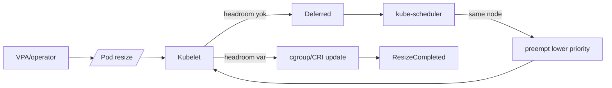
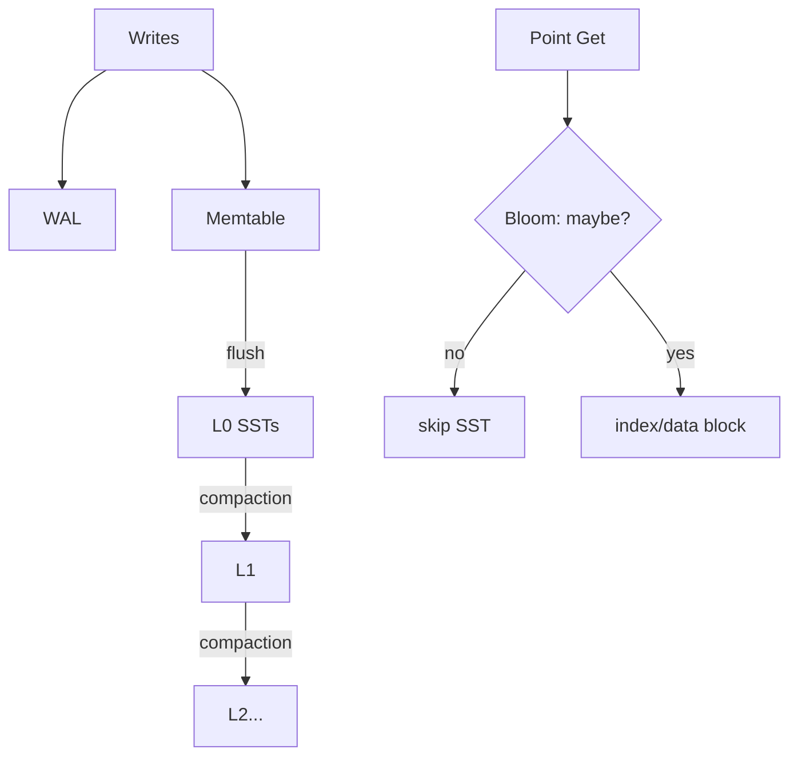

# 2026-09-19 02:00 — Interview Study Packages

README ve yakın `daily/2026-09-19/01-00.md` kontrol edildi; cell-based architecture ve OpenFeature tekrar edilmedi. Repo aramasında aşağıdaki iki başlık için doğrudan tekrar bulunmadı.

## Paket 1 — Mid → Principal Cloud/SRE: Kubernetes 1.37 In-Place Pod Resize Preemption & Resource Headroom
**Süre:** 20–30 dk

### Konu anlatımı
Kubernetes'te container CPU/memory request ve limit'lerini çalışan Pod'u yeniden yaratmadan değiştiren **in-place vertical scaling**, v1.35'ten beri stable. Temel problem scale-up'ın node üzerinde boş kapasite bulamamasıydı: kubelet geçerli fakat o anda uygulanamayan resize'ı `Deferred` olarak bırakıyordu. Kubernetes 1.37, opt-in Alpha `InPlacePodVerticalScalingSchedulerPreemption` ile scheduler'ın bu deferred resize için aynı node'daki daha düşük öncelikli Pod'ları preempt ederek headroom açabilmesini ekledi.

Bu mekanizma normal scheduling preemption'dan farklıdır: resize isteyen Pod zaten bir node'a bağlıdır; scheduler başka node aramak yerine yalnız mevcut node'da victim seçer. Kaynak yarışı olmaması için resize ile talep edilen kaynaklar scheduler açısından reserved kabul edilir. Kubelet actuation katmanıdır; scheduler ise priority/PDB/graceful termination semantics ile preemption kararını merkezileştirir.

`resizePolicy`, resource değişikliğinin container restart gerektirip gerektirmediğini belirler. CPU ve memory için default `NotRequired`; memory kullanan runtime'larda `RestartContainer` daha güvenli olabilir. QoS class creation-time'da sabittir ve resize ile değiştirilemez. Memory downsize ayrıca current usage ile yeni limit arasında race taşıdığı için best-effort'tur.

### Mental model

**Invariant:** resize request valid olsa bile node kapasitesi garanti değildir; `Deferred` başarısızlık değil bekleyen actuation state'idir. Preemption yalnız aynı node'da kapasite açabilir.

### İçeride ne oluyor?
- `/resize` subresource desired CPU/memory değerini günceller.
- Kubelet `PodResizePending` / `PodResizeInProgress` ve container status üzerinden progress bildirir.
- `Deferred`, request'in geçerli fakat geçici kapasite eksikliği nedeniyle uygulanamadığını belirtir; `Infeasible` kalıcı constraint ihlalidir.
- v1.37 Alpha scheduler preemption, deferred Pod'u scheduling değerlendirmesine dahil eder ve aynı node'da lower-priority victim seçebilir.
- `resizePolicy` container restart gereksinimini resource bazında tanımlar.
- QoS class resize ile değişmez; Guaranteed/Burstable kuralları korunmalıdır.

### Yüksek getirili mülakat soruları
1. Horizontal scaling ile in-place vertical scaling hangi bottleneck'leri farklı çözer?
2. `Deferred` ile `Infeasible` resize farkı nedir?
3. Resize preemption neden başka node seçmez?
4. CPU resize ile memory resize neden aynı risk profiline sahip değildir?
5. PDB ve PriorityClass victim seçimini nasıl etkiler?
6. Senior: VPA recommendation → resize → preemption loop'unda oscillation'ı nasıl engellersin?
7. Staff: cluster headroom ile low-priority bin-packing ekonomisini nasıl dengelersin?
8. Principal: preemption, Cluster Autoscaler ve node resizing controller'ı aynı platformda nasıl koordine edersin?

### Seviyeye göre cevap derinliği
- **Mid:** requests/limits, resizePolicy, Deferred/Infeasible ve QoS invariant'ını açıklar.
- **Senior:** VPA, kubelet/scheduler rolleri, PDB ve memory downsize riskini yönetir.
- **Staff:** headroom, priority taxonomy, autoscaling feedback loop ve SLO trade-off'u kurar.
- **Principal:** fleet-wide capacity economics, workload classes ve preemption governance tasarlar.

### Kısa alıştırma
8 CPU node üzerinde 4 CPU high-priority ve 3 CPU low-priority Pod çalışsın. High-priority Pod 6 CPU'ya resize istesin. Headroom, Deferred state, victim ve resize sonrası allocation'ı adım adım yaz. Aynı senaryoda PDB victim eviction'ı engellerse ne olacağını tartış.

### Proje fikri
`k8s-resize-preemption-lab`: kind/minikube üzerinde PriorityClass'lar, iki workload ve `/resize` patch. Deferred → preemption → completed event zincirini topla; resize wait time, victim count, restart count, node headroom ve application latency ölç.

### Failure modes / trade-off / production bağlantısı
Her resize'ın anında uygulanacağını sanmak, memory limit'i current RSS altına agresif indirmek, low-priority workload'ları PDB ile tamamen preemption-proof yapmak, priority inflation yaratmak ve autoscaler/preemption feedback loop'unu izlememek tipik hatalardır. Production'da resize pending duration, Deferred/Infeasible count, preemption/victim count, restart count, node allocatable headroom, OOM ve SLO latency izlenir.

### Kaynaklar
- Kubernetes — v1.37 Scheduler Preemption for In-Place Pod Resize, 10 Eylül 2026: https://kubernetes.io/blog/2026/09/10/kubernetes-v1-37-scheduler-preemption-for-in-place-pod-resize-alpha/
- Kubernetes — Resize CPU and Memory Resources assigned to Containers: https://kubernetes.io/docs/tasks/configure-pod-container/resize-container-resources/
- Kubernetes — Resource Management for Pods and Containers: https://kubernetes.io/docs/concepts/configuration/manage-resources-containers/

---

## Paket 2 — Junior → Staff Databases/Algorithms: RocksDB LSM Compaction, Bloom Filters & Amplification Budgets
**Süre:** 20–30 dk

### Konu anlatımı
LSM-tree write path'i random in-place update yerine önce WAL + memory structure'a yazar, sonra immutable sorted files (SST) üretir. Bu write throughput'u yükseltir fakat aynı key'in birden çok sorted run/level'da bulunabilmesi read amplification ve space amplification yaratır. **Compaction**, sorted run'ları merge ederek tree shape'i ve bu amplification bütçelerini kontrol eder.

RocksDB'de leveled, universal/tiered ve FIFO gibi compaction stilleri farklı read/write/space trade-off'ları seçer. Leveled compaction daha düzenli read path karşılığında daha fazla rewrite yapabilir. Tiered/universal daha az write amplification karşılığında read sırasında daha çok run kontrol ettirebilir. FIFO ise TTL/event-log benzeri workload'da eski file'ları düşürerek çok düşük write amplification sağlar ama genel amaçlı KV semantics değildir.

Bloom filter, point lookup'ta bir SST'nin key'i **kesinlikle içermediğini** ucuzca söyleyerek gereksiz data-block I/O'sunu engeller; positive sonuç ise yalnız `maybe`. False positive rate memory ile takas edilir. Range scan'lerde Bloom çoğunlukla fayda sağlamaz. Compaction yeni SST ürettiğinde filter da yeni key set'inden yeniden oluşturulur.

### Mental model

**Invariant:** Bloom false-negative üretmemelidir; compaction logical latest-value semantics'ini korurken physical layout'u yeniden yazar.

### İçeride ne oluyor?
- Memtable flush immutable SST üretir; L0 files key-range olarak overlap edebilir.
- Compaction seçili SST'leri merge/sort eder, obsolete versions/tombstone'ları uygun visibility kurallarıyla temizleyebilir.
- Leveled tree shape point/range read fan-out'u düşürmeye çalışır; bedeli rewrite I/O'dur.
- Bloom filter bit array + birden çok hash probe ile negative lookup'ı eler; positive lookup disk/cache kontrolü gerektirir.
- Filter/index block caching RAM tüketir fakat read I/O'yu azaltır.
- Compaction rate limiting read-tail-latency ile background catch-up arasında denge kurar.

### Yüksek getirili mülakat soruları
1. B+Tree yerine LSM neden write-heavy workload'da avantajlı olabilir?
2. Write, read ve space amplification nedir?
3. Bloom filter neden false negative üretmemeli, false positive üretebilir?
4. Bloom filter range scan'i neden hızlandırmaz?
5. Leveled ile universal/tiered compaction trade-off'u nedir?
6. Senior: compaction debt p99 read latency'yi nasıl bozar?
7. Staff: bits/key, block cache ve storage IOPS bütçesini nasıl birlikte seçersin?
8. Staff: tombstone-heavy workload ve snapshots varken garbage collection neden zorlaşır?

### Seviyeye göre cevap derinliği
- **Junior:** memtable, SST, compaction ve Bloom temelini açıklar.
- **Mid:** false-positive, cache ve read/write amplification ilişkisini kurar.
- **Senior:** compaction debt, tombstone, snapshots, rate limiting ve tail latency'yi tartışır.
- **Staff:** workload'a göre compaction style, memory/IO budget ve observability policy seçer.

### Kısa alıştırma
100 SST'nin her birinde %1 Bloom false-positive olduğunu varsay. Aranan key hiçbir SST'de yoksa beklenen false-positive file kontrolü yaklaşık kaçtır? Bloom memory'sini artırıp FPR'yi %0.1'e indirmenin RAM/IO trade-off'unu yaz.

### Proje fikri
`lsm-amplification-lab`: küçük log-structured KV veya RocksDB benchmark. Point-get ve range-scan workload'larını ayrı çalıştır; Bloom açık/kapalı ve compaction rate limit varyasyonlarında p50/p99 read latency, bytes written/read, cache hit ve compaction backlog ölç.

### Failure modes / trade-off / production bağlantısı
Bloom'u membership oracle sanmak, range-heavy workload'da filtre RAM'ini boşa harcamak, compaction'ı sınırsız I/O ile foreground read'leri boğmak, compaction'ı fazla kısmak ve L0/backlog biriktirmek, tombstone/snapshot retention'ını yok saymak tipik hatalardır. Production'da L0 file count, pending compaction bytes, write/read amplification, Bloom useful/false-positive metrics, block-cache hit, stall duration ve p99 latency izlenir.

### Kaynaklar
- RocksDB Wiki — Compaction: https://github.com/facebook/rocksdb/wiki/Compaction
- RocksDB Wiki — Bloom Filter: https://github.com/facebook/rocksdb/wiki/RocksDB-Bloom-Filter
- RocksDB Wiki — Setup Options and Basic Tuning: https://github.com/facebook/rocksdb/wiki/Setup-Options-and-Basic-Tuning
