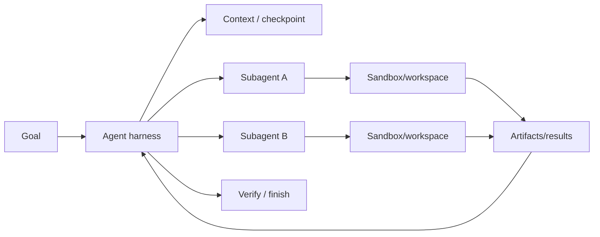
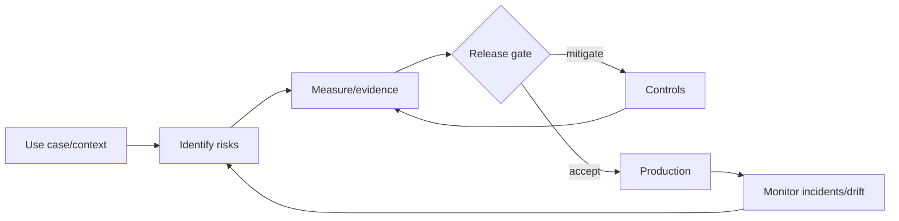

# 2026-09-19 03:00 — Interview Study Packages

README ve yakın `daily/2026-09-19/02-00.md` kontrol edildi; Kubernetes in-place resize/preemption ve RocksDB LSM/Bloom tekrar edilmedi. Repo aramasında aşağıdaki iki başlık için doğrudan tekrar bulunmadı.

## Paket 1 — Mid → Principal ML/AI/LLM/MLOps: Long-Running Agent Harness, Sandboxes & Subagent Coordination
**Süre:** 20–30 dk

### Konu anlatımı
Uzun süren agent workload'u tek bir LLM çağrısı değildir; model çağrıları, tool execution, dosya/workspace state'i, retries, checkpoints ve alt-agent koordinasyonunu yöneten bir **harness** problemidir. OpenAI, 10 Eylül 2026'da public beta Agents API'yi duyurdu; servis Codex harness ve infrastructure'ını managed biçimde sunuyor ve agent'ların günler süren işler, dosya/komut çalıştırma ve ara sonuç saklama gibi ihtiyaçlarını hedefliyor. Compute environment managed sandbox, kendi altyapın veya sandbox partneri olabilir.

Temel mimari ayrım **control/harness state** ile **compute workspace** arasındadır. Harness hangi işi, hangi context/tool policy ile, hangi subagent'a verdiğini takip eder; sandbox ise untrusted/side-effectful execution boundary'sidir. Uzun horizon'da tüm transcript'i sonsuza dek context'e taşımak yerine durable artifact/checkpoint üretmek gerekir. Subagent paralelliği latency'yi azaltabilir fakat duplicate work, conflicting writes ve token/tool maliyetini artırır.

### Mental model

**Invariant:** model reasoning ile execution authority aynı şey değildir; side effect sandbox/tool policy sınırından geçmeli, uzun iş yeniden başlatılabilir durable state bırakmalıdır.

### İçeride ne oluyor?
- Harness model/tool loop, context, subagent lifecycle ve result aggregation'ı yönetir.
- Sandbox filesystem/process/network capability'lerini sınırlar; harness'tan ayrılması isolation ve scaling sağlar.
- Checkpoint/artifact, context-window dışındaki durable progress contract'ıdır.
- Subagent fan-out bağımsız işleri paralelleştirir; shared-write işleri coordination ister.
- Retry yalnız idempotent veya deduplicated tool operation'larda güvenlidir.
- Verification stage “agent tamamladı” ile “çıktı doğru” ayrımını kurar.

### Yüksek getirili mülakat soruları
1. Agent harness ile model API çağrısı arasındaki fark nedir?
2. Sandbox neden yalnız container çalıştırmak demek değildir?
3. Uzun-running agent context büyümesini nasıl yönetirsin?
4. Tool retry hangi durumda duplicate side effect üretir?
5. Subagent fan-out ne zaman latency kazandırır, ne zaman maliyeti patlatır?
6. Senior: checkpoint/resume semantics'i nasıl tasarlarsın?
7. Staff: shared workspace'te conflicting write'ları nasıl önlersin?
8. Principal: managed harness vs self-hosted orchestration kararını security, cost, portability ve operability ile nasıl verirsin?

### Seviyeye göre cevap derinliği
- **Mid:** model, tool, harness, sandbox ve checkpoint rollerini ayırır.
- **Senior:** retries, idempotency, context compaction, verification ve failure recovery'yi tasarlar.
- **Staff:** subagent topology, workspace isolation, policy enforcement, telemetry ve cost budget kurar.
- **Principal:** build/buy, portability, data boundary, multi-tenant isolation ve platform governance kararı verir.

### Kısa alıştırma
Bir repo üzerinde 2 saat süren migration agent'ı çiz: plan, üç paralel subagent, test, review ve final write. Hangi state'in checkpoint olacağını, hangi tool call'un idempotency key gerektirdiğini ve sandbox network policy'sini yaz.

### Proje fikri
`durable-agent-harness-lab`: üç aşamalı repo-analysis agent'ı. Her aşama artifact/checkpoint üretir; intentional crash sonrası resume eder. Task success, resume success, duplicate side effect, tool error, token/tool cost ve wall-clock latency ölç.

### Failure modes / trade-off / production bağlantısı
Transcript'i tek durability mekanizması sanmak, sandbox'a geniş credential/network vermek, non-idempotent tool'u kör retry etmek, subagent'ları aynı dosyaya eşzamanlı yazdırmak, completion'ı verification sanmak ve fan-out maliyetini izlememek tipik hatalardır. Production'da task success, checkpoint age, resume rate, tool error/retry, sandbox violation, verification failure, token/tool cost ve p95 task duration izlenir.

### Kaynaklar
- OpenAI — Introducing the Agents API, 10 Eylül 2026: https://openai.com/index/introducing-the-agents-api/
- OpenAI — The next evolution of the Agents SDK, 15 Nisan 2026: https://openai.com/index/the-next-evolution-of-the-agents-sdk/

---

## Paket 2 — Senior → CTO Leadership/Product/AI Governance: NIST GenAI Risk Profile, Risk Registers & Release Gates
**Süre:** 20–30 dk

### Konu anlatımı
AI governance'ın production karşılığı “model güvenli mi?” diye tek skor üretmek değil; belirli kullanım bağlamındaki riskleri **identify → measure → mitigate → monitor** döngüsüne bağlamaktır. NIST AI 600-1 Generative AI Profile, AI RMF 1.0'a eşlik eden cross-sectoral bir profildir; 26 Temmuz 2024'te yayımlandı ve NIST sayfası 8 Nisan 2026'da güncellendi. GenAI'ye özgü riskleri organizasyonun amaç ve öncelikleriyle uyumlu risk-management action'larına bağlamayı hedefler.

Risk register yalnız compliance belgesi değil, engineering decision interface'idir: risk scenario, affected asset/user, likelihood/impact, evidence, owner, mitigation, residual risk ve release criterion birlikte tutulur. Release gate'in görevi sıfır risk istemek değil; önceden tanımlanmış risk appetite ve evidence threshold aşılmadan exposure'ı kontrollü tutmaktır. Model/provider değişimi, prompt/tool policy, retrieval corpus ve product UX değişiklikleri risk posture'u değiştirebilir; bu yüzden governance yalnız model registry seviyesinde kalmamalıdır.

### Mental model

**Invariant:** risk acceptance açık owner + evidence + residual-risk kararı gerektirir; “eval geçti” tek başına governance değildir.

### İçeride ne oluyor?
- Use-case context risk severity'yi belirler; aynı model farklı ürünlerde farklı risk taşır.
- Risk register teknik ve business owner'ı ortak karar nesnesinde buluşturur.
- Evaluation evidence offline benchmark, red-team, human review ve production telemetry'den gelebilir.
- Release gate threshold, exception path ve rollback/kill-switch ile operasyonel hale gelir.
- Residual risk mitigation sonrası kalan risktir; açıkça accept/transfer/avoid edilmelidir.
- Incident/postmortem sonuçları risk register ve eval suite'e geri beslenmelidir.

### Yüksek getirili mülakat soruları
1. AI risk ile model quality metric arasındaki fark nedir?
2. Risk register'da minimum hangi alanlar bulunmalı?
3. Offline eval neden production safety garantisi değildir?
4. Release gate'i nasıl bureaucracy'ye dönüşmeden kurarsın?
5. Human-in-the-loop hangi risklerde gerçekten control'dür?
6. Staff: model/provider değişikliğinin re-evaluation scope'unu nasıl belirlersin?
7. Principal: product velocity ile residual risk appetite'ı nasıl dengelersin?
8. CTO: board/regulator seviyesinde hangi leading/lagging AI risk göstergelerini raporlarsın?

### Seviyeye göre cevap derinliği
- **Senior:** concrete risk scenario, evidence, control ve owner tanımlar.
- **Staff:** eval/release/monitoring pipeline'ını risk register'a bağlar.
- **Principal:** cross-team control standardı, exception policy ve assurance evidence tasarlar.
- **CTO:** risk appetite, regulatory exposure, vendor concentration, incident economics ve product strategy'yi birlikte yönetir.

### Kısa alıştırma
Customer-support agent için beş risk yaz: yanlış bilgi, PII leakage, prompt injection/tool abuse, harmful output ve vendor outage. Her biri için evidence, mitigation, release threshold, owner ve production signal belirle.

### Proje fikri
`ai-risk-gate-lab`: YAML risk register + CI gate. Her risk için eval metric/threshold ve owner tanımla; model/prompt değişikliğinde ilgili eval setlerini çalıştır; exception expiry ve production incident feedback'i ekle.

### Failure modes / trade-off / production bağlantısı
Tek benchmark'ı safety score sanmak, risk owner koymamak, exception'ları süresiz bırakmak, vendor/model değişimini re-evaluation olmadan geçirmek, yalnız pre-release test yapmak ve incident feedback'ini eval suite'e taşımamak tipik hatalardır. Production'da policy violation, human override, harmful/incorrect outcome sample rate, PII/security incident, exception age, rollback rate ve risk-by-severity trend izlenir.

### Kaynaklar
- NIST — AI RMF: Generative Artificial Intelligence Profile (NIST AI 600-1), 26 Temmuz 2024; sayfa 8 Nisan 2026 güncellendi: https://www.nist.gov/publications/artificial-intelligence-risk-management-framework-generative-artificial-intelligence
- NIST — AI Risk Management Framework: https://www.nist.gov/itl/ai-risk-management-framework
