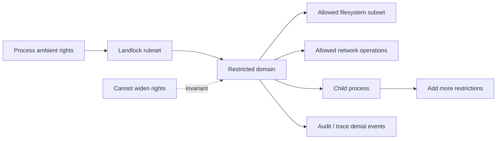
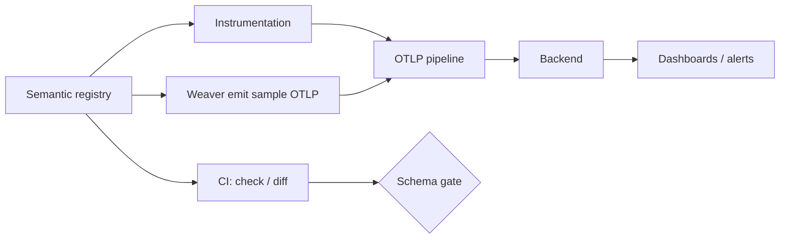

# 2026-09-19 04:00 — Interview Study Packages

README ve yakın `daily/2026-09-19/03-00.md` kontrol edildi. Long-running agent harness ve NIST GenAI governance tekrar edilmedi. Repo aramasında aşağıdaki iki başlık için doğrudan tekrar bulunmadı.

## Paket 1 — Mid → Principal Cybersecurity/Linux: Landlock LSM, Unprivileged Sandboxing & Denial Observability
**Süre:** 20–30 dk

### Konu anlatımı
Linux Landlock, bir process'in sahip olduğu ambient filesystem/network haklarını kendi kendine **yalnız daraltabilmesini** sağlayan stackable bir Linux Security Module'dür. Temel güvenlik fikri monotonic restriction'dır: Landlock mevcut DAC/LSM politikasını gevşetmez, üstüne yeni kısıt katmanı ekler. Bu yüzden unprivileged process bile kendi execution alanını daraltabilir; compromised uygulamanın blast radius'u azaltılabilir.

Sandbox tasarımında namespace ile access-control aynı şey değildir. Namespace resource görünürlüğü/izolasyonu sağlar; Landlock ise kernel object erişimine policy uygular. Ruleset hangi access right'ların handled olduğunu tanımlar; filesystem ve network rule'ları allowlist benzeri daraltma yapar. Domain oluşturulduktan sonra child process'ler restriction'ı miras alır ve daha fazla restriction ekleyebilir, geri açamaz.

Güncel kernel dokümantasyonu Landlock denial ve sandbox lifecycle olaylarının audit/ftrace/eBPF üzerinden gözlemlenebilmesini de belgeler. Bu production debugging için önemlidir: sandbox 'permission denied' üretirken bunun hangi domain/rule nedeniyle olduğunu ayırabilmek gerekir. Ancak bu telemetry hassas process/path bilgisi taşıyabileceğinden observability'nin kendisi de privilege boundary ister.

### Mental model

**Invariant:** Landlock policy yalnız yetki azaltır; sandboxed process kendi Landlock domain'ini kullanarak önceden kaybettiği hakkı geri kazanamaz.

### İçeride ne oluyor?
- `landlock_create_ruleset()` handled access-right set'ini oluşturur.
- `landlock_add_rule()` object/network rule'larını ruleset'e bağlar.
- `landlock_restrict_self()` current thread/process'i yeni domain'e geçirir; restriction descendants'a miras kalır.
- Landlock diğer DAC/LSM kontrollerinin yerine geçmez; kararların üzerine ek kısıt uygular.
- Network kuralları belirli TCP bind/connect operasyonlarını daraltabilir; IPC scoping ayrı bir boundary'dir.
- Güncel kernel trace events ruleset/domain lifecycle ve access denial'larını ftrace/eBPF ile görünür kılar.

### Yüksek getirili mülakat soruları
1. Landlock ile container namespace arasındaki fark nedir?
2. Unprivileged process'in security policy uygulaması neden privilege escalation yaratmaz?
3. Monotonic restriction hangi invariant'ı sağlar?
4. Landlock neden SELinux/AppArmor'un doğrudan alternatifi değildir?
5. Sandbox'ta filesystem allowlist tasarlarken hangi runtime dependency'leri unutmak kolaydır?
6. Senior: denial telemetry'sini nasıl toplar, hassas path/process bilgisini nasıl korursun?
7. Staff: seccomp + namespaces + Landlock katmanlarını hangi sırayla ve hangi threat model için kullanırsın?
8. Principal: developer platformunda sandbox policy versioning, compatibility ve rollout'u nasıl standardize edersin?

### Seviyeye göre cevap derinliği
- **Mid:** DAC, LSM, namespace ve Landlock rollerini ayırır.
- **Senior:** ruleset/domain inheritance, filesystem/network boundary ve debugging failure mode'larını açıklar.
- **Staff:** seccomp/namespaces/cgroups/Landlock defense-in-depth tasarımı ve telemetry güvenliğini kurar.
- **Principal:** platform policy lifecycle, kernel compatibility, exception process ve sandbox SLO'larını yönetir.

### Kısa alıştırma
Bir build worker için policy çiz: source tree read-only, `/tmp/work` read-write, artifact directory write, yalnız artifact proxy'ye network connect. Hangi ihtiyaç Landlock, namespace ve seccomp ile çözülür ayrı ayrı yaz; üç beklenen denial üret ve telemetry alanlarını belirle.

### Proje fikri
`landlock-runner-lab`: command wrapper; filesystem/network policy dosyasından Landlock ruleset kurup child process çalıştırır. Negative test suite, kernel ABI capability detection ve denial telemetry ekle. Escape attempt success, false denial, policy setup latency ve denied operation count ölç.

### Failure modes / trade-off / production bağlantısı
Landlock'u container isolation'ın tamamı sanmak, runtime library/config dosyalarını allowlist dışında bırakmak, kernel ABI capability'sini kontrol etmemek, denial telemetry'yi herkese açmak ve policy'yi versionlamamak tipik hatalardır. Production'da sandbox setup failure, denied access, policy version, unsupported ABI, exception rate ve sandbox escape/security incident sinyalleri izlenir.

### Kaynaklar
- Linux Kernel — Landlock: unprivileged access control, Ağustos 2026: https://kernel.org/doc/html/next/userspace-api/landlock.html
- Linux Kernel — Landlock LSM design: https://kernel.org/doc/html/next/security/landlock.html
- Linux Kernel — Landlock trace events, Ağustos 2026: https://kernel.org/doc/html/next/trace/events-landlock.html
- Linux Kernel — Landlock system-wide management/audit: https://www.kernel.org/doc/html/latest/admin-guide/LSM/landlock.html

---

## Paket 2 — Junior → Staff SRE/Backend: OpenTelemetry Weaver, Semantic-Convention Registries & Telemetry Contracts
**Süre:** 20–30 dk

### Konu anlatımı
Observability yalnız 'trace/metric/log gönder' problemi değildir; büyük sistemde asıl sorun telemetry'nin **anlam sözleşmesini** korumaktır. Aynı kavram farklı takımlar tarafından farklı attribute adı, unit veya cardinality ile üretilirse dashboard, alert ve query katmanı kırılganlaşır. OpenTelemetry semantic conventions ortak isim/anlam sözlüğü sağlar; Weaver ise registry'leri tanımlama, doğrulama, diff etme ve örnek telemetry üretme gibi schema-management işlerini CI/CD'ye taşır.

Mental model API schema migration'a benzer: instrumentation producer, registry contract'a uyar; collector/backend consumer'dır. Contract değişikliği additive, breaking veya semantic olabilir. `weaver registry check` registry policy'lerini doğrulayabilir; `weaver registry emit` gerçek uygulama hazır olmadan örnek OTLP telemetry üreterek dashboard/alert geliştirmeyi öne çekebilir. Custom registry resmi OTel convention'larını extend ederek domain-specific telemetry tanımlar.

OpenTelemetry'nin declarative SDK configuration modelinin temel parçaları 5 Mart 2026'da stable ilan edildi. Bu, instrumentation behavior ile telemetry schema'yı ayrı ama versionlanabilir contracts olarak ele almak için güçlü bir production modelidir.

### Mental model

**Invariant:** telemetry producer ve consumer aynı semantic contract'ı paylaşmalıdır; isim doğru ama anlam/unit/cardinality yanlışsa observability yine bozulur.

### İçeride ne oluyor?
- Registry attribute, entity ve signal semantic'lerini versionlanabilir tanımlar.
- Weaver registry check schema/policy consistency'yi CI'da doğrular.
- Diff, telemetry contract evolution'ını review edilebilir hale getirir.
- Emit, instrumentation tamamlanmadan örnek OTLP sinyali üretip downstream contract'ı test eder.
- Custom registry resmi semantic conventions'ı extend edip domain-specific vocabulary ekleyebilir.
- Cardinality policy, unit ve stability metadata backend maliyet/correctness açısından API contract kadar önemlidir.

### Yüksek getirili mülakat soruları
1. Semantic convention neden yalnız naming convention değildir?
2. Metric unit değişikliği neden breaking telemetry change olabilir?
3. High-cardinality attribute hangi production sorunlarını doğurur?
4. Registry'yi CI gate'e koymanın getirisi nedir?
5. Sample telemetry üretmek dashboard geliştirme akışını nasıl değiştirir?
6. Senior: schema rename migration'ında dual-write/query compatibility'yi nasıl yönetirsin?
7. Staff: company-specific registry ile upstream OTel conventions arasında ownership nasıl kurulur?
8. Staff: telemetry contract drift'ini runtime'da nasıl tespit edersin?

### Seviyeye göre cevap derinliği
- **Junior:** metric/log/trace ve attribute kavramlarını doğru ayırır.
- **Mid:** semantic convention, unit ve cardinality'nin consumer etkisini açıklar.
- **Senior:** schema evolution, dual-read/write, CI validation ve backend cost trade-off'unu tasarlar.
- **Staff:** organizasyon çapında telemetry governance, registry ownership, compatibility ve rollout standardı kurar.

### Kısa alıştırma
Checkout servisi için `checkout.duration`, `checkout.result` ve `customer.segment` telemetry contract'ı tasarla. Unit, allowed values, cardinality ve stability alanlarını yaz. Sonra `checkout.duration` milliseconds -> seconds değişikliğinin dashboard ve alert migration planını çıkar.

### Proje fikri
`telemetry-contract-lab`: custom semantic registry + CI check + sample OTLP emit. İki registry version'ı arasında breaking diff üret; dashboard fixture'ını sample telemetry ile test et. Schema violation, unknown attribute, cardinality budget ve dashboard contract-test sonuçlarını raporla.

### Failure modes / trade-off / production bağlantısı
Attribute adını serbest metin bırakmak, user/request ID'yi metric label yapmak, unit'i metadata sanmak, schema rename'i tek deploy'da yapmak, registry owner koymamak ve dashboard'u gerçek production telemetry gelene kadar bekletmek tipik hatalardır. Production'da unknown/deprecated attribute, cardinality growth, telemetry ingest cost, dropped points, schema-version adoption ve broken-query/alert sinyalleri izlenir.

### Kaynaklar
- OpenTelemetry — Semantic Convention Registry: https://opentelemetry.io/docs/specs/semconv/registry/
- OpenTelemetry — Observability by Design / Weaver: https://opentelemetry.io/blog/2025/otel-weaver/
- OpenTelemetry — Declarative configuration stable, 5 Mart 2026: https://opentelemetry.io/blog/2026/stable-declarative-config/
