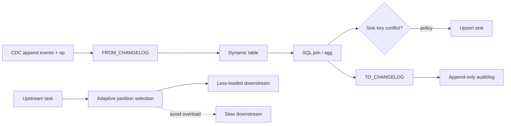
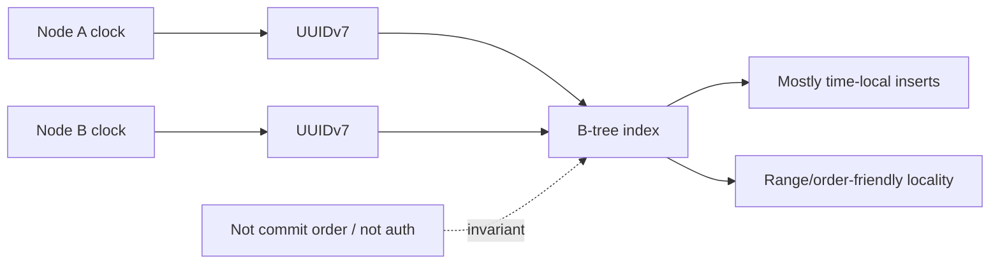

# 2026-09-19 05:00 — Interview Study Packages

README ve yakın `daily/2026-09-19/04-00.md` kontrol edildi. Landlock ve OpenTelemetry Weaver tekrar edilmedi. Repo aramasında Python free-threading ve Kubernetes DRA/Gateway API'nin daha önce işlendiği görüldüğü için bu turda kullanılmadı. Aşağıdaki iki başlık için doğrudan tekrar bulunmadı.

## Paket 1 — Mid → Principal Data Engineering/Distributed Systems: Flink 2.3 Changelog Conversion, Conflict Semantics & Backpressure-Aware Partitioning
**Süre:** 20–30 dk

### Konu anlatımı
Streaming SQL'de tablo sabit bir snapshot değil, zaman içinde `INSERT`, `UPDATE_BEFORE`, `UPDATE_AFTER` ve `DELETE` değişiklikleriyle evrilen dynamic table'dır. Production sınırında sorun şudur: CDC kaynağı veya append-only sink bu semantiği çoğu zaman düz event satırları olarak taşır. Apache Flink 2.3, SQL seviyesinde `FROM_CHANGELOG` ve `TO_CHANGELOG` Process Table Function'larını ekleyerek append-only event representation ile updating-table representation arasında açık dönüşüm kurar.

`FROM_CHANGELOG`, operation-code taşıyan append-only satırları engine'in gerçek changelog semantiğine çevirir. Full update image beklentisi kritiktir: `UPDATE_BEFORE`/`UPDATE_AFTER` eksikliği downstream aggregation/join correctness'ini bozabilir. `TO_CHANGELOG` ters yönde dynamic table'ı operation-code içeren append-only satırlara dönüştürür; audit/log/archive ve append-only sink'lerde kullanışlıdır. Mapping ile bazı operation'ları düşürmek mümkündür ama bu bir semantic decision'dır, yalnız format dönüşümü değildir.

Flink 2.3 ayrıca upsert key ile sink primary key uyuşmazlığında davranışı `ON CONFLICT` ile görünür hale getirir: `DO NOTHING`, `DO ERROR`, `DO DEDUPLICATE`. Runtime tarafında adaptive partition selection, round-robin yerine downstream load'a göre daha boş kanalları seçebilir. Bu, hot/slow subtask kaynaklı backpressure'ı azaltabilir; fakat key-partitioning gibi correctness gerektiren routing'i keyfi biçimde değiştirmez.

### Mental model

**Invariant:** changelog representation değişebilir, fakat update/delete semantiği kaybolursa sonuç tablosu artık aynı değildir.

### İçeride ne oluyor?
- `FROM_CHANGELOG` operation column'ını yorumlar ve output'tan çıkarır; bilinmeyen/null op runtime failure üretebilir.
- `TO_CHANGELOG` dynamic-table change kind'larını normal INSERT satırlarına ve explicit op alanına encode eder.
- Flink 2.3 temel kullanımda full before/after update image beklentisini açıkça belirtir.
- `ON CONFLICT` sink key uyuşmazlığında correctness/state-cost kararını explicit yapar.
- Adaptive partitioner opt-in'dir; downstream channel load bilgisini kullanarak idlest adaylardan seçim yapar.
- Watermark alignment/backpressure/state growth birlikte düşünülmelidir: throughput kazanımı event-time correctness veya state budget'tan bağımsız değildir.

### Yüksek getirili mülakat soruları
1. Dynamic table ile append-only event stream arasındaki fark nedir?
2. `UPDATE_BEFORE` neden bazı aggregation/join'lerde gereklidir?
3. `TO_CHANGELOG` neden yalnız serialization değildir?
4. Upsert key ile sink primary key farklıysa hangi correctness problemi çıkar?
5. `DO ERROR` ile `DO DEDUPLICATE` arasında nasıl seçim yaparsın?
6. Senior: CDC kaynağında before-image yoksa pipeline contract'ını nasıl tasarlarsın?
7. Staff: adaptive partitioning throughput'u artırırken hangi ordering/key invariants korunmalı?
8. Principal: schema/changelog compatibility, replay ve sink semantics'i organizasyon çapında nasıl standardize edersin?

### Seviyeye göre cevap derinliği
- **Mid:** insert/update/delete changelog ve append/upsert/retract farkını açıklar.
- **Senior:** before-image, sink key, dedup state, replay ve late-data failure mode'larını yönetir.
- **Staff:** partitioning/backpressure, watermark, state growth ve exactly-once sink contract'ını birlikte tasarlar.
- **Principal:** CDC semantic contract, schema evolution, migration/replay ve platform guardrail'lerini standardize eder.

### Kısa alıştırma
`orders(id,status,total)` için `c/ub/ua/d` kodlu CDC stream'i çiz. `FROM_CHANGELOG` mapping'ini tanımla; status bazlı count aggregation'da `ub` kaybolursa sonucu göster. Ardından append-only audit sink için `TO_CHANGELOG` tasarla ve hangi operation'ları asla filtrelememen gerektiğini gerekçelendir.

### Proje fikri
`flink-changelog-contract-lab`: sentetik CDC -> `FROM_CHANGELOG` -> aggregation -> upsert sink + `TO_CHANGELOG` audit branch. Missing-before-image, duplicate event, conflicting key ve slow downstream fault injection ekle. Correctness diff, state bytes, backpressure time, checkpoint duration ve end-to-end lag ölç.

### Failure modes / trade-off / production bağlantısı
Before-image yokken full changelog varsaymak, DELETE'i audit dönüşümünde yanlışlıkla filtrelemek, sink key uyuşmazlığını sessiz dedup'a bırakmak, adaptive partitioning'i key correctness'in yerine koymak ve throughput'u state/checkpoint maliyetinden bağımsız optimize etmek tipik hatalardır. Production'da changelog-kind dağılımı, invalid op, conflict count, dedup state size, backpressure, watermark lag, checkpoint duration/failure ve sink reconciliation drift izlenir.

### Kaynaklar
- Apache Flink 2.3 — Changelog Conversion: https://nightlies.apache.org/flink/flink-docs-release-2.3/docs/sql/reference/queries/changelog/
- Apache Flink 2.3.0 Release Announcement, 25 Haziran 2026: https://flink.apache.org/2026/06/25/apache-flink-2.3.0-release-announcement/
- Apache Flink 2.3 Release Notes — FLIP-564/558/339: https://nightlies.apache.org/flink/flink-docs-master/release-notes/flink-2.3/

---

## Paket 2 — Junior → Staff Backend/Databases: UUIDv7, B-Tree Locality & Identifier Semantics
**Süre:** 20–30 dk

### Konu anlatımı
Dağıtık sistemlerde identifier seçimi yalnız uniqueness problemi değildir; index locality, information leakage, ordering semantics ve generation authority de etkilenir. RFC 9562, UUIDv7'yi Unix epoch timestamp tabanlı, zaman sıralanabilir 128-bit UUID biçimi olarak standardize eder. PostgreSQL 18 core `uuidv7()` fonksiyonu ile UUIDv7 üretebilir; mevcut `uuid` tipi RFC 9562 UUID'lerini saklar.

Random UUIDv4 B-tree index'e geniş key-space boyunca dağınık insert yapar. UUIDv7'nin yüksek bitlerinde zaman bilgisi olduğundan yeni değerler genel olarak index'in yakın bölgelerine gelir; bu cache/page locality açısından avantaj sağlayabilir. Fakat 'time-ordered' ile global total order aynı şey değildir: farklı node clock'ları, aynı millisecond içinde randomness/monotonicity stratejisi ve transaction commit order nedeniyle UUID sırası business-event veya commit sırası olarak yorumlanmamalıdır.

UUIDv7 ayrıca timestamp bilgisini ID içinde görünür kılar. Bu, debugging/partitioning için yararlı olabilir ama ID'yi opaque secret sanan tasarımlarda metadata leakage yaratır. Identifier'ın authorization token olmadığı unutulmamalıdır.

### Mental model

**Invariant:** UUIDv7 uniqueness ve temporal locality sağlar; tek başına causality, commit ordering veya access control sağlamaz.

### İçeride ne oluyor?
- UUID 128 bittir; RFC 9562 v7 Unix timestamp tabanlı layout tanımlar.
- PostgreSQL 18 `uuidv7()` millisecond timestamp + sub-millisecond/random bileşenlerle time-ordered UUID üretir.
- `uuid_extract_timestamp()` v1/v7 UUID'den timestamp çıkarabilir; bu metadata'nın gerçekten görünür olduğunu gösterir.
- B-tree locality random v4'e göre write/cache davranışını iyileştirebilir; gerçek kazanç workload, fill factor, concurrency ve storage'a bağlıdır.
- Client-side generation DB round trip/central sequence ihtiyacını azaltır; fakat clock behavior ve implementation compatibility sorumluluğunu client fleet'e dağıtır.
- UUID primary key kullanmak business uniqueness constraint'lerinin yerine geçmez.

### Yüksek getirili mülakat soruları
1. UUIDv4 ile UUIDv7 arasındaki temel fark nedir?
2. UUIDv7 neden B-tree için daha locality-friendly olabilir?
3. UUIDv7 sırası neden transaction commit sırası değildir?
4. ID'deki timestamp hangi privacy/security etkisini yaratır?
5. DB-side ve client-side ID generation trade-off'u nedir?
6. Senior: multi-region clock skew varken pagination/order semantics'i nasıl kurarsın?
7. Senior: UUID primary key varken neden ayrıca business unique constraint gerekir?
8. Staff: UUIDv4 -> v7 migration'ında index, API compatibility, dual-write/backfill ve rollback planını nasıl tasarlarsın?

### Seviyeye göre cevap derinliği
- **Junior:** uniqueness, UUIDv4 randomlığı ve UUIDv7 zaman sıralanabilirliğini açıklar.
- **Mid:** B-tree locality, DB/client generation ve opaque-ID varsayımını tartışır.
- **Senior:** clock skew, pagination, index/storage behavior, migration ve privacy failure mode'larını yönetir.
- **Staff:** identifier contract'ını API, storage, event ordering, observability ve multi-region mimariyle birlikte standardize eder.

### Kısa alıştırma
Bir `orders` tablosunda 10M UUIDv4 primary key olduğunu varsay. Yeni kayıtlar için v7'ye geçiş planı çıkar: schema/API değişmeden nasıl geçersin, hangi index metriklerini önce/sonra ölçersin ve neden `ORDER BY id` ifadesini kesin event ordering contract'ı yapmazsın?

### Proje fikri
`uuid-locality-lab`: PostgreSQL 18'de aynı schema ile UUIDv4 ve UUIDv7 insert benchmark'ı. Index size, buffer hit, WAL bytes, insert latency ve page split göstergelerini karşılaştır; concurrency ve fillfactor varyasyonları ekle. Ayrıca extracted timestamp'in privacy etkisini gösteren küçük API testi yaz.

### Failure modes / trade-off / production bağlantısı
UUIDv7'yi global sequence sanmak, ID'yi authorization mekanizması yapmak, timestamp leakage'i göz ardı etmek, client clock/implementation çeşitliliğini test etmemek, business uniqueness'i yalnız UUID'ye bırakmak ve locality kazancını benchmark etmeden varsaymak tipik hatalardır. Production'da collision/error, generation latency, clock anomaly, index growth/bloat, buffer hit, WAL/write latency ve migration-version dağılımı izlenir.

### Kaynaklar
- IETF RFC 9562 — Universally Unique IDentifiers, Mayıs 2024: https://www.rfc-editor.org/rfc/rfc9562.html
- PostgreSQL 18 — UUID Type: https://www.postgresql.org/docs/18/datatype-uuid.html
- PostgreSQL 18 — UUID Functions (`uuidv7`, extractors): https://www.postgresql.org/docs/18/functions-uuid.html
- PostgreSQL 18 Release Notes — `uuidv7()`, 25 Eylül 2025: https://www.postgresql.org/docs/18/release-18.html
