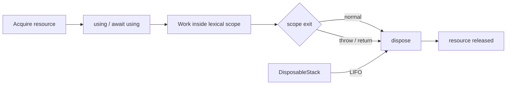

# 2026-09-19 06:00 — Interview Study Packages

README ve yakın `daily/2026-09-19/05-00.md` kontrol edildi. Flink changelog semantics ve UUIDv7 tekrar edilmedi. Repo aramasında Go 1.26 Green Tea GC'nin daha önce işlendiği görüldüğü için elendi. Aşağıdaki iki başlık için doğrudan tekrar bulunmadı.

## Paket 1 — Mid → Principal Backend/Cybersecurity: HTTP Message Signatures, Digest Fields & Replay-Safe Verification
**Süre:** 20–30 dk

### Konu anlatımı
TLS hop-to-hop kanal güvenliği sağlar; fakat bir HTTP mesajının seçilmiş semantik bileşenlerinin uygulama katmanında kim tarafından imzalandığını ve aradaki proxy/gateway zincirinden sonra değişmediğini tek başına kanıtlamaz. RFC 9421 HTTP Message Signatures, `@method`, `@authority`, `@target-uri` ve seçilmiş header alanlarından deterministik bir signature base üretir; `Signature-Input` hangi bileşenlerin ve metadata'nın imzalandığını, `Signature` ise kriptografik değeri taşır.

Body integrity ayrı bir contract'tır. RFC 9530 `Content-Digest` ile HTTP message content'inin, `Repr-Digest` ile representation data'nın digest'ini tanımlar. Body'yi güven zincirine katmak için digest alanını üretip HTTP Message Signature içinde bu alanı da cover etmek güçlü bir pattern'dir. Digest tek başına authentication değildir; saldırgan digest'i değiştirebilir. Signature da TLS'nin confidentiality rolünü kaldırmaz.

Replay savunması yalnız signature doğrulamaktan ibaret değildir. Verifier signer/key policy, gerekli covered components, `created`/`expires`, kabul edilen clock skew ve uygulamaya özgü nonce/idempotency state'i kontrol etmelidir. Hangi alanların cover edildiği security boundary'dir: imzalanmayan fakat routing/authorization davranışını etkileyen alan saldırı yüzeyi bırakabilir.

### Mental model
```mermaid
flowchart LR
  C[Client] --> D[Content-Digest]
  D --> B[Signature base]
  M[@method / @authority / @target-uri] --> B
  B --> S[Signature-Input + Signature]
  S --> P[Proxy / gateway]
  P --> V[Verifier]
  V --> T{key + coverage + time + replay policy}
  T -->|pass| A[Application]
  T -->|fail| R[Reject]
```
**Invariant:** cryptographic verification yalnız imzalanan bileşenleri kanıtlar; verifier'ın application policy'si coverage, freshness ve signer trust'ı ayrıca enforce etmelidir.

### İçeride ne oluyor?
- RFC 9421 raw HTTP bytes yerine canonical signature base üretir; intermediary-safe semantik bileşenler seçilebilir.
- `@signature-params` signature metadata'sını da signature base'e bağlar.
- `created` önerilir; `expires` ve maximum signature age uygulama policy'siyle enforce edilebilir.
- RFC 9530 `Content-Digest` ve `Repr-Digest` ayrımı content encoding/representation semantiği nedeniyle önemlidir.
- TLS hâlâ confidentiality ve transport security için gereklidir.
- Multiple signatures desteklenir; verifier hangi signer/tag/coverage'ın kendi use-case'i için geçerli olduğunu seçmelidir.

### Yüksek getirili mülakat soruları
1. TLS varken neden HTTP Message Signature isteyebilirsin?
2. HMAC ile raw request bytes imzalamak neden proxy/intermediary ortamında kırılgan olabilir?
3. `Content-Digest` ile `Repr-Digest` farkı nedir?
4. Signature başarılı olduğu halde request nasıl güvensiz olabilir?
5. Replay'i `created`/`expires` tek başına tamamen çözer mi?
6. Senior: webhook doğrulamasında hangi derived/header components'i zorunlu cover edersin?
7. Staff: key rotation ve multi-signer migration'ını downtime olmadan nasıl yaparsın?
8. Principal: organization-wide signing profile'da algorithm agility, canonicalization, clock skew ve replay-store maliyetini nasıl standardize edersin?

### Seviyeye göre cevap derinliği
- **Mid:** digest, signature, TLS ve authentication/integrity farklarını açıklar.
- **Senior:** coverage, replay, clock skew, key rotation ve intermediary transform failure mode'larını yönetir.
- **Staff:** gateway/verifier policy, multi-signer rollout, observability ve backward compatibility tasarlar.
- **Principal:** trust domain, crypto agility, key lifecycle ve cross-service protocol standardını belirler.

### Kısa alıştırma
`POST /payments/{id}` webhook'u için minimum covered component set'i tasarla. Body için `Content-Digest`, request için `@method`, `@authority`, `@target-uri` ve bir idempotency identifier düşün. 5 dakikalık replay window ve 30 saniye clock skew varken verifier karar sırasını yaz.

### Proje fikri
`http-signature-gateway-lab`: signer + reverse proxy + verifier kur. Header rewrite, body mutation, expired signature, wrong key, duplicate nonce ve unsigned routing-header fault injection ekle. Verification latency, replay-store hit, signature-age, unknown-key ve coverage-policy failure metriklerini ölç.

### Failure modes / trade-off / production bağlantısı
Raw bytes canonicalization varsaymak, digest'i authentication sanmak, kritik routing alanını cover etmemek, invalid signature test etmeden verifier'ın gerçekten enforce ettiğini varsaymak, clock skew'i yok saymak ve replay cache'i limitsiz büyütmek tipik hatalardır. Production'da verify failure reason, signature age/skew, replay detection, unknown key id, algorithm distribution ve p95 verification cost izlenir.

### Kaynaklar
- IETF RFC 9421 — HTTP Message Signatures, Şubat 2024: https://www.rfc-editor.org/rfc/rfc9421.html
- IETF RFC 9530 — Digest Fields, Şubat 2024: https://www.rfc-editor.org/rfc/rfc9530.html

---

## Paket 2 — Junior → Staff Frontend/Backend: ECMAScript Explicit Resource Management, `using` & Deterministic Cleanup
**Süre:** 20–30 dk

### Konu anlatımı
Garbage collector memory lifetime'ını yönetir; file descriptor, lock, DB transaction, stream handle veya temporary resource gibi dış kaynakların ne zaman bırakılacağını garanti etmez. ECMAScript'in explicit resource management modeli lexical scope sonunda deterministic cleanup kurar. `using` declaration bir disposable resource'ı scope'a bağlar; resource `Symbol.dispose` sağlarsa scope çıkışında cleanup çalışır. Async kaynaklar için `await using` ve `Symbol.asyncDispose` kullanılır.

`DisposableStack`/`AsyncDisposableStack`, birden fazla cleanup action'ını LIFO düzeninde toplar. Bu model `try/finally` ihtiyacını ortadan kaldırmaz; resource ownership'i standart bir protocol ile ifade eder. Kritik soru ownership'tir: resource'u kim acquire ettiyse hangi scope'un dispose edeceği açık olmalıdır. Resource başka scope'a transfer ediliyorsa stack transfer/move semantiği veya API contract'ı gerekir.

Cleanup sırasında hem business operation hem dispose hata verebilir. Explicit resource management bu çift-hata durumunu kaybetmeden temsil etmek için suppressed-error semantiğine sahiptir. Interview'da syntax'tan daha değerli nokta deterministic lifetime, ownership, exception safety ve async cleanup'ın latency/backpressure etkisidir.

### Mental model

**Invariant:** GC reachability ile external-resource lifetime aynı şey değildir; deterministic cleanup lexical ownership contract'ıdır.

### İçeride ne oluyor?
- `using` binding dispose capability'sini kaydeder ve scope completion'da cleanup çalıştırır.
- `await using` async disposal'ı await eder; scope completion latency'sine cleanup süresi eklenir.
- Stack yapıları nested resource acquisition'da reverse-order cleanup sağlar.
- Early return/throw cleanup'ı atlamamalıdır; deterministic scope bunun ana değeridir.
- Cleanup failure original failure'ı gölgelememeli; suppressed-error semantics önemlidir.
- Closure ile resource'u lexical scope dışına kaçırmak disposed-resource use-after-close hatası yaratabilir.

### Yüksek getirili mülakat soruları
1. GC varken deterministic disposal neden gerekir?
2. `using` ile `try/finally` arasındaki ilişki nedir?
3. Cleanup neden LIFO olmalıdır?
4. `await using` request latency'sini nasıl etkileyebilir?
5. Resource scope dışına kaçarsa hangi bug sınıfı oluşur?
6. Senior: DB transaction + lock + stream birlikte acquire edilirse ownership/cleanup sırasını nasıl kurarsın?
7. Senior: work ve dispose aynı anda hata verirse observability nasıl olmalı?
8. Staff: framework API'larında Disposable protocol adoption'ını backward compatibility ile nasıl standardize edersin?

### Seviyeye göre cevap derinliği
- **Junior:** GC ile explicit cleanup farkını ve lexical lifetime'ı açıklar.
- **Mid:** sync/async disposal, LIFO ve exception path'lerini yönetir.
- **Senior:** ownership transfer, double-dispose, cleanup failure ve latency etkisini tasarlar.
- **Staff:** library contracts, telemetry, compatibility ve organization-wide resource-lifetime convention kurar.

### Kısa alıştırma
DB connection, transaction ve temporary file kullanan bir request handler çiz. Normal return, query exception ve cleanup exception yollarında hangi kaynağın hangi sırayla bırakılacağını yaz. Ardından async cleanup'ın timeout bütçesine etkisini ekle.

### Proje fikri
`resource-lifetime-lab`: `Symbol.dispose`/`Symbol.asyncDispose` implement eden üç mock resource ve `DisposableStack` tabanlı request pipeline yaz. Early return, nested throw, slow async dispose ve cleanup failure fault injection ekle; leaked-resource count ve cleanup latency ölç.

### Failure modes / trade-off / production bağlantısı
GC'nin socket/file handle'ı zamanında kapatacağını varsaymak, ownership'i belirsiz bırakmak, resource'u scope dışına kaçırmak, async cleanup'ı request deadline'dan bağımsız bırakmak, dispose'u non-idempotent tasarlayıp double-close side effect üretmek ve cleanup failure telemetry'sini yutmak tipik hatalardır. Production'da open-resource gauge, cleanup error, disposal duration, timeout ve pool exhaustion izlenir.

### Kaynaklar
- TC39 — ECMAScript living specification: https://tc39.es/ecma262/
- TC39 — Explicit Resource Management specification: https://tc39.es/proposal-explicit-resource-management/
- TC39 — Async Explicit Resource Management: https://tc39.es/proposal-async-explicit-resource-management/
