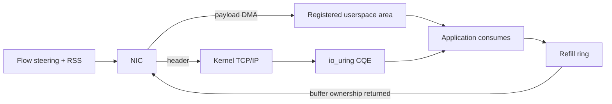
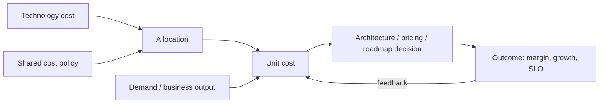

# 2026-09-19 07:00 — Interview Study Packages

README ve yakın `daily/2026-09-19/06-00.md` kontrol edildi. HTTP Message Signatures ve ECMAScript Explicit Resource Management tekrar edilmedi. Repo aramasında bu iki başlık için doğrudan tekrar bulunmadı.

## Paket 1 — Mid → Principal Networking/Backend: Linux io_uring Zero-Copy Rx, Buffer Ownership & NIC Queue Steering
**Süre:** 20–30 dk

### Konu anlatımı
Klasik network receive path'te NIC DMA ile veriyi kernel buffer'a alır, TCP/IP stack header'ları işler ve payload çoğu socket API'sinde userspace buffer'a kopyalanır. `io_uring` zero-copy Rx (ZC Rx), payload'ı doğrudan önceden kayıtlı userspace memory alanına alarak kernel→userspace payload copy maliyetini kaldırmayı hedefler; kernel TCP stack'i header ve protocol processing yapmaya devam eder. Bu, DPDK gibi kernel-bypass modeli değildir.

Performans kazancı yalnız API çağrısından gelmez. NIC'in header/data split yapabilmesi, zero-copy akışların özel RX queue'larına flow steering ile yönlendirilmesi ve diğer trafik için RSS dağılımının doğru kurulması gerekir. Uygulama registered area içindeki buffer/chunk'ların ownership lifecycle'ını yönetir; completion geldikten sonra payload tüketilir ve buffer refill ring üzerinden kernel'e geri verilir. Buffer'ı erken recycle etmek use-after-recycle/corruption; geç recycle etmek ise receive starvation/backpressure üretir.

### Mental model

**Invariant:** zero-copy copy maliyetini azaltır; ownership, queue steering ve backpressure problemlerini ortadan kaldırmaz.

### İçeride ne oluyor?
- ZC Rx için `IORING_SETUP_SINGLE_ISSUER` ile ring kurulumu ve interface/RX queue registration gerekir.
- NIC tarafında header/data split gerekir; header kernel stack'e, payload registered userspace memory'ye gider.
- Flow steering zero-copy flow'ları ayrılmış hardware RX queue'larına yönlendirir; RSS diğer flow'ları bu queue'lardan uzak tutar.
- Kernel registered area'yı chunk'lara böler; daha büyük `rx_buf_len` fiziksel contiguous memory ve hardware/kernel desteğine bağlıdır.
- CQE payload offset/length bilgisini taşır; application tüketim sonrası area token ile refill ring'e buffer döndürür.
- Zero-copy throughput/CPU avantajı memory pinning, queue affinity, buffer pressure ve operational complexity karşılığında gelir.

### Yüksek getirili mülakat soruları
1. Zero-copy Rx hangi kopyayı kaldırır, TCP processing'i de bypass eder mi?
2. DPDK/kernel bypass ile farkı nedir?
3. Header/data split neden gerekir?
4. Flow steering ve RSS birlikte neden önemlidir?
5. Buffer erken veya geç recycle edilirse ne olur?
6. Senior: p99 latency yükselirken CPU düşüyorsa hangi queue/buffer metriklerine bakarsın?
7. Staff: fallback path ve capability detection'ı nasıl tasarlarsın?
8. Principal: ZC Rx adoption kararını throughput, CPU/core economics, NIC portability ve operability ile nasıl verirsin?

### Seviyeye göre cevap derinliği
- **Mid:** copy path, DMA, CQE ve buffer recycle modelini açıklar.
- **Senior:** queue steering, affinity, buffer starvation, fallback ve observability'yi yönetir.
- **Staff:** workload segmentation, NIC capability matrix, rollout ve SLO benchmark tasarlar.
- **Principal:** hardware bağımlılığı, core economics, portability ve platform abstraction trade-off'unu verir.

### Kısa alıştırma
Bir TCP ingest service için klasik `recv()` ve ZC Rx path'ini çiz. 100 Gbit/s trafik altında CPU, memory bandwidth, RX queue depth ve refill availability için dört hipotez yaz. Buffer tüketimi yavaşladığında backpressure'ın nerede görüneceğini işaretle.

### Proje fikri
`zcrx-benchmark-lab`: desteklenen Linux/NIC ortamında klasik socket receive ile io_uring ZC Rx'i karşılaştır. bytes/core, cycles/byte, p50/p99 latency, RX drops, refill occupancy ve CPU utilization ölç; capability yoksa normal path'e fallback et.

### Failure modes / trade-off / production bağlantısı
NIC capability'yi varsaymak, flow steering'i yanlış queue'ya vermek, refill ring'i aç bırakmak, buffer'ı consumer bitmeden recycle etmek, NUMA/CPU affinity'yi yok saymak ve yalnız throughput benchmark etmek tipik hatalardır. Production'da packets/bytes per core, CQ depth, refill availability, RX drop/error, queue imbalance, memory footprint ve p99 latency birlikte izlenir.

### Kaynaklar
- Linux kernel — io_uring zero copy Rx: https://kernel.org/doc/html/latest/networking/iou-zcrx.html
- Linux kernel — Networking documentation: https://www.kernel.org/doc/html/latest/networking/
- Linux kernel — Interface statistics: https://www.kernel.org/doc/html/latest/networking/statistics.html

---

## Paket 2 — Senior → CTO Leadership/Product/Business: FinOps 2026 Unit Economics, Allocation & Technology-Value Decisions
**Süre:** 20–30 dk

### Konu anlatımı
Teknoloji maliyetini yalnız aylık cloud bill olarak yönetmek, büyüyen bir ürünün pahalı mı yoksa başarılı mı olduğunu ayırt edemez. Unit economics teknoloji spend'ini business/technical output ile ilişkilendirir: cost per transaction, cost per active customer, cost per inference/token, cost per case resolved veya contribution-margin benzeri ölçüler. FinOps Framework 2026, FinOps'u public-cloud optimizasyonundan daha geniş teknoloji değer yönetimine taşır ve Executive Strategy Alignment capability'sini ekler.

Unit metric güvenilirliği allocation kalitesine bağlıdır. Direct cost owner/product'a atanabilir; shared platform/network/support maliyeti fixed, proportional veya proxy-driver ile dağıtılabilir ya da bilinçli biçimde merkezi tutulabilir. Amaç kusursuz muhasebe değil, doğru davranışı tetikleyecek kadar güvenilir decision modelidir. Average unit cost tek başına yanıltıcı olabilir; marginal cost, demand mix, SLO/quality ve fully-loaded cost sınırları ayrıca düşünülmelidir.

### Mental model

**Invariant:** cost reduction tek başına value optimization değildir; denominator ve business outcome yanlışsa unit metric yanlış davranışı optimize eder.

### İçeride ne oluyor?
- Allocation account/tag/label ve derived metadata ile cost ownership kurar.
- Shared cost allocation fixed, proportional veya proxy metric tabanlı olabilir; her cost'u zorla dağıtmak şart değildir.
- Unit Economics teknoloji maliyetini value/demand unit'iyle bağlar ve engineering ile product/finance arasında ortak dil kurar.
- Fully-loaded metric direct cloud cost'un ötesinde platform, license veya ilgili teknoloji kategorilerini kapsayabilir.
- Metric definition/version/owner açık olmalıdır; denominator drift veya scope change trend'i bozabilir.
- 2026 Framework teknoloji value kararlarını executive strategy ve workload placement'a daha erken bağlar.

### Yüksek getirili mülakat soruları
1. Toplam cloud cost artarken unit cost düşüyorsa bunu nasıl yorumlarsın?
2. Cost per request neden her ürün için iyi business metric değildir?
3. Shared platform maliyetini nasıl allocate edersin?
4. Showback ile chargeback davranış açısından nasıl farklılaşır?
5. Average ve marginal unit cost ne zaman farklı karar üretir?
6. Staff: cost per tenant metriğinde noisy-neighbor ve enterprise discount etkisini nasıl normalize edersin?
7. Principal: architecture review'e unit economics'i hangi gate/forecast ile eklersin?
8. CTO: cost, margin, reliability ve growth arasında hangi metric tree ile yatırım kararı verirsin?

### Seviyeye göre cevap derinliği
- **Senior:** cost driver, allocation, denominator ve SLO trade-off'unu açıklar.
- **Staff:** product/service ownership, shared-cost policy, metric pipeline ve anomaly loop kurar.
- **Principal:** architecture/workload-placement kararlarını unit economics ve forecast ile bağlar.
- **CTO:** technology portfolio, margin, pricing, vendor strategy ve risk appetite'ı ortak value modelinde yönetir.

### Kısa alıştırma
Aylık teknoloji maliyeti 300k→420k, başarılı transaction 100M→175M olan bir ürün için direct cost/transaction trend'ini hesapla. Sonra 80k shared platform cost'unu transaction volume'a göre allocate et ve sonucu SLO'nun 99.9→99.99 iyileşmesiyle birlikte yorumla.

### Proje fikri
`tech-unit-economics-lab`: billing export + service ownership + request/business event verisini birleştir. Direct/shared allocation policy'si, versioned unit metric definitions ve dashboard üret; cost per transaction/customer ile SLO ve revenue proxy trend'lerini yan yana göster.

### Failure modes / trade-off / production bağlantısı
Yanlış denominator seçmek, unallocated cost'u gizlemek, shared cost dağıtımını politik gerçek sanmak, discount/commitment etkisini karıştırmak, kalite/SLO düşüşünü 'tasarruf' diye raporlamak ve metric definition'ı versionlamamak tipik hatalardır. Production/operating review'da allocation coverage, unallocated %, unit cost trend, marginal cost, forecast variance, SLO ve business outcome birlikte izlenir.

### Kaynaklar
- FinOps Foundation — Framework 2026: https://www.finops.org/framework/
- FinOps Foundation — Unit Economics capability: https://www.finops.org/framework/capabilities/unit-economics/
- FinOps Foundation — Allocation capability: https://www.finops.org/framework/capabilities/allocation/
- FinOps Foundation — 2026 Framework changes, 19 Mart 2026: https://www.finops.org/insights/2026-finops-framework/
