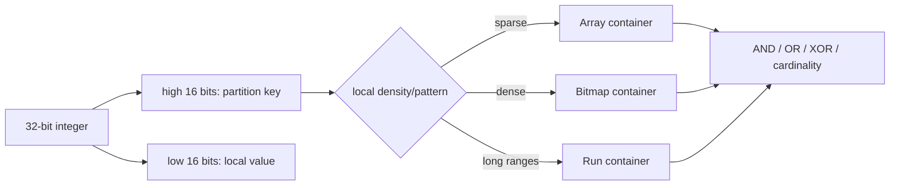
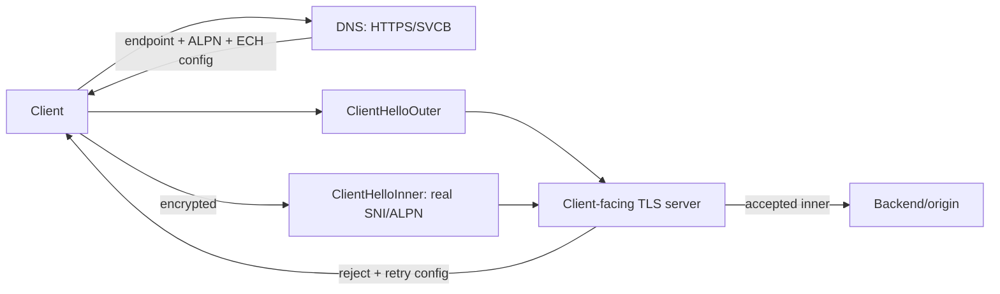

# 2026-09-19 08:00 — Interview Study Packages

README ve yakın `daily/2026-09-19/07-00.md` kontrol edildi. io_uring Zero-Copy Rx ve FinOps unit economics tekrar edilmedi. Repo aramasında Roaring Bitmap ile DNS SVCB/HTTPS + ECH için doğrudan önceki paket bulunmadı.

## Paket 1 — Junior → Staff Algorithms & Data Structures / Data Engineering: Roaring Bitmaps, Container Switching & Set-Operation Economics
**Süre:** 20–30 dk

### Konu anlatımı
Bitmap, integer set üyeliğini bit pozisyonuyla temsil eder: `x` varsa `bitmap[x]=1`. Dense domain'de üyelik ve AND/OR/XOR gibi set işlemleri çok hızlıdır; fakat sparse ve geniş domain'de düz bitmap büyük boş alan taşır. Roaring Bitmap bu problemi 32-bit integer uzayını üst 16 bit'e göre partition ederek ve her partition'ın alt 16-bit değerlerini yoğunluğa göre farklı container representation'larında tutarak çözer.

Temel container türleri array, bitmap ve run container'dır. Sparse partition array container ile az sayıda 16-bit değer saklar; yoğun partition sabit boyutlu bitmap container'a geçer; ardışık değerler run-length benzeri run container ile ekonomik olabilir. Kritik fikir tek bir compression formatına zorlamak değil, local density'ye göre representation seçmektir. Set intersection/union sırasında container-type çiftine göre farklı algoritma seçilir; cardinality metadata'sı ve SIMD-friendly word operations performansı yükseltir.

### Mental model

**Invariant:** compression ratio ile operation speed aynı hedef değildir; doğru container seçimi workload'un density ve set-operation mix'ine bağlıdır.

### İçeride ne oluyor?
- 32-bit value üst 16 bit ile container'a, alt 16 bit ile container içindeki üyeliğe ayrılır.
- Sparse container sorted 16-bit array sayesinde compact kalır ve binary/merge-style operations kullanabilir.
- Dense container 2^16 bitlik bitmap ile word/SIMD tabanlı AND/OR ve popcount'a uygundur.
- Run container uzun contiguous range'lerde iyi sıkıştırır; random sparse data'da faydası azalır.
- Operation dispatch container çiftine göre array-array, array-bitmap, bitmap-bitmap gibi specialized path seçer.
- Serialization ve container cardinality metadata'sı query engine/cache katmanlarında önemli olur.

### Yüksek getirili mülakat soruları
1. Hash set yerine bitmap ne zaman daha iyi olur?
2. Sparse 32-bit domain'de düz bitmap neden pahalıdır?
3. Roaring neden high/low 16-bit partitioning kullanır?
4. Array container ne zaman bitmap container'a dönüşmelidir?
5. Intersection için array-array ile bitmap-bitmap algoritmaları nasıl farklıdır?
6. Senior: cardinality-heavy analytics workload'unda CPU/cache locality'yi nasıl ölçersin?
7. Staff: posting-list, hash set ve Roaring arasında storage/query trade-off'unu nasıl seçersin?
8. Staff: distributed bitmap index'te partitioning ve merge maliyetini nasıl tasarlarsın?

### Seviyeye göre cevap derinliği
- **Junior:** bitset, membership ve AND/OR set işlemlerini açıklar.
- **Mid:** sparse/dense representation ve container switching mantığını açıklar.
- **Senior:** cache locality, SIMD/popcount, serialization ve operation mix'i değerlendirir.
- **Staff:** query-engine/index architecture, distributed partitioning ve memory/CPU economics kararını verir.

### Kısa alıştırma
Üç set düşün: A={1,2,3,4}, B={2,4,65000}, C=0..60000. Düz bitmap, sorted array ve Roaring için yaklaşık storage davranışını karşılaştır. `A∩B` ve `C∩B` için hangi representation'ın neden avantajlı olacağını yaz.

### Proje fikri
`roaring-index-lab`: 10 milyon integer ID için hash set, sorted vector ve Roaring tabanlı inverted index kur. Membership, intersection, union ve cardinality benchmark'ı yap; bytes/value, p50/p99 latency, CPU cycles ve cache-miss oranını density'ye göre çiz.

### Failure modes / trade-off / production bağlantısı
Her sparse set için bitmap kullanmak, yalnız compression ratio ölçmek, container conversion maliyetini yok saymak, adversarial/random density değişimlerini test etmemek ve serialization compatibility'yi düşünmemek tipik hatalardır. Production'da bytes/cardinality, container-type distribution, set-op latency, cache-miss, allocation rate ve serialization/deserialization cost izlenir.

### Kaynaklar
- Roaring Bitmaps: Implementation of an Optimized Software Library: https://arxiv.org/abs/1709.07821
- CRoaring repository/documentation: https://github.com/RoaringBitmap/CRoaring
- RoaringBitmap project: https://roaringbitmap.org/

---

## Paket 2 — Mid → Principal Networking/Cybersecurity: DNS SVCB/HTTPS Records, ECH Discovery & Privacy Boundaries
**Süre:** 20–30 dk

### Konu anlatımı
Klasik DNS A/AAAA çözümlemesi client'a çoğunlukla yalnız IP adresi verir; client protocol/port/alternative endpoint bilgisini bağlantı denemeleri sırasında öğrenir. RFC 9460 SVCB ve HTTPS resource record'ları service endpoint ile `alpn`, `port`, address hints ve extensible service parameters'ı DNS katmanında birlikte yayınlamayı sağlar. HTTPS RR, HTTP origin'leri için SVCB'nin özel varyantıdır. AliasMode apex aliasing gibi delegation senaryolarını; ServiceMode ise priority + target + key/value service parameters modelini sağlar.

2026'da RFC 9849 ile standartlaşan TLS Encrypted Client Hello (ECH), gerçek SNI ve ALPN gibi hassas ClientHello alanlarını `ClientHelloInner` içinde şifreler; dışarıda `ClientHelloOuter` görünür. ECH configuration'ın DNS ile advertisement'ı SVCB/HTTPS mekanizmasına bağlanır. Bu nedenle TLS privacy artık yalnız TLS library konusu değildir: DNS resolver privacy, HTTPS RR freshness/cache, front-end anonymity set ve fallback/retry davranışı birlikte threat model'e girer.

### Mental model

**Invariant:** ECH plaintext SNI leakage'ını azaltır; DNS query, IP address, traffic analysis ve küçük anonymity set gibi diğer metadata kanallarını otomatik olarak gizlemez.

### İçeride ne oluyor?
- SVCB/HTTPS ServiceMode priority, target name ve service parameters taşır; AliasMode service ownership/delegation için kullanılır.
- Client HTTPS RR'dan ALPN/endpoint bilgisini erken öğrenerek gereksiz connection attempts'i azaltabilir.
- ECH client gerçek handshake parametrelerini Inner'a koyup public-key ile korur; Outer public-facing routing/compatibility yüzüdür.
- RFC 9849'a göre ECH rejection application data için kullanılacak normal başarı değildir; client güncel configuration ile retry edebilir.
- Privacy anonymity set'e bağlıdır: aynı client-facing configuration arkasında daha çok origin gözlemciye karşı ayrıştırmayı zorlaştırabilir.
- Encrypted DNS olmadan DNS lookup hedef adı açığa çıkarabilir; ECH tek başına end-to-end metadata invisibility sağlamaz.

### Yüksek getirili mülakat soruları
1. HTTPS RR, A/AAAA'dan hangi ek bilgileri sağlar?
2. SVCB AliasMode ve ServiceMode farkı nedir?
3. ECH neden yalnız 'SNI encryption' diye düşünülmemeli?
4. ClientHelloOuter ve ClientHelloInner rollerini açıkla.
5. ECH varken plaintext DNS neden privacy leak olmaya devam eder?
6. Senior: stale ECH config ve rejection/retry davranışını nasıl gözlemlersin?
7. Staff: multi-CDN HTTPS RR rollout'unda TTL, priority ve fallback'i nasıl tasarlarsın?
8. Principal: ECH adoption'ında privacy, availability, middlebox compatibility ve observability trade-off'unu nasıl yönetirsin?

### Seviyeye göre cevap derinliği
- **Mid:** DNS RR, ALPN, SNI ve Inner/Outer modelini doğru açıklar.
- **Senior:** cache/TTL, fallback, rejection, encrypted DNS ve failure diagnostics'i yönetir.
- **Staff:** multi-CDN/service discovery, rollout, telemetry ve anonymity-set etkisini tasarlar.
- **Principal:** privacy architecture, dependency/failure domains, policy ve organization-wide migration standardını kurar.

### Kısa alıştırma
`example.com` için iki endpoint'li bir HTTPS RR taslağı çiz: bir endpoint HTTP/3 desteklesin, diğeri fallback olsun. ECH config stale olduğunda client'ın DNS lookup → ECH reject → retry akışını çiz ve hangi adımda hangi metadata'nın gözlemciye açık kalabileceğini işaretle.

### Proje fikri
`svcb-ech-lab`: test domain/resolver ortamında HTTPS RR parse eden küçük client yaz. ALPN/priority seçimini, TTL cache'ini ve ECH-config rotation simülasyonunu logla. Resolution latency, selected endpoint, ECH accept/reject, retry count ve fallback rate ölç.

### Failure modes / trade-off / production bağlantısı
HTTPS RR'ı A/AAAA replacement gibi basitleştirmek, mandatory-key semantics'i yanlış uygulamak, TTL/config rotation uyumunu düşünmemek, ECH rejection'ı sessizce plaintext downgrade'a çevirmek, DNS privacy'yi yok saymak ve yalnız handshake success izlemek tipik hatalardır. Production'da HTTPS-RR resolution success/latency, RR age, endpoint selection, ALPN distribution, ECH accept/reject/retry, fallback, handshake latency ve provider-specific failure oranları izlenir.

### Kaynaklar
- RFC 9460 — Service Binding and Parameter Specification via DNS: https://www.rfc-editor.org/rfc/rfc9460.html
- RFC 9849 — TLS Encrypted Client Hello, Mart 2026: https://www.rfc-editor.org/rfc/rfc9849.html
- OpenSSL — ECH support, 11 Mart 2026: https://openssl-library.org/post/2026-03-11-ech/
