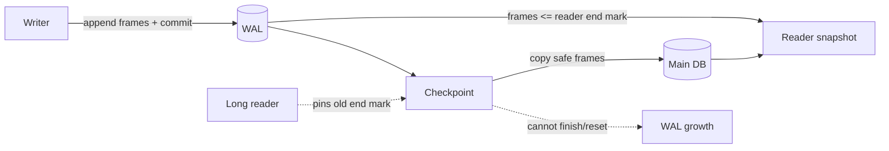
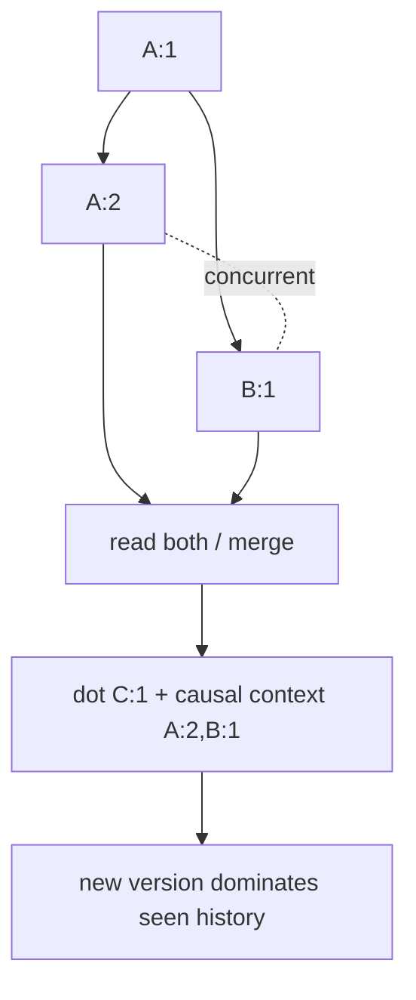

# 2026-09-19 09:00 — Interview Study Packages

README ve yakın `daily/2026-09-19/08-00.md` kontrol edildi. Roaring Bitmap ile DNS SVCB/HTTPS + ECH tekrar edilmedi. Repo aramasında SQLite WAL checkpoint starvation ve dotted version vectors/causal context için doğrudan önceki paket bulunmadı.

## Paket 1 — Junior → Staff Databases/Backend: SQLite WAL, Checkpoint Starvation & Embedded-DB Concurrency
**Süre:** 20–30 dk

### Konu anlatımı
SQLite WAL (Write-Ahead Logging), rollback journal modelini tersine çevirir: ana database dosyasını commit sırasında yerinde değiştirmek yerine değişen page'leri `-wal` dosyasına append eder. Commit, WAL'a commit marker eklenmesiyle tamamlanabilir. Reader kendi transaction'ı başlarken WAL içindeki görünür son commit noktasını — end mark — sabitler; böylece writer yeni frame'ler append ederken reader eski snapshot'ını okumaya devam edebilir.

Bu model `readers block writers` problemini büyük ölçüde azaltır fakat `many writers` problemi çözülmüş değildir: normal WAL modunda aynı anda tek writer vardır. Üçüncü temel operasyon checkpoint'tir. Checkpoint WAL frame'lerini ana database'e geri taşır; fakat aktif bir reader'ın end mark'ının ötesine geçemez. Uzun yaşayan veya sürekli üst üste binen reader'lar checkpoint'in tamamlanmasını engellerse WAL büyür: checkpoint starvation.

SQLite'ın varsayılan auto-checkpoint eşiği 1000 page'dir. Bu bir correctness sabiti değil, workload-dependent bir varsayılandır. Küçük WAL read path'i rahatlatabilir; sık checkpoint ise write latency/I/O maliyetini yükseltebilir. `PASSIVE`, `FULL`, `RESTART`, `TRUNCATE` checkpoint modları farklı blocking/progress trade-off'ları taşır.

### Mental model

**Invariant:** WAL, reader/writer concurrency sağlar; unlimited writer concurrency sağlamaz. Checkpoint progress'i reader lifetime ile bağlıdır.

### İçeride ne oluyor?
- WAL frame'i değişen bir database page'in yeni halini taşır; commit marker transaction sınırını belirler.
- Reader başlangıçta end mark seçer ve snapshot isolation benzeri sabit görünüm okur.
- `wal-index` reader'ın page'in en güncel görünür frame'ini hızlı bulmasına yardım eder; shared memory gereksinimi nedeniyle klasik WAL aynı host varsayımına dayanır.
- Normal WAL'da tek writer append eder; write transaction'ı uzun tutmak diğer writer'ların kuyrukta beklemesine yol açar.
- Checkpoint aktif reader'ın ihtiyaç duyduğu WAL geçmişini ezemez; reader gap yoksa reset/truncate tamamlanamayabilir.
- `synchronous=FULL` ile commit durability maliyeti farklıdır; `NORMAL` daha az sync ile latency kazanırken power-loss durability trade-off'u yaratır.

### Yüksek getirili mülakat soruları
1. WAL rollback journal'dan kavramsal olarak nasıl farklıdır?
2. Reader ve writer aynı anda nasıl ilerleyebilir?
3. Neden WAL modunda yine tek writer vardır?
4. Checkpoint ne yapar ve neden gereklidir?
5. Checkpoint starvation nasıl oluşur?
6. Senior: `SQLITE_BUSY` gördüğünde transaction scope, busy timeout ve retry'ı nasıl ayırırsın?
7. Senior: auto-checkpoint eşiğini hangi metriklerle tune edersin?
8. Staff: SQLite'ı high-concurrency service'te kullanma kararını Postgres gibi client/server DB ile nasıl kıyaslarsın?

### Seviyeye göre cevap derinliği
- **Junior:** WAL'ın append + checkpoint modelini ve transaction kavramını doğru açıklar.
- **Mid:** reader snapshot/end mark, single writer ve busy davranışını bağlar.
- **Senior:** checkpoint starvation, fsync/durability, transaction lifetime ve latency tail'ini ölçer.
- **Staff:** workload shape, failure domain, operational simplicity, local-first/edge kullanım ve migration boundary üzerinden teknoloji seçer.

### Kısa alıştırma
Bir process'te 20 kısa reader, bir 60 saniyelik reader ve saniyede 100 kısa write olduğunu varsay. WAL size'ın neden büyüyebileceğini çiz. Uzun reader'ı 500 ms'lik parçalara böldüğünde checkpoint progress ve snapshot semantics'in nasıl değişeceğini tartış.

### Proje fikri
`sqlite-wal-lab`: aynı DB üzerinde configurable reader lifetime ve write rate üreten küçük benchmark kur. `wal_autocheckpoint` değerini değiştir; WAL bytes, checkpointed frames, busy count, commit p50/p99, read p99 ve fsync davranışını ölç. Uzun reader ekleyip starvation'ı kontrollü üret.

### Failure modes / trade-off / production bağlantısı
WAL'ı “lock yok” sanmak, transaction içinde network çağrısı yapmak, `SQLITE_BUSY` için sınırsız retry, WAL büyümesini disk problemi diye görmek, aggressive TRUNCATE ile reader latency'sini bozmak ve durability ayarını workload'dan bağımsız seçmek tipik hatalardır. Production'da WAL bytes/pages, checkpoint progress, active/longest read transaction, write transaction duration, busy rate, commit/read p99 ve disk sync latency izlenir.

### Kaynaklar
- SQLite — Write-Ahead Logging: https://www.sqlite.org/wal.html
- SQLite — Isolation: https://www.sqlite.org/isolation.html
- SQLite — PRAGMA `wal_checkpoint` / `wal_autocheckpoint`: https://www.sqlite.org/pragma.html
- SQLite — Database File Format / WAL: https://www.sqlite.org/fileformat.html#the_write_ahead_log

---

## Paket 2 — Mid → Principal Distributed Systems/System Design: Dotted Version Vectors, Causal Context & Conflict Economics
**Süre:** 20–30 dk

### Konu anlatımı
Eventually consistent, multi-replica bir sistemde iki write fiziksel saatlere bakılarak güvenilir biçimde “hangisi önceydi?” diye sıralanamaz. Asıl soru nedenselliktir: B write'ı A'yı görerek üretildiyse `A happens-before B`; iki write birbirini görmeden oluştuysa concurrent'dır. Vector clock her actor için görülen event counter'ını tutarak bu partial order'ı temsil eder.

Sorun, client'ın okuduğu causal history ile yeni event'i yeterince hassas temsil edemediğimizde gereksiz sibling/conflict üretilebilmesidir. Dotted Version Vector (DVV), yeni version'ı tekil bir “dot” `(actor,counter)` ile, geçmişi ise causal context ile ayırır. Böylece “bu update tam olarak hangi yeni event?” ile “bu client hangi geçmişi zaten görmüştü?” farklı kavramlar olur. Riak 2.x dokümantasyonu DVV'leri klasik vector clock'lara tercih eder; temel operasyonel gerekçe sibling explosion'ı daha iyi sınırlamaktır.

Causal metadata conflict'i sihirli biçimde çözmez. İki write gerçekten concurrent ise sistem hâlâ domain-specific merge, CRDT, sibling exposure veya last-write-wins gibi bir policy seçmelidir. Timestamp/LWW basittir fakat clock skew ve gerçek concurrent intent'in kaybı nedeniyle veri kaybettirebilir.

### Mental model

**Invariant:** causal order wall-clock order değildir; concurrent değerler “eski/yeni” diye zorla sıralanmak zorunda değildir.

### İçeride ne oluyor?
- Vector `V` actor→counter map'idir; `V1 <= V2` ise V2, V1'in causal history'sini içerir.
- İki vector birbirini dominate etmiyorsa event'ler concurrent kabul edilir.
- DVV'de dot yeni event kimliğini; context daha önce gözlenen event setinin compact özetini taşır.
- Read/modify/write client'ın aldığı causal context'i write ile geri göndermelidir; context kaybı gereksiz sibling üretir.
- Replica/read-repair/anti-entropy aynı causal relation'ı kullanarak obsolete version'ları ayıklayabilir.
- Metadata büyümesi actor identity tasarımına bağlıdır; per-client actor gibi yüksek churn maliyetlidir.

### Yüksek getirili mülakat soruları
1. Physical timestamp neden causality için yeterli değildir?
2. Vector clock iki update'in concurrent olduğunu nasıl gösterir?
3. “Dominates” ne demektir?
4. DVV'deki dot ile causal context'in görevleri neden ayrıdır?
5. Causal context kaybedilirse ne olur?
6. Senior: sibling explosion'ın latency ve memory etkisini nasıl teşhis edersin?
7. Staff: DVV, LWW ve CRDT arasında nasıl seçim yaparsın?
8. Principal: actor cardinality, metadata budget ve application merge semantics'i organizasyon çapında nasıl standardize edersin?

### Seviyeye göre cevap derinliği
- **Mid:** happens-before, concurrent ve vector comparison'ı örnekle açıklar.
- **Senior:** read/modify/write, context propagation, sibling lifecycle ve anti-entropy ilişkisini kurar.
- **Staff:** conflict policy'yi domain invariant, availability ve metadata economics ile seçer.
- **Principal:** causal API contract, actor model, observability ve cross-service consistency standardı tasarlar.

### Kısa alıştırma
`A={a:2,b:1}`, `B={a:1,b:2}`, `C={a:2,b:2}` vector'larını karşılaştır. Hangi çiftler concurrent, hangilerinde dominance var? Sonra A ve B'yi görerek yapılan yeni `c` actor write'ının dot/context temsilini çiz.

### Proje fikri
`causal-kv-lab`: üç replica'lı in-memory KV yap. Network partition sırasında iki tarafta concurrent write üret; vector clock ve DVV metadata'sını ayrı modlarda simüle et. Conflict count, sibling count, metadata bytes/object, merge latency ve read-repair maliyetini ölç.

### Failure modes / trade-off / production bağlantısı
Wall clock'u causal clock sanmak, context'i API'de kaybetmek, her request/client için yeni actor yaratmak, gerçek concurrent conflict'i otomatik “en yeni” değere ezmek, sibling sayısını izlememek ve domain merge'ini associative/commutative sanmak tipik hatalardır. Production'da sibling/conflict rate, siblings/object, causal-context bytes, merge failures, read-repair/anti-entropy work, conflict-resolution latency ve lost-update business signals izlenir.

### Kaynaklar
- Riak KV — Causal Context, Vector Clocks and Dotted Version Vectors: https://docs.riak.com/riak/kv/2.2.3/learn/concepts/causal-context/index.html
- Riak KV — Conflict Resolution: https://docs.riak.com/riak/kv/2.2.0/developing/usage/conflict-resolution.1.html
- Paulo Sérgio Almeida et al. — Dotted Version Vectors / causality research: https://arxiv.org/abs/1011.5808
