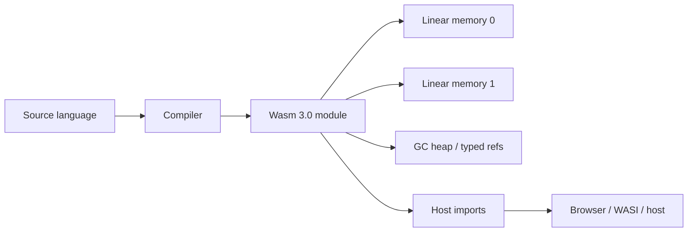
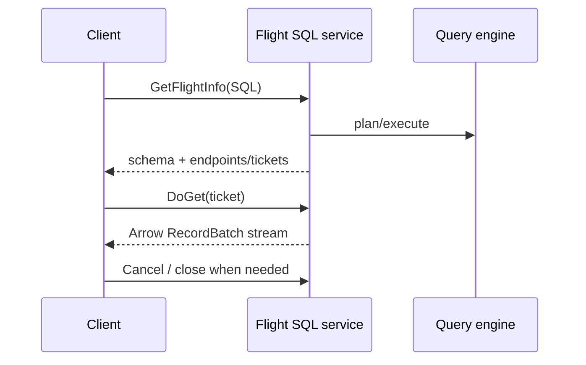

# 2026-09-19 10:00 — Interview Study Packages

README ve yakın `daily/2026-09-19/09-00.md` kontrol edildi. SQLite WAL ve Dotted Version Vectors tekrar edilmedi. Repo aramasında aşağıdaki iki konu için doğrudan önceki paket bulunmadı.

## Paket 1 — Junior → Staff Frontend/Runtime/System Design: WebAssembly 3.0, memory64, Multiple Memories & Runtime Boundaries
**Süre:** 20–30 dk

### Konu anlatımı
WebAssembly (Wasm), taşınabilir bir binary instruction format ve doğrulanabilir execution modelidir. 17 Eylül 2025'te tamamlanan Wasm 3.0; 64-bit address space (`memory64`), aynı module içinde multiple memories, garbage-collected storage/types, typed references, tail calls, native exception handling, relaxed SIMD ve deterministic execution profile gibi büyük yetenekleri standartlaştırdı.

`memory64`, linear-memory adres tipini `i32` yerine `i64` yapabilir. Teorik adres alanı 4 GiB'den 16 EiB'ye çıkar; bu, fiziksel RAM garantisi değildir. Web embedding'i ayrıca limit uygulayabilir. Multiple memories ise code/data, trusted/untrusted state veya instrumentation buffer gibi bölgeleri ayrı linear address spaces olarak modellemeyi kolaylaştırır. Fakat memory isolation tek başına capability security değildir: host import'ları hâlâ authority sınırıdır.

Wasm GC, linear memory'nin yerine geçen genel bir managed runtime değildir; compiler'ın struct/array/reference tipleri üzerinden runtime-managed heap kullanmasına olanak verir. Typed references ve `call_ref` daha zengin high-level language compilation sağlar. Tail calls ve exception handling de compiler'ın host'a kaçmadan daha doğal control-flow üretmesini sağlar.

### Mental model

**Invariant:** Wasm memory safety, host capability safety ile aynı şey değildir. Module'ın gerçek authority'sini imports/embedding belirler.

### İçeride ne oluyor?
- Validation, module'ın type-correct instruction/control-flow kullanmasını execution'dan önce kontrol eder.
- `memory64` address operand'larını 64-bit yapar; pointer width büyümesi memory footprint ve ABI'yi etkileyebilir.
- Multiple memories tek module içinde ayrı address spaces ve memory-to-memory copy senaryoları sağlar.
- GC proposal struct/array heap types ve typed references verir; source-language object modelini compiler tasarlar.
- Tail call mevcut frame'i büyütmeden callee'ye transfer sağlar; recursive/functional workloads için önemlidir.
- Deterministic profile, floating-point/relaxed SIMD gibi implementation-dependent sonuçlarda reproducibility isteyen ortamlar için ortak davranış tanımlar.

### Yüksek getirili mülakat soruları
1. WebAssembly JVM veya container ile aynı şey midir?
2. Linear memory nedir ve neden memory-safe olabilir?
3. `memory64` neyi çözer, neyi çözmez?
4. Multiple memories security boundary olarak ne kadar güçlüdür?
5. Wasm GC neden Java/Go GC'sinin birebir kopyası değildir?
6. Senior: 32-bit pointer ABI'den memory64'a geçişte hangi performans/regression risklerini ölçersin?
7. Staff: browser plugin, edge compute ve server-side sandbox için Wasm seçimini nasıl kıyaslarsın?
8. Staff: host imports/capabilities için least-authority API nasıl tasarlarsın?

### Seviyeye göre cevap derinliği
- **Junior:** module, linear memory, import/export ve sandbox kavramlarını ayırır.
- **Mid:** validation, memory growth, ABI ve host-call boundary maliyetini açıklar.
- **Senior:** memory64/multi-memory, GC, exception/tail-call desteğini workload ve portability ile değerlendirir.
- **Staff:** embedding capability modelini, engine compatibility, cold start, observability ve supply-chain riskini tasarlar.

### Kısa alıştırma
Bir image-processing Wasm module'ı çiz: input buffer, output buffer ve secret configuration için üç memory yaklaşımını tek-memory yaklaşımıyla kıyasla. Hangi host import'larının filesystem/network authority verdiğini işaretle.

### Proje fikri
`wasm3-runtime-lab`: aynı compute kernel'ini native ve Wasm olarak çalıştır. Module size, compile/instantiate time, steady-state throughput, peak memory ve host-call overhead ölç. Engine destekliyorsa 32-bit linear memory ile memory64 varyantını karşılaştır.

### Failure modes / trade-off / production bağlantısı
Wasm'ı otomatik güvenlik sandbox'ı sanmak, unrestricted host imports vermek, pointer-width maliyetini yok saymak, engine feature support kontrol etmemek, host-call boundary'sinde aşırı chatty API kurmak ve deterministic profile olmadan cross-platform bit-identical sonuç varsaymak tipik hatalardır. Production'da instantiate/compile latency, trap rate, memory growth, host-call count/latency, module cache hit, engine version/feature matrix ve capability violations izlenir.

### Kaynaklar
- WebAssembly — Wasm 3.0 Completed (17 Sep 2025): https://webassembly.org/news/2025-09-17-wasm-3.0/
- WebAssembly — Specifications: https://webassembly.org/specs/
- WebAssembly — Feature Status: https://webassembly.org/features/

---

## Paket 2 — Mid → Principal Data Engineering/Backend: Apache Arrow Flight SQL, Columnar RPC & Query Transport Economics
**Süre:** 20–30 dk

### Konu anlatımı
Apache Arrow Flight SQL, SQL database erişimini Arrow'ın columnar in-memory formatı ve Arrow Flight RPC framework'ü üzerinde standardize eder. Klasik row-oriented driver yolunda server sonucu row/field nesnelerine dönüştürür, wire format serialize eder ve client tekrar columnar analytics representation'a çevirebilir. Flight SQL'nin temel ekonomik fikri, analytics pipeline'ında zaten columnar olan veriyi columnar record batch olarak taşımaktır.

Flight SQL, Flight'ın `GetFlightInfo`, `DoGet`, `DoPut`, `DoAction` gibi RPC primitive'lerini SQL command'larıyla eşler. Client önce query için `FlightInfo`/endpoint bilgisi alabilir, sonra bir veya daha fazla endpoint'ten Arrow stream okuyabilir. Bu separation parallel fetch ve distributed result serving için elverişlidir. Prepared statements, metadata discovery, transactions ve cancellation gibi database-driver ihtiyaçları da protokolde modellenir.

Columnar transport her workload için otomatik kazanç değildir. Küçük OLTP point-query'lerinde setup/RPC overhead baskın olabilir. Büyük analytical scan'lerde ise vectorized execution, zero/low-copy handoff ve batch amortization önemli olabilir. Production tasarımında batch size, backpressure, endpoint locality, authentication/TLS ve query cancellation birlikte düşünülmelidir.

### Mental model

**Invariant:** Flight SQL query semantics ile data-plane transfer'ı ayırabilir; yüksek throughput ancak batching, flow control ve execution engine aynı yönde tasarlanırsa gelir.

### İçeride ne oluyor?
- SQL command protobuf mesajları Flight descriptor/ticket mekanizmasına bağlanır.
- Arrow schema wire'da column types ve metadata contract'ını taşır.
- RecordBatch, kolon başına contiguous buffers sayesinde vectorized consumer'lara uygundur.
- Endpoint/ticket ayrımı result partitions'ın farklı server'lardan çekilmesine izin verebilir.
- `DoPut` parameter binding veya ingest gibi client-to-server streams için kullanılabilir.
- Cancellation ve transaction semantics yalnız transport değil lifecycle correctness problemidir.

### Yüksek getirili mülakat soruları
1. Row-oriented RPC ile columnar RPC arasındaki temel fark nedir?
2. Arrow Flight ile Flight SQL arasındaki ayrım nedir?
3. `FlightInfo`, endpoint ve ticket ne işe yarar?
4. Neden columnar transport analytical workloads'ta avantajlı olabilir?
5. Batch size çok küçük veya çok büyük olursa ne olur?
6. Senior: slow consumer backpressure'ını ve memory budget'ı nasıl yönetirsin?
7. Staff: JDBC/ODBC, REST/JSON ve Flight SQL arasında workload'a göre nasıl seçim yaparsın?
8. Principal: multi-tenant query service'te endpoint locality, auth, admission control ve cost attribution'ı nasıl tasarlarsın?

### Seviyeye göre cevap derinliği
- **Mid:** row/columnar representation ve RPC lifecycle'ı açıklar.
- **Senior:** batching, flow control, cancellation, memory ownership ve TLS/auth trade-off'larını kurar.
- **Staff:** query engine, distributed endpoints, interoperability ve operational compatibility'yi değerlendirir.
- **Principal:** platform standardı, tenant isolation, cost model, protocol evolution ve fallback/migration stratejisi tasarlar.

### Kısa alıştırma
100 kolonlu, 10 milyon satırlık bir sonuçta client'ın yalnız 8 kolonu tükettiğini varsay. Row JSON, row binary ve Arrow RecordBatch yollarında serialization, allocation ve network maliyetlerinin nerede oluşacağını çiz. 1 MiB ve 16 MiB batch'lerin latency/memory trade-off'unu tartış.

### Proje fikri
`flight-sql-benchmark`: aynı analytical query sonucunu REST/JSON ve Flight SQL ile taşı. Server CPU, bytes transferred, client allocations, first-batch latency, total throughput ve peak RSS ölç. Slow-consumer modu ekleyip backpressure davranışını gözle.

### Failure modes / trade-off / production bağlantısı
Columnar formatı otomatik zero-copy sanmak, unbounded batch buffering, cancellation'ı server execution'a propagate etmemek, endpoint affinity/locality'yi yok saymak, schema evolution'ı test etmemek ve small-query latency'sini throughput benchmark'ıyla gizlemek tipik hatalardır. Production'da first-batch latency, rows/bytes per batch, stream throughput, server/client RSS, cancellation latency, RPC errors, endpoint skew ve query CPU/bytes-per-tenant izlenir.

### Kaynaklar
- Apache Arrow — Flight SQL specification: https://arrow.apache.org/docs/format/FlightSql.html
- Apache Arrow — Flight RPC: https://arrow.apache.org/docs/format/Flight.html
- Apache Arrow — Columnar Format: https://arrow.apache.org/docs/format/Columnar.html
