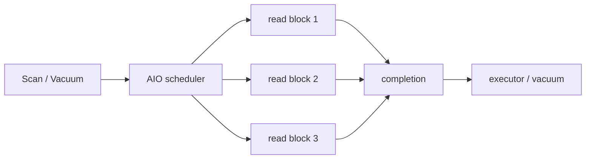

# 2026-09-19 11:00 — Interview Study Packages

README ve yakın `daily/2026-09-19/10-00.md` kontrol edildi. WebAssembly 3.0 ve Arrow Flight SQL tekrar edilmedi. Repo aramasında aşağıdaki iki konu için doğrudan önceki paket bulunmadı.

## Paket 1 — Mid → Principal Databases/SRE: PostgreSQL 18 Asynchronous I/O, Queue Depth & Storage Latency Hiding
**Süre:** 20–30 dk

### Konu anlatımı
PostgreSQL 18, database engine'in birden fazla read I/O isteğini eşzamanlı kuyruğa alabilmesini sağlayan yeni asynchronous I/O (AIO) subsystem'i getirdi. Önceki yaklaşım büyük ölçüde OS readahead davranışına yaslanırken database engine erişim pattern'ini OS'den daha iyi bildiği için sequential scan, bitmap heap scan ve vacuum gibi operasyonlarda gelecekte gerekecek blokları daha kontrollü biçimde önden isteyebilir.

Buradaki ana fikir “disk artık hızlı” değildir; latency'yi concurrency ile gizlemektir. Tek I/O için servis süresi değişmeyebilir. Fakat engine bir request'in tamamlanmasını beklerken diğerlerini uçuşa sokarsa storage device'ın paralelliğini kullanabilir ve aggregate throughput artabilir. PostgreSQL 18 `io_method` ile `worker`, Linux'ta uygun build varsa `io_uring`, veya eskiye yakın `sync` yöntemlerini seçebilir. Varsayılan `worker`'dır. `io_max_concurrency` bir process'in aynı anda yürütebileceği I/O sayısını sınırlar.

AIO, durability semantics ile karıştırılmamalıdır. Bu özellik öncelikle eligible read paths'in scheduling/execution biçimidir; transaction commit'in WAL durability garantisini otomatik değiştirmez. Ayrıca yüksek queue depth her zaman daha iyi değildir: storage saturation, tail latency, cache pollution ve tenant interference yaratabilir.

### Mental model

**Invariant:** AIO tek I/O'nun fiziksel latency'sini sihirli biçimde azaltmaz; bağımsız I/O'ları overlap ederek bekleme süresini gizlemeye ve device parallelism'i kullanmaya çalışır.

### İçeride ne oluyor?
- `io_method=worker`, I/O'yu worker process'ler üzerinden yürütür ve platformlar arası varsayılan yoldur.
- `io_method=io_uring`, Linux'ta liburing desteğiyle kernel submission/completion mekanizmasını kullanabilir.
- `io_method=sync`, AIO-eligible I/O'ları synchronous çalıştırarak karşılaştırma/fallback sağlar.
- `io_max_concurrency` per-process outstanding I/O sınırıdır; otomatik değer shared buffers/process bütçesini dikkate alır ve 64'ü aşmaz.
- Sequential/bitmap scans ve vacuum gibi access pattern'leri concurrency'den faydalanabilir; küçük cache-hit OLTP query'si aynı faydayı görmeyebilir.
- PostgreSQL 18 `pg_aios` view'u AIO tarafından kullanılan file handle'ları gözlemlemeye yardımcı olur.

### Yüksek getirili mülakat soruları
1. Synchronous I/O ile asynchronous I/O arasındaki temel fark nedir?
2. AIO neden tek request latency'sini azaltmadan throughput'u artırabilir?
3. PostgreSQL neden yalnız OS readahead'e güvenmek istemez?
4. `worker`, `io_uring` ve `sync` yöntemlerini nasıl kıyaslarsın?
5. Queue depth çok yükselirse hangi failure/performance mode'ları oluşur?
6. Senior: AIO benchmark'ında cache-warm ve cache-cold sonuçlarını neden ayırırsın?
7. Staff: OLTP + analytical scan karışımında I/O concurrency'nin noisy-neighbor etkisini nasıl ölçersin?
8. Principal: AIO rollout'unu storage class, kernel, virtualization ve rollback stratejisiyle nasıl yönetirsin?

### Seviyeye göre cevap derinliği
- **Mid:** blocking vs overlapping I/O ve throughput/latency ayrımını doğru kurar.
- **Senior:** queue depth, cache state, scan/vacuum workload'u ve tail latency'yi benchmark tasarımına katar.
- **Staff:** storage saturation, workload isolation, observability ve capacity modelini kurar.
- **Principal:** platform/kernel compatibility, fleet rollout, performance regression budget ve fallback politikasını yönetir.

### Kısa alıştırma
8 ms ortalama storage read latency'si olan bir workload düşün. Önce tek outstanding request, sonra 8 outstanding request için idealized throughput üst sınırını hesapla; ardından neden gerçek sistemin bu ideale ulaşamayacağını CPU, cache, device queue, dependency ve tail latency üzerinden açıkla.

### Proje fikri
`pg18-aio-lab`: PostgreSQL 18 üzerinde aynı dataset için `sync`, `worker` ve mümkünse `io_uring` çalıştır. Cold/warm sequential scan, bitmap heap scan ve vacuum workload'larında elapsed time, IOPS, throughput, CPU, p95/p99 query latency ve storage queue depth ölç. `io_max_concurrency` sweep'i ekle.

### Failure modes / trade-off / production bağlantısı
AIO'yu durability özelliği sanmak, yalnız average throughput ölçmek, page cache etkisini gizlemek, storage queue'yu aşırı doldurmak, `io_uring`'in her build/platformda mevcut olduğunu varsaymak ve mixed workload'ta scan'lerin OLTP tail latency'sini bozmasını görmezden gelmek tipik hatalardır. Production'da query p95/p99, scan throughput, vacuum duration, device utilization/queue latency, CPU, cache-hit oranı ve AIO configuration/version matrisi izlenir.

### Kaynaklar
- PostgreSQL 18 release announcement, 25 Sep 2025: https://www.postgresql.org/about/news/postgresql-18-released-3142/
- PostgreSQL 18 release notes: https://www.postgresql.org/docs/18/release-18.html
- PostgreSQL 18 resource/I/O configuration: https://www.postgresql.org/docs/18/runtime-config-resource.html

---

## Paket 2 — Junior → Staff Algorithms & Data Structures: Fenwick Tree, Prefix Aggregates & Update/Query Economics
**Süre:** 20–30 dk

### Konu anlatımı
Fenwick Tree (Binary Indexed Tree), dinamik bir array üzerinde point update ve prefix aggregate query'lerini tipik olarak `O(log n)` zamanda destekleyen kompakt bir veri yapısıdır. Prefix sum en klasik örnektir. Naive array'de point update `O(1)`, prefix sum `O(n)` olabilir; prefix-sum array'de query `O(1)` iken tek eleman update'i sonrasındaki birçok prefix'i değiştirdiği için `O(n)` olur. Fenwick Tree iki maliyeti dengeler.

Ana fikir index'in binary representation'ını kullanarak her tree slot'una belirli büyüklükte bir suffix/prefix bloğunun aggregate'ını yüklemektir. 1-based indexing'de `lowbit(i) = i & -i`, `tree[i]` slot'unun kapsadığı blok uzunluğunu verir. Prefix query sırasında `i -= lowbit(i)` ile daha büyük prefix'i disjoint bloklara ayırırız. Point update sırasında `i += lowbit(i)` ile ilgili elemanı kapsayan daha büyük aggregate node'larına çıkarız.

Fenwick Tree segment tree'ye göre genellikle daha az memory ve daha küçük constant factor sunar; fakat arbitrary associative operation/range metadata için segment tree daha esnektir. Prefix difference ile range sum elde edilir: `sum(l..r)=prefix(r)-prefix(l-1)`. Bu çıkarma yaklaşımı operation'ın invertible olmasını gerektirir.

### Mental model
```text
index:  1 2 3 4 5 6 7 8
lowbit: 1 2 1 4 1 2 1 8

prefix(7):
  tree[7]  covers [7..7]
+ tree[6]  covers [5..6]
+ tree[4]  covers [1..4]
```
**Invariant:** Query path'teki bloklar overlap etmeden hedef prefix'i kaplar; update path'teki her node güncellenen index'i kapsar.

### İçeride ne oluyor?
- `i & -i`, two's-complement binary representation'da en düşük set bit'i izole eder.
- Query her adımda en düşük set bit'i temizlediği için en fazla `O(log n)` node ziyaret eder.
- Update her adımda kapsama aralığını bir üst seviyeye taşıdığı için `O(log n)` sürer.
- Memory `O(n)`'dir; pointer-heavy tree yapısı gerekmez.
- Range sum, iki prefix sum farkıdır; prefix-min gibi non-invertible operation'larda aynı trick doğrudan çalışmaz.
- Coordinate compression ile büyük/sparse key domain'i rank space'e indirip Fenwick Tree üzerinde frequency/order-statistics problemleri çözülebilir.

### Yüksek getirili mülakat soruları
1. Prefix-sum array ile Fenwick Tree arasındaki update/query trade-off'u nedir?
2. `i & -i` neyi hesaplar?
3. Point update ve prefix query neden `O(log n)`?
4. Range sum nasıl elde edilir?
5. Fenwick Tree ile segment tree ne zaman tercih edilir?
6. Mid: inversion count'u Fenwick Tree ile nasıl hesaplarsın?
7. Senior: coordinate compression correctness'ini ve duplicate değerleri nasıl yönetirsin?
8. Staff: yüksek write/read oranlarında Fenwick Tree, segment tree, database index veya streaming aggregate arasında nasıl seçim yaparsın?

### Seviyeye göre cevap derinliği
- **Junior:** prefix sum problemini ve `O(log n)` update/query hedefini açıklar.
- **Mid:** lowbit traversal'ını kodlar ve range sum/inversion count uygular.
- **Senior:** algebraic operation şartlarını, coordinate compression ve cache/memory davranışını tartışır.
- **Staff:** concurrency, sharding, persistence ve gerçek production aggregate ihtiyaçlarıyla veri yapısı seçimini ilişkilendirir.

### Kısa alıştırma
`[3,1,4,1,5,9,2,6]` array'i için Fenwick Tree'yi elle oluştur. `prefix(7)` query path'ini yaz; sonra index 3'e `+5` update'i uygulayıp değişen tree slot'larını göster.

### Proje fikri
`fenwick-benchmark`: naive array, prefix array, Fenwick Tree ve segment tree implement et. 1M elemanda %90 query/%10 update ve %10 query/%90 update workload'larını kıyasla. Throughput, allocations, memory footprint ve p99 operation latency ölç.

### Failure modes / trade-off / production bağlantısı
0-based/1-based index karıştırmak, integer overflow, range query için inverse operation gereksinimini unutmak, coordinate compression'da duplicate/rank semantics'i bozmak ve concurrent update'leri synchronization olmadan yapmak tipik hatalardır. Production'da Fenwick Tree leaderboard/rank, frequency table, mutable cumulative counters ve offline analytics gibi yerlerde yararlı olabilir; ancak distributed persistence/consistency gerektiğinde local data structure tek başına sistem tasarımı değildir.

### Kaynaklar
- Peter M. Fenwick, “A New Data Structure for Cumulative Frequency Tables”, Software: Practice and Experience 24(3), 1994: https://doi.org/10.1002/spe.4380240306
- CP-Algorithms — Fenwick Tree (uygulama referansı): https://cp-algorithms.com/data_structures/fenwick.html
